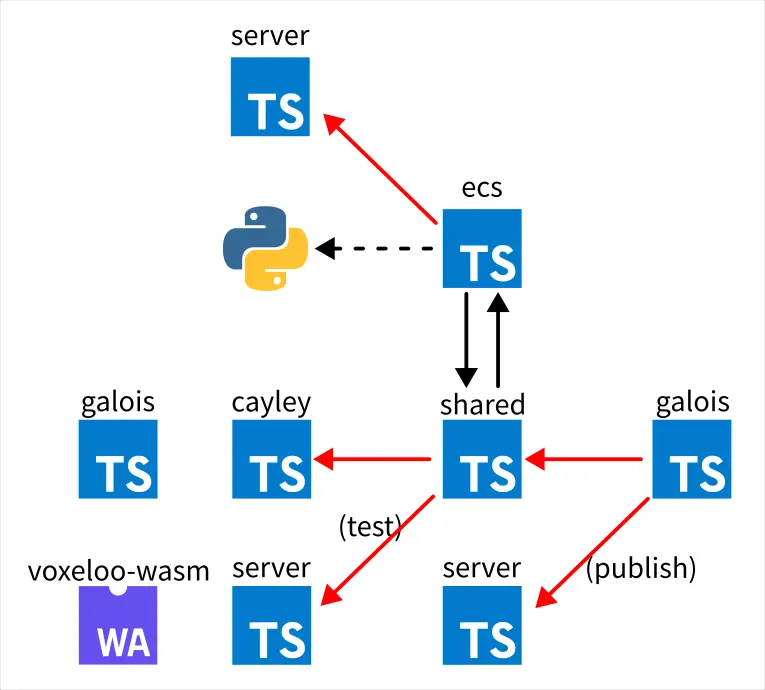

# Biomes 研究筆記 3

<head>
  <meta property="og:image" content="https://raw.githubusercontent.com/FlySkyPie/flyskypie.github.io/main/post/2025-11-23_biomes/00_cover.webp" />
</head>

## Galois

> Galois is a collection of tools for asset generation. Galois introduces a custom DSL for defining assets (e.g. meshes, textures, game objects, configuration files, maps, worlds), a build system for generating binary asset data, and tools for viewing and editing assets through a UI.

以上是 README 的原始描述。

### 遊戲素材

`src/galois/data` 目錄下是該專案大部分透過 Git LFS (Large File Storage) 儲存的資料所在的路徑，內容如下：

```shell
tree -L 1 src/galois/data
src/galois/data
├── animations
├── audio
├── blocks
├── color_palettes
├── crops
├── editor
├── flora
├── gaia
├── glass
├── icons
├── item_meshes
├── mapping
├── maps
├── npcs
├── placeables
├── textures
└── wearables
```

並且當中的結構與 `biomes_data_snapshot.tar.gz` 的內容大致吻合：


`biomes_data_snapshot.tar.gz` 是什麼呢？它是 Biomes 透過腳本在本地運行時，理論上應該被下載的檔案，但是官方的伺服器已經不再提供該檔案，GitHub 上有一些 issue 有反應這件事：

- [Create a mirror for missing biomes_data_snapshot.tar.gz · Issue #93 · ill-inc/biomes-game](https://github.com/ill-inc/biomes-game/issues/93)
- [Unable to download biomes_data_snapshot.tar.gz | host - static.biomes.gg is down · Issue #91 · ill-inc/biomes-game](https://github.com/ill-inc/biomes-game/issues/91)

換言之，這個 `biomes_data_snapshot.tar.gz` 是檔案想接手這個開源專案的人第一個會碰到的問題（在不理解程式直接使用官方提供的腳本試圖運行該專案的話），而這個 `biomes_data_snapshot.tar.gz` 檔案的祕密就藏在 Galois 組件內。

:::info
打包用的腳本其實存在於 `scripts/b/data_snapshot.py`，不過我認為理解資料比輸出資料還重要。
:::

### 素材瀏覽器與編輯器

在 `src/galois/js` 中可以看到 `editor` 和 `viewer`：

```shell
tree -L 1 src/galois/js
src/galois/js
├── assets
├── components
├── editor
├── index.d.ts
├── interface
├── lang
├── publish
├── python
├── README.md
├── scripts
├── server
├── tsconfig.json
└── viewer
```

根據程式碼判斷，它們應該是 Electron + React 實現的 GUI 工具。

這個組件的定位使其不涉及遊戲本身的實做，並且提供一些必要的封裝給遊戲開發使用，因此作為我的下一個解析目標。

## AQL (Asset Query Language) utilities


- https://github.com/FlySkyPie/biomes-aql-utils
- https://www.npmjs.com/package/@flyskypie/biomes-aql-utils

這個模組在 Biomes 的原始路徑是：`src/galois/js/lang`，
並且當中缺少一些的 Typescript 程式碼是由 `src/galois/py/assets` 下的 Python 腳本生成的，
因為涉及跨語言的操作，而且沒有其他仰賴，因此我將其抽出作為獨立的套件。

"Asset Query Language" 只是根據內部實現的邏輯跟被呼叫的方式先隨便取的暫時性名稱，它被呼叫的時候大致上長這樣：

```typescript
import * as l from "@/galois/lang";

const skeleton = l.toSkeleton(animationInfo.skeleton);
const tPose = l.ExtractInitialPose(animationsGltf, skeleton);
const posedVoxJointMap = l.ToPosedVoxJointMapFromVoxLayers(vox, skeleton);

let gltf = l.ToGLTF(
meshJointMap,
tPose,
l.ExtractAllAnimations(animationsGltf, skeleton)
);
```

不然 `lang` 並不是一個方便理解的名稱。

## 當前挑戰



### Galois 的外部仰賴


首先， Galois 對 `shared` 有仰賴，這個部份沒有什麼問題，畢竟 `shared` 職責上就是處理那些同時會被前端與後端使用的通用邏輯。

但是 Galois 對 `server` 仰賴就有問題了，因為 `server` 是應用程式的後端實做，在素材瀏覽或編輯階段不應該對後端邏輯有所仰賴。

仔細看發現跟發布有關，或許可以將該部份暫時從 Galois 中移除，剩下的部份一小部份如果實做不是很多可以視情況直接從 `server` 移過來。

### shared 的循環仰賴


因為 `ecs` 組件大部分的程式碼用 Python 生成的，可以的話我想拉出來變成單獨的套件，但是因為它跟 `shared` 之間有密切的耦合（循環仰賴），無奈之下只能用 monorepo 處理。

### shared 的測試仰賴


`shared` 也有對 `server` 的仰賴，另外一個則是 `voxeloo`，但是它使用的是不明的實做：

```typescript
import wasmLoader from "@/gen/shared/cpp_ext/voxeloo-simd/wasm";

  return wasmLoader({
    wasmBinary: await readFile(wasmFile),
    wasmMemory: makeWasmMemory(1024),
  });
```

之前我用 Emscripten 編譯出來的 Voxeloo WASM 本身並沒有符合上述 `wasmLoader` 界面的東西，Bazel 裡面我也看不出來這個東西是在哪裡實做的。

這個部份是寫在單元測試內的東西，不影響遊戲本體運作，因此我合理懷疑這個是專案經過重構後遺留的痕跡，某個時間點之後就不再維護單元測試而只注重遊戲運行正常與否，造成單元測試內的實作已經過期。
