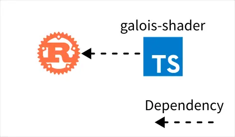

# Biomes 研究筆記 4

<head>
  <meta property="og:image" content="https://raw.githubusercontent.com/FlySkyPie/flyskypie.github.io/main/post/2025-12-01_biomes/00_cover.webp" />
</head>

## Galois Shader



- https://github.com/FlySkyPie/biomes-galois-shader
- https://www.npmjs.com/package/@flyskypie/biomes-galois-shader

這個組件在原本的專案有幾個神奇的事情：

1. 使用 Bazel 封裝 Rust 程式碼，而不是標準 Rust 專案的 `Cargo.toml`。
2. 使用 Rust 當生成器，生成 Typescript。

"使用 Bazel 封裝"是什麼意思？ `BUILD.bazel` 內容如下：

```bazel
load("@rules_rust//rust:defs.bzl", "rust_binary", "rust_library")

package(default_visibility = ["//visibility:public"])

rust_library(
    name = "shader_preprocessor",
    srcs = ["preprocess.rs"],
    deps = [
        "@crate_index//:regex",
    ],
)

rust_library(
    name = "materials",
    srcs = ["materials.rs"],
    deps = [
        "@crate_index//:serde",
        "@crate_index//:serde_json",
    ],
)

rust_library(
    name = "shader_link_info",
    srcs = ["link_info.rs"],
    deps = [
        "@crate_index//:glsl",
    ],
)

rust_binary(
    name = "shader_gen_ts",
    srcs = ["gen_ts.rs"],
    deps = [
        ":materials",
        ":shader_link_info",
        ":shader_preprocessor",
        "@crate_index//:clap",
        "@crate_index//:convert_case",
        "@crate_index//:glsl",
    ],
)
```

編譯結果是一個 CLI 的執行檔。

回過來說，這個組件主要的目的是：

- 把 Shader 檔案轉成 Typescript 字串。
- 提供可以 hot load 的 Three.js `RawShaderMaterial`。
- 懶得寫 Typescript，直接用生的（？）

## Galois Viewer

Galois 的部份還在重構中，所以還沒上傳，不過當前進度大概如下：


目前是使用 PNPM 的 workspace/monorepo 來同時包容所有子組件。沒有使用單純的專案架構是因為不同子組件的性質不盡相同，例如：`viewer` 是 Electron app；`server` 是 process 封裝；`editor` 是另外一個 Electron app。

有些組件會作為 app 發布、有些則是作為套件被 import、有些涉及 React 、有些又沒有涉及 React，透過 workspace 分別設定每個組件的組態我覺得比較恰當。

剛剛提到 `server` 實際上會呼叫 CLI spawn process，而呼叫的對象在原始實做是 `python py/assets/build.py`，目前我是直接使用 `pyinstaller` 來打包 Python CLI 成獨立的執行檔。

並且目前的進度， `viewer` 在跟 `server` 的執行檔整合還有一點問題需要排除：


