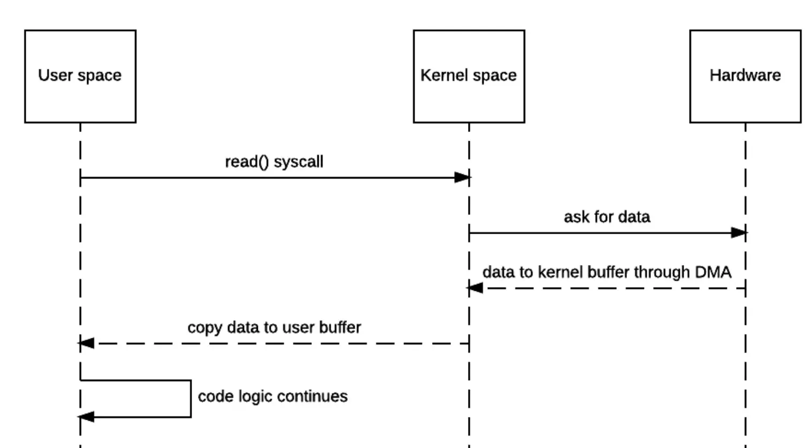

# stdin, stdout, stderr 我有印象，但是 stdio[3], stdio[4] 是怎麼回事？

<head>
  <meta property="og:image" content="https://raw.githubusercontent.com/FlySkyPie/flyskypie.github.io/main/post/2025-12-06_stdio/00_stdio.webp" />
</head>

最近在研究 Biomes 的程式碼看到這個：

```javascript
    this.process = spawn(
      buildCommand,
      ["batch", `--workspace="${dataDir}"`, "--ignore_sigint"].concat(
        additionalArgs
      ),
      {
        cwd: execDir,
        stdio: ["ignore", "inherit", "inherit", "pipe", "pipe"],
        shell: true,
        windowsHide: true,
      }
    );
```

恩？就算不看文件也猜得到 `stdio` 前三個是 `stdin`、 `stdout` 和 `stderr`，但是後面兩個是怎麼回事？

點進去看型別會看到[^child_process-ts]：

```typescript
        readonly stdio: [
            Writable | null,
            // stdin
            Readable | null,
            // stdout
            Readable | null,
            // stderr
            Readable | Writable | null | undefined,
            // extra
            Readable | Writable | null | undefined, // extra
        ];
```

在 Node.js 的官方文件則只有稍稍帶過[^node]：

```javascript
// Open an extra fd=4, to interact with programs presenting a
// startd-style interface.
spawn('prg', [], { stdio: ['pipe', null, null, null, 'pipe'] });
```

這個用法我不太熟悉，於是稍微往下追究。

[^child_process-ts]: DefinitelyTyped/types/node/child_process.d.ts. GitHub. Retrieved 2025-12-06, from https://github.com/DefinitelyTyped/DefinitelyTyped/blob/e70e0eca2af7ad212c893ee94bbcb1ba33b4dd3d/types/node/child_process.d.ts#L181-L191
[^node]: Child process | Node.js v25.2.1 Documentation. Retrieved 2025-12-06, from https://nodejs.org/api/child_process.html#optionsstdio

## File Descriptor （Python 被呼叫端）

如果直接執行該指令會得到錯誤：

```shell
$ ./build \
    batch \
    --workspace="${PWD}/data" \
    --ignore_sigint

Traceback (most recent call last):
  File "build.py", line 161, in <module>
  File "build.py", line 115, in build_batch
  File "<frozen os>", line 1037, in fdopen
OSError: [Errno 9] Bad file descriptor
[PYI-453501:ERROR] Failed to execute script 'build' due to unhandled exception!
```

回去看實做的地方則是會看到：

```python
    infile = os.fdopen(3, "r")
    outfile = os.fdopen(4, "w")
```

再找一下範例程式[^python-sample]：

```python
# Import os Library
import os

# Open file
fd = os.open("test.txt", os.O_RDWR|os.O_CREAT)

# Get a file object for the file
fo = os.fdopen(fd, "w+")

# Write something on open file
fo.write( "This is a test content for w3schools")

# Close file
fo.close()
```

好吧，我還是不太清楚，這個 `fd` 到底是什麼，看起來是某種檔案有關的 id，但是不知道為什麼會跟 stdio 扯上關係。

[^python-sample]: Python os.fdopen(). W3Schools Online Web Tutorials. Retrieved 2025-12-06, from https://www.w3schools.com/python/ref_os_fdopen.asp

## File Descriptor （System call）

嗯...這個 `os.open` 跟 `os.fdopen` 是用整數在操作，而不是實例或物件之類的，看起來很底層，

讓我翻一下 System call 的資料[^open][^read][^write]：

```c
int open(const char* path, int oflag, /* mode_t mode */...);

ssize_t read(int fd, void* buf, size_t count);

ssize_t write(int fildes, const void* buf, size_t nbyte);
```

[^open]: open (system call) - Wikipedia. https://en.wikipedia.org/wiki/Open_(system_call)
[^read]: read (system call) - Wikipedia. https://en.wikipedia.org/wiki/Read_(system_call)
[^write]: write (system call) - Wikipedia. https://en.wikipedia.org/wiki/Write_(system_call)

## File Descriptor （Unix/Linux User space）



> 上面簡單介紹了User space和Kernel space，這對於理解fd有很大的幫助。fd會存在，就是因為使用者程序無法直接訪問硬體，因此當程序向核心發起system call打開一個檔案時，在使用者處理程序中必須有一個東西標識著打開的檔案，這個東西就是fd。[^fd-1]

> file descriptor 和 file 之間的關係並不是一對一的。[^fd-2]


[^fd-1]: 理解linux中的file descriptor(檔案描述符) | Bigbyto. https://wiyi.org/linux-file-descriptor.html
[^fd-2]: Linux 的 file descriptor 筆記 - Kakashi's Blog. https://kkc.github.io/2020/08/22/file-descriptor/

## Process

寫一個簡單的 Node.js 程式 spawn 這個程式把它掛起來之後，用 `pstree` 找到 PID 之後調查一下：

```shell
$ pwd
/proc/435759

$ cat cmdline |  xargs -n1 --null
./build
batch
--workspace=/some/where/data
--ignore_sigint

$ ll fd
total 0
dr-x------ 2 flyskypie flyskypie  5 Dec  6 20:34 ./
dr-xr-xr-x 9 flyskypie flyskypie  0 Dec  6 20:26 ../
lr-x------ 1 flyskypie flyskypie 64 Dec  6 20:34 0 -> /dev/null
lrwx------ 1 flyskypie flyskypie 64 Dec  6 20:34 1 -> /dev/pts/15
lrwx------ 1 flyskypie flyskypie 64 Dec  6 20:34 2 -> /dev/pts/15
lrwx------ 1 flyskypie flyskypie 64 Dec  6 20:34 3 -> 'socket:[1744182]'
lrwx------ 1 flyskypie flyskypie 64 Dec  6 20:34 4 -> 'socket:[1744184]'
```

> 在檔案系統中，每個磁碟有多個分區，每個分區有多個柱面組，每個柱面組有一個inode陣列。上面的數字2248868代表inode的一個編號，稱為inode編號。可以用來唯一標識改該檔案，也可以定位inode在磁碟中的位置。在socketfs虛擬檔案系統中，socket對應的inode並不像普通的檔案系統，位於磁碟上，而是位於核心的socket結構中（記憶體）。[^inode]

[^inode]: linux /proc/[pid]/fd 中socket描述符後面的數字是什麼意思？inode（information node）_proc fd socket-CSDN部落格. https://blog.csdn.net/Dontla/article/details/124854177

## 結論

"一切皆是文件" 是 Unix/Linux 的核心哲學之一，即便是 `stdin`, `stdout`, `stderr` 這些標準的 IO (`stdio`, standard input/output)，實際上跟「打開檔案進行讀寫」的行為處於一套相同的體系：File Descriptor。

File Descriptor 是作業系統發給 Process 的整數 ID；`stdin`, `stdout`, `stderr` 固定為 0, 1, 2。透過 `open` 之類的操作界面 (System call)，系統會另外分配 ID 並且再連結到對應要進行讀寫的檔案。

Node.js 在 Spawn 的時候可以在 `stdin`, `stdout`, `stderr` 以外再額外指定兩條管道，它們在 process 內的 File Descriptor 為 3 和 4。
