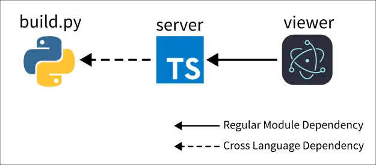
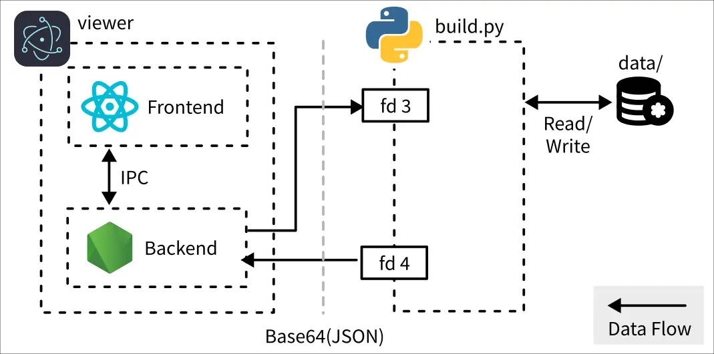

# Biomes 研究筆記 5

<head>
  <meta property="og:image" content="https://raw.githubusercontent.com/FlySkyPie/flyskypie.github.io/main/post/2025-12-07_biomes/00_cover.webp" />
</head>

## Galois Viewer

`viewer` 是一個 Electron 實做。`server` 則是一個薄封裝，實作了簡單的佇列，並且會從 Python 那邊的實作 (`build.py`) spawn 一個 process。



從資料流的角度則如下圖所示：



spawn 出來的 process 是透過 FD (File descriptor) 3 和 4 跟 Electron 的後端※溝通。而兩者傳輸的資料格式則是使用 base64 編碼過得 JSON，而 JSON 的 sechma 可以在 [biomes-aql-utils](https://github.com/FlySkyPie/biomes-aql-utils) 裡面找到。

:::info
※更精確的說法是 main process，與之相對的瀏覽器端則是 renderer process，這裡選擇使用一個對 Electron 不熟悉的人應該也比較好理解的用詞。
:::

## `Error: spawn /bin/sh ENOENT at Process.ChildProcess`

目前遇到的主要障礙是以下錯誤訊息：

```
Error: A JavaScript error occurred in the main process

Uncaught Exception: Error: spawn /bin/sh ENOENT at Process.ChildProcess._handle.onexit (node:internal/child_process:282:19) at onErrorNT (node:internal/child_process:477:16) at processTicksAndRejections (node:internal/process/task_queues:83:21)
```

```
Uncaught Exception: Error: write EPIPE at afterWriteDispatched (node:internal/stream_base_commons:164:15) at writeGeneric (node:internal/stream_base_commons:155:3) at Socket._writeGeneric (node:net:780:11) at Socket._write (node:net:792:8) at writeOrBuffer (node:internal/streams/writable:389:12) at _write (node:internal/streams/writable:330:10) at Socket.Writable._write (node:internal/streams/writable:334:10) at BatchAssetServer.send (/home/flyskypie/Desktop/2025-10-22_biomes-game_research/2025-11-16_galois-extract/galois-fe-investigation/js/server/dist/server.cjs:93:30) at /home/flyskypie/Desktop/2025-10-22_biomes-game_research/2025-11-16_galois-extract/galois-fe-investigation/js/server/dist/server.cjs:110:9 at processTicksAndRejections (node:internal/process/task_queues:96:5)
```

目前盲猜是因為 spawn 發生在 Electron 內，在 Linux 上應屬於某種沙盒環境，因此「有 shell 的 spawn」沒辦法正常運作。

我不是很想處理 Electron 打包機制與虛擬目錄引入的複雜性，之後應該會把架構改寫成單純的 Web 前端跟 HTTP API 伺服器。
