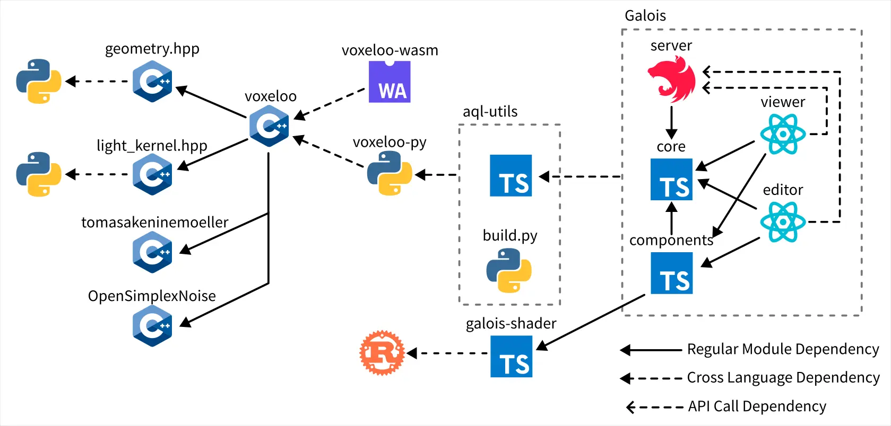

# Biomes 研究筆記 6

<head>
  <meta property="og:image" content="https://raw.githubusercontent.com/FlySkyPie/flyskypie.github.io/main/post/2025-12-14_biomes/00_cover.webp" />
</head>

## Galois

- https://github.com/FlySkyPie/biomes-galois
- https://www.npmjs.com/package/@flyskypie/biomes-galois-core

上一篇已經說明過 Viewer/Editor 是以 Electron 實做，並且和一個副程式透過 `stdio` 通訊。

經過研究發現該副程式的工作依然是採取 request-response 模式，並沒有太複雜的非同步通訊行為，因此我把處理副程式的實做改到 Nest.js 建立的 API 伺服器內，並且把原本用 Electron 呈現的 Viewer/Editor 重構成單純的 Web 應用程式。

呈現結果如下：

Editor 給我的感覺有點失望，因為它實際上並沒有編輯的能力，只是畫面更完整一點的 Viewer，並且 Block 類的素材是沒辦法讀取的，這方面的問題預計暫時先跳過，不過已知的資訊有：

- Trace 到 `voxeloo` 實做，看起來是單純的斷言失敗，而失敗的原因看起來是缺少 `texture` 參數。
- Viewer 那邊是可以渲染方塊的，只是兩邊的 query 不太一樣。

## 循環仰賴

Galois 和 `shared` 之間原本有循環仰賴的問題，我試著移除一些看起來不是核心功能的東西，並且把真的消除不掉的仰賴直接從 `shared` 內抽出來直接放進 Galois 內。
