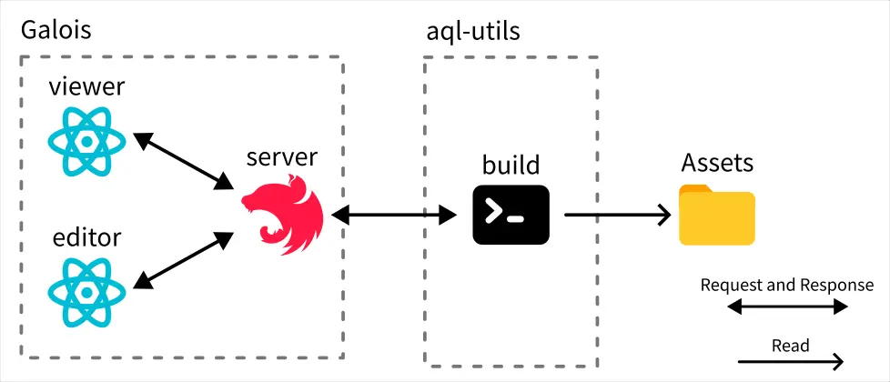
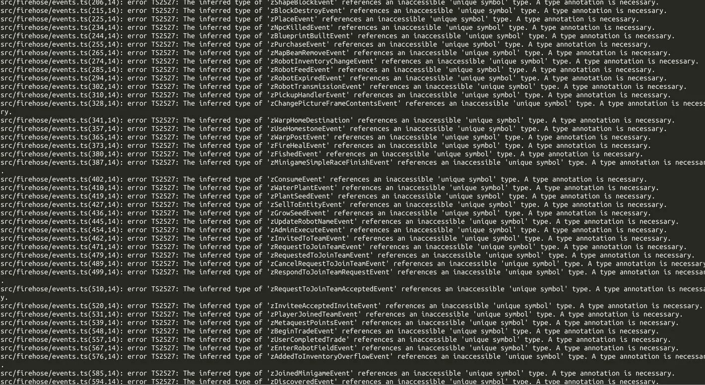

# Biomes 研究筆記 7

<head>
  <meta property="og:image" content="https://raw.githubusercontent.com/FlySkyPie/flyskypie.github.io/main/post/2025-12-24_biomes/00_cover.webp" />
</head>

## Assets



- https://github.com/FlySkyPie/biomes-assets

這個部份算是[上一次的研究筆記](https://flyskypie.github.io/posts/2025-12-14_biomes/)漏掉了，這個模組沒什麼特別的，就是一堆放在 Git LFS 的檔案，只是我抽出來單獨放在一個 repository 內。

做這件事的時候，順便參考了幾個開源遊戲，看看它們處理遊戲素材的：

- 0 .A.D.
  - 使用 [SVN](https://svn.wildfiregames.com/nightly-build/trunk/)， 因此不在 Git 討論範疇內。
- Luanti (Minetest)
  - https://github.com/luanti-org/luanti
  - 看起來是直接放在一個 repo 內。
- BAR (Beyond All Reason)
  - https://github.com/beyond-all-reason/Beyond-All-Reason
  - 看起來是直接放在一個 repo 內。
- Warzone 2100 
  - 不同性質的素材是分別放在獨立的 repo 內，再用 Git 的 Submodule 放到主要的 repo 內，例如：
    - https://github.com/Warzone2100/data-music-opus
    - https://github.com/Warzone2100/data-fonts
    - https://github.com/Warzone2100/data-texpages/

## Cayley.js


- https://github.com/FlySkyPie/biomes-cayley-js

Cayley.js 是一個 Cayley WASM 的再封裝，除了實做了一些東西以外，還提供一些單元測試跟 Benchmark 測試。

處理它的時候算是踩了 Javascript 生態系一個很經典的小坑，原本我打算用 Vitest 取代原本的 AVA 單元測試框架，但是我忘記了 Vite 工具鏈是 ESM 本位主義，因此單元測試會 import Web 版本的 WASM 載入器。

然而 Web 與 Node.js 是屬於兩個不同的 Javascript Runtime，對於「如何載入 WASM」的方式也不同；Web 是使用 `fetch` **從網路下載** WASM；Node.js 則是使用 `fs` **從檔案系統讀取** WASM。

使用 Vitest 呼叫 `fetch` 會觸發 "Not implemented yet" 之類的錯誤訊息。最後是使用 Jest 取代 AVA，慶幸的是已經有人寫了遷移指南[^ava-to-jest]，照著做就完成了。

Benchmark 那邊則是用 `tsx` 取代 `ts-node`。

[^ava-to-jest]: Switching from Ava to Jest for TypeScript | by Gant Laborde | Red Shift. Retrieved 2025-12-24, from https://shift.infinite.red/a6dac7d1712f

## Zod

- https://github.com/FlySkyPie/biomes-zod
- https://www.npmjs.com/package/@flyskypie/biomes-zod
- https://github.com/ill-inc/zod
  - Biomes 專案自己的 Fork

Zod 是一個方便開發者在 Runtime 對 JSON 資料進行 Schema 驗證的函式庫，我其實不確定 Biomes 為什麼要刻意 fork 出一個版本，最明顯的差異是 Biomes 的版本多了這個方法：

```javascript
z.object().annotate(Symbol.for("some"), true)
```

並且 Symbol 並不在 Zod 的支援路線上：

> Symbols aren't considered literal values, nor can they be simply compared with `===`. This was an oversight in Zod 3.[^zod]

考慮到這並不屬於 JSON 解析的範疇，想想也合理，不過 Biomes 專案本身已經用下去了，我也不能在不熟悉的專案的情況下貿然移除這個客製化 Zod 轉而使用原本的。Biomes 原本是直接從 GitHub 安裝，我 fork 之後做了兩件事：

- 將原本應該被 gitignore 的發布路徑 (`/lib`) 從 Git 紀錄中清除。
- 將打包結果發布到 NPM。

[^zod]: Migration guide | Zod. Retrieved 2025-12-24, from https://zod.dev/v4/changelog#drops-symbol-support

## Shared


`ecs` 和 `shared` 之間有很嚴重的循環仰賴，無奈之下只好用 PNPM 的 workspace 處理。`ecs` 對 `server` 有輕微的仰賴，我直接複製那部份的程式碼進入 `ecs`，在我看來這裡解偶的效益遠比 DRY 還重要。

`shared` 則是測試的部份對 `server` 仰賴，仰賴了 Voxeloo WASM loader 的部份，這一點我打算暫時忽略，之後再來處理，畢竟這個部份可以參考 Cayley 的處理方式。

這是我在 `shared` 上面臨另外一個比較麻煩的問題：



`shared` 使用 Zod 大量定義 Schema，而一些複雜的 Schema 在編譯 Typescript 型別檔 (`.d.ts`) 時，無法正常推論，因此必須透過手動聲明的方式來解決：

```typescript
export const zChallengeCompleteMessage: z.ZodObject<{
    kind: z.ZodLiteral<"challenge_complete">;
    challengeId: typeof zBiomesId;
}> = z.object({
    kind: z.literal("challenge_complete"),
    challengeId: zBiomesId,
});
```
而且看起來跟前面提到的 Symbol 有關...F**k...
