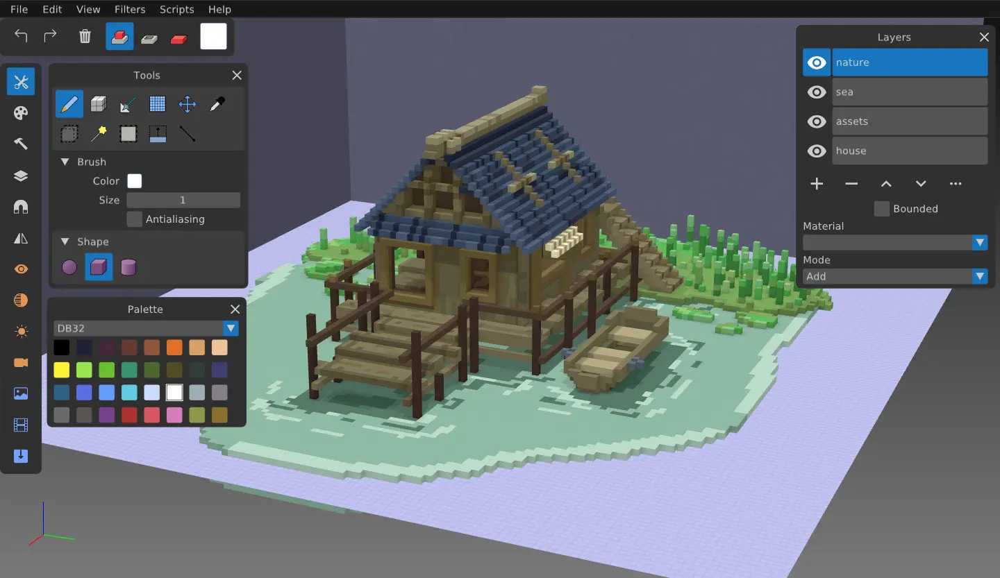
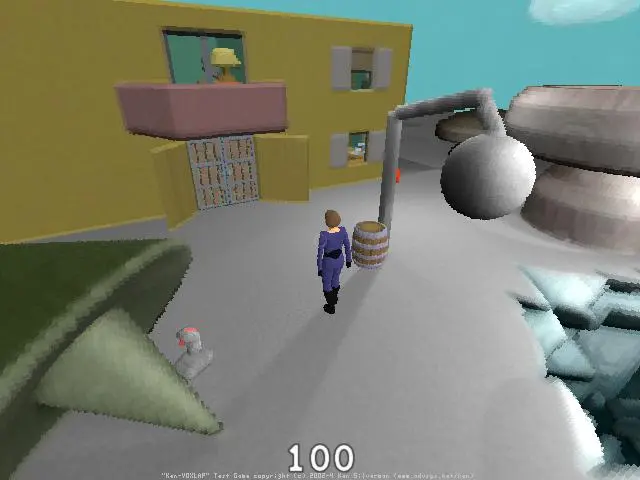
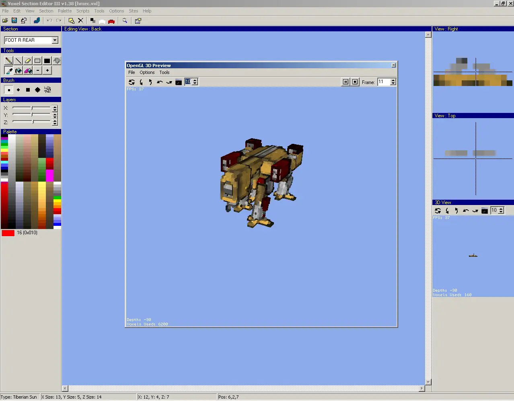
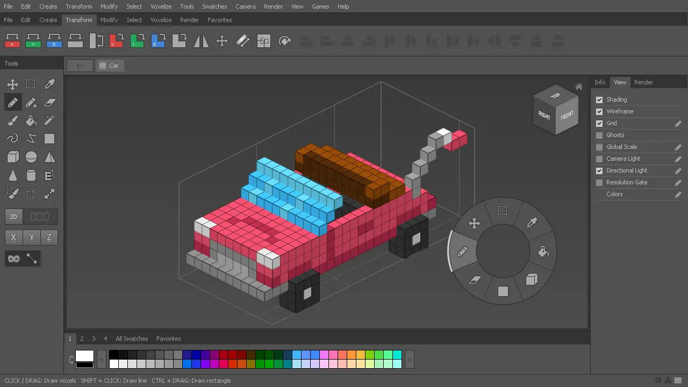

# Voxel 檔案格式筆記

<head>
  <meta property="og:image" content="https://raw.githubusercontent.com/FlySkyPie/flyskypie.github.io/main/post/2025-12-24_voxel-format/02_goxel.webp" />
</head>

## 前情提要

最近我在研究一個開源專案 ([ill-inc/biomes-game](https://github.com/ill-inc/biomes-game))，並且在 2025-12-14 算是完成了一個里程碑，我成功重建專案內的素材瀏覽器，將遊戲素材讀出並且播放動畫：


「這個是怎麼幫 Voxel 上動畫的？」一個工程師這個問我。

「我不知道」我回道。

雖然我有瞄過遊戲素材檔案一眼，知道裡面有 `.vox` 和 JSON 檔，但是我不知道它們在這個專案具體是怎麼組裝起來的。

`.vox` 這個檔案格式我其實不陌生，早在 2021 年 11 月的時候我就有一篇筆記紀錄關於各種 Voxel 儲存的檔案格式，不過並沒有整理成能夠拿給別人看的程度。於是我想說趁這個機會把東西整理出來發一篇廢文。

## `.gox` (Goxel)



Goxel 是 一個 Voxel 編輯軟體，而 `.gox` 則是它的專有（專案）格式，檔案格式的 Spec 直接寫在[程式碼](https://github.com/guillaumechereau/goxel/blob/069c094f8d3d72b7435483f42e6d7aafc9fb6b93/src/formats/gox.c)的註解內：

```c
/*
 * File format, version 2:
 *
 * This is inspired by the png format, where the file consists of a list of
 * chunks with different types.
 *
 *  4 bytes magic string        : "GOX "
 *  4 bytes version             : 2
 *  List of chunks:
 *      4 bytes: type
 *      4 bytes: data length
 *      n bytes: data
 *      4 bytes: CRC
 *
 *  The layer can end with a DICT:
 *      for each entry:
 *          4 byte : key size (0 = end of dict)
 *          n bytes: key
 *          4 bytes: value size
 *          n bytes: value
 *
 *  chunks types:
 *
 *  IMG : a dict of info:
 *      - box: the image gox.
 *
 *  PREV: a png image for preview.
 *
 *  BL16: a 16^3 block saved as a 64x64 png image.
 *
 *  LAYR: a layer:
 *      4 bytes: number of blocks.
 *      for each block:
 *          4 bytes: block index
 *          4 bytes: x
 *          4 bytes: y
 *          4 bytes: z
 *          4 bytes: 0
 *      [DICT]
 *
 *  CAMR: a camera:
 *      [DICT] containing the following entries:
 *          name: string
 *          dist: float
 *          rot: quaternion
 *          ofs: offset
 *          ortho: bool
 *
 *   LIGH: the light:
 *      [DICT] containing the following entries:
 *          pitch: radian
 *          yaw: radian
 *          intensity: float
 */
```

順便提一下，我有回報過 [Issue](https://github.com/guillaumechereau/goxel/issues/292)，雖然不是我修的；其實不值得炫耀，不過回報 bug 也是 FOSS 的參與方式之一，對吧？


## KVX, KV6 (Ken Silverman's Voxel file)



在介紹這些檔案格式以前，可能需要談談 [Ken Silverman](https://en.wikipedia.org/wiki/Ken_Silverman) 這個人，他是 [Build 遊戲引擎](https://en.wikipedia.org/wiki/Build_(game_engine)) 的作者，並且他設計 KVX 檔案格式被用於 [Shadow Warrior](https://en.wikipedia.org/wiki/Shadow_Warrior_(1997_video_game)) 和 [Blood](https://en.wikipedia.org/wiki/Blood_(video_game)) 兩款遊戲。[^kvx-format-1][^kvx-format-2]

不過對我而言這些資訊並不是我認識他的原因，我是從這個影片得知這號人物存在的：

<iframe width="560" height="315" src="https://www.youtube.com/embed/irvFiTsY05Q?si=kutgdpdHfKdOHxlp" title="YouTube video player" frameborder="0" allow="accelerometer; autoplay; clipboard-write; encrypted-media; gyroscope; picture-in-picture; web-share" referrerpolicy="strict-origin-when-cross-origin" allowfullscreen></iframe>

根據影片的說明，我們可以找到 Voxlap 引擎的說明頁面：

https://advsys.net/ken/voxlap.htm

接著我們可以在網頁中看到它指向一個名為 SLAB6 的工具：

https://advsys.net/ken/download.htm#slab6

這裡有一個 SLAB6 原始碼的備份：

https://github.com/vuolen/slab6-mirror

並且這裡有一個筆記是從 SLAB6 中抽出 `slab6.txt` 檔案格式的介紹整理而成的：

https://gist.github.com/falkreon/8b873ec6797ffad247375fc73614fd08

該文件提供了 VOX,KVX 和 KV6 三種檔案格式的詳細說明，因此我們可以知道：

- VOX: 無壓縮的三維 RGB 資料。
- KVX: Ken Silverman 比較早期 (1995 年) 設計的 Voxel 格式。
- KV6: 在 Ken Silverman 比較後期 (2020 年) 設計的格式，原本屬於 SLAB6 這個軟體的一部分。

:::info
注意，這裡的 VOX 不要跟目前真正流行的 `.vox` (MagicaVoxel) 檔案格式搞混，我稍後會介紹。
:::

為什麼要介紹這個看起來有點古老的格式？因為你依然可以在一些 Voxel 遊戲中看到它的蹤跡，例如： [OpenSpades](https://github.com/yvt/openspades) (Ace of Spades 的 Clone)


[^kvx-format-1]: Ken Silverman's Projects Page. Retrieved 2025-12-24, from https://advsys.net/ken/download.htm#slab6

[^kvx-format-2]: RTCM - Files - General Tools - Voxel. Retrieved 2025-12-24, from https://web.archive.org/web/20200706184402/http://www.r-t-c-m.com/knowledge-base/downloads-rtcm/general-tools-voxel/

## VXL



`.vxl` 是紅色警戒 2 用於繪製單位模型的格式，具體的檔案結構如以下文件所示：

> This document describes the VXL format for storing voxel (volume pixels) models for the game Tiberian Sun by Westwood Studios. [^VXL]

[^VXL]: VXL_Format.txt. Retrieved 2025-12-24, from http://xhp.xwis.net/documents/VXL_Format.txt

## Luanti (Minetest)


Minetest 是一個「很像 Minecraft」的開源遊戲引擎，並且地圖的資料是儲存在 SQLite 中，

```sql
CREATE TABLE `blocks` (
    `x` INTEGER, `y` INTEGER, `z` INTEGER,
    `data` BLOB NOT NULL,
    PRIMARY KEY (`x`, `z`, `y`)
);
```

至於當中的 BLOB 是如何編碼的，則可以在 `world_format.md` 中找到[^minetest-spec]。

[^minetest-spec]: luanti/doc/world_format.md. GitHub. Retrieved 2025-12-24, from https://github.com/luanti-org/luanti/blob/46436248de4d64887f5ee3f1005224495ede895c/doc/world_format.md

## Vox (MagicaVoxel)


MagicaVoxel 是一個閉源的免費 Voxel 編輯軟體。

`.vox` 檔案是 RIFF (Resource Interchange File Format) 風格的格式[^vox]，完整的文件和檔案 sample 可以在這裡找到：

https://github.com/ephtracy/voxel-model

[^vox]: MagicaVoxel-file-format-vox.txt. GitHub. Retrieved 2025-12-24, from https://github.com/ephtracy/voxel-model/blob/8044f9eb086216f3485cdaa525a52120d72274e9/MagicaVoxel-file-format-vox.txt

## BINVOX[^BINVOX]

它是單色的 voxel 格式，檔案結構如下：

```
#binvox 1
dim 128 128 128
translate -0.120158 -0.481158 -0.863158
scale 7.24632
<data>
```

由文本的資訊與二進制的資料構成。

資料則是由數個 word 組成，一個 word 用來描述一段連續的 voxel：

1. `0` or `1` 用來表示實體或是空氣
2. `1`~`255` 表示前一個 byte 的資料要重複幾次

[^BINVOX]: BINVOX voxel file format. Retrieved 2025-12-24, from https://www.patrickmin.com/binvox/binvox.html

## .qb (Qubicle Binary)



[Qubicle](https://store.steampowered.com/app/454550/Qubicle_Voxel_Editor/) 是一個付費的 Voxel 編輯器。檔案格式的內容可以在它舊的網站找到[^qubicle]。

[^qubicle]: Qubicle Binary (QB) | Qubicle 3.0 Documentation. Retrieved 2025-12-24, from https://web.archive.org/web/20250417030951/https://getqubicle.com/qubicle/documentation/docs/file/qb/

## Minecraft 地圖格式

### Named Binary Tag (NBT)

NBT 是一種 Minecraft 用於儲存資料的數據結構。而序列化的 NBT 則是 SNBT (stringified NBT)。

SNBT 有著類似於 JSON 的結構（與 JSON 並**不兼容**），比如：

```
{name1:123,name2:"sometext1",name3:{subname1:456,subname2:"sometext2"}}
```

從這段程式碼可以更好的理解 NBT 和 SNBT 的關係：[^NBTLint]

```javascript=
    var tag1;
    try {
        tag1 = nbtlint.parse(input.value);
    } catch (e) {
        output.value = e.message;
    }

    // 這是 NBT    
    var tag2 = new nbtlint.TagCompound({
        Score: new nbtlint.TagInteger(1500),
        Pos: new nbtlint.TagList(nbtlint.TagDouble, [
            new nbtlint.TagDouble(15.5),
            new nbtlint.TagDouble(123),
            new nbtlint.TagDouble(-491.77),
        ]),
        SelectedItem: new nbtlint.TagCompound({
            id: new nbtlint.TagString("minecraft:diamond_sword"),
        }),
    });

    // 這是 SNBT
    // {
    // 	Score: 1500,
    // 	Pos: [15.5d, 123d, -491.77d],
    // 	SelectedItem: {
    // 		id: "minecraft:diamond_sword"
    // 	}
    // }
    console.log(nbtlint.stringify(tag2, "\t"));
```

「能夠儲存樹狀結構以及各種資料型別的定義」這個抽象概念本身就是 NBT，不論實作的語言是什麼；不論資料儲存在記憶體還是硬碟上。而 SNBT 就是序列化的 BNT。

[^NBTLint]: AjaxGb/NBTLint: Quickly and easily validate the stringified NBT format (SNBT) used in Minecraft commands. Retrieved 2025-12-24, from https://github.com/AjaxGb/NBTLint

### 不同版本的地圖資料

:::info
以下是四年前 (2021) 寫的筆記，而且我也退坑 Minecraft 一陣子了，不確定最新版本的 Minecraft 是否有所調整。
:::

不同時期（版本）的 Minecraft 使用不盡相同的資料結構來儲存遊戲世界。

#### Server_level.dat[^level.dat]

- 單一檔案
- gzip 壓縮
- 使用於 Classic

[^level.dat]: server_level.dat – Minecraft Wiki. Retrieved 2025-12-24, from https://minecraft.fandom.com/wiki/Server_level.dat

#### Java_Edition_Alpha_level_format[^Alpha_level_format]

- 複數個檔案
- 使用 NBT
- 使用資料夾結構區分 chunk
- GZip 壓縮
- 使用於 Infdev 、 Alpha 和部份版本的 Beta

一個 Chunk 被定義為 16x16x128 個 Blocks ，一個 Block 消耗 20 bit：

- ID: 8 bits
- Data: 4 bits
- Light: 4 bits
- SkyLight: 4 bits

在 Infdev 版本中，一個 Chunk 被定義為 16x16x128 個 Blocks ，一個 Block 消耗 20 bit。[^Alpha_level_format]

[^Alpha_level_format]: Java Edition Alpha level format – Official Minecraft Wiki.  Retrieved 2021-02-28, from https://minecraft.gamepedia.com/Java_Edition_Alpha_level_format

#### Region file format [^Region_file_format]

- 複數個檔案
- 使用 NBT
- 使用檔案名稱區分 chunk (r.x.z.mcr)
- GZip 或 Zlib 壓縮
- 開始使用於 Beta 1.3

[^Region_file_format]: Region file format – Minecraft Wiki. Retrieved 2025-12-24, from https://minecraft.fandom.com/wiki/Region_file_format

#### Anvil File Format [^Anvil_file_format]

- 複數個檔案
- 使用 NBT
- 使用檔案名稱區分 chunk (a.x,z.mca)
- GZip 或 Zlib 壓縮
- 開始使用於 Java Edition 1.2.1
- 格式大致跟 Region file format 相同，只有描述 chunk 的 NBT 與部份 label 有進行調整。

[^Anvil_file_format]: Anvil file format – Minecraft Wiki. Retrieved 2025-12-24, from https://minecraft.gamepedia.com/Anvil_file_format
