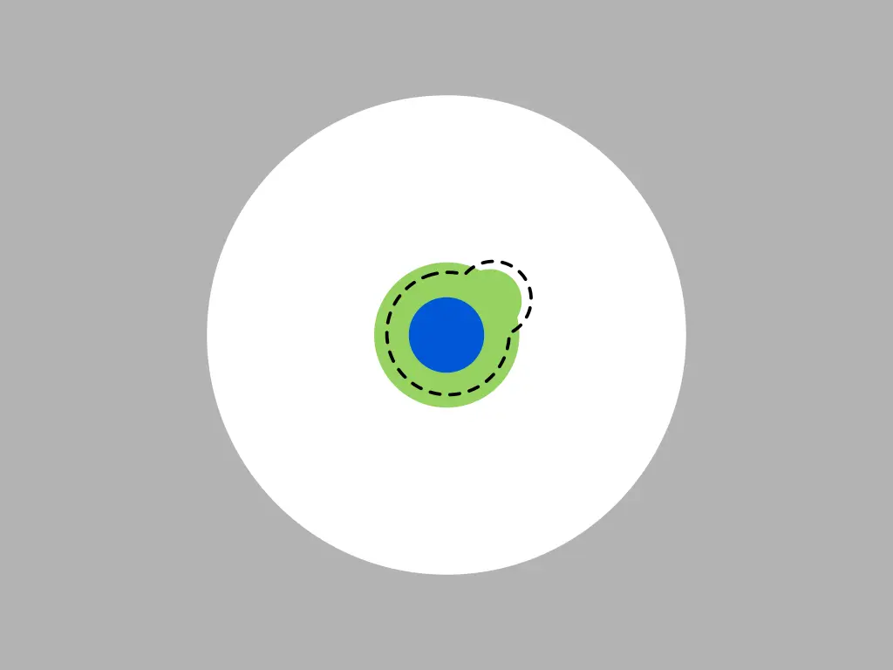
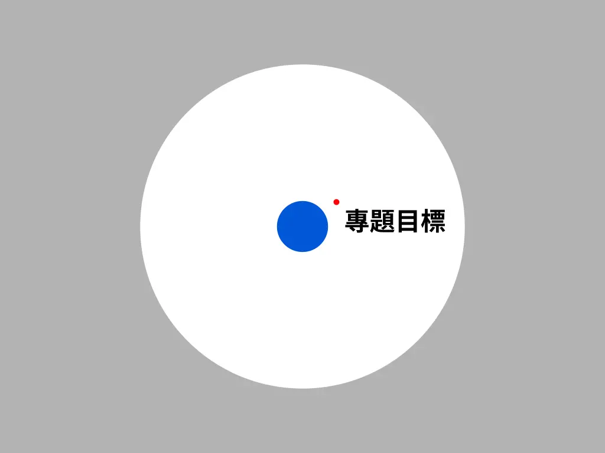

# 知識邊界與我的專題式自學法

<head>
  <meta property="og:image" content="https://raw.githubusercontent.com/FlySkyPie/flyskypie.github.io/main/post/2025-12-26_knowledge-boundary-and-project-based-learning/01_circle-of-knowledge.webp" />
</head>

## 知識邊界

Matt Might 的「[圖解博士學位 (The illustrated guide to a Ph.D.)](https://matt.might.net/articles/phd-school-in-pictures/)」主要是以視覺化的方式解釋「全人類的知識邊界」與博士學位之間關係。不過我認為這個概念在幫助人理解教育體系本身的設計以及自身的知識邊界非常有幫助。沒有看過得人可以點擊上面的連結或是[這個中文翻譯](https://researcher20.com/2010/08/18/ph-d-圖解-the-illustrated-guide-to-a-ph-d/)。

以下我會參考這個概念解釋，加上一點我的個人見解。

> “As our circle of knowledge expands, so does the circumference of darkness surrounding it.” 
> 
> -- 愛因斯坦
>

用圓圈來形容知識，Matt Might 並不是第一個人，不過視覺化的表達可能遠比名言金句更有力量。現在想像一個圓圈代表全人類知識體系已知的知識，而圓圈外則是未知：

當一個人接受了國民義務教育，它從整個知識體系中均衡的學習到了一點東西：

在 Matt Might 的圖解中，高中是另外一個均勻的知識圈圈，開始出現知識領域專業化是大學系所才發生的事情。不過在我國教育實務上有分成普通高中跟高職；普通高中又有分組（108 課綱之後為班群），而高職則是已經開始進行類似大學系所的專業化學習（理論與實務的差異先不談）：

普通高中是綠色的比較均勻圈圈，高職則是以較偏頗的虛線，看過銀之匙（荒川弘）這部作品的讀者可能會對這種差異更有感覺，作品中普通升學體系的主角進入技職體系所受到的衝擊就是來自於兩種體系對於知識邊界預期不太一樣。

如果你繼續留在學術界，完成學士、碩士的訓練；並且持續閱讀論文、學習往特定的知識領域前進；最後在人類的知識邊界挖出一角，那個成果將讓你成為博士。

Matt Might 花比較多篇幅在醞釀這個小角，因為擴展人類知識邊界的博士並不容易，不過這並不是我今天要談的重點，所以容我快速帶過，但是到這裡為止，你應該對「知識邊界」的概念有比較清晰的想像。

另外在我看來，知識邊界拓展的方式從微觀尺度來講，更像是「劈裂」過去的，當每你經歷一個得以觸動的知識點時，知識邊界會以閃電一般的路徑劈裂過去。

觸動的與否取決於該知識點與知識邊界的距離，以及原本「裂痕的方向」有關，這是為什麼同樣的事件、同樣的體驗可以成為某些人的知識點並拓展它的知識邊界，對某些人而言卻只是成為被忘卻的記憶。

## 專題式自學法

專題導向學習 (Project-Based Learning) 似乎是一種教育科學的方法論，並且在我國被提倡也只是最近（108 課綱）的事情而已。而我有幸在成長過程自然的捕捉到這個方法論的脈絡。

---

「想做遊戲」，於是有了：

[飛貓工作室](https://flyskypie.github.io/sideprojects-wiki/#%E9%A3%9B%E8%B2%93%E5%B7%A5%E4%BD%9C%E5%AE%A4)，

但是實際上沒有完成任何遊戲。

---

「看著 LEGO® NXT 2.0，心想自己造一個」，於是有了：

[電機開發平台 (MMFEDP, Modular Multi-Faceted Electrical Develop Platform) 專案](https://flyskypie.github.io/sideprojects-wiki/#Project%3AMMFEDP)，

但是實際上沒有完成任何跟可程式化有關的東西或是足夠實用的減速機。

---

「看著機器人比賽，對著那種與他人合作打造機器人的憧憬，心想自己造一個」，於是有了：

[獨立性無人地面載具 (ITUGV, Independent Task Unmanned Ground Vehicle)](https://flyskypie.github.io/sideprojects-wiki/#Project%3AITUGV)，

但是實際上沒有實現遠端遙控的機器人。

---

「YouTube 的『homemad』影片往往包含了車銑床之類的加工方式，但是我想自己製作機器人零件，那就用鑄造的好了」，於是有了：

[土砲熔爐](https://flyskypie.github.io/sideprojects-wiki/#%E5%9C%9F%E7%A0%B2%E7%86%94%E7%88%90)，

但是實際上沒有用它製作過機器人零件。

---

「想和同儕分享寫程式的樂趣」，於是有了：

[程式蠱](https://flyskypie.github.io/sideprojects-wiki/#%E7%A8%8B%E5%BC%8F%E8%A0%B1)，

但是實際上沒有讓其他人參與過。

---

「想做 2.5D RPG」，於是有了：

[VB.NET 土砲 2.D 遊戲](https://flyskypie.github.io/sideprojects-wiki/#VB.NET%20%E5%9C%9F%E7%A0%B2%202.D%20%E9%81%8A%E6%88%B2)，

但是實際上沒有實現遊戲該有的抽象化與職責分離。

---

「看著 KSP 遊戲但是無法合法的擁有，心想自己造一個」，於是有了：

[VB.NET 太空軌道模擬遊戲](https://flyskypie.github.io/sideprojects-wiki/#VB.NET%20%E5%A4%AA%E7%A9%BA%E8%BB%8C%E9%81%93%E6%A8%A1%E6%93%AC%E9%81%8A%E6%88%B2)，

但是實際上停留在 2D 模擬，而且沒有更進一步的多組件編輯機制。

---

「心想開發一個多人連線 FPS」，於是有了：

[香巴朵 Online](https://flyskypie.github.io/sideprojects-wiki/#Project%3A%E9%A6%99%E5%B7%B4%E6%9C%B5%20Online)，

但是實際上 3D 射擊的部份並不是使用 GPU 繪圖，而連線功能也僅停留在 2D 的實驗性開發 (prototype)。

---

「想用論壇機制來解決抽象的『自造者銀行』」，於是有了：

[C 幣論壇](https://flyskypie.github.io/sideprojects-wiki/#C%20%E5%B9%A3%E8%AB%96%E5%A3%87)，

但是實際上交易功能並沒有投入使用。

---

「既然我已經做過熔爐了，這次順便解決廢氣問題好了」，於是有了：

[畢業專題-熔爐](https://flyskypie.github.io/sideprojects-wiki/#%E7%A7%BB%E5%8B%95%E7%86%94%E7%88%90)，

但是實際上廢氣處理系統並沒有得到足夠多的關注與測試。

---

當我說：

> 我有「閃亮事物症候群」
>

不是在開玩笑的。

當我說：

> 「智者從歷史中學習，愚者從錯誤中學習」，而我是愚者。
>

不只是說說而已。

每一個 Side Project 其實都源自微不足道的願望，並且乍看之下所有專案都以失敗告終，不過我尚未提起我在當中獲得了什麼：

- 「飛貓工作室」：我當過傲慢毫無能力（不論是領導能力或是技術能力）的籌備者；這讓我每次在團體或團隊中手握權力時，不斷提醒著自身與他人之間的關係。
- 「MMFEDP」、「ITUGV」：我已經成長到不必透過 NXT 2.0 這樣的東西，而是使用 Arduino、樹莓派來開發機電玩具的程度了。
- 「土砲熔爐」、「畢業專題-熔爐」：它帶給我「無法製造」的無能感是引導我前往材料系的因素之一，如今我已經能夠使用車床、銑床、鉗工、手工電弧焊、3D 列印...等等方式打造我想要的東西。
- 「程式蠱」：Zero-player game 的概念至今仍然在影響著我學習的方向，實作 2.0 的時候更是直接點開 `dlopen` 的使用經驗。
- 「VB.NET *」：雖然現在我已經不使用 VB 了，但是第一次使用參考（指標）以及從靜態記憶體到動態記憶體的過程依然是不可多得的體驗。
- 「香巴朵 Online」：它對我提供了一個很強烈的 TCP Socket 的記憶點，這讓我在使用諸如 HTTP 其他網路連線機制的時候很有幫助。
- 「C 幣論壇」：使用 Laravel 的經驗可以說是幫我在後端軟體的開發經驗上打下非常堅硬的基礎。

## 專題與知識邊界

是的，大部分的專題目標都在我當下的知識邊界之外，這也是為什麼它們大多數都會失敗的原因。

> 我們選擇在這個十年登上月球，並完成其他的事，不是因為它們很簡單，而是因為它們很困難。
> 
> -- 約翰．甘迺迪（John F. Kennedy）
>

每一個 Side Project 都是對於「博士挑戰人類知識邊界」的微小仿作，對我而言知識不是一個被好像很偉大的人站在教室裡授予的東西，而是在知識邊界之外，透過一個又一個知識點劈開未知獲得的東西。

如此不斷的前進，過個幾年回過頭來看，可能會驚訝於那些曾經遙不可及的目標不知不覺已經處於自己的身後；又或是它已經處於自己當下的知識邊界觸手可及的地方。
