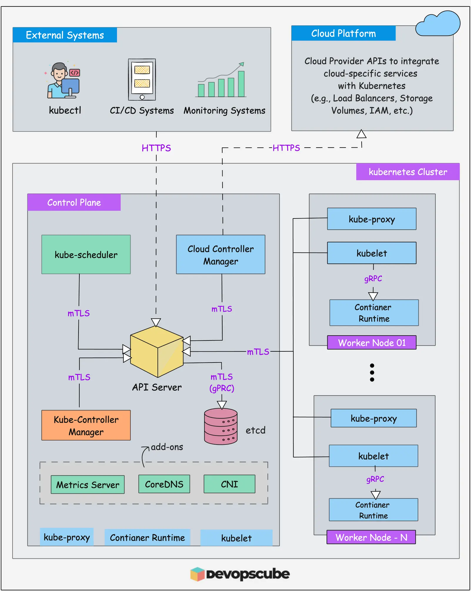

# 教練我想學 K8s

<head>
  <meta property="og:image" content="https://raw.githubusercontent.com/FlySkyPie/flyskypie.github.io/main/post/2025-12-28_learn-k8s/00_cover.webp" />
</head>


最近想學 K8s 然後陸續把 Homelab 的服務從 Docker Swarm 移過去，不過一直靜不下心好好讀它，思緒糊成一團，於是想說先把一些已經知道的事情整理一下。

## 動機

:::info
因為我實際上還未實際使用 K8s，所以以下可以當成「對 K8s 的美好幻想」。
:::

簡單紀錄一下幾個讓我想學 K8s 的動機。

### Image Volume

前一陣子在鼓搗 Keyclaok，並且外掛了兩個組件：

- https://github.com/keycloakify/keycloakify
- https://github.com/p2-inc/keycloak-magic-link

Keycloak 的插件機制是將 `*.jar` 檔案放到 `/opt/keycloak/providers/` 下，待啟動時被載入。

在 OCI (Open Container Initiative) 佈署下處理這種這整合有兩種方法：

- 建置階段：直接在 Dockerfile 用 COPY 完成組裝。
- 佈署階段：透過 Volume 將 jar 檔案掛載進容器。

前者缺乏彈性；後者 Docker 不支援，但是 K8s 支援[^k8s-image-volume]。

:::info
話說回來這幾天在讀 Docker Compose 的 spec 看到這東西(`image`)：
```json
// service.volumes.type
  "type": {
    "type": "string",
    "enum": ["bind", "volume", "tmpfs", "cluster", "npipe", "image"],
    "description": "The mount type: bind for mounting host directories, volume for named volumes, tmpfs for temporary filesystems, cluster for cluster volumes, npipe for named pipes, or image for mounting from an image."
  },
```
也許 Docker 也支援了說不定。
:::

[^k8s-image-volume]: Use an Image Volume With a Pod | Kubernetes. https://kubernetes.io/docs/tasks/configure-pod-container/image-volumes/

### `depends_on`

Docker Compose 使用 `depends_on` 來延遲一些容器的啟動，避免仰賴其他容器的服務過早的啟動，例如：後端嘗試對還沒準備完成的資料庫進行連線。

Docker Swarm 則不支援這個功能，它的邏輯是透過 health check：反正有仰賴的容器連線失敗會 health check 失敗，直接重啟容器直到成功為止。但是這樣的設計無法運行相對複雜的服務，例如：我嘗試在 Swarm 模式下運行 GVM (OpenVas) 並沒有成功過。

而 K8s 則是透過 `initContainers` 的機制來處理這類需求。

### Serverless

工作時使用雲端的 Serverless 的服務 (GCP Cloud Run)，因此我對於自架 (selfhosted) 方案很感興趣，也有找到一些開源方案，不過它們多基於 K8s，例如：

- https://github.com/fission/fission
- https://github.com/openfaas/faas
- https://github.com/knative/serving

:::info
我這裡是指基於 OCI 的 Serverless，非 OCI 的 "Function based" Serverless 方案通常都有緊支援特定程式語言的限制。
:::

## K3s 與遠端訪問

前幾天 (2025-12-23) 安裝完 K3s 設定遠端訪問時看到這個：

```shell
$ kubectl config view
apiVersion: v1
clusters:
- cluster:
    certificate-authority-data: DATA+OMITTED
    server: https://127.0.0.1:6443
  name: default
contexts:
- context:
    cluster: default
    user: default
  name: default
current-context: default
kind: Config
preferences: {}
users:
- name: default
  user:
    client-certificate-data: DATA+OMITTED
    client-key-data: DATA+OMITTED
```

雖然知道 `certificate-authority-data` 大概是為了 HTTPS 的加密機制而準備的，不過我其實不知所以然。

## K8s 架構圖

查資料的時候看到這張架構圖：



我注意到 K8s 的組件之間通訊都是加密的，這讓我想到之前透過「Kubernetes The Hard Way」學習 K8s 的經驗。

以及某篇文章，有個老兄抱怨 K8s 難用，伺服器癱瘓的原因似乎是憑證過期，並且它們最後在 AWS 找到了歸屬。

## Kubernetes The Hard Way

[Kubernetes The Hard Way](https://github.com/kelseyhightower/kubernetes-the-hard-way) 是一個架設 K8s 的教學，但是不使用現成的安裝精靈，而是手動安裝與配置每一個組件。

去年（2024 年 1 月）我其實試著依照這份指南的步驟嘗試在一台 x86 32 位元筆電上建立 K8s，雖然最後沒有持續下去，但是我隱約記得過程中一直在生成金鑰跟簽署憑證。

:::info
我當時有試著將執行過得步驟寫成 Make/Ansible 腳本：

https://github.com/FlySkyPie/k8s-builder-and-installer-for-x86-single-node
:::

## 正確打開 K8s 的方式...難道是密碼學？

作為一個以開發前端業務邏輯為重心的開發者，密碼學相關的基礎概念可以說是很容易被輕忽的部份。或許我該好好的梳理以下對於加密技術的基礎概念作為。

當然，如果我只是要作為 K8s 的使用者，這些知識似乎沒有這麼重要，不過我同時還是要在 Homelab 架設 K8s 的維護者，我不認為紮紮時時的把基礎打好有什麼壞處。
