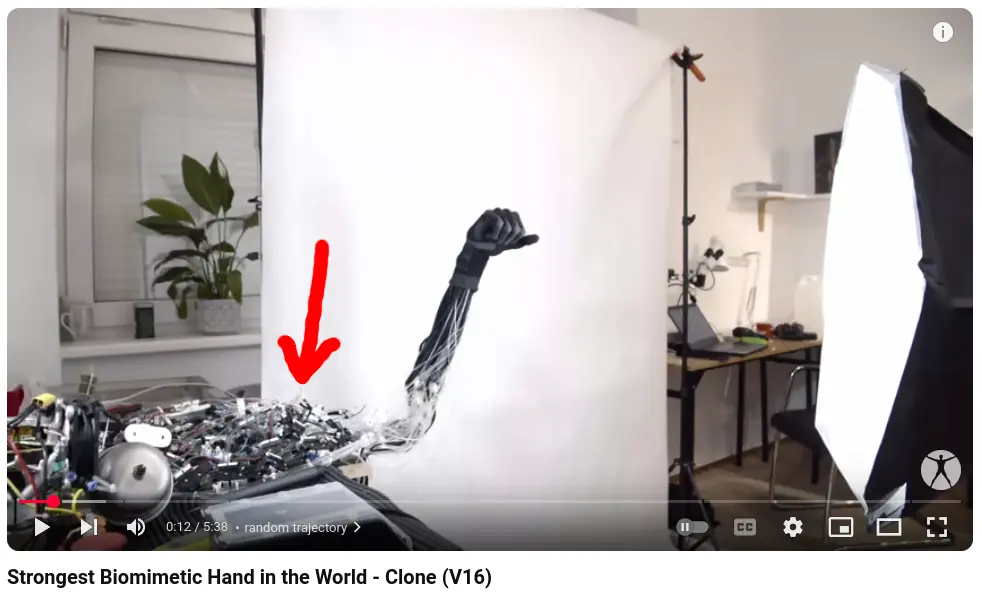

---
slug: 2025_02_22_the-distance-between-life-and-lifeless
authors: [weiji,]
tags: []
--- 

# 生者與死物的距離，一種人形仿生機器人開發路徑的視角

<head>
  <meta property="og:image" content="https://raw.githubusercontent.com/FlySkyPie/flyskypie.github.io/main/post/2025_02_22_the-distance-between-life-and-lifeless/01.webp" />
</head>

:::warning
本文可能觸及敏感的社會議題或現象，目的是提出一種看事情的角度，並無針對特定族群冒犯之意。
:::

## 背景 (Context)

作為一個理工死宅男，我想做機器人妹抖 (Maid)。

## 靈感

事後整理了一下思緒，我想一切的起因來自這則貼文：

<blockquote class="twitter-tweet">
<a href="https://t.co/QcYEAUBqBV">https://t.co/QcYEAUBqBV</a> <a href="https://t.co/kLkziAlPVj">pic.twitter.com/kLkziAlPVj</a>
&mdash; jet (@natwjeq) <a href="https://twitter.com/natwjeq/status/1892580946274050411?ref_src=twsrc%5Etfw">February 20, 2025</a></blockquote>  

這個貼文包含了兩個實體：Clone 和足立レイ，等等我會稍做解釋。

關於足立レイ的具體資訊可以從[萌娘百科](https://zh.moegirl.org.cn/zh-tw/足立零)了解，簡單來說它是一個 ACG 圈的原創角色，然後作者有愛到造了一個等身大小的機器人。可以在作者的 Twitter 帳號 ([@missile_39](https://x.com/missile_39))看到各種關於足立レイ的貼文，並且機器人看起來被安置在一個像是電子實驗室的空間中。

另外一件事則是前幾天 (2025-02-20) Clone 發布了一支[影片](https://www.youtube.com/watch?v=H7dhwFcuUn0)：

<blockquote class="twitter-tweet">
Protoclone, the world&#39;s first bipedal, musculoskeletal android. <a href="https://t.co/oIV1yaMSyE">pic.twitter.com/oIV1yaMSyE</a>
&mdash; Clone (@clonerobotics) <a href="https://twitter.com/clonerobotics/status/1892250639360561234?ref_src=twsrc%5Etfw">February 19, 2025</a></blockquote>  

內容就是一個神似 Westworld 中的機器人被吊著抽搐（？）的畫面。

對於 Clone 不熟悉的讀者，我這邊稍微介紹一下，Clone 在研發"仿生機器人"的方向與主流機器人公司不同的地方在於它們是在基於人類骨骼的骨架上附上基於液壓的仿生肌肉來製作機器人的肢體，而不是直接「把基於電機的機器關節打造成人形」的形式，後者是包含波士頓動力和 Tesla Optimus 等知名公司製造人形機器人的方式。

### 批判與反思

對於 Clone 的貼文，大部分留言的反應是感到不安，一來是 Clone 的配樂有意的製造驚悚的氣氛，而「像人一樣的肢體抽搐」更是命中了不少人的恐怖谷，更有人批評「開發團隊甚至不能讓它做出有意義的動作，只是讓特定的組件做動而已，這裡沒有新聞」。

事實是，足立レイ的貼文出現在我的 Twitter 動態牆上時，大部分都是坐在椅子上的擺拍，它的本質就像一個二次元角色的巨大手辦而已，對於這些貼文我的心態大部分是嗤之以鼻的。

另一方面，一些 Clone 更早的[影片](https://www.youtube.com/watch?v=guDIwspRGJ8)中，那栩栩如生的手臂確實讓不少人感到驚豔，不過背景的噪音透漏的是旁邊有一組體積異常龐大的驅動裝置在做動[^clone-arm]：

[^clone-arm]: Strongest Biomimetic Hand in the World - Clone (V16) - YouTube, https://www.youtube.com/watch?v=lGnSQbEzI9s

因此不論 Clone 在鏡頭前呈現多少東西，只要開發者沒有辦法微縮化那坨液壓驅動系統，就不可能實現真正意義的實用化人形機器人。

不過話說回來，挑別人毛病容易，我呢？作為一個想開發類似的東西後進者有沒有因此學到什麼？

## 過程與中間狀態

讓我們來想像，起點是空無一物；終點是實用化的人形機器人，那麼中間的過度狀態是什麼？我該如何設定階段性目標 (milestone)?

實用化人形機器人理論上應該具備自然人的大部分能力，因此如果我把問題反過來思考會發生什麼事？起點是自然人；終點是死物。

我們會發現這是一個失能 (Disable) 的過程：從一個功能完全正常的人，經歷輕度、中度、重度、極重度殘疾直到不再被承認為活物。

採用這個視角看待問題會有一個好處，那就是殘疾這件事是已經被經過系統化討論與歸納的主題，各國對於殘疾等級都有一定的規範與定義，作為開發者在這個問題上就不太需要重複造輪子去定義中間的過度狀態了。

接著我們再把這個人類失能的過程反過來看，變成賦能 (Enable)，從死物、極重度、重度、中度、輕度殘疾到正常人，就是一個實用化人形機器人的開發路徑了：

