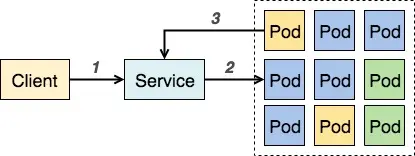
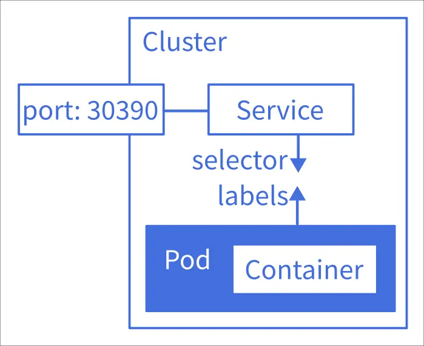
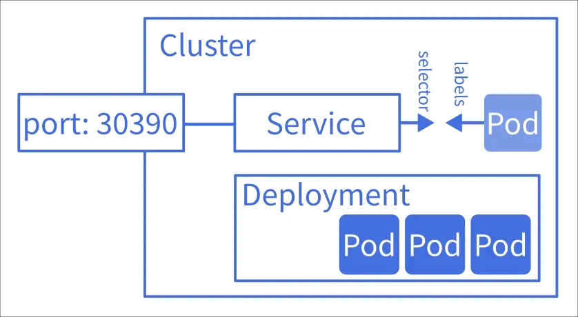

# K8s 學習筆記 - Pod 和它快樂的小夥伴們

<head>
  <meta property="og:image" content="https://raw.githubusercontent.com/FlySkyPie/flyskypie.github.io/main/post/2026-01-01_learn-k8s/02_k8s-pod-shocker.webp" />
</head>

## Pod

聲明一個 Pod：

```yaml
apiVersion: v1
kind: Pod
metadata:
  name: awesome-pod
  labels:
    app: awesomeApp
spec:
  containers:
    - name: awesome-container
      image: mendhak/http-https-echo:38
      ports:
        - containerPort: 8080
```

根據聲明建立資源（在這個例子中是建立 Pod）：

```shell
kubectl create -f sample.yaml
```
接著使用這個指令建立隧道 (tunnel)：

```shell
kubectl port-forward awesome-pod 3001:8080
```

接著就可以透過這個連結訪問剛剛建立的 Pod 了： `http://localhost:3001`


這個通道是臨時的，中止指令就會消滅通道，使用過 ngrok 的人或許會對這種感覺不陌生，它就像是「反向的 ngrok」，暫時將 Cluster 內特定的資源暴露到本機上。

:::info
玩耍結束後不要忘記銷毀資源：
```shell
kubectl delete -f sample.yaml
```
:::

## Service


Pod 在 K8s 的世界裡其實是雜魚、消耗品，可能會故障然後被清除掉之後被新建的 Pod 取代，又或是為了負載需求而被複製成一堆一樣參數的 Pod，Pod 的 IP 也因此是浮動的，實際使用你不會直接連線到特定的 Pod，而是透過一層抽象找到「在運行這種服務的 Pod」，那個抽象就是 Service。這個抽象不只是用於外部訪問，也包含 Pod 對 Pod 的內部連線。

### ClusterIP

一個 Service 大概長得像這樣：

```yaml
apiVersion: v1
kind: Service
metadata:
  name: awesome-service
spec:
  selector:
    app: awesomeApp
  type: ClusterIP
  ports:
    - protocol: TCP
      port: 3001
      targetPort: 8080
```

完整的檔案如下：

:::spoiler sample.yaml
```yaml
apiVersion: v1
kind: Pod
metadata:
  name: awesome-pod
  labels:
    app: awesomeApp
spec:
  containers:
    - name: awesome-container
      image: mendhak/http-https-echo:38
      ports:
        - containerPort: 8080
---
apiVersion: v1
kind: Service
metadata:
  name: awesome-service
spec:
  selector:
    app: awesomeApp
  type: ClusterIP
  ports:
    - protocol: TCP
      port: 3001
      targetPort: 8080
```
:::

```shell
# 用一樣的指令把服務帶起來：
kubectl create -f sample.yaml

# 開 tunnel
kubectl port-forward service/awesome-service 3002:3001
```

只是這次我們連線的目標不是 Pod 而是 Service： `http://localhost:3002`


ClusterIP 尚未真正對外暴露我們的服務，這個模式主要給 Pod 內部訪問用（路徑3→2）[^k8s-ClusterIP]：



[^k8s-ClusterIP]: Kubernetes Service 概念詳解 | Kubernetes. Retrieved 2026-01-01, from https://tachingchen.com/tw/blog/kubernetes-service/

### NodePort

```yaml
apiVersion: v1
kind: Pod
metadata:
  name: awesome-pod
  labels:
    app: awesomeApp
spec:
  containers:
    - name: awesome-container
      image: mendhak/http-https-echo:38
      ports:
        - containerPort: 8080
---
apiVersion: v1
kind: Service
metadata:
  name: awesome-service
spec:
  selector:
    app: awesomeApp
  type: NodePort
  ports:
    - protocol: TCP
      port: 3001
      targetPort: 8080
      nodePort: 30390
```

接著用一樣的指令把服務帶起來：

```shell
kubectl create -f sample.yaml
```

這次從 Node 的 IP 訪問（例如： `http://192.168.0.123:30390`）



:::info
Service 除了 ClusterIP 和 NodePort 以外，還有其他種類，不過在此不做過多的解釋，因為不是本文重點。
:::

## Deployment



> Pod 在 K8s 的世界裡其實是雜魚、消耗品
> 

是的，在 K8s 我們一般不會直接佈署 Pod，而是透過 Deployment 組件（或是其他類似功能的組件）來間接的佈署 Pod：

```yaml
apiVersion: apps/v1
kind: Deployment
metadata:
  name: awesome-deployment
spec:
  replicas: 3
  template:
    metadata:
      labels:
        app: awesomeApp
    spec:
      containers:
        - name: kubernetes-demo-container
          image: mendhak/http-https-echo:38
          ports:
            - containerPort: 8080
  selector:
    matchLabels:
      app: awesomeApp
---
apiVersion: v1
kind: Service
metadata:
  name: awesome-service
spec:
  selector:
    app: awesomeApp
  type: NodePort
  ports:
    - protocol: TCP
      port: 3001
      targetPort: 8080
      nodePort: 30390
```

你可以用瀏覽器打開它（例如： `http://192.168.0.123:30390`）， 不過你可能只會看到相同的 `os.hostname`，試試多執行幾次 `curl`：

```shell
curl http://192.168.0.123:30390/ | jq .os.hostname
```
