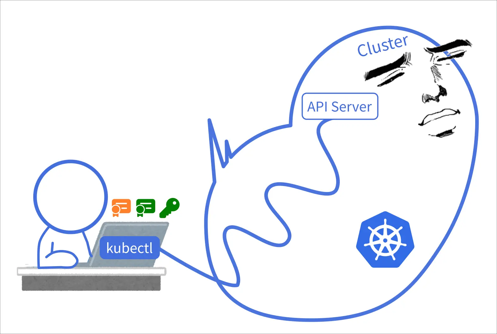

# 安裝 K3s 與遠端連線

<head>
  <meta property="og:image" content="https://raw.githubusercontent.com/FlySkyPie/flyskypie.github.io/main/post/2026-01-02_learn-k8s/01_kubectl.webp" />
</head>

## 安裝

懶人安裝法：

```shell
curl -sfL https://get.k3s.io | sh - 
```

檢查一下有沒有正常：

```shell
sudo k3s kubectl get node 
```

## 設定



從安裝 K3s 的機器複製 `/etc/rancher/k3s/k3s.yaml` 到想要遠端連線的機器（Client 端）的 `~/.kube/config`。[^cluster-access]

:::info
要留意 K8s 的憑證會過期這件事。
:::

[^cluster-access]: Cluster Access | K3s. Retrieved 2026-01-02, from https://docs.k3s.io/cluster-access
