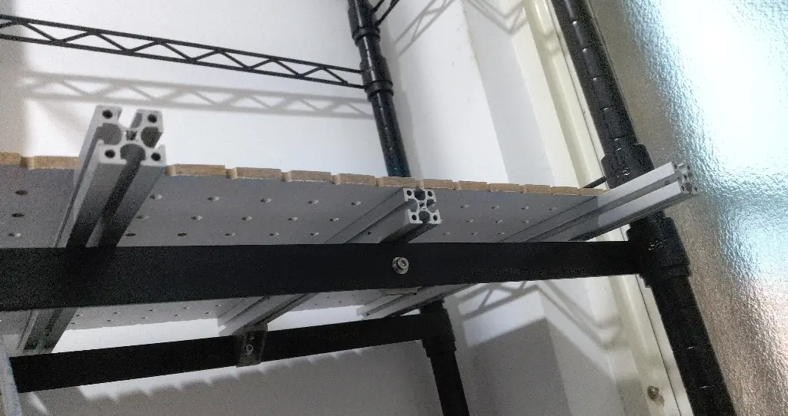

# 老兄，你真的找錯人推銷桌面照明了

<head>
  <meta property="og:image" content="https://raw.githubusercontent.com/FlySkyPie/flyskypie.github.io/main/post/2026-01-03_desktop-lighting/03_lighting.webp" />
</head>

前一陣子跟一個硬體工程師聊天，然後他順便推銷他們公司出的桌面燈，因為是他經手過的產品。老兄，不是我要貶低你的努力，只是我的消費水準是隨便找個鋁擠、幾顆 M4 螺絲、一支 USB 燈條就處理掉桌面照明的人，找我推銷桌面燈是真的找錯人了。

就算真的有興趣想買的，大概也是手術燈那種東西，畢竟在做事的時候光源被手或是頭擋住真的很煩。
