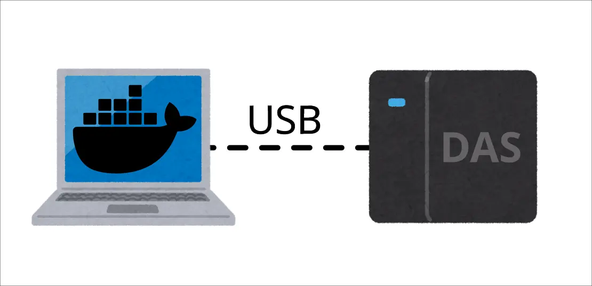
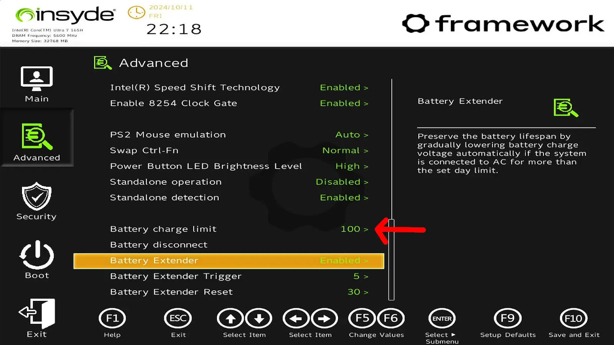

# 筆記型 Homelab 飼養注意事項



## 背景

我的 Homelab 是透過筆電和 USB 外接 DAS (Direct Attached Storage) 建構的，並且採過一些小坑。最近在建置新的節點時，發現我把相關的資訊分散在不同的筆記和 IaC (Infrastructure as Code) 裡面，於是想說趁這個機會整理一下資訊。

## 電池充電上限

Framework 的話可以在 BIOS 設定充電上限：



（從 Framework 的論壇[借用螢幕截圖](https://community.frame.work/t/framework-laptop-13-ryzen-7040-bios-3-07-release-held/65582)）

另外一台 Lenovo 的筆電則是靠這個設定：

https://github.com/makifdb/lenopow

我會把把充電上限設在 80% 避免筆電作為伺服器長時間插著充電造成電池膨脹。

## 筆電螢幕問題

讓筆電不會因為螢幕蓋上而進入休眠模式，編輯 `/etc/systemd/logind.conf`：

```shell
HandleLidSwitch=ignore
```

執行指令重啟服務：

```shell
systemctl restart systemd-logind.service
```

但是上述設定會造成另外一個問題：螢幕蓋著還是繼續發光，於是還需要一個步驟，編輯 `/etc/default/grub`：

在 `GRUB_CMDLINE_LINUX_DEFAULT` 插入 `consoleblank=60`。

這會讓螢幕在 60 秒後熄滅。

<details>
<summary>完整 Ansible Playbook</summary>
```yaml
- name: Setup laptop
  hosts: 
    - arachne-node-beta
  tasks:
    - name: check if consoleblank is configured in the boot command
      ansible.builtin.lineinfile:
        backup: true
        path: /etc/default/grub
        regexp: '^GRUB_CMDLINE_LINUX_DEFAULT=".*consoleblank=60'
        state: absent
      check_mode: true
      register: grub_cmdline_check
      changed_when: false
    - name: insert consoleblank if missing
      ansible.builtin.lineinfile:
        backrefs: true
        path: /etc/default/grub
        regexp: '^(GRUB_CMDLINE_LINUX_DEFAULT=".*)"$'
        line: '\1 consoleblank=60"'
      when: grub_cmdline_check.found == 0
      notify: update grub
    - name: Set HandleLidSwitch
      ansible.builtin.lineinfile:
        backrefs: true
        path: /etc/systemd/logind.conf
        regexp: "#?(HandleLidSwitch=)(?:.*)$"
        line: '\1ignore'
      notify: Restart logind
  handlers:
    - name: update grub
      ansible.builtin.command: update-grub
    - name: Restart logind
      ansible.builtin.systemd_service:
        name: systemd-logind
        state: restarted
```
</details>

## DAS 掛載

當服務透過 Docker 跑在容器內，持久化資料卻儲存在透過 USB 連線的外部儲存中，這個仰賴關係需要額外處理。

### 自動化載

編輯 `/etc/fstab` 加入以下內容：

```ini
# DAS
UUID=7f858b7e-f942-45b3-92dd-8c99b497b6a4 /mnt/das-storage ext4 defaults,nofail,x-systemd.automount 0 2
```

修改後執行：

```shell
systemctl daemon-reload
```

:::info
UUID 可以透過 `lsblk -f` 之類的指令獲得。
:::

### 設定仰賴

新增檔案 `/etc/systemd/system/docker.service.d/override.conf`：

```ini
[Unit]
After=mnt-das\\x2dstorage.automount
ConditionPathExists=/mnt/das-storage
```

```shell
systemctl restart docker.service
```

確保 Docker Daemon 在 DAS 掛載後才運行。

## DAS SMART 檢查

因為電腦沒有直接和硬碟建立連線而是隔著一層 DAS，因此不能使用普通的 `smartctl` 指令確認，而必須使用額外的參數[^qnap-smart]：

```shell
smartctl -a -d jmb39x-q,0 /dev/sdd
smartctl -a --device jmb39x-q,1 /dev/sdd
smartctl -a -d jmb39x-q,2 /dev/sdd
smartctl -a --device jmb39x-q,3 /dev/sdd
```


[^qnap-smart]: QNAP External RAID Manager - Export SMART Data - QNAP NAS Community Forum. Retrieved 2026-01-03, from https://forum.qnap.com/viewtopic.php?p=873575&sid=573c6149a1276e4ab8d9f4785f1c6029#p873575
