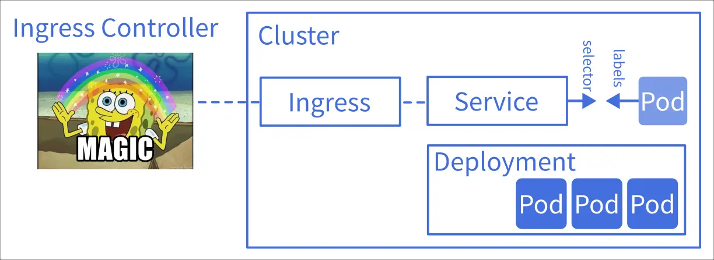

# K8s 學習筆記 - K8s 只是框架

<head>
  <meta property="og:image" content="https://raw.githubusercontent.com/FlySkyPie/flyskypie.github.io/main/post/2026-01-05_k8s-is-framework/03_storage-backend.webp" />
</head>

> K8s 不是一個完整解決方案，K8s 只是框架。
>

驚不驚喜？意不意外？

當你安裝了 Docker 之後就可以開始打包 image 並運行程式，甚至可以使用 Dokcer Compose 指令開始進行容器編排 (Orchestration)。

反觀，對於一個 K8s 使用者而言，生態系內有很多「口味」供你選擇：Minikube、MicroK8s、K3s、GKE、EKS...但是當你選擇原味 (Vanilla)時，你可能會發現歷經一番波折安裝完成之後，你還是什麼都不能幹：不能正常建立網路連線、不能正常的掛載持久化實體 (Volume)...

為什麼？因為 K8s 本身不是開箱即用解決方案，它只是一種框架。

## 不是開箱即用的網路

:::info
這個段落會多次提及 OSI 的 L4 和 L7，對兩者差異不清楚的讀者建議先去查點資料，不然閱讀起來可能會有點吃力。
:::

我在[前一篇文章](https://flyskypie.github.io/posts/2026-01-01_learn-k8s/)中介紹了 Service，以及內網模式 ClusterIP 與節點開埠 NodePort，即便是 NodePort 也不像是標準佈署使用的模式，因為它只能開奇怪的埠號。這是因為 Service 其實還有兩個生產環境在使用的模式：LoadBalancer 模式或是加掛一個 Ingress。

以 ServiceLB (LoadBalancer) 為例，K8s 只提供一個 L4 的抽象層，具體的實做依然需要別人來完成：

:::info
LB (LoadBalancer) Controller 是一個方便讀者理解的稱呼，實際情況比較複雜，有其他專門的術語用來稱呼這個東西。
:::

在雲端環境（如 Google, AWS）這是由雲端供應商實作的，可能是一團閉源商業軟體和硬體級 LB 整合而成；在 K3s 中這是由 [klipper-lb](https://github.com/k3s-io/klipper-lb) 透過 `hostPort` 實作的。

Ingress 也是相同的狀況，K8s 只提供一個 L7 的抽象層，具體的實做依然需要別人來完成：

實作可以是 Nginx 也可以是 Traefik。

## 不是開箱即用的持久化儲存

K8s 在設計上就是一個分散式運行的框架，當 Pod 可能分散在多個不同的主機（節點）時，我們就不能像 Docker 那樣直接用某個路徑當作持久化實體。

在 K8s 的世界中，Volume 通常是一個 SDS (Software-defined storage)；
在 K8s 的世界中，網路線就是 SATA 線。

細節我不在此解釋，簡單來說在 K8s 要幫 Container 掛載 Volume 需要經過層層抽象，並且最後實際的儲存實體並不在 K8s 內實作：

:::info
你也可以在 K8s 設定 `storageClassName: local-storage` 的 Volume，但是這樣你可能需要額外配置讓 Pod 只能佈署在特定的 Node 上。
:::

:::info
Storage Backend 同樣是一個方便讀者理解的稱呼，並不是 K8s 內的標準術語。
:::