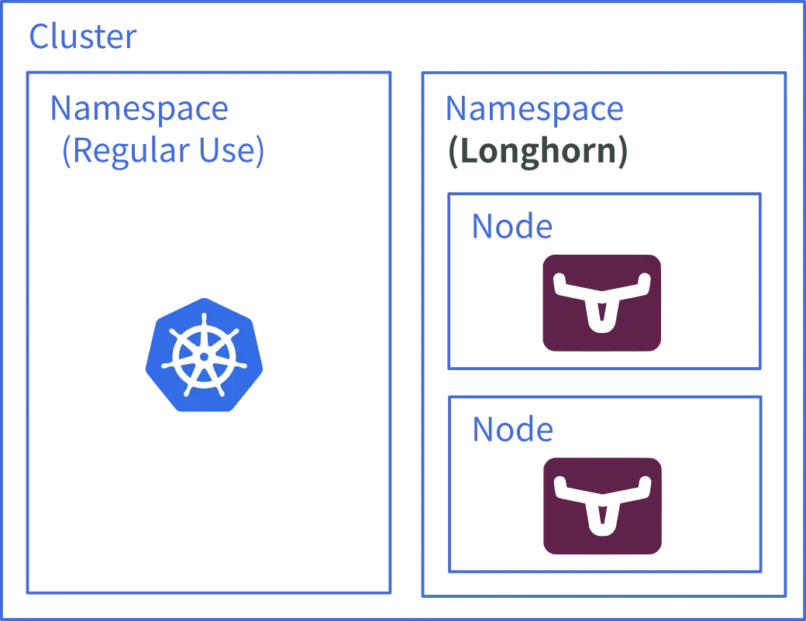

# K8s 學習筆記 - Longhorn 簡介

接續我在[前一篇貼文](https://flyskypie.github.io/posts/2026-01-05_k8s-is-framework/)指出的：K8s 本身只是框架，並沒有包含 SDS (Software-defined storage) 的具體實作：

[Longhorn](https://github.com/longhorn/longhorn) 則是其中一種 SDS 實作：

Longhorn 巧妙的運用 K8s 作為基礎設施，將 SDS 運行在 Cluster 內部，並且利用 K8s 的多節點特性運行多個實例，並在多個實例上建立資料冗餘實現分散式副本：

