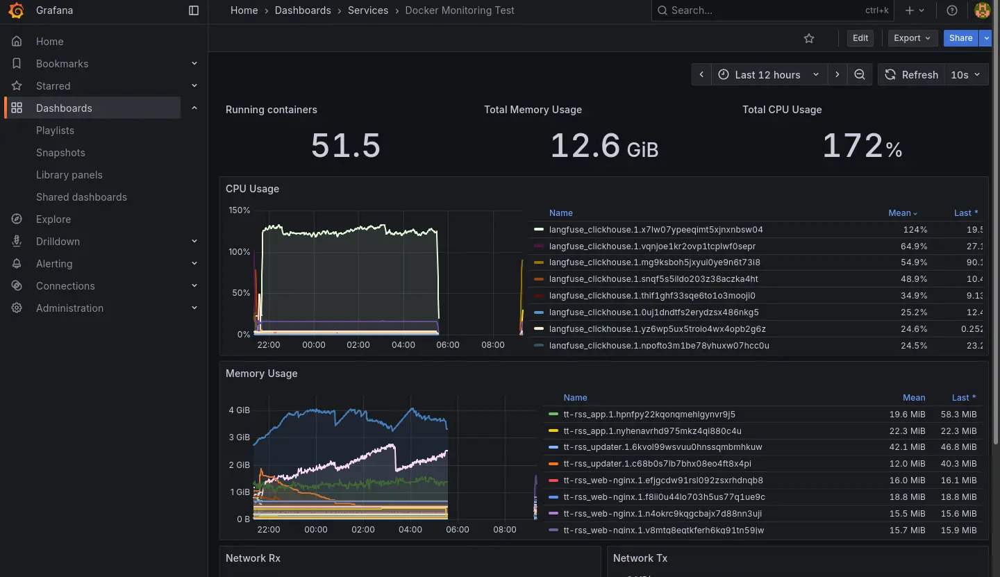
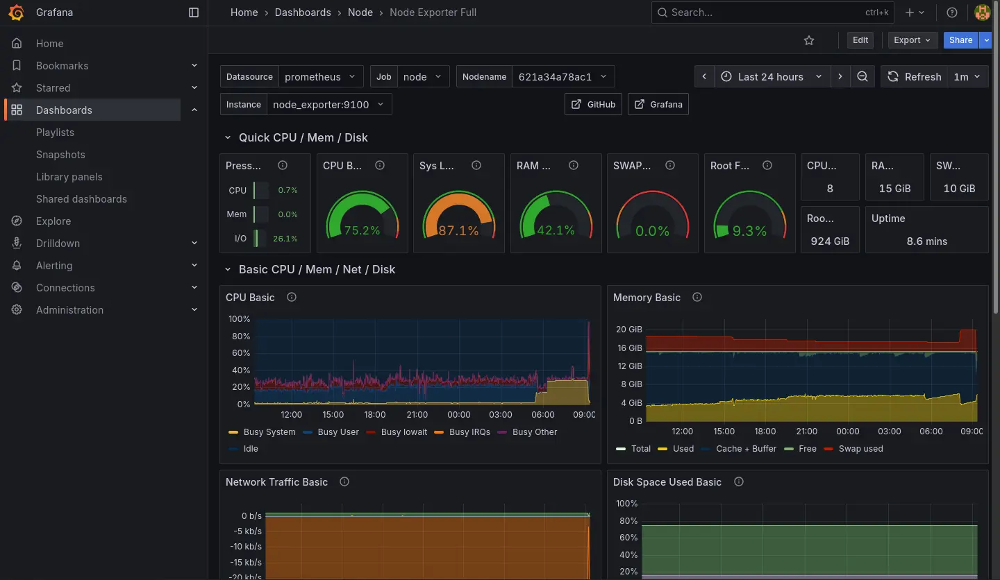
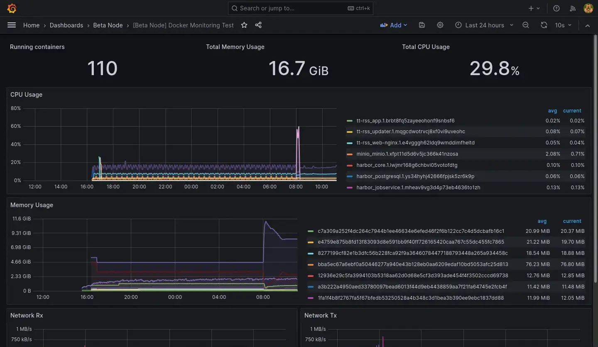
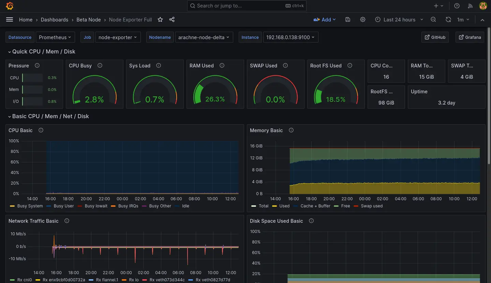

# Homelab 可觀測重建進度

<head>
  <meta property="og:image" content="https://raw.githubusercontent.com/FlySkyPie/flyskypie.github.io/main/post/2026-01-07_observability-outage/03_migration.webp" />
</head>

## 前情提要

:::info
日期是根據 Git Commit 紀錄跟螢幕截圖時間推論的，但是不是真正精準的時間，因為 Git Commit 可能延後一段時間才推送，截圖的問題則是不是每一個當下都有截圖。
:::

2025-10-04 左右： LiteLLM 和 Langfuse 上線。
2025-10-11 左右： Local Deep Research 上線。

2025-10-14 左右： 開始比較頻繁使用 Local Deep Research。


2025-10-22 左右：Homelab 開始出現當機異常。

- 圖表的斷層就是伺服器完全當機讓資料採集的機能癱瘓造成的。
- 可以觀察到 CPU 跟 RAM 異常使用是 Langfuse 服務簇的 ClickHouse 造成的。


2025-10-23 的紀錄：





2025-11-01 左右：連帶 Grafana 服務簇也失效，失效後就把 Langfuse 關掉然後沒有修復它了，直到最近 (2026-01) 佈署 K8s 才準備把服務遷移過去。


Grafana 失效前我有關查到 Docker 在重新拉取 image，推測是因為我忘記鎖定 image 版本造成的。

---

整個過程中出現過幾種不同的情況：

- 電源鍵強制關機後恢復正常。
- 電源鍵強制關機後 LiteLLM 異常。
  - Stack 刪掉後重新佈署後恢復正常。
- 電源鍵強制關機後 Langfuse 異常。
  - 根據 clickhouse log 找到有問題的 block，刪除後重新佈署恢復正常（如下）。

```
2025.11.01 11:00:20.208590 [ 652 ] {c14fc20e-f2b0-45cb-939c-0fe47de9811c::202510_16681_17212_76} <Error> virtual bool DB::MergePlainMergeTreeTask::executeStep(): Exception is in merge_task.: Code: 40. DB::Exception: Checksum doesn't match: corrupted data. Reference: 52f594fc9d7f3ee0495f8f089d3882cf. Actual: c92bc03d0da25742da61b67ce5764aac. Size of compressed block: 3640. The mismatch is caused by single bit flip in data block at byte 2581, bit 2. This is most likely due to hardware failure. If you receive broken data over network and the error does not repeat every time, this can be caused by bad RAM on network interface controller or bad controller itself or bad RAM on network switches or bad CPU on network switches (look at the logs on related network switches; note that TCP checksums don't help) or bad RAM on host (look at dmesg or kern.log for enormous amount of EDAC errors, ECC-related reports, Machine Check Exceptions, mcelog; note that ECC memory can fail if the number of errors is huge) or bad CPU on host. If you read data from disk, this can be caused by disk bit rot. This exception protects ClickHouse from data corruption due to hardware failures: While reading or decompressing /var/lib/clickhouse/store/c14/c14fc20e-f2b0-45cb-939c-0fe47de9811c/202510_16681_17060_75/data.bin (position: 824782, typename: DB::ReadBufferFromFilePReadWithDescriptorsCache, compressed data header: <uninitialized>): (while reading column ProfileEvent_ReadBufferFromFileDescriptorRead): (while reading from part /var/lib/clickhouse/store/c14/c14fc20e-f2b0-45cb-939c-0fe47de9811c/202510_16681_17060_75/ in table system.metric_log (c14fc20e-f2b0-45cb-939c-0fe47de9811c) located on disk default of type local, from mark 2 with max_rows_to_read = 916, offset = 0): While executing MergeTreeSequentialSource. (CHECKSUM_DOESNT_MATCH), Stack trace (when copying this message, always include the lines below):
```

- 電源鍵強制關機後 Langfuse 異常。
  - 根據 clickhouse log 找到有問題的 block，刪除後重新佈署依然無法恢復。
  - 把 clickhouse 建立全新的 Volume 後恢復正常。

- 有幾次伺服器是完全沒螢幕反應，有反應的幾次可以在終端觀察到 CPU Lock：

```
watchdog: BUG: soft lockup - CPU#* stuck for **s!
```

## 仰賴鏈


1. Biomes 重構的進展目前面臨大量的 Schema 型別修復工作，我需要借助 LLM 之力來解決。


2. 我拒絕使用基於聊天或 IDE Agent 的 LLM 方案。
3. 我想使用 ComfyUI 來構造專門用來處理 Schema 修復問題的 pipeline。
4. 我在本地使用 LLM 工具我要求必須在有 LLM Observability 的前提下使用，所以我必須先修復我的 LLM Observability。
5. 在有伺服器崩潰的前車之鑑，我要求必須在有 Observability 的前提下佈署 LLM Observability，所以我必須先修復我的 Observability。
6. 但是我不想在現有的節點上修復 Observability，而是在新的節點使用 K8s 並佈署 Observability，因此我要先學習使用 K8s。

## Observability 重建的當前狀態

到昨天 (2026-01-06) 為止，我已經：

1. 設定新的節點，安裝 K3s。(2025-12-24)
    - [筆記型 Homelab 飼養注意事項](https://flyskypie.github.io/posts/2026-01-03_laptop-homelab/)
    - [安裝 K3s 與遠端連線](https://flyskypie.github.io/posts/2026-01-02_learn-k8s/)
2. 整理之前跟 K8s 有關的知識點。(2025-12-28~2026-01-02)
    - [教練我想學 K8s](https://flyskypie.github.io/posts/2025-12-28_learn-k8s/)
    - [從 Docker 開始的 Systemd 小宇宙](https://flyskypie.github.io/posts/2025-12-29_systemd-ish/)
    - [K8s 學習筆記 - Cluster 和它快樂的小夥伴們](https://flyskypie.github.io/posts/2025-12-31_learn-k8s/)
    - [K8s 學習筆記 - Pod 和它快樂的小夥伴們](https://flyskypie.github.io/posts/2026-01-01_learn-k8s/)
3. 釐清 Ingress/Load Balancer 的概念。(~2026-01-05)
    - [K8s 學習筆記 - K8s 只是框架](https://flyskypie.github.io/posts/2026-01-05_k8s-is-framework/)
4. 釐清 PV/PVC 的概念。(~2026-01-05)
5. 用 Helm 安裝 Longhorn。(2026-01-05)
    - [K8s 學習筆記 - Longhorn 簡介](https://flyskypie.github.io/posts/2026-01-05_k8s-longhorn-intro/)
    - [K8s 學習筆記 - Longhorn 安裝與 Helm](https://flyskypie.github.io/posts/2026-01-05_k8s-longhorn-install-and-helm/)
6. 用 Helm 安裝 Kube-Prometheus-Stack。(2026-01-06)

---


用 K8s 內的 Prometheus 和 Grafana 實例取代原本的，原本的兩張 Dashboard 則是本來就有 JSON 檔直接移過去。原本的伺服器指保留 Cadvisor 供新的 Prometheus 採集資料。

目前關於容器的 Dashboard 是處於兩個節點資料混在一起的狀態，暫時先不處理 Query 需要更新的問題：



Node Dashboard 則是直接接軌新的 Node Exporter 的資料，暫時也先不處理舊節點的資料：



:::info
Kube-Prometheus-Stack 其實有提供不少 Dashboard 用來觀察新節點，我就不在這邊一一列舉了。
:::

## Prometheus 安裝筆記

跟 Longhorn 一樣直接使用 Helm 安裝：

```shell
helm repo add prometheus-community https://prometheus-community.github.io/helm-charts

helm repo update

helm show values prometheus-community/kube-prometheus-stack --version 51.6.0 >values.yaml

helm install prometheus-stack prometheus-community/kube-prometheus-stack \
    -f values.yaml \
    -n prometheus-stack \
    --create-namespace \
    --version 51.6.0
```

`values.yaml` 倒是有做一些調整：

- 時區
- 適應當前 K8s (K3s) 的 Ingress 為 Traefik
- 對內網 DNS 暴露 Grafana
- 適應當前 K8s 持久化實例為 Longhorn
- 從舊 Node 的 Cadvisor 採集資料

```yaml
grafana:
  defaultDashboardsTimezone: Asia/Taipei
  ingress:
    ingressClassName: traefik
    hosts:
      - grafana.observable.gas.arachne

prometheus:
  prometheusSpec:
    storageSpec:
      volumeClaimTemplate:
        spec:
          storageClassName: longhorn
          accessModes: ["ReadWriteOnce"]
          resources:
            requests:
              storage: 50Gi
    additionalScrapeConfigs: |
      - job_name: beta-cadvisor
        static_configs:
          - targets:
            - web.cadvisor.arachne
```

## LLM Observability 重建的當前狀態

LiteLLM 雖然在 OpenRouter 排行榜蟬聯前幾名，但是實際使用下來給我的感覺不太穩定（經歷過加密 Bug、當機後無法正常復位）。

另一方面，Langfuse 給我的感覺則是相對肥大（服務簇需要同時配置 ClickHouse、MinIO、Redis、PostgresSQL），但是我又沒有使用到裡面的每一個功能。更別提 ClickHouse 就是表面上這次事故的主因。

因此我打算評估其他 LLM Gateway/Observability 方案，目前看上 [Bifrost](https://github.com/maximhq/bifrost)，試用了一下感覺不錯，就是它的資料庫配置稍微有點麻煩，這個部份可能之後再提。
