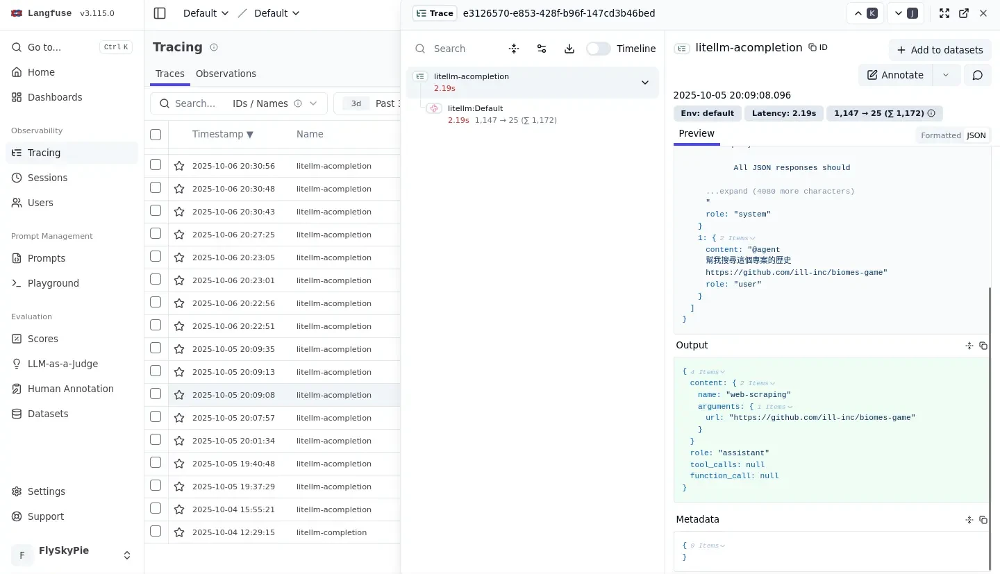
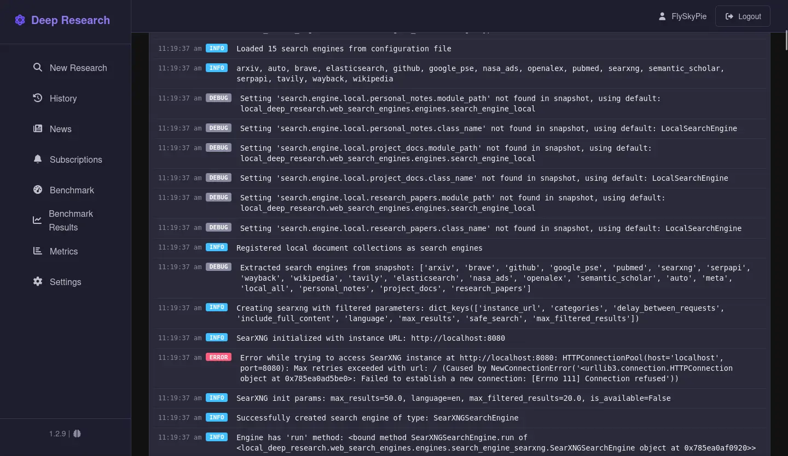
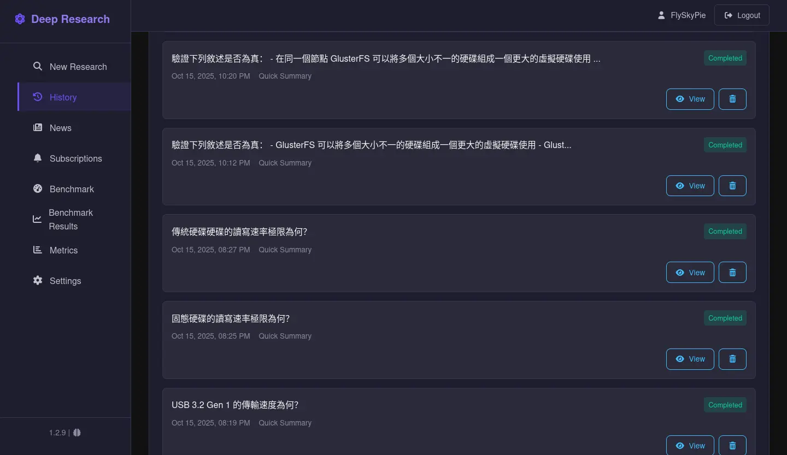

# LLM 可觀測筆記

<head>
  <meta property="og:image" content="https://raw.githubusercontent.com/FlySkyPie/flyskypie.github.io/main/post/2026-01-08_llm-observability/00_cover.webp" />
</head>

其實自[我架設 LLM 可觀測工具](https://flyskypie.github.io/posts/2025-10-05_llm-api-chain/) (2025-10-05) 以後，陸續嘗試幾款 LLM 工具有獲得一些觀察，不過當時因為覺得缺乏嚴謹考證所以沒有發文，不過現在我可以說是往下一個階段前進了（？），大概也沒有做嚴謹實驗的計畫，就把當時的紀錄發出來水一篇廢文好了。

## LLM 可觀測

這邊簡單跟不知道發生什麼事情的讀者解釋一下「LLM 可觀測」是什麼。以下容我重複使用以前做的圖卡：

:::info
「角色卡」是一種角色扮演類 LLM 應用軟體的資料包，本質上是包含一堆人物設定、世界觀設定、台詞樣板...的文字。
:::

## AnythingLLM

[AnythingLLM](https://github.com/Mintplex-Labs/anything-llm) 是一個很熱門的 LLM 應用軟體。不過正如我前面所說的，LLM 只是一個組件，要讓它發揮效用，關鍵在於應用程式是否擷取正確資料或資訊餵給 LLM 處理，因此「應用程式的外部連線能力」是我測試的重點。

這是我的測試題目；我知道正確答案，而我也知道這個題目不簡單，我只是想觀察這些 LLM 應用軟體會怎麼處理這個任務：

> 幫我搜尋這個專案的歷史
> 
> https://github.com/ill-inc/biomes-game
>

最後得到的結果當然不符合我的預期，於是我開啟我的可觀測工具檢查剛剛發生了什麼事情。

我們可以觀察到，AnythingLLM 根據我的輸入觸發了一個「網頁爬蟲工具」：

然後我們可以看到它單純從 GitHub 爬了一堆垃圾就開始唬爛我試著回答剛剛那個問題。

:::info
正確答案是要用 `ill-inc` 找到 Global Illumination, Inc. 這間公司，接著找到 OpenAI 在 2023 年收購它們的新聞。
並且在專案的[文件網站](https://docs.biomes.gg/roadmap)找到：「被收購之後，專案被團隊釋出後不再維護」的資訊。
我知道這個題目很難，所以後來我也沒有用這個題目測試了，加上我後來找到一些其他對於 LLM 軟體更重要的特性。
:::

## Perplexica

[Perplexica](https://github.com/ItzCrazyKns/Perplexica) 是一個自稱作為 Perplexity AI 開源替代方案的 LLM 軟體，Perplexity AI 則是一個以真實性為賣點的 SaaS (Software as a service)。

同一個題目，表現的跟 AnythingLLM 一樣差勁，不過除了外部連線的機制問題以外，我觀察到另外一個更可疑的行為：

它把對話紀錄的所有角色 (role) 都設定成 `assistant`！在 OpenAI API 的設計，role 至少有三種：`user`、`assistant`、`system`。

因此 LLM 實際上無法分辨歷史紀錄中誰說了什麼，因為全部都是 `assistant` 在自言自語。

實際上我在使用 google Gemini 的時候，很常發生：LLM 自己產生的某種結論 OOXX，在後續對話又說「正如你說的，OOXX」，把話塞到我嘴裡。我嚴重懷疑這是由類似的角色不分的提示詞工程造成的。

## Local Deep Research

[Local Deep Research](https://github.com/LearningCircuit/local-deep-research) 是一個只有 3.8k 星星的專案（截至 2026-01-08），但是它嚴謹的特性深得我喜愛。

觀察到這個特性其實源自於一個意外，我搞錯搜尋引擎的設定，因此它當下無法使用搜尋引擎：

但是我們看看它是怎麼回答使用者的：

- 它懂得回報使用者當下沒有對外連線、額外可供參考的資料，而不是直接試圖唬爛使用者。
- 這甚至是「光速是多少？」這種大部分 LLM 都可以應對的簡單問題。它也懂得自我檢討這個回答沒有參考資料佐證。
- 我使用的是普通的繼承 GPT 幹話王血統的 `openai/gpt-oss-20b`，並不是什麼特別調整的 LLM。

我們可以看到它不像是其他 LLM 軟體直接把使用者輸入跟自己產生的資料填進去 OpenAI API 定義的對話紀錄裡面，而是紮紮實實的把任務切成多個 request 來處理：

另外一個我在學習 VR 生態系時的例子，比對多個資料來源矛盾的敘述：

因此我可以簡單的把一些需要確認的主題丟給它研究，真正意義上的降低認知負荷，而不是時時要擔心 LLM 在唬爛我：

## 結論

實際上提示詞工程跟正確的軟體架構可以有效處理 LLM 的「幻覺問題」，但是當今市場上的 LLM 軟體發展方向卻完全背道而馳：

- 基於聊天形式的頁面設計，本質上是一個上下文極度不受控的環境，很容易讓 LLM 產生垃圾資料。
- 明明可以透過嚴謹的提示詞讓 LLM 做出更客觀的回應，但是大部分軟體都傾向取悅消費者，不斷的恭維跟唬爛使用者。
- 明明可以使用 one shot 的軟體形式提供更穩定的服務，但是就是要做成聊天機器人來欺騙投資人與使用者。

就算不提閉源的 SaaS 方案（ChatGPT, Gemini...），AnythingLLM 或 Perplexica 這類譁眾取寵的實作反而贏得更多喝采（星星），而老實解決問題的 Local Deep Research 卻倍受冷落。

我用 LLM 可觀測性工具看見的不是邪惡的 LLM，更多的是整個產業帶有惡意的商業決策與人們的集體瘋狂。

## 後記

曾經有工程師問我，既然我想觀察提示詞工程，為什麼不乾脆看程式碼？畢竟那些自架軟體都有開源。

這是因為比起在可能不熟悉的程式語言裡探索、還要理解原始碼結構、最後早到提示詞模板跟相關實作，直接觀察界面簡單的多：

- 當我送出一個指令，應用程式呼叫了幾次 LLM 來處理？
  - 複雜問題但是只有一次呼叫，代表著實作的架構有問題。
- 每次呼叫給了什麼輸入？
  - 「Garbage in, garbage out」，如果 LLM 給了什麼糟糕的答案，十之八九來自應用程式給了糟糕的輸入。
