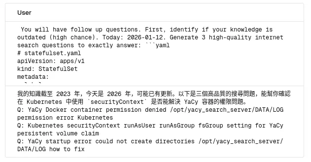
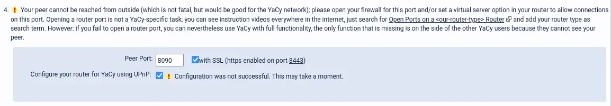
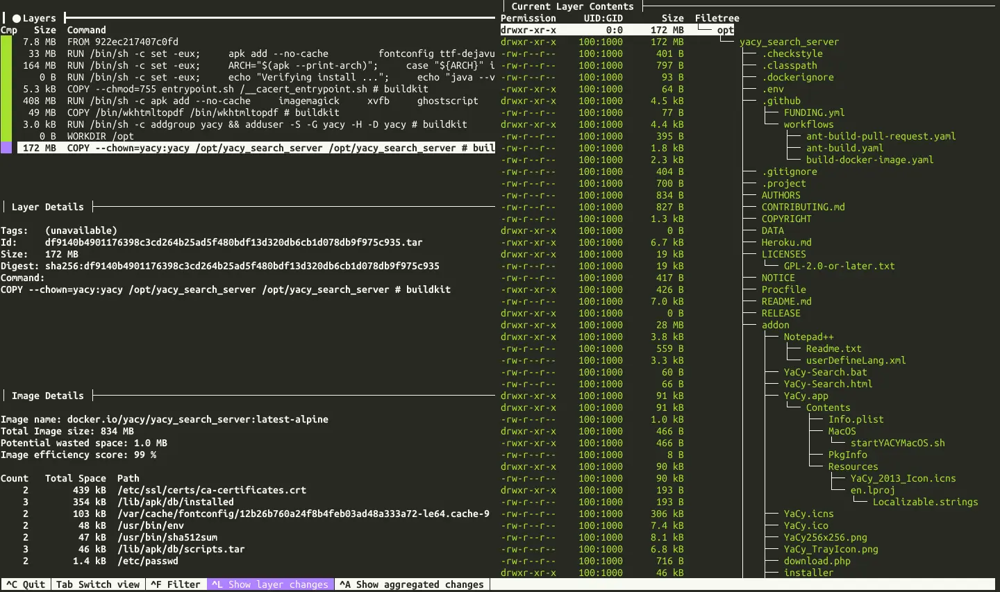

# 自架搜尋引擎套餐 (YaCy + SearXNG + Local Deep Research)

<head>
  <meta property="og:image" content="https://raw.githubusercontent.com/FlySkyPie/flyskypie.github.io/main/post/2026-01-12_search-engine/00_cover.webp" />
</head>

今天 (2026-01-12) 處理了一些 YaCy 跟 SearXNG 的故障排除，做個紀錄。


## 前情提要

故事得從我最近愛用的 LLM 工具 LDR ([Local Deep Research](https://github.com/LearningCircuit/local-deep-research)) 說起，LDR 能夠根據使用者的輸入拆分成數個 LLM 任務：


其中一個任務長得像這樣：



將使用者原始輸入轉換成精簡的搜尋引擎關鍵字之後，呼叫 [SearXNG](https://github.com/searxng/searxng) 來取得搜尋結果。

SearXNG 本身不實做搜尋引擎，而是作為代理去呼叫多個搜尋引擎，諸如 Google, Bing, DuckDuckGo...


於是乎有時後會發生這種事情：


呼叫太頻繁被外部的搜尋引擎封鎖，造成有的時候 LDR 會「研究失敗」，因為沒有可靠的外部資訊來源。

我架設 LDR 時使用官方的預設組態，沒有特別設定 SearXNG，於是想說趁這個機會改善這個問題。以上圖為例， 我被 Brave 搜尋引擎擋了。

## 天下沒有白吃的午餐

老實說我不會特別怪罪搜尋引擎投放廣告、過濾內容...，畢竟：

> 當使用者沒有為服務付費，使用者本身就是產品，而不是消費者。
>

搜尋引擎自己有自己的營利模型，而 SearXNG 的使用者幾乎就是繞過這些措施白嫖搜尋引擎，即便搜尋引擎供應商本身有它的原罪，我也不認為應該正當化白嫖的行為。

找來找去，[YaCy](https://github.com/yacy/yacy_search_server) 似乎是比較合理的方案，它是一個去中心化的搜尋引擎，能夠透過 P2P (Peer-to-peer) 的方式分享索引資訊跟分散爬蟲任務。

網際網路巨大無比，只靠自己建立與維護索引資料根本癡心妄想，YaCy 在這方面就相對理想，讓一群人分散 Google 這種資訊巨獸才能建立的資料庫難度。

話雖如此，架設過程才發現要對外暴露埠才能對整個 YaCy 網路進行貢獻：



目前我的 Homelab 出於安全性考慮是沒有對外暴露的，不過我依然可以在本地建立自己的索引資料庫，至於「做出貢獻」這件事大概要緩緩以後再來處理了。

## K8s 故障排除

架設的過程有遇到一點問題，在這邊紀錄一下問題跟解決辦法。

```shell
$ kubectl logs yacy-0 -n search-stack
****************** YaCy Web Crawler/Indexer & Search Engine *******************
**** (C) by Michael Peter Christen, usage granted under the GPL Version 2  ****
****   USE AT YOUR OWN RISK! Project home and releases: https://yacy.net/  ****
**  LOG of       YaCy: DATA/LOG/yacy00.log (and yacy<xx>.log)                **
**  STOP         YaCy: execute stopYACY.sh and wait some seconds             **
**  GET HELP for YaCy: join our community at https://community.searchlab.eu  **
*******************************************************************************
[ YaCy v1.940 by Michael Christen / www.yacy.net ]
-------------------------------------------------------------------------------
Jan 12, 2026 11:49:04 AM net.yacy.cora.util.ConcurrentLog enQueueLog
WARNING: * could not create directories /opt/yacy_search_server/DATA/LOG
could not copy yacy.logging: /opt/yacy_search_server/DATA/LOG/yacy.logging (No such file or directory)
STARTUP: Trying to load logging configuration from file /opt/yacy_search_server/DATA/LOG/yacy.logging
could not find logging properties in homePath=/opt/yacy_search_server
Jan 12, 2026 11:49:04 AM net.yacy.cora.util.ConcurrentLog enQueueLog
WARNING: * java.io.FileNotFoundException: /opt/yacy_search_server/DATA/LOG/yacy.logging (No such file or directory)
java.io.FileNotFoundException: /opt/yacy_search_server/DATA/LOG/yacy.logging (No such file or directory)
	at java.base/java.io.FileInputStream.open0(Native Method)
	at java.base/java.io.FileInputStream.open(Unknown Source)
	at java.base/java.io.FileInputStream.<init>(Unknown Source)
	at net.yacy.cora.util.ConcurrentLog.configureLogging(ConcurrentLog.java:385)
	at net.yacy.yacy.startup(yacy.java:180)
	at net.yacy.yacy.main(yacy.java:832)

Jan 12, 2026 11:49:05 AM net.yacy.cora.util.ConcurrentLog enQueueLog
SEVERE: * FATAL ERROR: Permission denied
java.io.IOException: Permission denied
	at java.base/java.io.UnixFileSystem.createFileExclusively0(Native Method)
	at java.base/java.io.UnixFileSystem.createFileExclusively(Unknown Source)
	at java.base/java.io.File.createNewFile(Unknown Source)
	at net.yacy.yacy.startup(yacy.java:194)
	at net.yacy.yacy.main(yacy.java:832)

Jan 12, 2026 11:49:05 AM net.yacy.cora.util.ConcurrentLog shutdown
INFO: shutdown of ConcurrentLog.Worker void because it was not running.
```

典型的容器權限問題，在 K8s 可以透過 `securityContext` 處理：

```yaml
apiVersion: apps/v1
kind: StatefulSet
spec:
  template:
    spec:
      securityContext:
        runAsUser: 100
        runAsGroup: 1000
        fsGroup: 1000
```

但是該如何找到正確的 UID 和 GID 呢？OCI image 調查神器：[dive](https://github.com/wagoodman/dive)



SearXNG 也有類似的問題：


