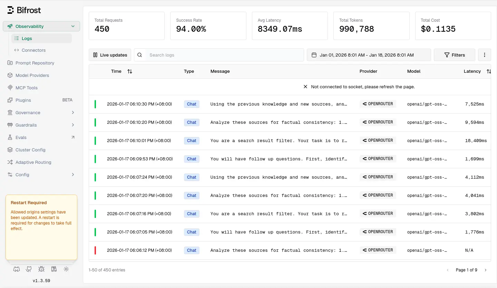
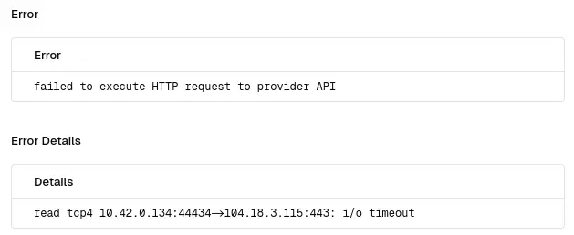

# Bifrost 採坑筆記

<head>
  <meta property="og:image" content="https://raw.githubusercontent.com/FlySkyPie/flyskypie.github.io/main/post/2026-01-18_bifrost/01_bifrost.webp" />
</head>

試用了 Bifrost 大概九天，有很高的請求失敗率（~6%）：



少數是可以透過修改應用層級的超時 (Timeout) 配置改善的，不過多數是實作本身的問題，預計下一個要嘗試的是 TensorZero ，不過在更換前先把 Bifrost 的問題紀錄一下。

## `i/o timeout`



這個 bug 看起來已經被紀錄在案一個月了，但是還沒有被修復：

[[Bug]: Getting I/O timeout · Issue #1157 · maximhq/bifrost](https://github.com/maximhq/bifrost/issues/1157)

## Websocket 異常

原本 Logs 頁面是會自動更新的，但是不知道為什麼不能正常運作，後台則有大量的錯誤訊息：

```
{"level":"error","time":"2026-01-18T01:03:28Z","message":"websocket upgrade error: websocket: request origin not allowed by FastHTTPUpgrader.CheckOrigin"}
```
