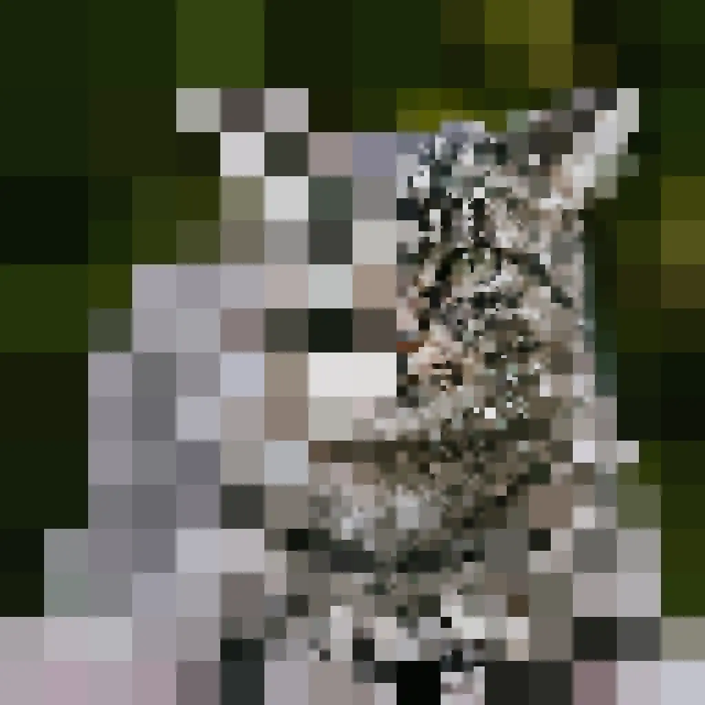
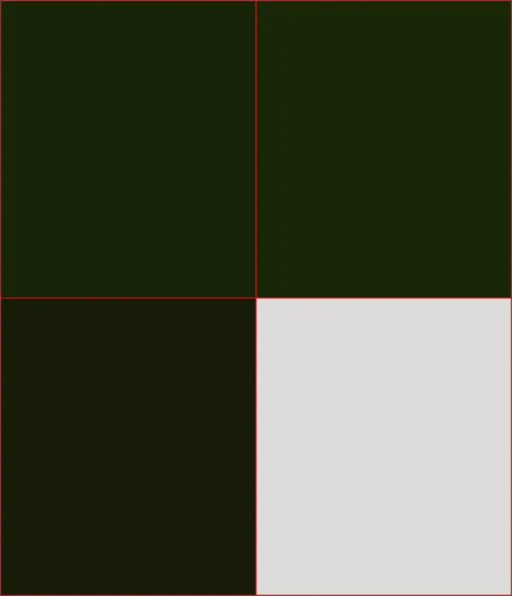
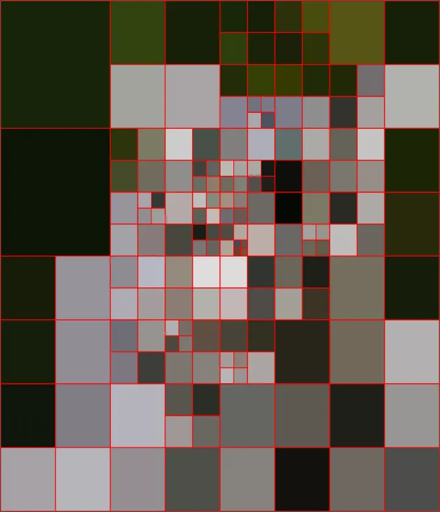
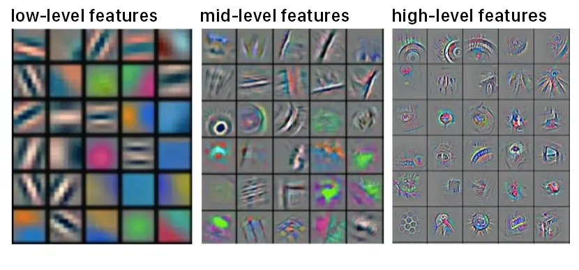

# 一種有限像素影像辨識謎題

<head>
  <meta property="og:image" content="https://raw.githubusercontent.com/FlySkyPie/flyskypie.github.io/main/post/2026-01-25_dequadtree-puzzle-game/00_cover.webp" />
</head>

## 前情提要

前一陣子和人聊天，剛好提到了一個我六年前 (2020) 寫的一個小玩具，我似乎沒有把跟它相關的想法寫下來，於是試著在這邊文章做個整理。

## 有限像素影像辨識謎題

謎題規則如下：

- 謎題本身為一張點陣圖
- 初始狀態為 1 pixel
- 點擊一次 1 pixel 會被切割成四等分
- 換句話說每點一次（探勘）就會多揭露 3px 的資訊
- 玩家必須用最少的探勘次數獲得的「馬賽克圖像」辨識出謎題

舉例來說，這是初始狀態：

這是第一次點擊：

這是點擊了 55 次之後：

經過 453 次之後，玩家可以辨識出這是「貓」：

453 就是這個玩家的量化成績，數字越小越好。

這個謎題的程式碼在此：

https://github.com/FlySkyPie/dequadtree-puzzle-game

## CNN 問題

這個謎題啟發自卷積類神經網路 (CNN, Convolution Neural Network) 的問題。

CNN 會掃描整張圖片，並且偵測諸如邊界之類的微小特徵[^cnn-explained]：

接著再透過這些微小特徵組合成比較高級的特徵，例如：臉、手...之類的。

這個特性為 CNN 帶來了一些問題：

- 高頻下毒
- 重組可辨識性

[^cnn-explained]: Convolutional Neural Networks Explained. Retrieved 2026-01-25, from https://tvirdi.github.io/2017-10-29/cnn/

### 高頻下毒

攻擊者可以在影像內參入人類肉眼不可見的資訊，讓圖片無法被 CNN 正確的識別。

### 重組可辨識性

當圖片被重組打亂，人類將會難以辨識，但是 CNN 仍然能夠維持辨識能力。

## 模擬注意力

人類的視覺成像其實並不是均勻的，受到視網膜視錐細胞分佈的影響，實際上只有中間的區域具有比較多的成像資訊。另一方面任意瞬間視網膜接受的資訊其實是模糊的，是透過大腦在時間序上累積的資訊腦補成一個比較清晰的影像。

前面的謎題就是為了模擬這種特性而設計的，人類會將注意力放在最可疑、最有價值的區域去提高解析度，其他地方就算不管也沒關係。經過探索圖片本質上是一個四元樹 (Quadtree) 結構。
