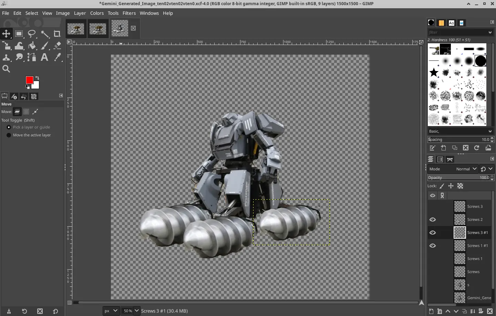
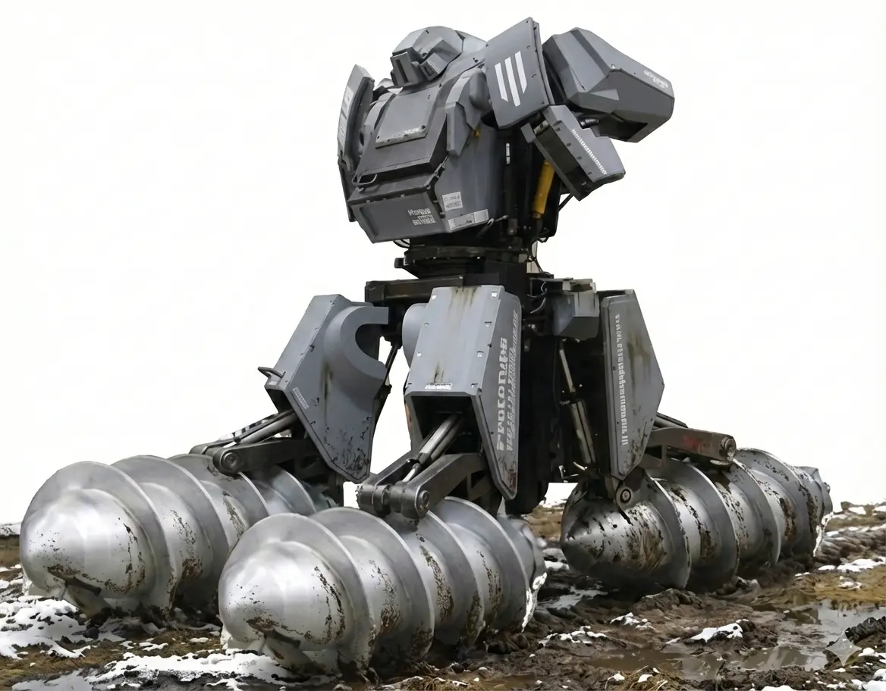
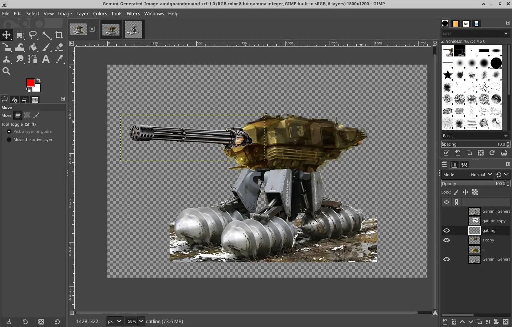
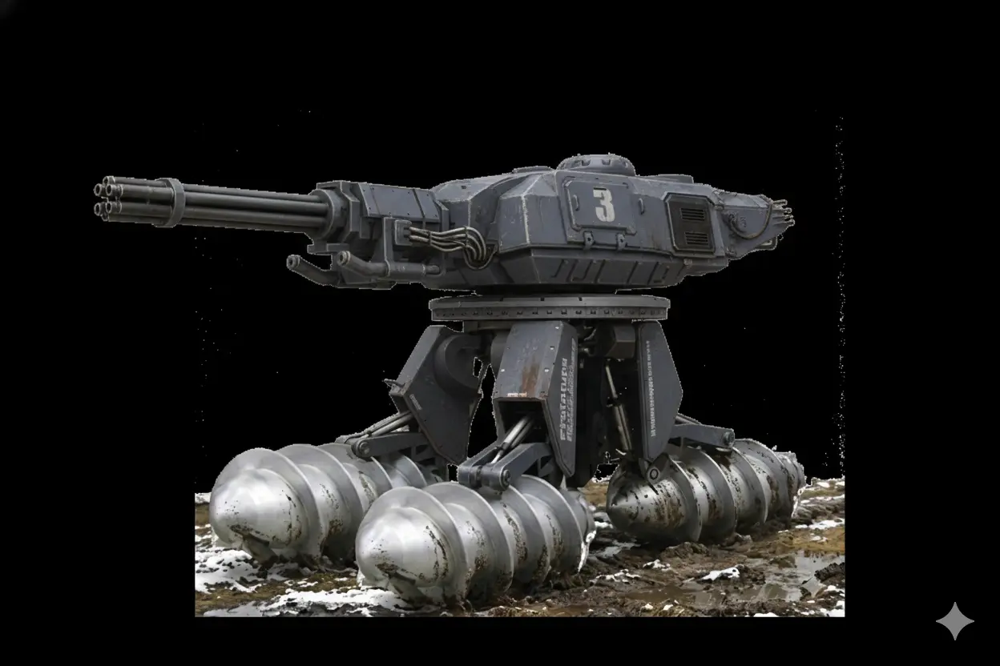
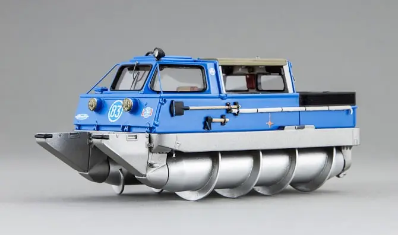
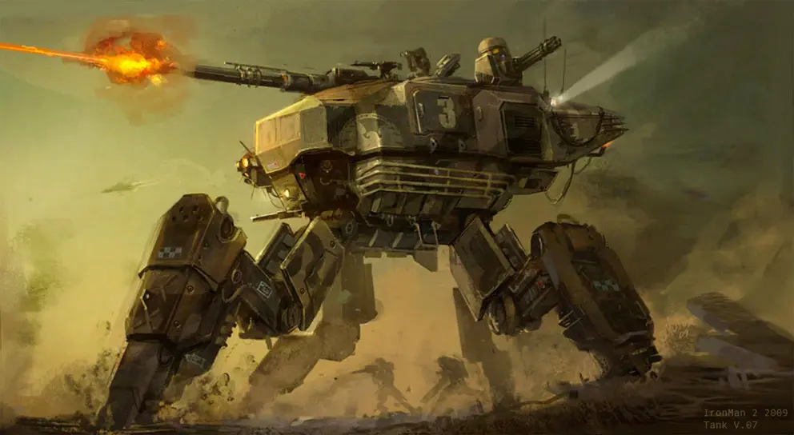

# 一種機甲構想與 Nano Banana 使用筆記

<head>
  <meta property="og:image" content="https://raw.githubusercontent.com/FlySkyPie/flyskypie.github.io/main/post/2026-01-25_marsh-screw-quadruped-mech/01_mecha.webp" />
</head>

## 背景

機戰傭兵 (Armored Core) 是一款我沒玩過的遊戲，但是很享受於它的衍生作品，包含遊戲預告、實機影片之類的。其中一個讓我感興趣的是機甲在遊戲中機動的方式：

<iframe width="560" height="315" src="https://www.youtube.com/embed/yFLYs8UzVVc?si=yRfRiO2BdN3A_bb4" title="YouTube video player" frameborder="0" allow="accelerometer; autoplay; clipboard-write; encrypted-media; gyroscope; picture-in-picture; web-share" referrerpolicy="strict-origin-when-cross-origin" allowfullscreen></iframe>

撇除誇張的瞬間噴射以及懸浮飛行以外，麥卡納姆輪 (Mecanum wheel) 在可控的室內平地同樣可以做出炫泡的機動：

<iframe width="560" height="315" src="https://www.youtube.com/embed/I-tPQtsd-ls?si=M627JPSJSn4Rzoea" title="YouTube video player" frameborder="0" allow="accelerometer; autoplay; clipboard-write; encrypted-media; gyroscope; picture-in-picture; web-share" referrerpolicy="strict-origin-when-cross-origin" allowfullscreen></iframe>

因為很炫泡，所以我想做，於是一個構想就在我腦海成型：

- 以 50cm 的迷你尺度實現。
- 運行在草皮上，比室內平地粗曠，但是又保留考量可行性的平面。
- 四足機甲造型，四足設計用來作為主動式懸吊系統。
- 使用類似 ZIL-29061 螺旋輪結構，實現一般輪型或履帶型載具無法達成的漂移機動。
- 使用 360 攝影機實時進行 3D 點雲掃描與場景重建，因此可以在一個渲染的 3D 空間實現第三人稱操作（近似遊戲本身的體驗）。

最近隨便用 Nano Banana 搓了一張概念圖，順便把這個想法做個筆記：


## Nano Banana 使用筆記

:::info
過程我省略原圖，所有使用過得原圖我放在文章最後面。
:::

### 第一次合成嘗試

提示詞：

```
將第一章圖（水道橋重工機甲）的底盤改成第二張圖（ZiL-2906）的螺旋輪。

保持原本的四足設計、將原本的兩個螺旋輪設計改成四個較小的尺寸的螺旋輪、對應原本的四足位置。 
```

結果：


左邊的東西很明顯是這個上下文讓模型推論出 bug 了，不能期望它 one shot 搞定了，於是後面採用不同的策略。

### 提高解析度

第一次嘗試除了組裝失敗以外，底圖的解析度明顯太低，但是因為這張圖的角度剛剛好，所以我沒有再去尋找其他解析度比較高的圖片。

提示詞：

```
提高畫質、提高解析度 
```

### 第一次預組裝

將提昇過解析度的圖與第一次生成的螺旋輪做簡單的合成：



之後再用 Nano Banana 進行揉合，提示詞：

```
這是一個簡易合成的圖片，內容為四足人形機甲配上螺旋輪 (marsh screw)，
有以下缺陷：
- 不完整的去背
- 缺乏正確透視
- 機甲與螺旋輪缺乏真實的機械連接
你必須修復上述缺陷。 
```

結果：


提示詞：

```
移除機甲的左右手，保留上半身與頭部
```

結果：



這個步驟是因為我不太喜歡人形這種高重心的設計，但是手部有部份遮擋到一些腿部，自行移除再修復有失敗的風險，乾脆一開始就用比較明確的語意讓 Banana 移除手部。

:::info
我知道最後的圖還是重心偏高，但是我也說了：「隨便搓的」=3=
:::

### 第二次預組裝



提示詞：

```
這是一個簡易合成的圖片，內容為四足機甲配上螺旋輪 (marsh screw)，配上砲塔以及格林機關槍，，
有以下缺陷：
- 機甲、砲塔、機關槍色彩不一致，將砲塔改成與機甲相同的德軍灰。
- 缺乏正確透視
- 機甲-砲塔、砲塔-機關槍，兩個連接處缺乏真實的機械連接

你必須修復上述缺陷。
```

結果：



### 使用素材

水道橋重工機甲[^kuratasrobot]：


ZiL-2906[^ZiL-2906]:



科幻戰車[^scifi-tank]：



格林機關槍[^Gatling]：


[^kuratasrobot]: Suidobashi Heavy Industry – KURATAS – Retrenders. Retrieved 2026-01-25, from https://retrenders.com/2012/07/31/suidobashi-heavy-industry-kuratas/

[^ZiL-2906]: ZIL Amphibious Screw Vehicles: a Cool Soviet Era Invention - autoevolution. Retrieved 2026-01-25, from https://www.autoevolution.com/news/zil-amphibious-screw-vehicles-a-cool-soviet-era-invention-79250.html

[^scifi-tank]: Sci-fi Art: Mountain Urban Tank V07 | Coolvibe – Digital Art. Retrieved 2026-01-25, from https://coolvibe.com/2013/sci-fi-art-mountain-urban-tank-v07/

[^Gatling]: GAU-8/A 30mm Gatling Gun.  Retrieved 2026-01-25, from https://www.gdots.com/armaments/aircraft-guns-gun-systems/gau8a/

## 後記

後來稍微搜尋一下，發現 ZIL-29061 遙控車已經有人做了：

<iframe width="560" height="315" src="https://www.youtube.com/embed/wf4PqVhCTJA?si=SYqzQiLwQxDQE_VE" title="YouTube video player" frameborder="0" allow="accelerometer; autoplay; clipboard-write; encrypted-media; gyroscope; picture-in-picture; web-share" referrerpolicy="strict-origin-when-cross-origin" allowfullscreen></iframe>

所以除了四足機甲以外，其他部份的可行性算是已經被驗證過了（？）
