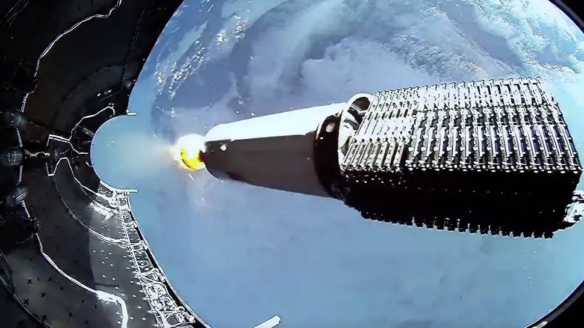
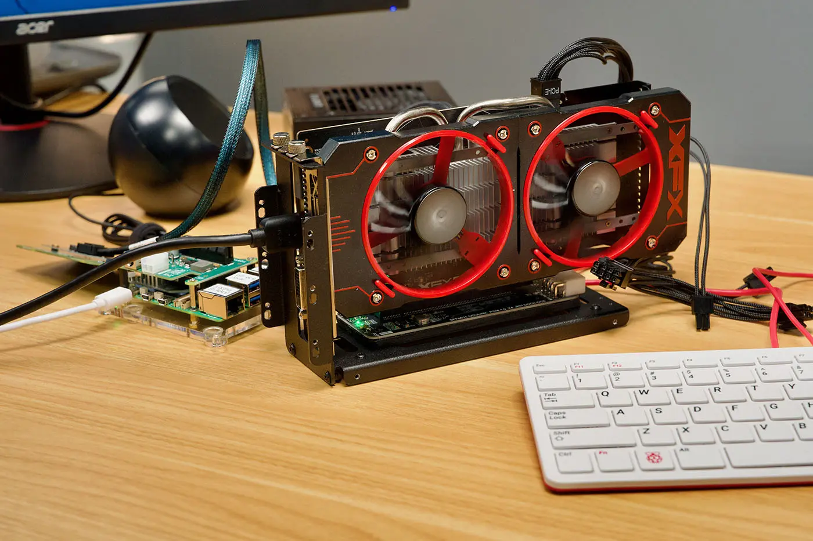
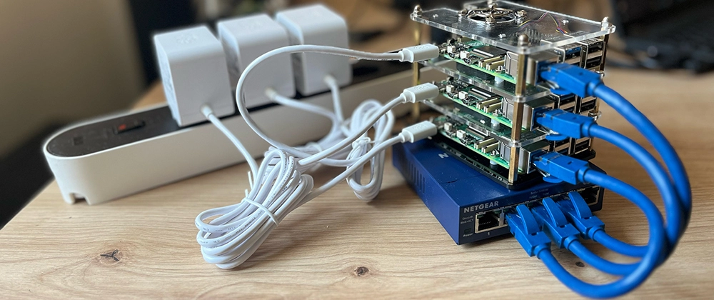

# 仰望群星 (Satellites) - 我的 Homelab 戰略

<head>
  <meta property="og:image" content="https://raw.githubusercontent.com/FlySkyPie/flyskypie.github.io/main/post/2026-02-04_homelab-hardware-strategy/01_dyson-swarm.webp" />
</head>

## 背景知識

要明白我要表達什麼，需要具備一些先驗知識，包含：Dyason Swarm, Starlink 和 樹莓派叢集，我會先做一些簡單的解釋幫對這方面概念比較缺乏的讀者能夠搭上我的思路。

### 戴森雲 (Dyason Swarm)

戴森雲是一種科幻構想，簡單來說就是：

> 用大量的人造衛星圍繞並運行在太陽附近來採集太陽能源。
>

更具體的介紹可以觀看 Kurzgesagt 的影片，我就不在這邊細談了：

<iframe width="560" height="315" src="https://www.youtube.com/embed/pP44EPBMb8A?si=82rJJfioS3e55D4W" title="YouTube video player" frameborder="0" allow="accelerometer; autoplay; clipboard-write; encrypted-media; gyroscope; picture-in-picture; web-share" referrerpolicy="strict-origin-when-cross-origin" allowfullscreen></iframe>

:::info
Kurzgesagt 的影片算是高度簡化版本，例如有人指出「把人造衛星降到靠近太陽的軌道這件事本身就需要消費不少能源」[^dyson-swarm-criticism]。
:::

然後我的立場是：

> 太酷了！我想蓋！
>

不過我看完 Kurzgesagt 的第一個想法是，它一定需要有一個資料中心來遙測與控制這麼多的衛星。

[^dyson-swarm-criticism]: The Dyson Swarm – A Personal Perspective - JMORE. Retrieved 2026-02-04, from https://jmoreliving.com/2020/06/08/the-dyson-swarm-a-personal-perspective/

### 星鏈 (Starlink)

星鏈是由接近一萬顆人造衛星構成的網路系統，讓消費者不用透過海底電纜就能使用高速的無線網路。尤其適合有線網路基礎設施不夠發達的國家，其他使用情境包含空運、海運等位於海洋中間或在深山之類缺乏基地台地方。

請特別留意 Starlink 佈署時堆疊在火箭內的樣子：

### 樹莓派叢集

樹莓派 (Raspberry Pi) 是原先出於教育目的而被設計出來的單板電腦，它就像一個手長大小的電路板，卻具備電腦的完整功能。

預留腳位的設計讓它能夠作為開發板被客製化裝上各種感測器或擴充電路。其中一個例子是把它跟獨立顯示卡裝在一起[^pi-dgpu]：

樹莓派叢集則是將多個樹莓派透過網路線連接在一起構成一個運算叢集：

是不是跟堆疊的衛星有幾分神似？

[^pi-dgpu]: Use an External GPU on Raspberry Pi 5 for 4K Gaming - Jeff Geerling. Retrieved 2026-02-04, from https://www.jeffgeerling.com/blog/2024/use-external-gpu-on-raspberry-pi-5-4k-gaming/

## 現實

現在讓我把眼光從戴森雲、星鏈拉回我那 4.3 坪的租屋處，身處於寸土寸金的大台北，五年網頁前端開發經驗，混雜一些 3D、後端、Docker...的經驗。

這是我手上有的牌，接下來我該如何玩這個名為現實的遊戲呢？

### Kubernetes

> 操作著數以百計的容器
>

閱讀 K8s (Kubernetes) 相關的文章很常會看到類似的描述。

> 「它一定需要有一個資料中心來遙測與控制這麼多的衛星」
>

它跟 Dyason Swarm 的影子在我面前重疊，「Dyason Swarm 的科技樹上必然有 K8s 的存在」我如此確信。

### Longhorn

[Longhorn](https://github.com/longhorn/longhorn) 是基於 K8s 的分散式儲存，它可以和 K8s 以類似共生的關係運作在一起：透過 K8s 的叢集架構 Longhorn 可以運作在每一個節點上實現多節點冗餘，而當 K8s 內佈署的服務請求儲存區 (Persistent Volumes) 時，則由 Longhorn 直接向應用程式提供儲存空間。

因此一顆硬碟只要掛上一個堪用的電腦（比如一塊樹莓派），丟進 K8s 內就能讓它成為儲存資源池的一部分，多餘的運算能力則可以「順便」運行一些服務分攤叢集的負載。

### 基於筆電的 K8s 叢集

筆電有一些工程特性是一般桌機以及伺服器運算不會考量的：省電，即能源效率以及體積和輕量化，為了方便攜帶，可靠性也不會做得太脆弱。我認為這在台灣這種地狹人綢以及寸土寸金的都市中是十分重要的因素，我最為租屋族不太可能負擔得起充足的空間建設伺服器機櫃，遷移的頻率也遠比居住在大陸上的歐美人士來得高。

並且根據我的主觀體驗，很容易低成本獲得二手筆電，加上 K8s 和 Longhorn 的架構下，數個無須十分強大的節點就能提供儲存冗餘，從而解決基於筆電的設備無法使用硬碟陣列卡的問題；又或是避免管理軟體陣列帶來額外的麻煩，只要是能夠安裝並運行 K8s 節點的設備都能對這個叢集進行水平拓展。拓展叢集的關鍵零件，交換器本身又不會太昂貴。

筆電或是單板電腦的尺寸較小，比起機架伺服器或是一般的桌機來得更有空間彈性，必要時甚至可以把叢集拆成數個不同大小的單元分散在空間之中。

當然，要把二手筆電當作一個儲存節點，可能需要透過 USB 外掛硬碟，二手筆電低階的 CPU、低階的 USB 埠口、低階的乙太網路埠口都會成為系統的瓶頸。不過這種事情等遇到再說吧，瓶頸就是用來感受的，畢竟我都經歷過直接把 OS 灌在 DAS (Direct-attached storage) 外部儲存、最後 I/O await 高到會讓 Docker 不穩定才把系統裝回 SSD 了。
