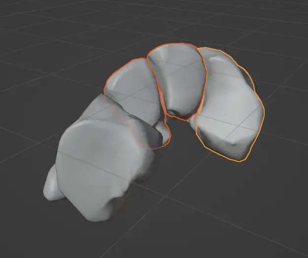
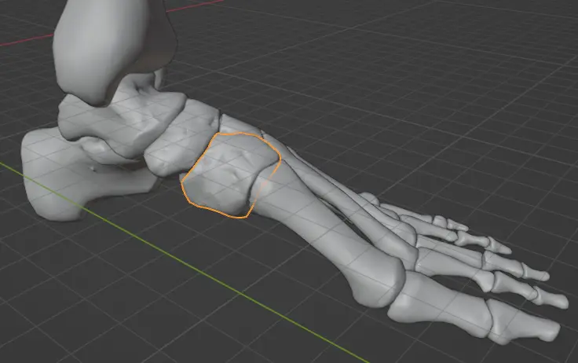
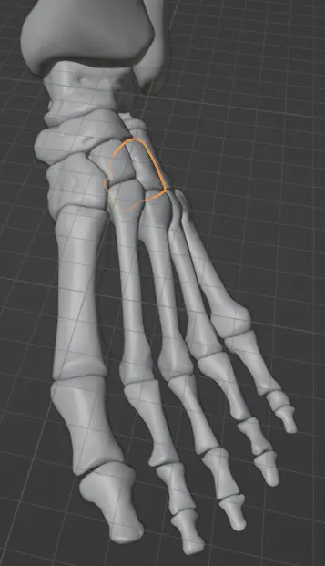
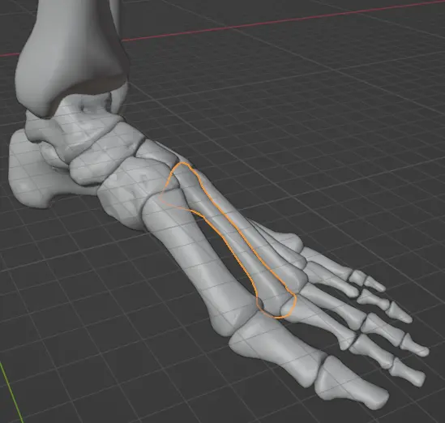
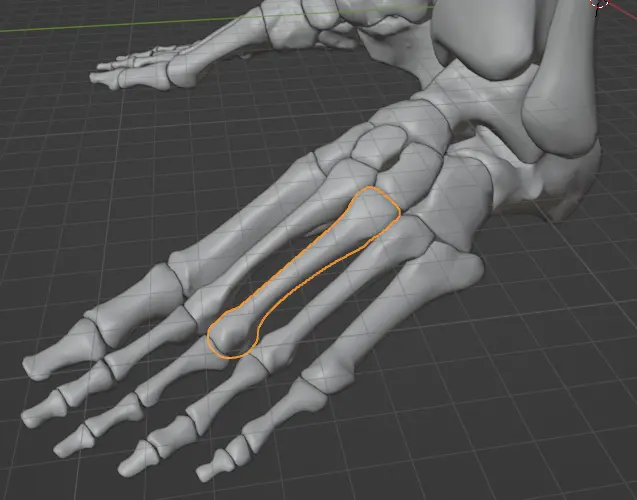

# 解剖學 - 人體骨骼 - 學習筆記 - 足部

這篇筆記已經放在我的 CodiMD 很久了 (2024-11-02)，想說整理一下發一篇廢文。

:::info
關於我如何獲得模型檔案，請見稍早的文章：[從 Blender 開始的解剖學筆記 - 骨骼篇 - 啟程](https://flyskypie.github.io/blog/2024-11-04_blender-anatomy/)。
:::

:::warning
本人非醫學背景，以下不專業筆記如有錯誤歡迎指出。
:::

## 腳掌

腳掌可以分成三個區塊[^Ospied]：

- 趾骨骨群 (Phalanx)
- 蹠骨骨群 (Metatarsus)
- 跗骨骨群 (Tarsus)

[^Ospied]: File:Ospied-en.svg - Wikipedia. Mario modesto. Retrieved 2026-02-25, from https://en.wikipedia.org/wiki/File:Ospied-en.svg

## 跗骨 (Tarsals)

跗骨 (Tarsals) 則由多個骨頭構成[^Tarsus]：

- A: 跟骨 (Calcaneus)
- B: 距骨 (Talus bone)
- C: Cuboid bone
- D: 足舟骨 (Navicular bone)
- E, F, G: 楔形骨 (Cuneiform bones)
  - Medial
  - Intermediate
  - Lateral

[^Tarsus]: Tarsus (skeleton) - Wikipedia. Retrieved 2024-11-04, from https://en.wikipedia.org/wiki/Tarsus_(skeleton)

### 距骨 (Talus)

> "anklebone," 1690s, from Latin talus "ankle, anklebone, knucklebone" (plural tali), related to or a derivative of Latin taxillus "a small die, cube" (they originally were made from the knucklebones of animals), which is of obscure origin.[^anklebone]

talus 在拉丁文中有腳踝之意。

[^anklebone]: talus | Etymology of talus by etymonline. Retrieved 2024-11-04, from https://www.etymonline.com/word/talus

### 跟骨 (Calcaneus)

### 足舟骨 (Navicular Bone)

## 楔形骨 (Cuneiform)

楔形骨從腳掌剖面看過去很像三角形的楔子：

### Medial Cuneiform

### Intermediate Cuneiform

### Lateral Cuneiform

## 蹠骨（Metatarsus）

### Metatarsal 1

### Metatarsal 2

### Metatarsal 3

### Metatarsal 4

### Metatarsal 5

