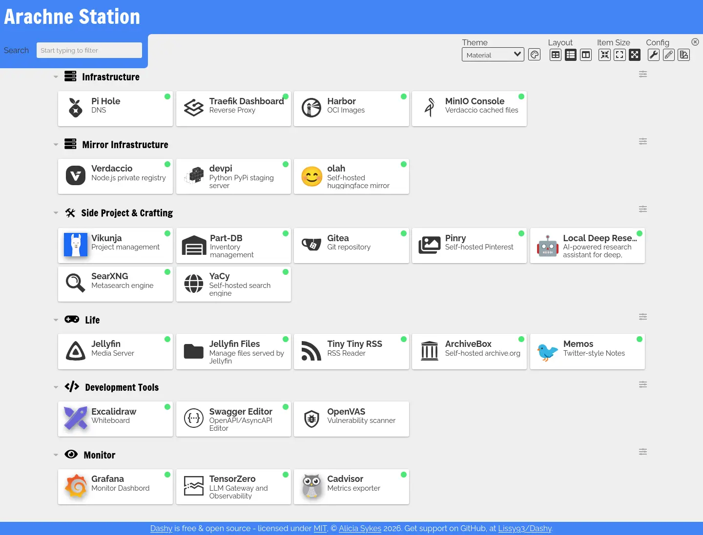

# Homelab 遷移近況

<head>
  <meta property="og:image" content="https://raw.githubusercontent.com/FlySkyPie/flyskypie.github.io/main/post/2026-02-25_homelabe-status/01_homepage.webp" />
</head>



最近在陸續把服務從運行在一台主機 Docker Swarm 遷移到另外一台主機的 Kubernetes 中，


一直到回老家過年前 (2026-02-15) 已經完成大部分服務的遷移，這裡紀錄一下剩餘的服務以及還沒完成遷移的原因。

## 簡單遷移流程

因為我使用 Longhorn 作為 Volume Provider，資料並不是直接寫在 host 的檔案系統內的，而是寫在類似虛擬機硬碟映像檔的東西內，

```shell
$ ll
total 14945644
drwx------  2 root root        4096 Feb 20 07:01 ./
drwxr-xr-x 22 root root        4096 Feb 24 12:16 ../
-rw-r--r--  1 root root 21474836480 Feb 25 00:56 volume-head-000.img
-rw-r--r--  1 root root         126 Jan 24 11:55 volume-head-000.img.meta
-rw-r--r--  1 root root         143 Feb 20 07:01 volume.meta
```

因此不能直接單純的把資料從一個主機的硬碟複製到另外一個主機硬碟，而是需要經過一層 K8s 把資料寫入 Volume 內。目前使用的遷移步驟大致如下。

### 1. 起草 K8s YAML

使用 Kompose 將 Docker Swarm 的 YAML 轉換成 K8s 資源，並且進行適當的修飾（例如：有狀態的服務從 Deployment 改成 StatefulSet）。

並且在目標 Pod 掛上臨時的 container，用於提供 PVC 寫入的 runtime，同時先註解掉真正的服務，如下：

<details>
  <summary>K8s YAML</summary>

```yaml
apiVersion: apps/v1
kind: StatefulSet
metadata:
  labels:
    io.kompose.service: pinry
  name: pinry
spec:
  replicas: 1
  selector:
    matchLabels:
      io.kompose.service: pinry
  updateStrategy:
    type: RollingUpdate
    rollingUpdate:
      partition: 0
  template:
    metadata:
      labels:
        io.kompose.service: pinry
    spec:
      containers:
        # - image: docker.io/getpinry/pinry:2.1.13
        #   name: pinry
        #   ports:
        #     - containerPort: 80
        #       protocol: TCP
        #   volumeMounts:
        #     - mountPath: /data
        #       name: pinry-data

        # Used to do data migration
        - image: docker.io/library/busybox:latest
          name: busybox
          command:
            - sleep
            - "3600"
          volumeMounts:
            - mountPath: /data
              name: pinry-data
      restartPolicy: Always
      volumes:
        - name: pinry-data
          persistentVolumeClaim:
            claimName: pinry-data
```
</details>

### 2. 確認原始 Volume 大小

```shell
du -s -h
```

### 3. 遷移

#### 3.1 直接 `cp`，適用小量遷移

先遷移到本地：

```shell
rsync -avh --info=progress2 --info=name0 --delete \
root@arachne-node-beta:/mnt/das-storage/volumes/pinry_data/ \
./pinry_data/
```

之後上傳到 Pod：

```shell
kubectl cp -n pinry-stack ./pinry_data/ pinry-0:/pinry_data
```

移動檔案到 PV 掛載的路徑：

```shell
kubectl exec -n pinry-stack --stdin --tty pinry-0 -- /bin/sh
```

```shell
cp -rf  /pinry_data/* /data/.
```

:::info
需要拆分兩個步驟是因為 `kubectl cp` 指令只能複製資料夾，不能在兩個資料夾之間直接同步內容。
:::

#### 3.2 tar 打包後 `cp`，適用小量遷移

步驟同上，只是多了一個打包/解包的步驟[^kube-cp-bundle]：

```shell
# 打包壓縮
tar -czf gitea.tar.gz <PATH>

# 解壓縮解包
tar -xzf gitea.tar.gz
```

[^kube-cp-bundle]: Remco Kersten - Importing Data into Longhorn. aspberry Pi 5 for 4K Gaming - Jeff Geerling. Retrieved 2026-02-25, from https://www.remcokersten.nl/posts/import-data-into-longhorn/ 

#### 3.3 `hostPath`，適用中量遷移

上述方法對於容量小的遷移尚可處理，但是我的 ArchiveBox 有 12 GB 的資料，`kubectl cp` 傳輸過程會遇到以下問題：

```
error: unexpected EOF
```

於是我在 Deployment 上加掛一個 `hostPath` Volume：

<details>
  <summary>K8s YAML</summary>

```yaml
apiVersion: apps/v1
kind: StatefulSet
metadata:
  labels:
    io.kompose.service: archivebox
  name: archivebox
spec:
  replicas: 1
  selector:
    matchLabels:
      io.kompose.service: archivebox
  updateStrategy:
    type: RollingUpdate
    rollingUpdate:
      partition: 0
  template:
    metadata:
      labels:
        io.kompose.service: archivebox
    spec:
      containers:
        # - name: archivebox
        #   image: docker.io/archivebox/archivebox:0.7.3
        #   ports:
        #     - containerPort: 8000
        #       protocol: TCP
        #   volumeMounts:
        #     - mountPath: /data
        #       name: archivebox-data

        # Used to do data migration
        - image: docker.io/library/busybox:latest
          name: busybox
          command:
            - sleep
            - "3600"
          volumeMounts:
            - mountPath: /data
              name: archivebox-data
            - mountPath: /archivebox_data
              name: tmp-archivebox-data
      restartPolicy: Always
      volumes:
        - name: archivebox-data
          persistentVolumeClaim:
            claimName: archivebox-data

        # Used to do data migration
        - name: tmp-archivebox-data
          hostPath:
            path: /mnt/archivebox_data
```
</details>

先把資料從一台主機移到另外一台主機，再進入容器中把資料從  `hostPath` Volume 移到 Longhorn 去。

### 4. 切換 container

將遷移用暫時性的 container 註解並且把真實服務掛回。

## 剩餘服務

以下是過年前尚未完成遷移的服務，主要是因為有額外的雜務需要處理，不適用上述簡單遷移方法。

### MinIO

MinIO 的遷移比較特別，一來是已經停止維護了[^minio-dead]，雖然作為封閉的地端使用情況並不需要太過擔心安全性問題， 可以繼續使用已經存在的 OCI (Open Container Initiative) 映像檔，不過依然可能要物色一下其他替代方案。

二來是 MinIO 是一個 S3 (Simple Storage Service) 實例，本身就有 CRUD (Create, read, update and delete) 的 API，因此資料遷移時無須考慮 Volume 層級的問題，只要用 `mc` 指令同步兩個在不同實例上的 Bucket 即可。

[^minio-dead]: MinIO 已死，MinIO 復生 - 知乎. Retrieved 2026-02-25, from https://zhuanlan.zhihu.com/p/2008215929461445776

### Harbor

Harbor 本身就有 Helm 可以使用，但是因為我是客製化 `docker-compose.yaml` 的情況，考慮資料遷移的複雜性可能不能直接使用 Helm。

加上 Harbor 的微服務結構跟我 selfhosted 的其他服務相比複雜得多，翻譯成 K8s 的過程會比較麻煩。

### Jellyfin

資料比較多 (1.3TB)，即便是 `hostPath` 方案也必須在新的主機上消費兩倍的硬碟空間，因此 `hostPath` 不適合用來遷移這種規模的資料。

我腦海浮現兩種解決方法，第一個是直接在舊將資料封裝成 SDS (Software-defined storage)，然後在新節點上作為 Volume 掛載後進行資料轉移。

第二個方法是把 Volume 在新節點上掛給一個 SSH 容器，由 SSH 完成資料轉移。

### Gitea

Gitea 因為需要使用 SSH (Git over SSH)，無法透過 Ingress 處理，而必須設定 Load Balancer。

:::info
Ingress 是 L7 的 HTTP 反向代理，SSH 是建立在 L4 的 TCP 連線上，因此需要 L4 的 Gateway （即 Load Balancer） 處理。
:::

### AptCacherNg

AptCacherNg 雖然是使用 HTTP，但是 `apt` 指令的實做似乎不會帶上 hostname 之類的資訊，因此服務不能運行在反向代理之後，在 Docker Swarm 的舊節點我是直接找個 port 暴露出去。

在 K8s 則是類似於 Gitea 的情況，必須要用 Load Balancer 額外設定。

### Dashy

Dashy 的運作方式是每次容器啟動時，都會根據配置檔「編譯」一份靜態網站。我有點懷疑在 K8s 這種「容器是經濟動物；隨便新增隨便刪除」的哲學下，這種運作是否恰當，視情況可能需要找其他的 homepage 替代方案。
