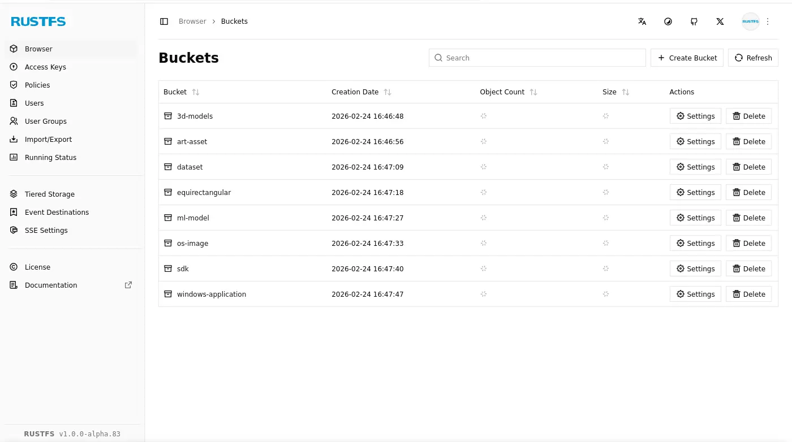

# S3 遷移筆記


在 Homelab 的 S3 中我有幾個 Bucket：

**3D 模型**

理想上我是希望有一個「開源自架的 Sketchfab」，來儲存這類檔案，不過目前還沒找到合適的方案因此就先放在 S3 內，具體是哪種檔案呢？例如：


**素材**

跟 3D 模型類似，理想上我是希望有一個「開源自架的 `itch.io`/`opengameart.org`」但是因為目前沒有所以先找個地方塞。

**資料集**

可能跟機器學習有關的資料集，這種資料集通常動輒數 GB，為了節省網路流量，我收錄了幾個有興趣的在 homelab 裡，以備不時之需（例如：`COCO dataset val2014`、`cv-corpus-15.0-2023-09-08`...）。

**等距長方投影 (Equirectangular)**

之前經手過處理 Equirectangular 相關的專案，跟資料集的情況差不多，8K 影片的話動輒數 GB，手邊存幾份樣本方便日後處理類似題目的時候有檔案可以用。

**機器學習模型**

之前隨手開的 Bucket，目前已經有 Huggingface 的鏡像站 (Olah)了，之後用途可能不大了。或許可以用來儲存那種沒有被上傳到 Huggingface 的野雞模型。

**作業系統映像檔**

這應該不用解釋吧...？安裝 Linux 的時候手邊存一份備著。

**SDK**

不少軟體的 SDK 非常的肥大，為了避免日後需要花時間重複下載，手邊備一份。

**Windows 應用程式**

我開始使用 Linux 以前囤積的軟體。

## 遷移過程

整個 S3 的遷移過程大致如下：

1. 安裝 [mc](https://github.com/minio/mc) 指令：

```shell
curl https://dl.min.io/client/mc/release/linux-amd64/mc \
  --create-dirs \
  -o $HOME/.local/bin/mc
  
chmod +x $HOME/.local/bin/mc
```

2. 分別設定新/舊的 S3 實例：

```shell
$ mc config host add minio-server http://localhost:9000
Enter Access Key:               
Enter Secret Key: 
```

3. 搬遷檔案：

```shell
mc mirror minio-server/3d-models rustfs-server/3d-models
```

## RustFS

|||
|---|---|
|程式碼| https://github.com/rustfs/rustfs |
|星數| 22.3k |

因為 MinIO 官方不再維護[^minio-dead]，RustFS 是一個倍受推崇的替代方案，於是我便嘗試了一下。

然後遷移過程遇到以下問題：

```
mc: <ERROR> Failed to copy `http://s3.minio.arachne/sdk/cuda-repo-ubuntu2204-13-0-local_13.0.1-580.82.07-1_amd64.deb`. Put "http://s3.apps.liquid.arachne/sdk/cuda-repo-ubuntu2204-13-0-local_13.0.1-580.82.07-1_amd64.deb?partNumber=6&uploadId=YzRiMmE0YTgtN2JlOC00ZjY4LTlmZjUtYmVkYzY0NGI4NTg4LjZhNTMzZDU2LWZiZGMtNDk3OS05ZDI5LTY4ZjVhZDllMGNjYngxNzcxOTI2ODgzMDU2MzY3MTc3": http: ContentLength=16777216 with Body length 14680064
mc: <ERROR> Failed to copy `http://s3.minio.arachne/sdk/cuda-repo-ubuntu2204-13-0-local_13.0.1-580.82.07-1_amd64.deb`. Put "http://s3.apps.liquid.arachne/sdk/cuda-repo-ubuntu2204-13-0-local_13.0.1-580.82.07-1_amd64.deb?partNumber=6&uploadId=YzRiMmE0YTgtN2JlOC00ZjY4LTlmZjUtYmVkYzY0NGI4NTg4LmM5MWU3NjMzLTk2ZTYtNDNkYy1iMDg0LWNlYzI5YjgyNzMzZHgxNzcxOTI3MzIwNjk0MjE5MjYy": http: ContentLength=16777216 with Body length 14680064
mc: <ERROR> Unable to list comparison retrying.. context canceled
```

不過我對 CUDA SDK 沒什麼留念，刪除之後剩下的檔案都順利完成遷移了。

接著映入眼簾的是永遠在轉圈圈的 Bucket 大小：



不過還好，這也只是錦上添花的功能，但是 Bucket 的設定頁面也一直在轉圈圈是怎麼回事？


後來近一步調查：

>  Be ware of the recent RustFS CVE[^rustfs-cve] because a static key was vibe coded into the product… even though they mitigated the issue, my confidence dropped severely because of this. [^rustfs-comment-1]
> 

> This project looks mostly vibecoded, after a quick review I have found a dozen of obvious problems[^rustfs-comment-2]
>

很好，RustFS 的嘗試到此為止，繼續使用 MinIO；推移更新 S3 實作的計畫。

:::info
我使用的 RustFS 是 `docker.io/rustfs/rustfs:1.0.0-alpha.83`，供參考。
:::

:::info
另外我有評估過 [Garage](https://git.deuxfleurs.fr/Deuxfleurs/garage)，不過它有兩個問題：
- 設定稍微複雜一點，它需要設定 domain name，似乎難以在單純的環境 (localhost) 中測試。
- 不像 MinIO 有開箱即用 Web UI。
:::

[^minio-dead]: MinIO 已死，MinIO 復生 - 知乎. Retrieved 2026-02-25, from https://zhuanlan.zhihu.com/p/2008215929461445776

[^rustfs-comment-1]: What is the Best MiniO Alternative Right Now, RustFS, Garage or SeaweedFS ? : r/selfhosted. Retrieved 2026-02-25, from https://www.reddit.com/r/selfhosted/comments/1qcm5r5/comment/nzjbtcc/?utm_source=share&utm_medium=web3x&utm_name=web3xcss&utm_term=1&utm_content=share_button
[^rustfs-cve]: Update your RustFS immediately - Hardcoded token with privileged access (CVE-2025-68926) : r/selfhosted. Retrieved 2026-02-25, from https://www.reddit.com/r/selfhosted/comments/1q432iz/update_your_rustfs_immediately_hardcoded_token/
[^rustfs-comment-2]: What is the Best MiniO Alternative Right Now, RustFS, Garage or SeaweedFS ? : r/selfhosted. Retrieved 2026-02-25, from https://www.reddit.com/r/selfhosted/comments/1qcm5r5/comment/nzo0ez8/?utm_source=share&utm_medium=web3x&utm_name=web3xcss&utm_term=1&utm_content=share_button

## MinIO
