# Homelab 資料遷移筆記

<head>
  <meta property="og:image" content="https://raw.githubusercontent.com/FlySkyPie/flyskypie.github.io/main/post/2026-03-05_data-migration/node-01.webp" />
</head>

## 前情提要

我正在把 Homelab 的服務從一台機器的 Docker Swarm 遷移到另外一台機器的 Kubernetes，其中比較棘手的服務之一是 Jellyfin，因為這個服務包含了 1.3TB 的資料。

為什麼 1.3TB 是個問題？可以見前一篇文章：

[Homelab 遷移近況 (2026-02-25)](https://flyskypie.github.io/posts/2026-02-25_homelabe-status/)

## 結論

過程中其實有遇到一些挫折，不過我先講結論，過程等等提。

我使用了以下指令完成遷移：

```shell
ssh -A -R localhost:50000:192.168.0.138:32222 root@arachne-node-beta \
'rsync -avh --info=progress2 --info=name0 --delete --bwlimit=20m -e "ssh -p 50000" -vuar /mnt/das-storage/volumes/jellyfin_media-data/ linuxserver.io@localhost:/config/data/media-data/'
```

指令本身我是參考網路上的。`arachne-node-beta` 是我 homelab 內部使用的 hostname，之後簡稱 Beta 節點。

[^rsync-remote]: shell - How to rsync files between two remotes? - Unix & Linux Stack Exchange. Retrieved 2026-03-05, from https://unix.stackexchange.com/a/183516

### `-R`

```shell
-R localhost:50000:192.168.0.138:32222
```

這段參數的意思是，把 `192.168.0.138:32222` 接到 `localhost:50000` 去（對 Beta 節點而言），所以在 Beta 節點上訪問 `localhost:50000` 時實際上會連到 `192.168.0.138:32222` 去。

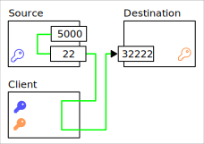

:::info
可以用 "SSH Remote Port Forwarding" 之類的關鍵字搜尋這個 flag 相關的資訊與用法。
:::

### `-A`

透過 ssh-agent 建立一個代理，把遠端的認證丟回本機處理，這樣就不用在 Beta 節點設定對目標（在這個案例中是 `192.168.0.138`）的金鑰。


### rsync

指令參數看起來有點髒的原因是混合了我平時自己備份資料常用的：

```
-avh --info=progress2 --info=name0 --delete
```

和網路上找到的：

```
-e "ssh -p 50000" -vuar
```

`--bwlimit=20m` 則是為了處理 I/O 背壓 (Backpressure) 問題， 稍後解釋。

```
/mnt/das-storage/volumes/jellyfin_media-data/ 
linuxserver.io@localhost:/config/data/media-data/
```

分別是來源跟目標。

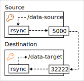

### 準備工作

先在 K8s 佈署 OpenSSH 的 Pod：

<details>
<summary>
`statefulset.yaml`
</summary>
```yaml
apiVersion: apps/v1
kind: StatefulSet
metadata:
  labels:
    io.kompose.service: openssh
  name: openssh
spec:
  replicas: 1
  selector:
    matchLabels:
      io.kompose.service: openssh
  updateStrategy:
    type: RollingUpdate
    rollingUpdate:
      partition: 0
  template:
    metadata:
      labels:
        io.kompose.service: openssh
    spec:
      containers:
        - image: docker.io/linuxserver/openssh-server:latest
          name: openssh
          env:
            - name: PASSWORD_ACCESS
              value: "true"
            - name: PGID
              value: "1000"
            - name: PUID
              value: "1000"
            - name: TZ
              value: Asia/Taipei
            - name: USER_PASSWORD
              value: password
          ports:
            - containerPort: 2222
              protocol: TCP
          volumeMounts:
            - mountPath: /config/data/jellyfin-cache
              name: jellyfin-cache
            - mountPath: /config/data/jellyfin-config
              name: jellyfin-config
            - mountPath: /config/data/media-data
              name: media-data
      restartPolicy: Always
      volumes:
        - name: jellyfin-cache
          persistentVolumeClaim:
            claimName: jellyfin-cache
        - name: jellyfin-config
          persistentVolumeClaim:
            claimName: jellyfin-config
        - name: media-data
          persistentVolumeClaim:
            claimName: media-data
---
apiVersion: v1
kind: Service
metadata:
  labels:
    io.kompose.service: openssh
  name: openssh-service
spec:
  type: NodePort
  selector:
    io.kompose.service: openssh
  ports:
    - protocol: TCP
      port: 2222
      targetPort: 2222
      nodePort: 32222
```
</details>

這邊是使用 `linuxserver/openssh-server` 這個別人做好的 image。我是使用獨立的 Pod 而不是和 Jellyfin 共用 Pod 因為這樣 YAML 比較乾淨。

這邊是用 NodePort 處理，因為我暫時還不想煩惱設定 LoadBalancer。

作為 OpenSSH 伺服器的 Container 還需要完成幾件事：

- 配置和本地對應的 public key
- 安裝 rsync

在本地則是：

- 使用 `ssh-add` 把要用來訪問 OpenSSH 伺服器的 private key 放進 SSH Agent 內。

## 方案的選擇

一開始其實有考慮過另外一個方案：掛載 SDS (Software-defined storage)。

Kubernetes 本身就支援將外部的 NFS 或是 iSCSI 之類的東西掛載成 Volume，或是 StorageClass 把網路上的各種實例當成 Volume 使用。因此理論上只要在 Beta 節點上套一層 SDS，就能讓 Pod 掛載它的 Volume，接著就能在 Pod 內進行資料資料轉移。

不過這個方案代表需要讓 Beta 節點暴露給網路做讀寫，在 LAN 內問題不大，但是考量「生產條件」的話這似乎不是一個標準的解決方式。所以最後選擇走基於 SSH 的方案，至少在正確使用方式下它是足夠安全的。

## 歷程

接著來談過程中遇到的挫折，反覆嘗試了幾種方式：

- Rclone 傳輸，兩端為 SFTP 對 SFTP。
- Rclone 傳輸，其中一端為 SSHFS 掛載本地，另外一端為 SFTP。
- Rclone 傳輸，兩端皆為 SSHFS 掛載本地。
- rsync 傳輸，兩端皆為 SSHFS 掛載本地。
- rsync 傳輸，其中一端 SSHFS 掛載本地。

:::info
rsync 不支援兩端同時為 remote。
:::

過程中都會突然停止傳輸（網路流量歸零），我原本以為是花式傳輸造成的某種鎖，或是 SSH 死掉之類的，但是就算用上 Port Forwarding 這個理應最穩定的方式還是會出現，而且它有很明顯的間歇性。雖然放著不管應該最後還是可以傳輸完畢，但是總覺得還是應該要試著解決它一下。

過程中用 LLM 做故障排除，最後試著把 `iostat` 資訊餵給 LLM 得到的階段性結論是硬碟的 I/O 瓶頸，加上個 `--bwlimit=20m` 限制傳輸流量之後，那個間歇性停止的問題就消失了，掛著跑了幾個小時終於把資料傳完了。

### Node 回顧

:::info
這個回顧使用的 Dashboard 可以在這裡找到：

https://github.com/rfmoz/grafana-dashboards
:::

前段不穩定的部份就是我嘗試各種方案，並且傳輸時觀察到間歇性停止的部份。

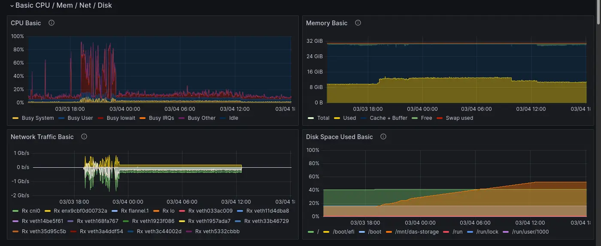

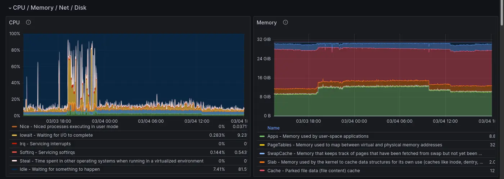

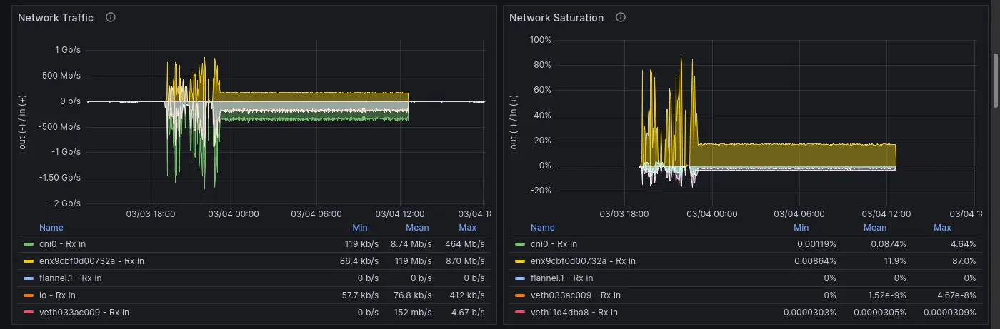

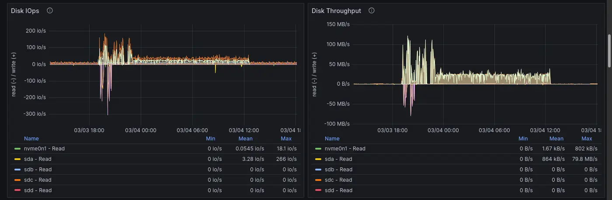

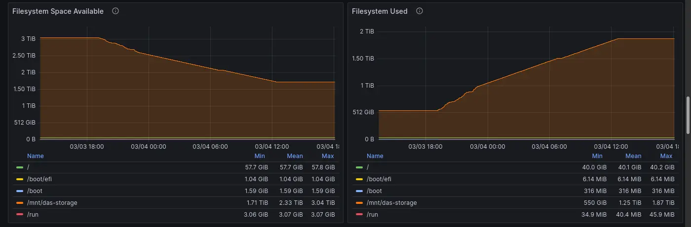

在這張圖很明顯看到硬碟的 I/O 已經吃滿了：

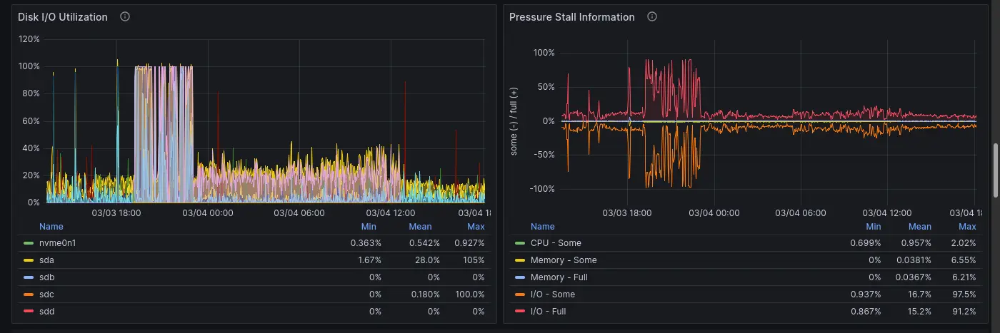

因此傳輸過程的間歇性停止其實是硬碟瓶頸，網路傳輸很快的把資料填進去 Buffer，Buffer 滿了硬碟來不及消化就讓網路傳輸暫停，寫入等待時間最高甚至超過一分半：

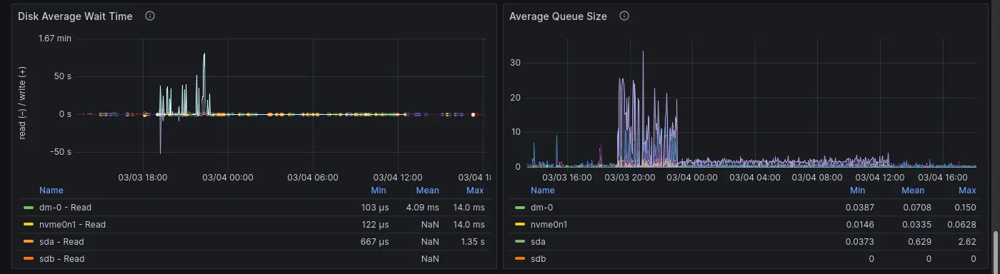

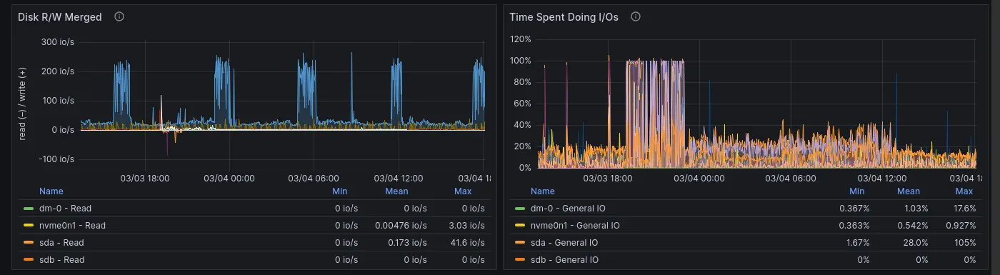

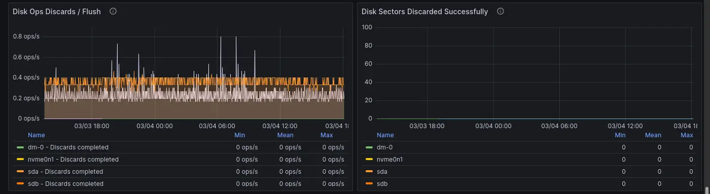

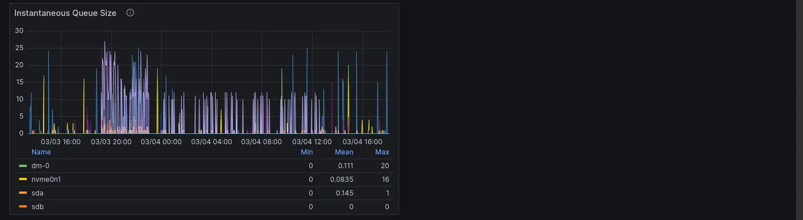

這裡也可以看到很多 I/O Wait：

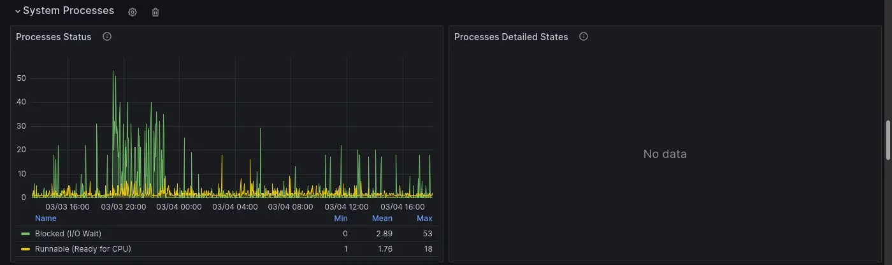

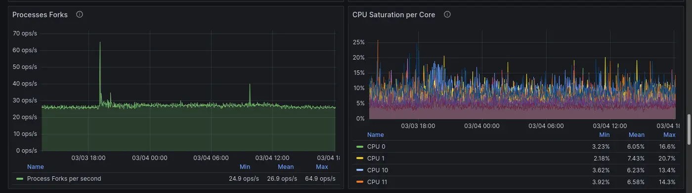

### Cluster 回顧

:::info
這個回顧使用的 Dashboard 是 [kube-prometheus-stack](https://github.com/prometheus-community/helm-charts/tree/main/charts/kube-prometheus-stack) 這個 Helm 的一部分。
:::

可以觀察到相同的模式，沒什麼特別的資訊，不過機會難得（？）順便曬一下從 Kubernetes 的角度看過去的 Dashboard 長怎樣。

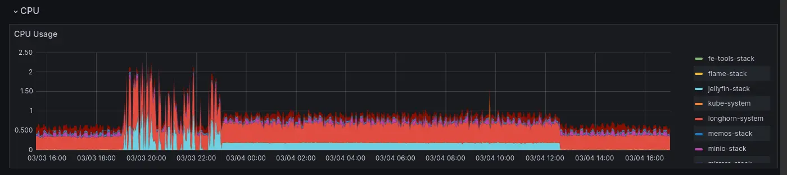

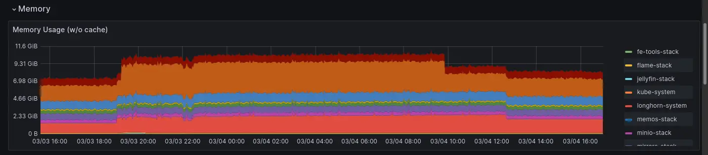

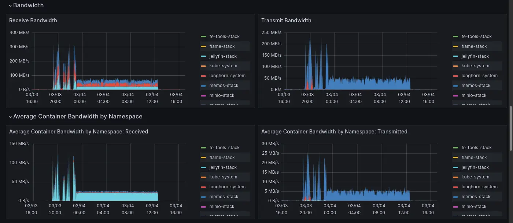

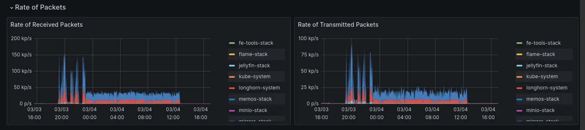

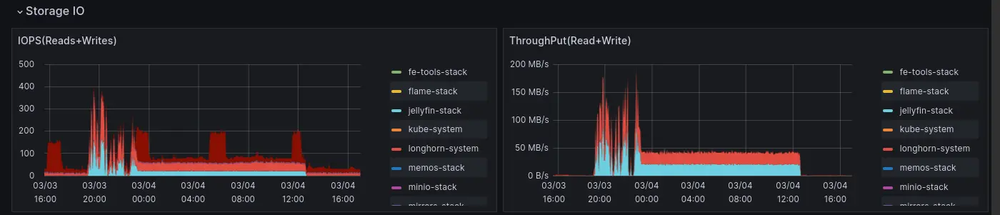
