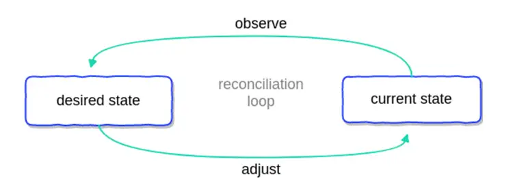
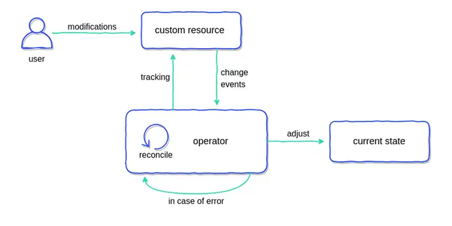

# Homelab 資料遷移筆記：GPU 篇

<head>
  <meta property="og:image" content="https://raw.githubusercontent.com/FlySkyPie/flyskypie.github.io/main/post/2026-03-07_homelab-migration/01_kubernetes_operators_diagram1.webp" />
</head>

## 前情提要

我完成了 1.3TB 的資料遷移，但是 Jellyfin 服務依然有東西還沒完成配置。

關於資料遷移的細節請見前一篇文樁：

[Homelab 資料遷移筆記 (2026-03-05)](https://flyskypie.github.io/posts/2026-03-05_data-migration/)

## GPU 與硬體加速

在遷移前的配置中有這麼一段設定：

```yaml
services:
  jellyfin-server:
    image: jellyfin/jellyfin:10
    devices:
      - /dev/dri/:/dev/dri/
```

原因是當瀏覽器不支援直接播放原本儲存的檔案格式時，Jellyfin 需要先編碼再串流給瀏覽器，而這個過程如果不透過硬體加速會非常慢，因此它不像一般的雲端程式只要 CPU 跟 RAM 資源就能運作，還需要訪問 GPU 資源。

然後在 K8s 內實現這件事稍微有點複雜，因為在 K8s 的世界，永遠要考慮多節點情況，而多節點代表著：

- 節點上不見得有 GPU
- 節點上有 GPU 但是硬體規格可能是 Intel, AMD, nvidia...
- 不同硬體的驅動程式與實做不盡相同。

K8s 的高度抽象化固然支援處理這樣的問題，不過它不是開箱即用的，至少對於自己架的 K8s 來說不是。

## 解決方案

廢話少說，先說結論，背景知識等等再補，以下是整個過程大致上需要的步驟：

1. 安裝 NFD (Node Feature Discovery)

```shell
helm install \
-n node-feature-discovery \
--create-namespace \
nfd oci://registry.k8s.io/nfd/charts/node-feature-discovery \
--version 0.18.3
```
2. 安裝 cert-manager

```shell
helm install \
  cert-manager oci://quay.io/jetstack/charts/cert-manager \
  --version v1.19.4 \
  --namespace cert-manager \
  --create-namespace \
  --set crds.enabled=true
```

3. 安裝 Intel 的 device-plugin-operator

```shell
helm install device-plugin-operator intel/intel-device-plugins-operator \
    --namespace intel-device-plugins-gpu \
    --create-namespace \
    --version 0.35.0
```

4. 安裝 Intel 的 gpu-device-plugin

```shell
helm install gpu-device-plugin intel/intel-device-plugins-gpu \
    --namespace intel-device-plugins-gpu \
    --create-namespace \
    --version 0.35.0
```

5. 使用 resources 標籤

```yaml
    spec:
      containers:
        - image: docker.io/jellyfin/jellyfin:10
          resources:
            requests:
              gpu.intel.com/i915: "1"
            limits:
              gpu.intel.com/i915: "1"
```

`requests` 是要求最小裝置數量，`limits` 是聲明最大的資源用量。

整個安裝過程參考網路上的兩篇文章[^intel-device][^intel-device-2]。

[^intel-device]: Intel GPU acceleration on Kubernetes – Jonathan Gazeley. Retrieved 2026-03-10, from https://jonathangazeley.com/2025/02/11/intel-gpu-acceleration-on-kubernetes/

[^intel-device-2]: Plex on Kubernetes with intel iGPU passthrough - Small how to : r/selfhosted. Retrieved 2026-03-10, from https://www.reddit.com/r/selfhosted/comments/121vb07/plex_on_kubernetes_with_intel_igpu_passthrough/

# K8s Operator

K8s Operator 本質上是一層聲明式與指令式的橋樑，目的是讓運維人員透過聲明式組態來操作經過封裝的指令式實做。



Operator 的運作方式大致為：程式觀察聲明式宣告的某種組態或資源，對 K8s 進行操作試圖使實際狀態與聲明狀態同步。換言之，當 K8s 發生某種變化，如：服務異常、失效，Operator 也會操作 K8s 試圖使其回到原本符合聲明的狀態。



:::info
本段落的圖片出自：

[Kubernetes Operators Explained](https://blog.container-solutions.com/kubernetes-operators-explained)
:::

類似的行為可以從 K8s 原本的設計就觀察到：

使用者聲明 Deployment 資源，K8s 再配置對應的 Pod，如果你手動把 Pod 刪除，K8s 會試著把 Pod 補回去。

## K8s Device Plugin

K8s Device Plugin 的基本概念如下：

- kubelet 暴露了 Unix Socket 供其他人連線。
- 第三方程式能夠透過這個 Socket 註冊包含 GPU 在內的各種裝置。
- 每個 K8s Worker Node 上有 kubelet。
- K8s 暴露了一種操作方式 DaemonSet，它能在 K8s Cluster 內的每一個 Node 配置 Pod。
- K8s Device Plugin 能夠透過 DaemonSet，佈署特定裝置的橋接器，當裝置存在就向 K8s 註冊裝置。
- 如此一來服務就能佈署到特定符合裝置條件的節點並使用該裝置。

## NFD (Node Feature Discovery)

- https://github.com/kubernetes-sigs/node-feature-discovery
  - 1k ⭐

安裝前的資訊：

<details>
  <summary>
  `kubectl get nodes -o json`
  </summary>
```shell
$ kubectl get nodes -o json | \
jq '.items[] | {name: .metadata.name, labels: .metadata.labels}'
{
  "name": "arachne-node-delta",
  "labels": {
    "beta.kubernetes.io/arch": "amd64",
    "beta.kubernetes.io/instance-type": "k3s",
    "beta.kubernetes.io/os": "linux",
    "kubernetes.io/arch": "amd64",
    "kubernetes.io/hostname": "arachne-node-delta",
    "kubernetes.io/os": "linux",
    "node-role.kubernetes.io/control-plane": "true",
    "node-role.kubernetes.io/master": "true",
    "node.kubernetes.io/instance-type": "k3s"
  }
}
```
</details>

安裝後的資訊：

<details>
  <summary>
  `kubectl get nodes -o json`
  </summary>
```shell
kubectl get nodes -o json | jq '.items[] | {name: .metadata.name, labels: .metadata.labels}'
{
  "name": "arachne-node-delta",
  "labels": {
    "beta.kubernetes.io/arch": "amd64",
    "beta.kubernetes.io/instance-type": "k3s",
    "beta.kubernetes.io/os": "linux",
    "feature.node.kubernetes.io/cpu-cpuid.ADX": "true",
    "feature.node.kubernetes.io/cpu-cpuid.AESNI": "true",
    "feature.node.kubernetes.io/cpu-cpuid.AVX": "true",
    "feature.node.kubernetes.io/cpu-cpuid.AVX2": "true",
    "feature.node.kubernetes.io/cpu-cpuid.AVXVNNI": "true",
    "feature.node.kubernetes.io/cpu-cpuid.BHI_CTRL": "true",
    "feature.node.kubernetes.io/cpu-cpuid.CETIBT": "true",
    "feature.node.kubernetes.io/cpu-cpuid.CETSS": "true",
    "feature.node.kubernetes.io/cpu-cpuid.CMPXCHG8": "true",
    "feature.node.kubernetes.io/cpu-cpuid.FLUSH_L1D": "true",
    "feature.node.kubernetes.io/cpu-cpuid.FMA3": "true",
    "feature.node.kubernetes.io/cpu-cpuid.FSRM": "true",
    "feature.node.kubernetes.io/cpu-cpuid.FXSR": "true",
    "feature.node.kubernetes.io/cpu-cpuid.FXSROPT": "true",
    "feature.node.kubernetes.io/cpu-cpuid.GFNI": "true",
    "feature.node.kubernetes.io/cpu-cpuid.HRESET": "true",
    "feature.node.kubernetes.io/cpu-cpuid.HYBRID_CPU": "true",
    "feature.node.kubernetes.io/cpu-cpuid.IA32_ARCH_CAP": "true",
    "feature.node.kubernetes.io/cpu-cpuid.IA32_CORE_CAP": "true",
    "feature.node.kubernetes.io/cpu-cpuid.IBPB": "true",
    "feature.node.kubernetes.io/cpu-cpuid.IDPRED_CTRL": "true",
    "feature.node.kubernetes.io/cpu-cpuid.LAHF": "true",
    "feature.node.kubernetes.io/cpu-cpuid.MD_CLEAR": "true",
    "feature.node.kubernetes.io/cpu-cpuid.MOVBE": "true",
    "feature.node.kubernetes.io/cpu-cpuid.MOVDIR64B": "true",
    "feature.node.kubernetes.io/cpu-cpuid.MOVDIRI": "true",
    "feature.node.kubernetes.io/cpu-cpuid.OSXSAVE": "true",
    "feature.node.kubernetes.io/cpu-cpuid.PMU_FIXEDCOUNTER_CYCLES": "true",
    "feature.node.kubernetes.io/cpu-cpuid.PMU_FIXEDCOUNTER_INSTRUCTIONS": "true",
    "feature.node.kubernetes.io/cpu-cpuid.PMU_FIXEDCOUNTER_REFCYCLES": "true",
    "feature.node.kubernetes.io/cpu-cpuid.PSFD": "true",
    "feature.node.kubernetes.io/cpu-cpuid.RRSBA_CTRL": "true",
    "feature.node.kubernetes.io/cpu-cpuid.SERIALIZE": "true",
    "feature.node.kubernetes.io/cpu-cpuid.SHA": "true",
    "feature.node.kubernetes.io/cpu-cpuid.SPEC_CTRL_SSBD": "true",
    "feature.node.kubernetes.io/cpu-cpuid.STIBP": "true",
    "feature.node.kubernetes.io/cpu-cpuid.STOSB_SHORT": "true",
    "feature.node.kubernetes.io/cpu-cpuid.SYSCALL": "true",
    "feature.node.kubernetes.io/cpu-cpuid.SYSEE": "true",
    "feature.node.kubernetes.io/cpu-cpuid.VAES": "true",
    "feature.node.kubernetes.io/cpu-cpuid.VMX": "true",
    "feature.node.kubernetes.io/cpu-cpuid.VPCLMULQDQ": "true",
    "feature.node.kubernetes.io/cpu-cpuid.WAITPKG": "true",
    "feature.node.kubernetes.io/cpu-cpuid.X87": "true",
    "feature.node.kubernetes.io/cpu-cpuid.XGETBV1": "true",
    "feature.node.kubernetes.io/cpu-cpuid.XSAVE": "true",
    "feature.node.kubernetes.io/cpu-cpuid.XSAVEC": "true",
    "feature.node.kubernetes.io/cpu-cpuid.XSAVEOPT": "true",
    "feature.node.kubernetes.io/cpu-cpuid.XSAVES": "true",
    "feature.node.kubernetes.io/cpu-cstate.enabled": "true",
    "feature.node.kubernetes.io/cpu-hardware_multithreading": "true",
    "feature.node.kubernetes.io/cpu-model.family": "6",
    "feature.node.kubernetes.io/cpu-model.id": "186",
    "feature.node.kubernetes.io/cpu-model.vendor_id": "Intel",
    "feature.node.kubernetes.io/cpu-pstate.scaling_governor": "powersave",
    "feature.node.kubernetes.io/cpu-pstate.status": "active",
    "feature.node.kubernetes.io/cpu-pstate.turbo": "true",
    "feature.node.kubernetes.io/kernel-config.NO_HZ": "true",
    "feature.node.kubernetes.io/kernel-config.NO_HZ_FULL": "true",
    "feature.node.kubernetes.io/kernel-version.full": "6.8.0-101-generic",
    "feature.node.kubernetes.io/kernel-version.major": "6",
    "feature.node.kubernetes.io/kernel-version.minor": "8",
    "feature.node.kubernetes.io/kernel-version.revision": "0",
    "feature.node.kubernetes.io/memory-swap": "true",
    "feature.node.kubernetes.io/pci-0300_8086.present": "true",
    "feature.node.kubernetes.io/pci-0300_8086.sriov.capable": "true",
    "feature.node.kubernetes.io/storage-nonrotationaldisk": "true",
    "feature.node.kubernetes.io/system-os_release.ID": "ubuntu",
    "feature.node.kubernetes.io/system-os_release.VERSION_ID": "24.04",
    "feature.node.kubernetes.io/system-os_release.VERSION_ID.major": "24",
    "feature.node.kubernetes.io/system-os_release.VERSION_ID.minor": "04",
    "feature.node.kubernetes.io/usb-ef_27c6_609c.present": "true",
    "feature.node.kubernetes.io/usb-ff_0bda_8156.present": "true",
    "kubernetes.io/arch": "amd64",
    "kubernetes.io/hostname": "arachne-node-delta",
    "kubernetes.io/os": "linux",
    "node-role.kubernetes.io/control-plane": "true",
    "node-role.kubernetes.io/master": "true",
    "node.kubernetes.io/instance-type": "k3s"
  }
}
```
</details>

## 故障排除

安裝過程有遭遇一點問題：

```shell
$ kubectl logs pod/intel-gpu-plugin-gpudeviceplugin-sample-79cwr -n intel-device-plugins-gpu
I0306 14:06:45.387882       1 gpu_plugin.go:843] GPU device plugin started with none preferred allocation policy
I0306 14:06:45.388177       1 gpu_plugin.go:530] GPU (i915/xe) resource share count = 1
I0306 14:06:45.442369       1 gpu_plugin.go:548] GPU scan update: 0->1 'i915_monitoring' resources found
I0306 14:06:45.442389       1 gpu_plugin.go:548] GPU scan update: 0->1 'i915' resources found
I0306 14:06:46.444272       1 server.go:288] Start server for i915_monitoring at: /var/lib/kubelet/device-plugins/gpu.intel.com-i915_monitoring.sock
I0306 14:06:46.444396       1 server.go:288] Start server for i915 at: /var/lib/kubelet/device-plugins/gpu.intel.com-i915.sock
I0306 14:06:46.844746       1 server.go:306] Device plugin for i915_monitoring registered
I0306 14:06:46.844752       1 server.go:306] Device plugin for i915 registered
E0306 14:06:46.844852       1 manager.go:146] Failed to serve gpu.intel.com/i915_monitoring: too many open files
Failed to create watcher for /var/lib/kubelet/device-plugins/gpu.intel.com-i915_monitoring.sock
github.com/intel/intel-device-plugins-for-kubernetes/pkg/deviceplugin.watchFile
	github.com/intel/intel-device-plugins-for-kubernetes/pkg/deviceplugin/server.go:328
github.com/intel/intel-device-plugins-for-kubernetes/pkg/deviceplugin.(*server).setupAndServe
	github.com/intel/intel-device-plugins-for-kubernetes/pkg/deviceplugin/server.go:310
github.com/intel/intel-device-plugins-for-kubernetes/pkg/deviceplugin.(*server).Serve
	github.com/intel/intel-device-plugins-for-kubernetes/pkg/deviceplugin/server.go:226
github.com/intel/intel-device-plugins-for-kubernetes/pkg/deviceplugin.(*Manager).handleUpdate.func1
	github.com/intel/intel-device-plugins-for-kubernetes/pkg/deviceplugin/manager.go:144
runtime.goexit
	runtime/asm_amd64.s:1693
```

解決方法：

```
# 編輯檔案
sudo nano /etc/sysctl.conf

# 加入以內容
# fs.inotify.max_user_instances = 256

sudo sysctl -p
```
