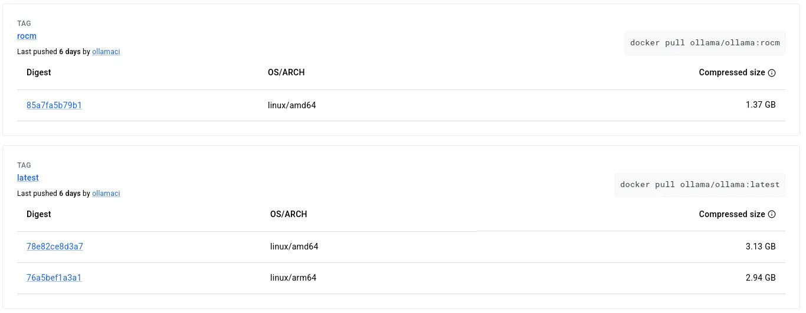
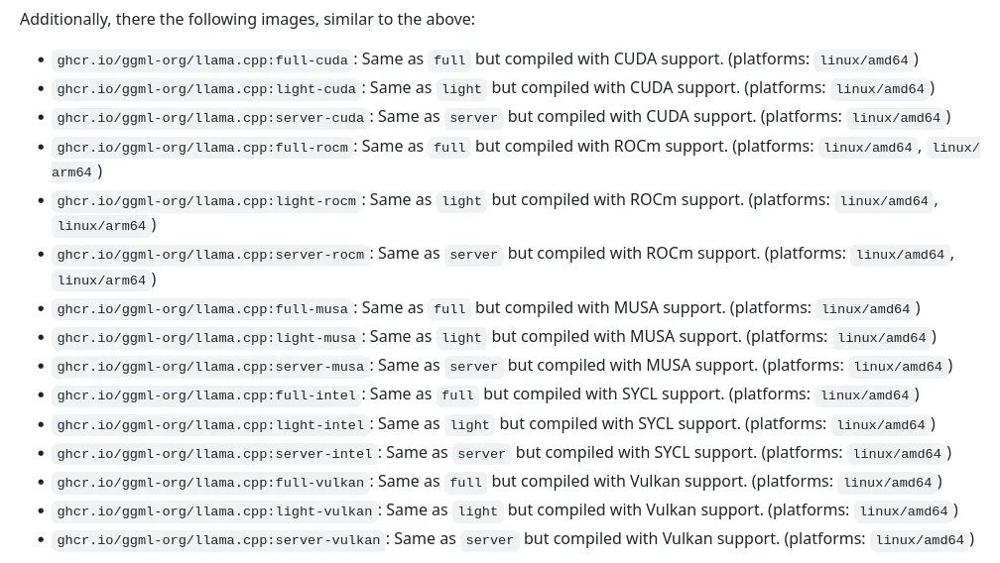
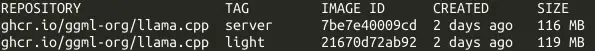
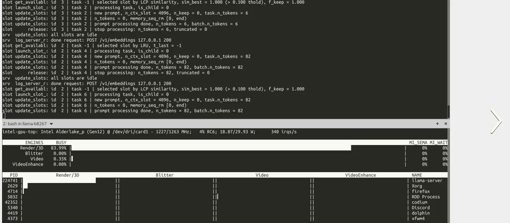
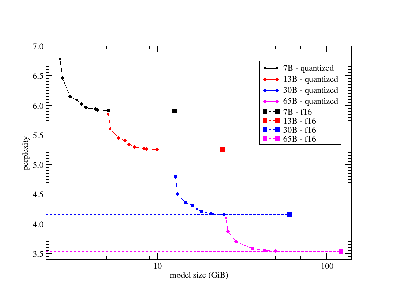

# llama.cpp 本地嵌入伺服器初體驗

<head>
  <meta property="og:image" content="https://raw.githubusercontent.com/FlySkyPie/flyskypie.github.io/main/post/2026-03-12_llama-cpp/01_kubernetes_operators_diagram1.webp" />
</head>

## 前情提要

最近其實處於多開戰線的狀態：

- Homelab
  - Docker Swarm 到 K8s 的遷移，相關文章見：
    - [Homelab 資料遷移筆記：GPU 篇 (2026-03-07)](https://flyskypie.github.io/posts/2026-03-07_homelab-migration/)
    - [Homelab 資料遷移筆記 (2026-03-05)](https://flyskypie.github.io/posts/2026-03-05_data-migration/)
  - 老舊筆電整備
    - ASUS X55C 和 Sony VAIO VGN-SR56TG/B，尚無公開文章
- 整理一下自己 AI 專案的思緒與結構
  - 相關資訊見筆記：[Anima & Seshat](https://flyskypie.github.io/microproject-wikis/anima-and-seshat.html)
- 學習 Carla, OpenDrive...等自駕車之至
  - 相關資訊見筆記：[台灣卡車模擬器](https://flyskypie.github.io/microproject-wikis/taiwan-truck-simulator.html)
- Typescript AST
  - 相關資訊見筆記：[Typescript 降解](https://flyskypie.github.io/microproject-wikis/ts-degradation.html)
- RAG Side Project

Homelab 遷移大致完成，目前只剩下一個服務，想說該回來灌溉一下 RAG 專案了。

## TiddlyRAG

關於目前整個生態系的亂象，我在[之前的文章](https://flyskypie.github.io/blog/2026-02-02_llm-using-approach/)已經全部噴過一遍了，接下來就是採取一些行動了，關於這個專案的細節請見：

[TiddlyRAG 計畫](https://flyskypie.github.io/tiddlyrag-planning/)

細節我就不贅述，簡單來說就是我發現 TiddlyWiki 本身自帶 Chunk 、 Graph 、人類可讀可編輯和可攜性...等特性，在 LLM 時代應該是一個很好用的軟體，這也不是什麼新點子，想法去年 (2025) 十月就有了：

[一種人類友善 llms.txt 構想](https://flyskypie.github.io/blog/2025-10-06_a-idea-about-using-tiddlywiki-as-llmstxt/)

:::info
上面很多 Side Project 寫了一堆 TiddlyWiki 其實和 TiddlyRAG 是相關的，除了實驗一些 DDD 流程以外，也算是準備一些資料方便日後做 RAG 的測試。
:::

## 嵌入伺服器與選擇

TiddlyRAG 的 POC 架構如下：


可以說有三個大題目：

- 向量資料庫 (Vector database)
- MCP (Model Context Protocol)
- 資料嵌入 (Embedding)

向量資料庫之前工作寫小工具有接觸過了，MCP 的部份也稍微查過資料，剩下比較陌生的是資料嵌入的部份。

開放權重、OpenAI API 兼容、OCI (Open Container Initiative) 佈署、nvidia 解偶，這幾個算是我對於嵌入方案的基本要求。

首先是大名鼎鼎的 Ollama，不過很快我就發現幾個問題：



- 它的映像檔過於肥大，單層超過 1GB 的映像檔在我的可憐網路下是拉不下來的。
- 它只支援 nvidia 的 CUDA 和 AMD 的 ROCm，不夠通用。
- 就算只使用 CPU 模式，映像檔是跟 nvidia 函式庫綁定的。

好吧，下一個看看以「性能優雅」出名的 llama.cpp。





斯巴拉西！


映像檔案小、支援多種 GPU 後端，看來就決定是你了！

## llama.cpp

下載了 `Ubuntu x64 (Vulkan)`，

```shell
./llama-server \
  --hf-repo Qwen/Qwen3-Embedding-8B-GGUF \
  --hf-file Qwen3-Embedding-8B-Q6_K.gguf \
  --embeddings --pooling mean \
  -c 4096 -ub 4096 -ngl 999 --no-mmap -fa on --no-webui
```

指令是參考別人的[^embedding-server]，模型會下載到 `~/.cache/llama.cpp/`，不知道能不能改路徑。

接著用 Typescript 戳一下：

```typescript
const url = "http://localhost:8080/v1/embeddings"
const headers = {
   "Authorization": `Bearer ANY`,
  "Content-Type": "application/json"
}
const payload = {
  "model": "ANY",
  "input": "Your text string goes here",
  "encoding_format": "float"
}

const response = await fetch(url, {
  method: "POST",
  headers,
  body: JSON.stringify(payload),
});

const result = await response.json()
console.log(JSON.stringify(result, undefined, 2));
```



GPU 有在運作，不錯不錯。

[^embedding-server]: embedding with llama.cpp server : r/LocalLLaMA. https://www.reddit.com/r/LocalLLaMA/comments/1nqyi1x/comment/ngacugv/?utm_source=share&utm_medium=web3x&utm_name=web3xcss&utm_term=1&utm_content=share_button

## 模型下載的一些問題

本來想說 llama.cpp 是精簡出名的，根據職責分離原則它可能不會實做下載的部份，所以先試著用 Huggingface 的 CLI 跑跑看了，

```shell
hf download \
  --local-dir models \
  Qwen/Qwen3-Embedding-8B-GGUF \
  Qwen3-Embedding-8B-Q6_K.gguf \
```

不過還蠻不穩定的，不知道為什麼。

也有試過另外一個 `llama.cpp` 的指令：

```shell
./llama-server \
  -hf Qwen/Qwen3-Embedding-8B-GGUF:Q6_K \
  --embeddings --pooling mean \
  -c 4096 -ub 4096 -ngl 999 --no-mmap -fa on --no-webui
load_backend: loaded RPC backend from /home/not-important/llama-b8267/libggml-rpc.so
ggml_vulkan: Found 1 Vulkan devices:
ggml_vulkan: 0 = Intel(R) Iris(R) Xe Graphics (RPL-P) (Intel open-source Mesa driver) | uma: 1 | fp16: 1 | bf16: 0 | warp size: 32 | shared memory: 65536 | int dot: 1 | matrix cores: none
load_backend: loaded Vulkan backend from /home/not-important/llama-b8267/libggml-vulkan.so
load_backend: loaded CPU backend from /home/not-important/llama-b8267/libggml-cpu-alderlake.so
common_download_file_single_online: no previous model file found /home/not-important/.cache/llama.cpp/Qwen_Qwen3-Embedding-8B-GGUF_preset.ini
common_download_file_single_online: HEAD failed, status: 404
no remote preset found, skipping
error from HF API (http://huggingface.mirrors.solid.arachne/v2/Qwen/Qwen3-Embedding-8B-GGUF/manifests/Q6_K), response code: 404, data: {"error":"Sorry, we can't find the page you are looking for."}
```

大概是因為 Olah 不支援 v2 API 吧。

:::info
我在 LAN 的模型快取策略是由 Homelab 處理，HF 原本用本地資料夾的「快取」我並不在乎。
:::

## GGUF

在上述範例中，我們看到了 `Qwen3-Embedding-8B-Q6_K.gguf` 這樣的檔案，它是什麼意思？

`Qwen3-Embedding-8B` 自然是模型本身的名稱以及它的參數量，`.gguf` 則是一種能夠儲存模型權重的檔案，並且 GGUF 是 GGML 的後繼者。

GGML 這個格式則是從 [GGML](https://github.com/ggml-org/ggml) (Georgi Gerganov Machine Learning Tensor library) 這個函式庫而來的，Georgi Gerganov 則是作者的名字。

GGUF 比較正確的全名其實是 "GGML Unified Format"，關於它的名稱這裡有一篇文章在討論它：

[What does GGUF stand for? A "Guide" : r/LocalLLaMA](https://www.reddit.com/r/LocalLLaMA/comments/1qxw66t/what_does_gguf_stand_for_a_guide/)

`Q6_K` 則是量化參數，量化是一種用更小的資料型態來儲存模型權重的技術，可以減少模型儲存的大小與推論時需要的記憶體數量。`Q6` 代表模型主要使用 6bit 的資料來儲存權重，後面的數字或編號代表各種不同的混合量化策略，具體差異對於調用者而言不是特別重要，重要的是量化同時也會造成模型性能下降：



Perplexity 是一種相對指標，簡單來說準備一個資料集（例如維基百科），給定一些文字，讓模型預測下一個詞，並紀錄不正確性。我們可以看到 `Q2_K` 量化的 65B 模型退化到接近 30B 未量化模型的水準。

圖表來自 llama.cpp 的 GitHub，它使用了 `Q2_K`, `Q3_K_S`, `Q3_K_M`, `Q3_K_L`, `Q4_K_S`, `Q4_K_M`, `Q5_K_S`, `Q5_K_M`, `Q6_K` 這幾種量化參數並與 F16 進行比較，完整報告請見：

[k-quants by ikawrakow · Pull Request #1684 · ggml-org/llama.cpp](https://github.com/ggml-org/llama.cpp/pull/1684)

這就是為什麼我選擇 `Q6_K` 量化的嵌入模型測試，因為它顯著的降低記憶體但是性能**可能**不會太顯著的下降。

:::info
Perplexity 是相對指標，Perplexity 指標沒有顯著下降不代表模型的其他性能沒有明顯下降。
:::
