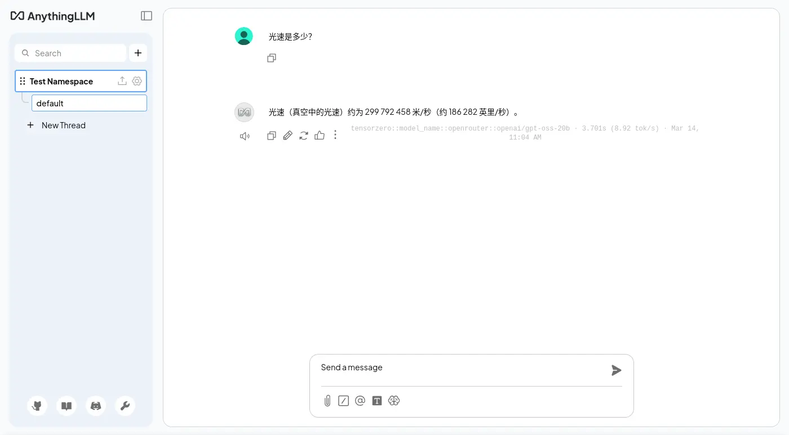
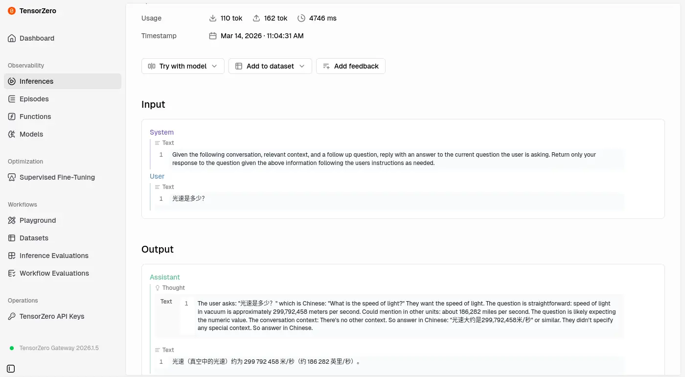
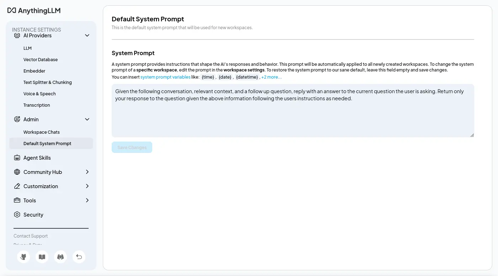
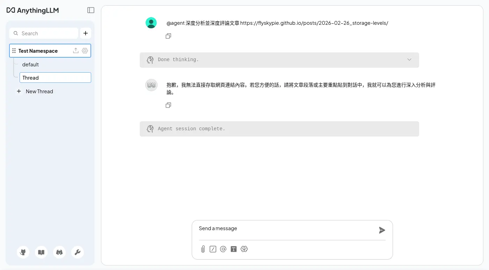
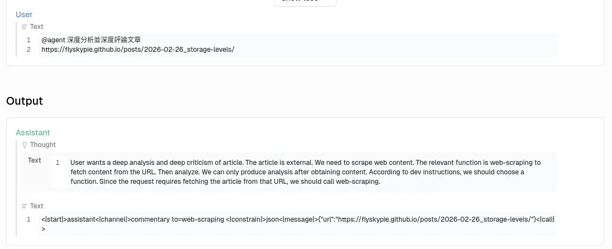
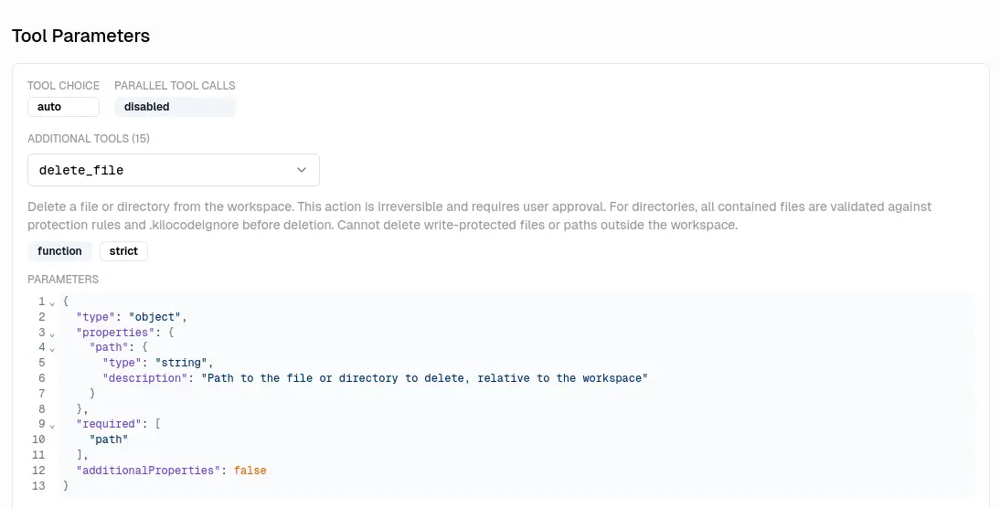
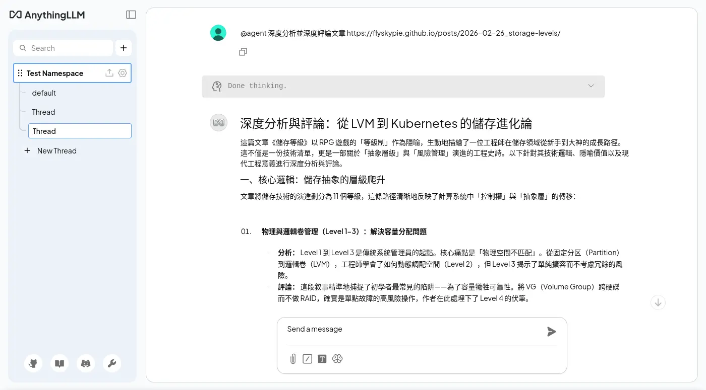
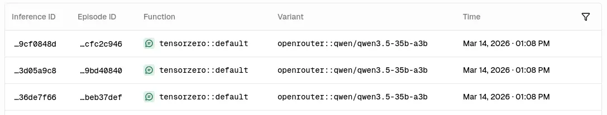

# 不正經 LLM APP 調查：AnythingLLM

## 前情提要

作為一個閃亮事物症候群工程屍，挖坑從來不手軟，[TiddlyRAG](https://github.com/FlySkyPie/tiddlyrag-planning) 是一個新坑，主要是關於 RAG (Retrieval-augmented generation)，於是我想先調查一下市面上的開源專案怎麼呈現 RAG 的。

找著找著發現一個不錯的[清單](https://github.com/av/awesome-llm-services)，於是想說從中把能跑得都跑過一遍吧！話雖如此，對我而言有幾個前提條件：

1. 是 Web App

基於 HTTP 的應用程式對我而言才有參考價值，因此桌面應用程式 (Desktop App) 或終端機應用 (TUI) 不在評估範圍內。

2. 有預編 OCI (Open Container Initiative) 映像檔

我的標準環境是 Dcoker/kubernetes，並且我也不想額外自行編譯映像檔，因此：只支援透過 uv/pip 安裝的 Python 軟體或是有提供 Dockerfile 但是沒有預編的方案同樣不考慮。

3. 有 RAG 機制

RAG 是我這次主要想觀察的功能，也就是匯入/上傳檔案、嵌入、檢索...，其他類型的 LLM 應用程式我暫時不列入考慮。話是這麼說，不過要是我下載之後才發現不具備 RAG 功能，還是會寫個簡單的紀錄。

## 評測與調查重點

以上是大前提，接著是評估的面向：

1. OCI 層分析

因為我的無線網路環境有點惡劣，根據經驗單層超過 1GB 的 OCI 映像檔幾乎都拉不下來。另外如果單一映像檔過大，在微服務架構下的自動擴展機制會不夠友善，因為載入與啟動時間比較長。所以 OCI 大小以及分層尺寸是我會考慮的其中一點。

:::info
實際上還是可以透過 [regclient](https://github.com/regclient/regclient) 的 `regctl` 指令修改 chunk 大小下載下來，只是會繞過我的 Homelab 本地快取/鏡像機制，所以視同拉不下來。
:::

2. 微服務編排與重用

雲原生環境會透過切割 OCI 的方式實現職責分離，並且往往會重複使用一些組件，例如：SQL 資料庫、S3 實例、記憶體快取...。一方面是透過職責分離，確保使用的是足夠成熟的方案，而不是自行研發；二方面是透過特定的界面整合實現解偶，可以視情況抽換實做（如：自用輕量 vs 商用可靠）。這個 LLM 應用程式是屬於微服務架構還是單體式架構也是我的觀察重點之一。

3. 嵌入資料可維護性

就算不談 RAG 這樣的現代系統，在傳統 ETL (Extract, Transform, Load) 的領域中，資料的可追朔、可審計是基本中的基本。更別提對 RAG 這樣的系統而言，可靠度高度受到資料庫的品質影響。

4. 提示詞與 LLM 呼叫策略

關於 LLM 可觀測性 (Observability)，也就是觀察應用程式的提示詞，過去我寫了幾篇相關的文章提及：

- [個人關於如何佈署與使用類神經演算法的一些想法 (2026-02-02)](https://flyskypie.github.io/blog/2026-02-02_llm-using-approach/)
- [LLM 可觀測筆記 (2026-01-08)](https://flyskypie.github.io/posts/2026-01-08_llm-observability/)
- [花式打 LLM (2025-10-05)](https://flyskypie.github.io/posts/2025-10-05_llm-api-chain/)

不過一直沒有系統性的紀錄下來，趁這個機會好好的寫下來吧。

## AnythingLLM

### OCI 構成

<details>
  <summary>`podman image tree`</summary>

```shell
podman image tree docker.io/mintplexlabs/anythingllm:1.11.0
Image ID: ff8367ba40cb
Tags:     [docker.io/mintplexlabs/anythingllm:1.11.0]
Size:     3.162GB
Image Layers
├── ID: e8bce0aabd68 Size: 80.64MB
├── ID: 9e7e2ecd31b0 Size: 1.024kB
├── ID: 3228a4f46016 Size: 1.179GB
├── ID: 7282d320f8f9 Size: 24.58kB
├── ID: c5ee10132db1 Size: 4.608kB
├── ID: 90a5b49ea903 Size: 3.584kB
├── ID: 42577cf50556 Size: 17.92kB
├── ID: 14c973612c97 Size: 3.584kB
├── ID: b6a11ed79c58 Size: 1.024kB
├── ID: d7f4147261e4 Size: 1.024kB
├── ID: d35130223185 Size: 2.908MB
├── ID: 5a8262e26991 Size: 1.024kB
├── ID: 7c2038cbfeb5 Size: 964.3MB
├── ID: 8f041fd68349 Size: 1.024kB
├── ID: ab54a4950e52 Size: 484.4kB
├── ID: 647fb5404ce3 Size: 1.024kB
├── ID: 40c5efdad8a9 Size: 921.2MB
├── ID: 63204dd64df9 Size: 1.024kB
├── ID: 58d9f478d9ba Size: 1.024kB
└── ID: 42428f8f7df8 Size: 12.48MB Top Layer of: [docker.io/mintplexlabs/anythingllm:1.11.0]
```
</details>

映像檔整體約為 3GB，但是單層不超過 1GB。

### 簡單對話





預設系統提示詞是可以修改的：



### URL 訪問能力

第一次測試是失敗的，



不知道為什麼沒有回應正確的格式：




<details>
  <summary>失敗的後台紀錄：</summary>
```
[anythingllm] | [backend] info: [AgentLLM - tensorzero::model_name::openrouter::openai/gpt-oss-20b] Untooled.stream - will process this chat completion.
[anythingllm] | [backend] info: [AgentLLM - tensorzero::model_name::openrouter::openai/gpt-oss-20b] Invalid function tool call: Missing name or arguments in function call..
[anythingllm] | [backend] info: [AgentLLM - tensorzero::model_name::openrouter::openai/gpt-oss-20b] Will assume chat completion without tool call inputs
```
</details>

是 `openai/gpt-oss-20b` 的性能太差勁還是提示詞下太爛？

是說 OpenAI API 明明就支援直接傳入工具，不知道開發者在想什麼。



這是目前 Agentic Programing （俗稱 Vibe Coding） 的標準實現方式的說。

---

換成貴一點的模型（`qwen/qwen3.5-35b-a3b`）就可以運作了：



主要分成兩次呼叫，我不知道為什麼其中一個重複了兩次，



<details>
  <summary>系統提示詞：</summary>

系統提示詞一：

```
You are a program which picks the most optimal function and parameters to call.
      DO NOT HAVE TO PICK A FUNCTION IF IT WILL NOT HELP ANSWER OR FULFILL THE USER'S QUERY.
      When a function is selection, respond in JSON with no additional text.
      When there is no relevant function to call - return with a regular chat text response.
      Your task is to pick a **single** function that we will use to call, if any seem useful or relevant for the user query.

      All JSON responses should have two keys.
      'name': this is the name of the function name to call. eg: 'web-scraper', 'rag-memory', etc..
      'arguments': this is an object with the function properties to invoke the function.
      DO NOT INCLUDE ANY OTHER KEYS IN JSON RESPONSES.

      Here are the available tools you can use an examples of a query and response so you can understand how each one works.
      -----------
Function name: rag-memory
Function Description: Search against local documents for context that is relevant to the query or store a snippet of text into memory for retrieval later. Storing information should only be done when the user specifically requests for information to be remembered or saved to long-term memory. You should use this tool before search the internet for information. Do not use this tool unless you are explicitly told to 'remember' or 'store' information.
Function parameters in JSON format:
{
    "action": {
        "type": "string",
        "enum": [
            "search",
            "store"
        ],
        "description": "The action we want to take to search for existing similar context or storage of new context."
    },
    "content": {
        "type": "string",
        "description": "The plain text to search our local documents with or to store in our vector database."
    }
}
Query: "What is AnythingLLM?"
JSON: {"name":"rag-memory","arguments":{"action":"search","content":"What is AnythingLLM?"}}
Query: "What do you know about Plato's motives?"
JSON: {"name":"rag-memory","arguments":{"action":"search","content":"What are the facts about Plato's motives?"}}
Query: "Remember that you are a robot"
JSON: {"name":"rag-memory","arguments":{"action":"store","content":"I am a robot, the user told me that i am."}}
Query: "Save that to memory please."
JSON: {"name":"rag-memory","arguments":{"action":"store","content":"<insert summary of conversation until now>"}}
-----------
-----------
Function name: document-summarizer
Function Description: Can get the list of files available to search with descriptions and can select a single file to open and summarize.
Function parameters in JSON format:
{
    "action": {
        "type": "string",
        "enum": [
            "list",
            "summarize"
        ],
        "description": "The action to take. 'list' will return all files available with their filename and descriptions. 'summarize' will open and summarize the file by the a document name."
    },
    "document_filename": {
        "type": "string",
        "x-nullable": true,
        "description": "The file name of the document you want to get the full content of."
    }
}
Query: "Summarize example.txt"
JSON: {"name":"document-summarizer","arguments":{"action":"summarize","document_filename":"example.txt"}}
Query: "What files can you see?"
JSON: {"name":"document-summarizer","arguments":{"action":"list","document_filename":null}}
Query: "Tell me about readme.md"
JSON: {"name":"document-summarizer","arguments":{"action":"summarize","document_filename":"readme.md"}}
-----------
-----------
Function name: web-scraping
Function Description: Scrapes the content of a webpage or online resource from a provided URL.
Function parameters in JSON format:
{
    "url": {
        "type": "string",
        "format": "uri",
        "description": "A complete web address URL including protocol. Assumes https if not provided."
    }
}
Query: "What is anythingllm.com about?"
JSON: {"name":"web-scraping","arguments":{"url":"https://anythingllm.com"}}
Query: "Scrape https://example.com"
JSON: {"name":"web-scraping","arguments":{"url":"https://example.com"}}
-----------


      Now pick a function if there is an appropriate one to use given the last user message and the given conversation so far.
```

系統提示詞二：

```
Given the following conversation, relevant context, and a follow up question, reply with an answer to the current question the user is asking. Return only your response to the question given the above information following the users instructions as needed.
```
</details>

關於呼叫工具，兩次 LLM 的回應一次給 「包含 JSON Code 的 Markdown」另外一次給「JSON」，不知道是不是重複呼叫的原因。

<details>
  <summary>後台紀錄：</summary>
```
[anythingllm] | [backend] info: [AgentLLM - tensorzero::model_name::openrouter::qwen/qwen3.5-35b-a3b] Untooled.stream - will process this chat completion.
[anythingllm] | [backend] info: [AgentLLM - tensorzero::model_name::openrouter::qwen/qwen3.5-35b-a3b] Valid tool call found - running web-scraping.
[anythingllm] | [backend] info: [AgentHandler] [debug]: @agent is attempting to call `web-scraping` tool {
[anythingllm] |   "url": "https://flyskypie.github.io/posts/2026-02-26_storage-levels/"
[anythingllm] | }
[anythingllm] | [backend] info: [EncryptionManager] Loaded existing key & salt for encrypting arbitrary data.
[anythingllm] | [collector] info: -- Working URL https://flyskypie.github.io/posts/2026-02-26_storage-levels => (captureAs: text) --
[anythingllm] | [collector] info: -- URL determined to be text/html (web) --
[anythingllm] | [backend] info: [TokenManager] Initialized new TokenManager instance for model: tensorzero::model_name::openrouter::qwen/qwen3.5-35b-a3b
[anythingllm] | [backend] info: [AgentLLM - tensorzero::model_name::openrouter::qwen/qwen3.5-35b-a3b] Untooled.stream - will process this chat completion.
[anythingllm] | [backend] info: [AgentLLM - tensorzero::model_name::openrouter::qwen/qwen3.5-35b-a3b] Cannot call web-scraping again because an exact duplicate of previous run of web-scraping.
[anythingllm] | [backend] info: [AgentLLM - tensorzero::model_name::openrouter::qwen/qwen3.5-35b-a3b] Will assume chat completion without tool call inputs.
[anythingllm] | [backend] info: [TELEMETRY SENT] {"event":"agent_chat_sent","distinctId":"9d1b8903-e002-42b7-8ea2-222fedeec43e","properties":{"runtime":"docker"}}
[anythingllm] | prisma:info Starting a sqlite pool with 25 connections.
[anythingllm] | [backend] info: [113:248]: No direct uploads path found - exiting.
[anythingllm] | [bg-worker][cleanup-orphan-documents] info: [113:248]: No direct uploads path found - exiting.
[anythingllm] | [backend] warn: Child process exited with code 0 and signal null
[anythingllm] | [backend] info: Worker for job "cleanup-orphan-documents" exited with code 0
[anythingllm] | [backend] info: Client took too long to respond, chat thread is dead after 300000ms
[anythingllm] | [backend] info: [AgentHandler] End 7f77b729-bd0c-4f8d-8cb1-df5eeed30117::generic-openai:tensorzero::model_name::openrouter::qwen/qwen3.5-35b-a3b
```
</details>

### 編排與構成


### 實作程序關閉

是否有實作 Graceful Shutdown？ 否。

如果程式有實作 Graceful Shutdown，它會監聽 SIGTERM 訊號，並且在收到後開始進入資源釋放流程；反之，如果沒有實做就會觀察到「下達容器關閉指令沒有反應，直到超時被服務強制中止」：

```shell
exit code: 137

WARN[0010] StopSignal SIGTERM failed to stop container anythingllm_anythingllm_1 in 10 seconds, resorting to SIGKILL
```

## 雜談

本來標題是想起個「評測」之類的，只是感覺這代表覆蓋的面向要足夠多，還要有可以量化的指標 (benchmark) 之類的，但是我只是想根據自己自己的需求「簡單翻閱一下」。

加上我在意的面向通常也不是一般使用者會在意的部份，如果看到「OOXX 評測」開開心心的點進來文章卻發現跟想像的不一樣這樣失望的話，那會有一點對不起讀者，所以最後給了一個「不正經」的標題，畢竟以一般 LLM 使用者的角度，我調查的點的確蠻不正經的。
