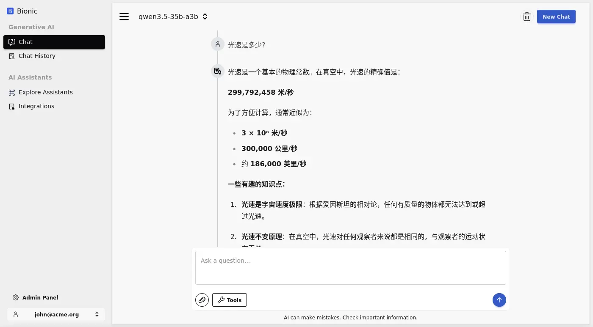
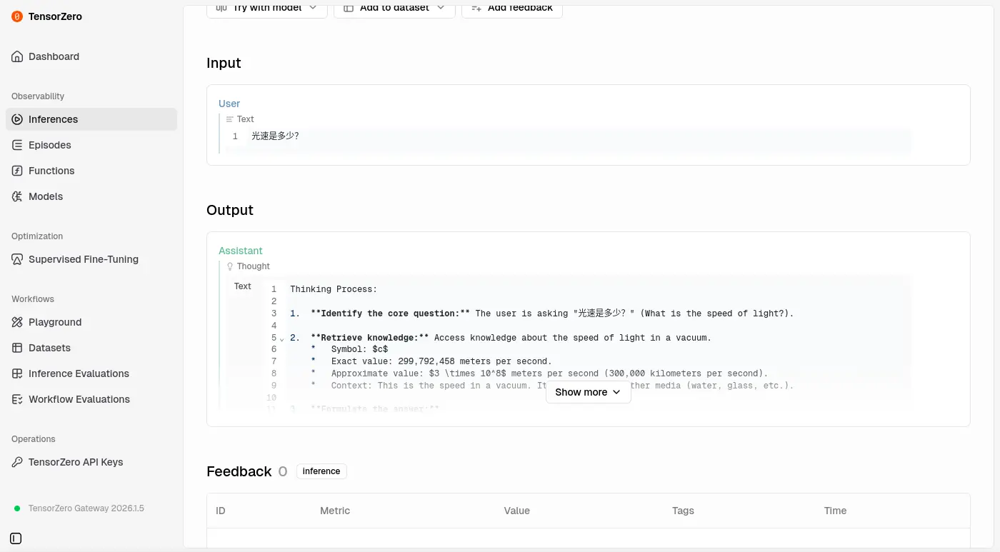
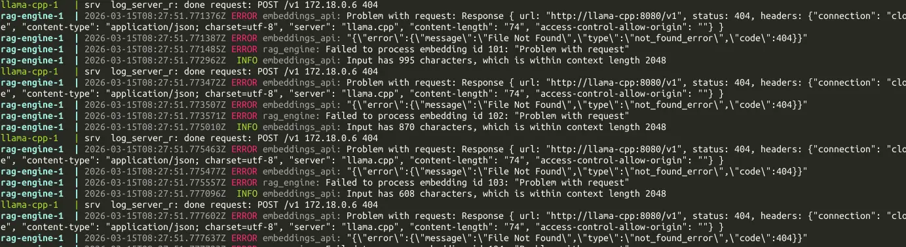
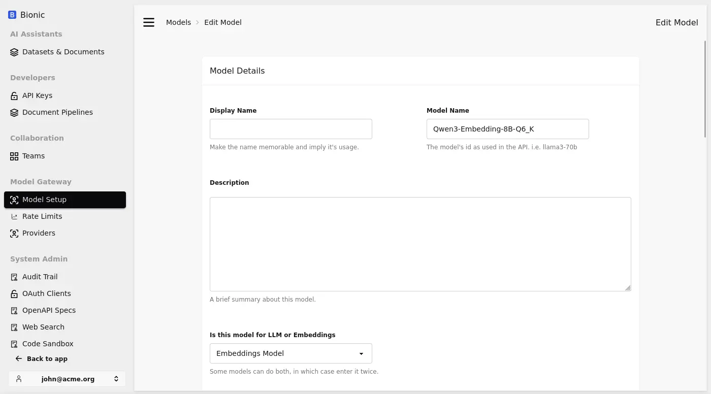
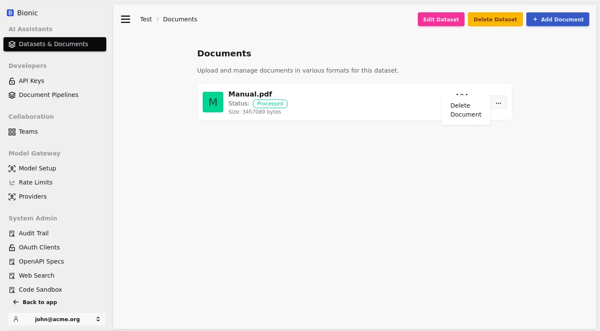
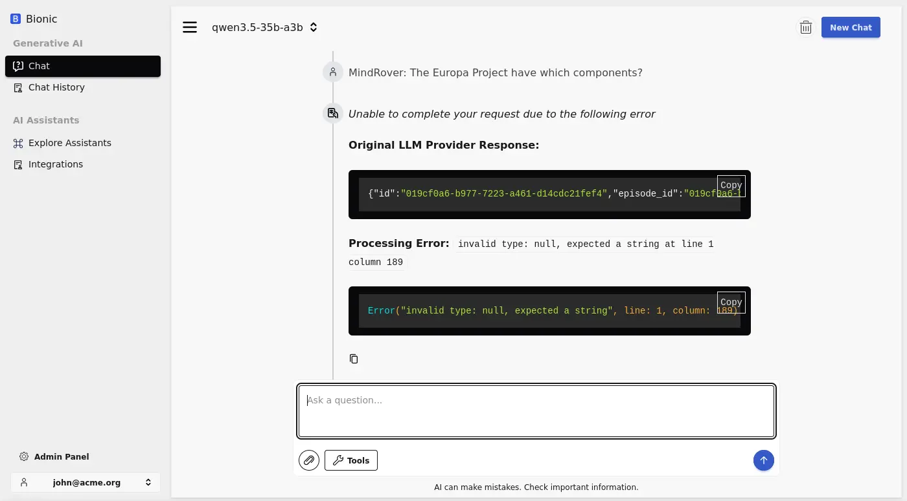

# 不正經 LLM APP 調查：Bionic

## 前情提要

想著調查一些 LLM 應用程式的 RAG 功能，關於調查的方向跟基準請見前一篇文章，不在此贅述：

[不正經 LLM APP 調查：AnythingLLM](https://flyskypie.github.io/posts/2026-03-14_anything-llm-survey/)

同系列其他調查文：

- [不正經 LLM APP 調查：AstrBot](https://flyskypie.github.io/posts/2026-03-15_astr-bot-survey/)

## OCI 構成

<details>
  <summary>`podman image tree`</summary>

```shell
podman image tree ghcr.io/bionic-gpt/bionicgpt-rag-engine:1.12.7
Image ID: 7b914d4ccbf8
Tags:     [ghcr.io/bionic-gpt/bionicgpt-rag-engine:1.12.7]
Size:     9.937MB
Image Layers
├── ID: 8468301206b4 Size: 9.715MB
└── ID: e887fadf887c Size: 220.2kB Top Layer of: [ghcr.io/bionic-gpt/bionicgpt-rag-engine:1.12.7]
```

```shell
podman image tree ghcr.io/bionic-gpt/bionicgpt:1.12.7
Image ID: 5669ca6f653a
Tags:     [ghcr.io/bionic-gpt/bionicgpt:1.12.7]
Size:     54.33MB
Image Layers
├── ID: 9ab36a216af2 Size: 48.52MB
├── ID: b453fb72ddf0 Size: 5.514MB
├── ID: 2b47f8765773 Size:  72.7kB
└── ID: bce47b0fc4f9 Size: 220.2kB Top Layer of: [ghcr.io/bionic-gpt/bionicgpt:1.12.7]
```
</details>

意思是因為用 Rust 實做的關係，映像檔構成都不大。

## 簡單對話



沒有系統提示詞，快速翻閱也沒有找到設定的地方：



## 嵌入文件

`bionicgpt-rag-engine` 組件疑似有 hardcode 測試值作為預設值：


`doc-engine` 服務我一開始是拿掉的因為有「教學使用」的註解，然後 YAML 上也看不到其他服務參考它，沒想到是必要元件。

API 風格不一致：



LLM 使用 `/v1` 結尾，嵌入模型則是使用 `/v1/embeddings` 結尾，因此第一次設定成 `/v1` 不能運作。

想要編輯嵌入模型的資訊時，資料會丟失：



嵌入之後沒辦法預覽文字塊：



## 檢索知識

不確定要如何觸發 RAG 檢索，而且會有不明錯誤：



## 編排與構成

官方文件缺少關於 Docker 組態以及持久化的說明，畢竟看網站開發者的目的主要是賣錢，開源只是順便得。

不知道為什麼在官方的組態中，向量資料庫使用 `docker.io/ankane/pgvector:v0.5.1` 這個非常舊的映像檔（2024 年上傳）。

## 實作程序關閉

是否有實作 Graceful Shutdown？ 否。

## 小結

- https://github.com/bionic-gpt/bionic-gpt
  - 2.3k ⭐

星星數似乎已經訴說著這個專案的水準，槽點已經多到有一些問題我懶得提出來了，不過作為~~開源糞作獵人~~豈有停下腳步的道理？看遺一分糞作長一分經驗。
