# 不正經 LLM APP 調查：kotaemon

<head>
  <meta property="og:image" content="https://raw.githubusercontent.com/FlySkyPie/flyskypie.github.io/main/post/2026-03-16_kotaemon/14_rag.webp" />
</head>

## 前情提要

想著調查一些 LLM 應用程式的 RAG 功能，關於調查的方向跟基準請見前一篇文章，不在此贅述：

[不正經 LLM APP 調查：AnythingLLM](https://flyskypie.github.io/posts/2026-03-14_anything-llm-survey/)

同系列其他調查文：

- [不正經 LLM APP 調查：AstrBot](https://flyskypie.github.io/posts/2026-03-15_astr-bot-survey/)
- [不正經 LLM APP 調查：Bionic](https://flyskypie.github.io/posts/2026-03-15_bionic-gpt/)
- [不正經 LLM APP 調查：LibreChat](https://flyskypie.github.io/posts/2026-03-16_libre-chat/)
- [不正經 LLM APP 調查：LobeHub](https://flyskypie.github.io/posts/2026-03-16_lobehub/)

## OCI 構成

<details>
  <summary>`podman image tree`</summary>

```shell
podman image tree ghcr.io/cinnamon/kotaemon:0.11.0-full 
Image ID: 74d5df3245d9
Tags:     [ghcr.io/cinnamon/kotaemon:0.11.0-full]
Size:     6.548GB
Image Layers
├── ID: 1bb35e8b4de1 Size: 77.88MB
├── ID: 353fe48ef9d7 Size: 9.561MB
├── ID: 82b4b4274b1a Size: 44.84MB
├── ID: d638946917f2 Size:  5.12kB
├── ID: 04c0a0d2e22a Size: 841.8MB
├── ID: aeb378591839 Size: 1.536kB
├── ID: 5fd7d86f70a2 Size: 4.096kB
├── ID: aed840e6f7fe Size: 4.096kB
├── ID: 92333158b865 Size: 16.69MB
├── ID: 0bf855215466 Size: 17.63MB
├── ID: 2235373e4fb4 Size: 1.024kB
├── ID: 45504146ffa4 Size: 4.096kB
├── ID: 8402ed8b9654 Size: 2.006GB
├── ID: 764658892e4b Size: 591.2MB
├── ID: 184d088eca1f Size:  7.68kB Top Layer of: [ghcr.io/cinnamon/kotaemon:0.11.0-lite]
├── ID: cf40a4fad18d Size: 868.5MB
├── ID: e67900442530 Size:   709MB
├── ID: 8c92b78037b8 Size: 723.4MB
├── ID: c4c98de4129d Size: 28.91MB
├── ID: 54f8511f72bc Size: 596.6MB
├── ID: f5e4b450a048 Size: 15.28MB
└── ID: 4f1b040c4c99 Size:  7.68kB Top Layer of: [ghcr.io/cinnamon/kotaemon:0.11.0-full]
```
</details>

單一映像檔 6.548GB，最大一層 2GB，有趣的是有切一個 Lite 版本。

## 簡單對話

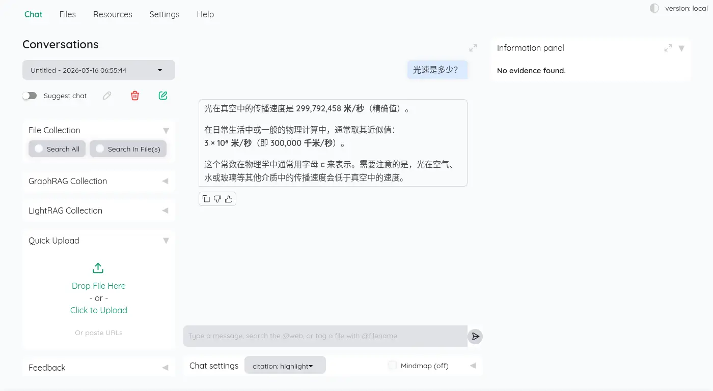

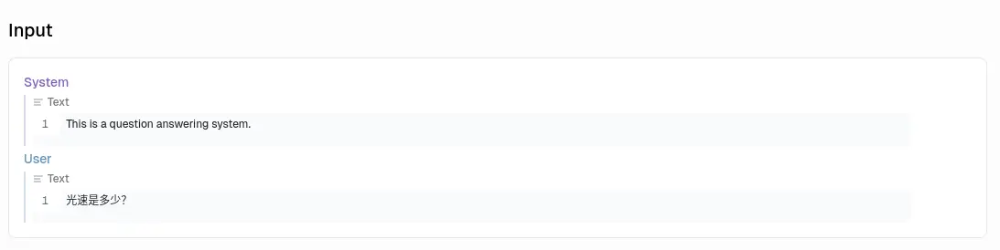

同有有對話標題生成，這裡採用的策略有點有趣：

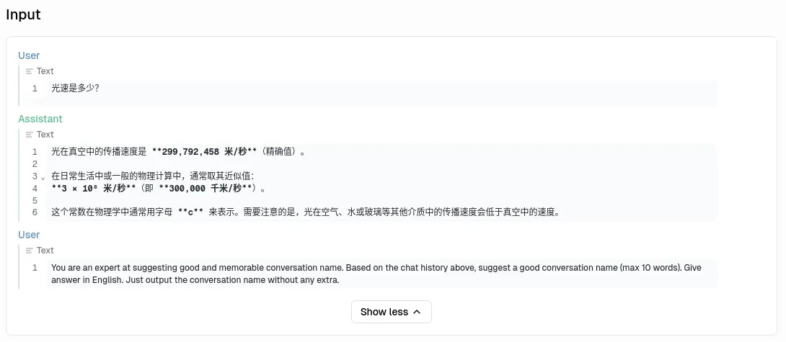

系統提示詞可以設定：

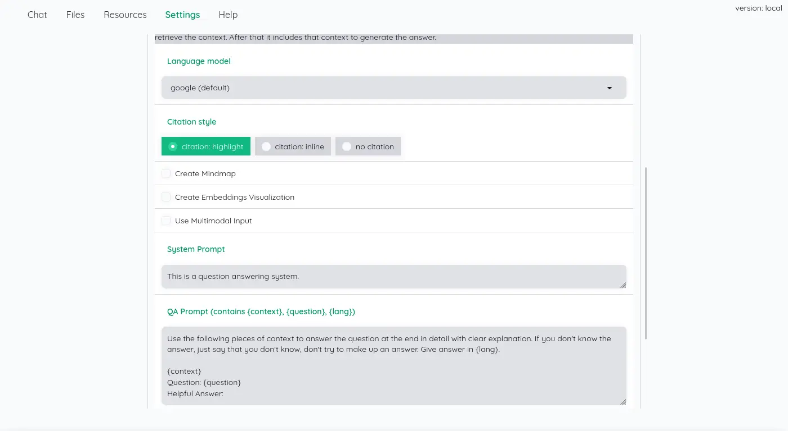

## 嵌入文件

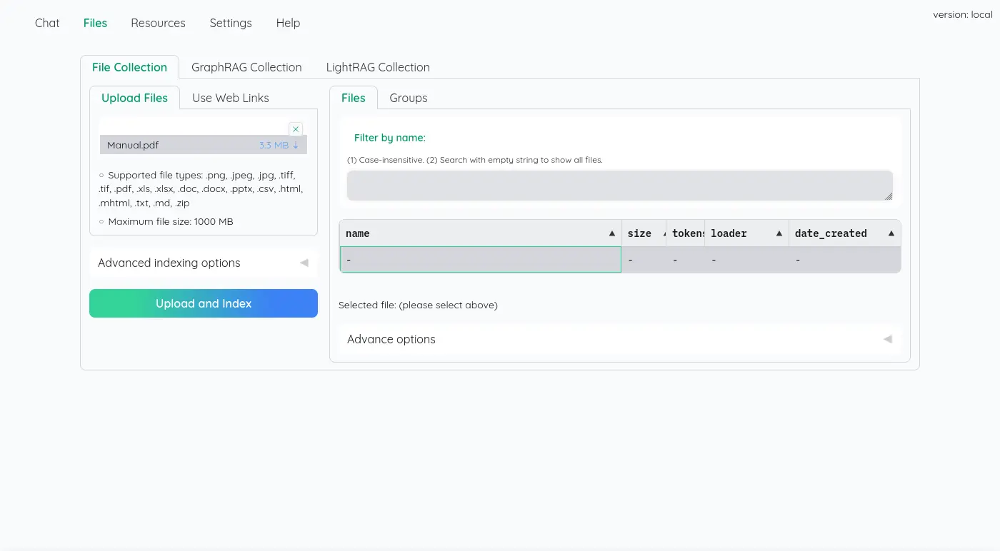

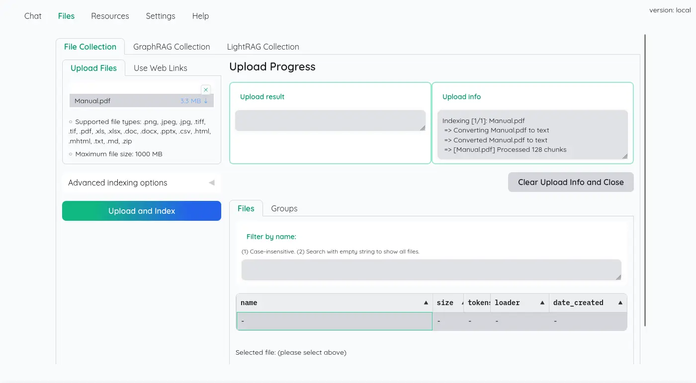

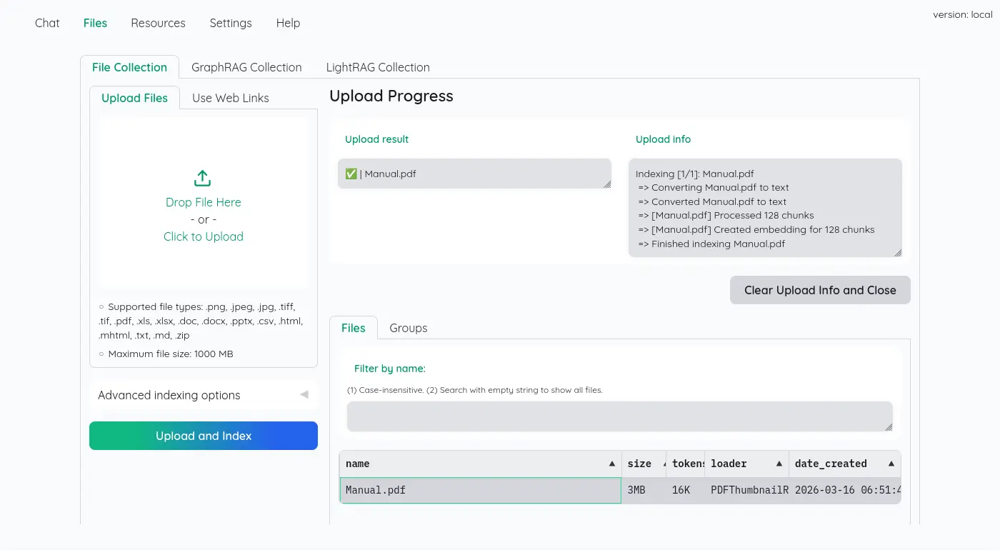

UI 雖然很簡陋，但是可以看到所有切割的字串塊：

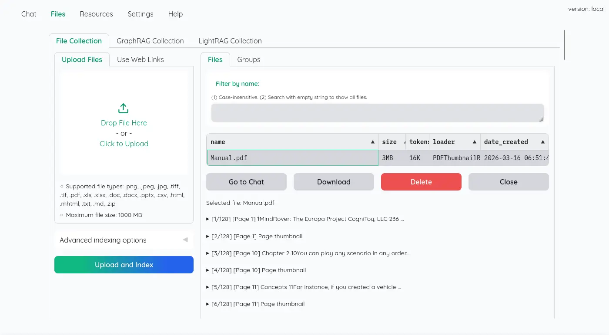

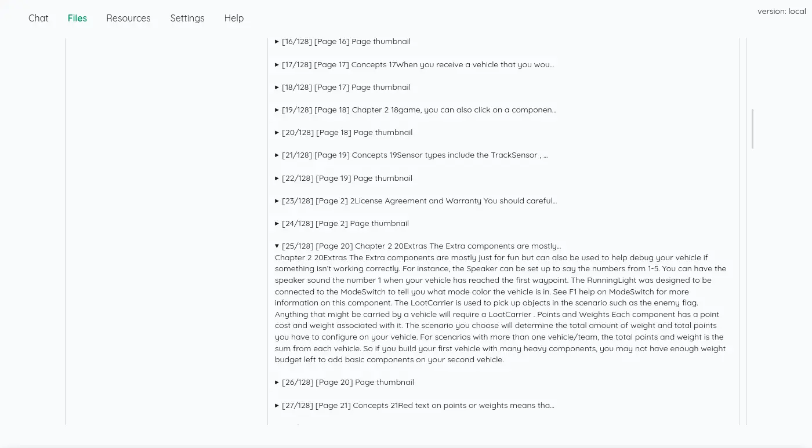

## 檢索知識

右邊會顯示參考資料：

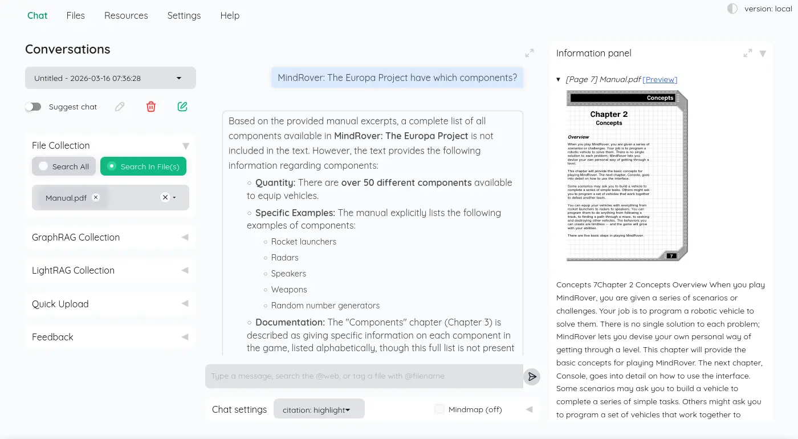

被提示詞「Give answer in English.」約束，輸入中文還是回答英文：

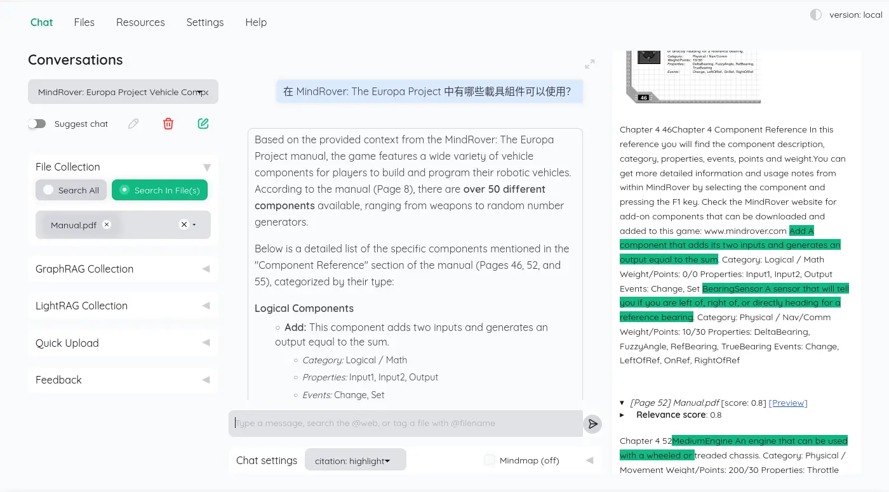

翻了一下 LLM 紀錄，一次 RAG 有 13 次 LLM 請求，一個是標題摘要：

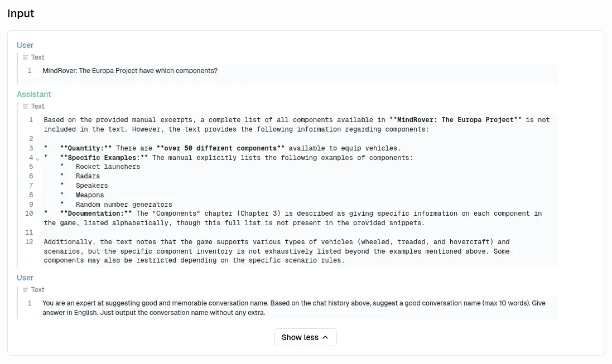

其中 10 次是針對每一個資料塊進行評分：

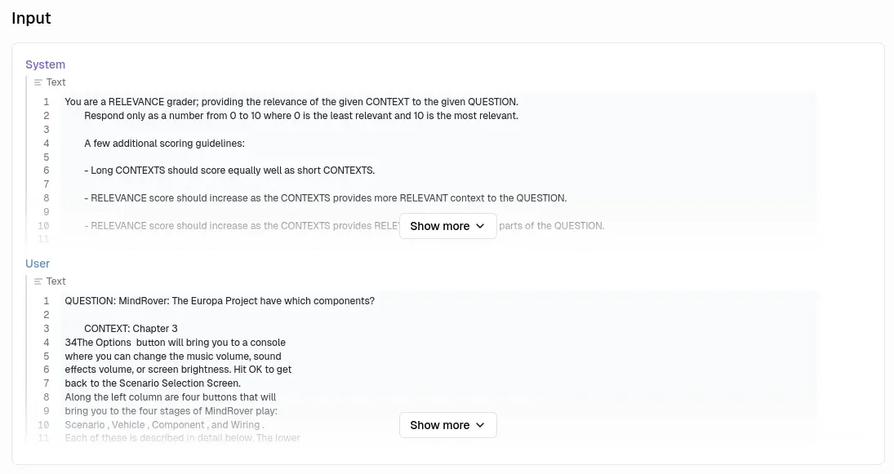

其中一次是呼叫工具：

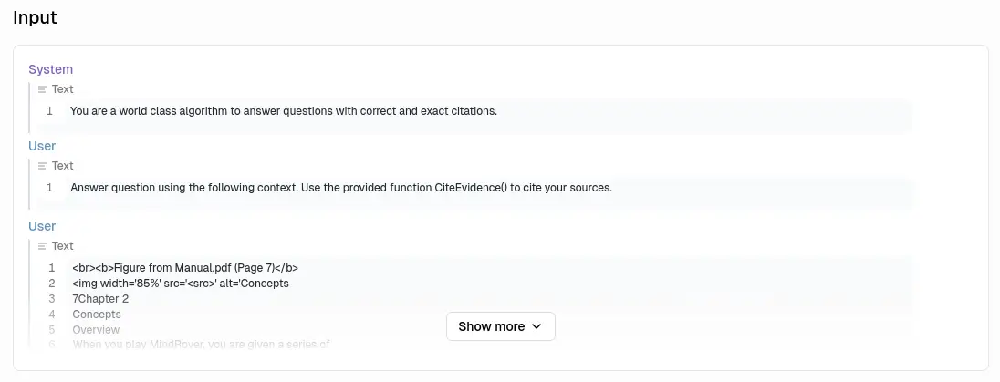

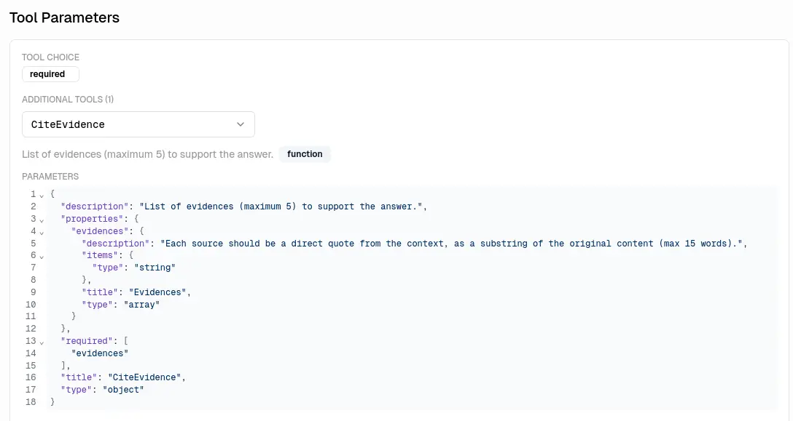

最後是總結：

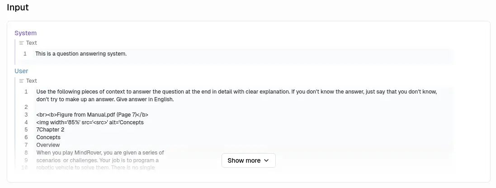

## 編排與構成

<details>
  <summary>`docker-compose.yaml`</summary>

```yaml
services:
  kotaemon:
    image: ghcr.io/cinnamon/kotaemon:0.11.0-full 
    environment:
      - GRADIO_SERVER_NAME=0.0.0.0
      - GRADIO_SERVER_PORT=7860
    volumes:
      - kotaemon-data:/app/ktem_app_data
    ports:
      - 7860:7860

  llama-cpp:
    image: ghcr.io/ggml-org/llama.cpp:server-vulkan
    restart: always
    devices:
      - /dev/dri/:/dev/dri/
    ports:
      - 8080:8080
    entrypoint: /app/llama-server
    environment:
      - HF_ENDPOINT=http://huggingface.mirrors.solid.arachne
    volumes:
      - llama-cpp-cache:/root/.cache/llama.cpp
    command:
      - --hf-repo 
      - Qwen/Qwen3-Embedding-8B-GGUF
      - --hf-file 
      - Qwen3-Embedding-8B-Q6_K.gguf
      - --embeddings 
      - --pooling 
      - mean
      - --ctx-size
      - "2048" 
      - --batch-size
      - "1024"
      - --ubatch-size
      - "2048" 
      - --gpu-layers
      - "999" 
      - --flash-attn
      - on 
      - --no-webui
    healthcheck:
      test: ["CMD", "curl", "-f", "http://localhost:8080/health"]
      interval: 10s
      timeout: 20s
      retries: 3

volumes:
  kotaemon-data:
  llama-cpp-cache:
```
</details>

雖然不是這一系列評測的重點，不過我覺得這個設計值得提一下，我認為 kotaemon 蠻優雅的處理不同的 AI 來源，它直接暴露 YAML 以及所有有效參數的說明：

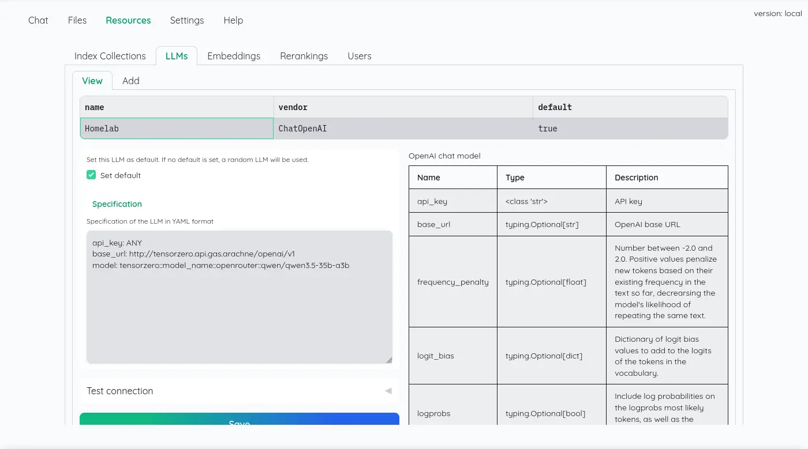

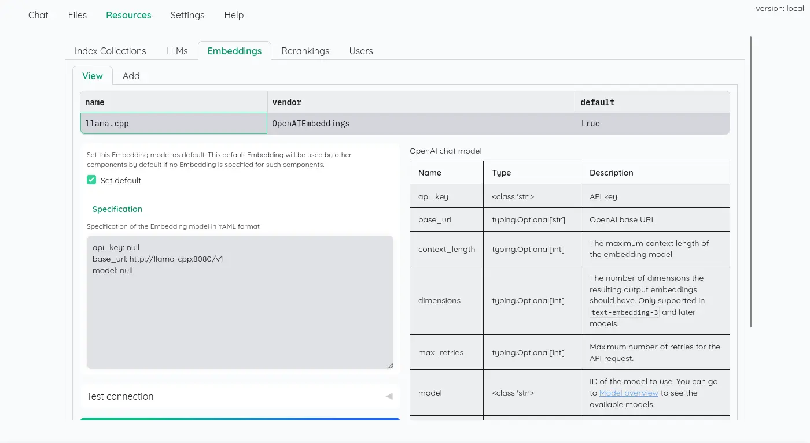

看起來是直接使用 LangChain 的實例：

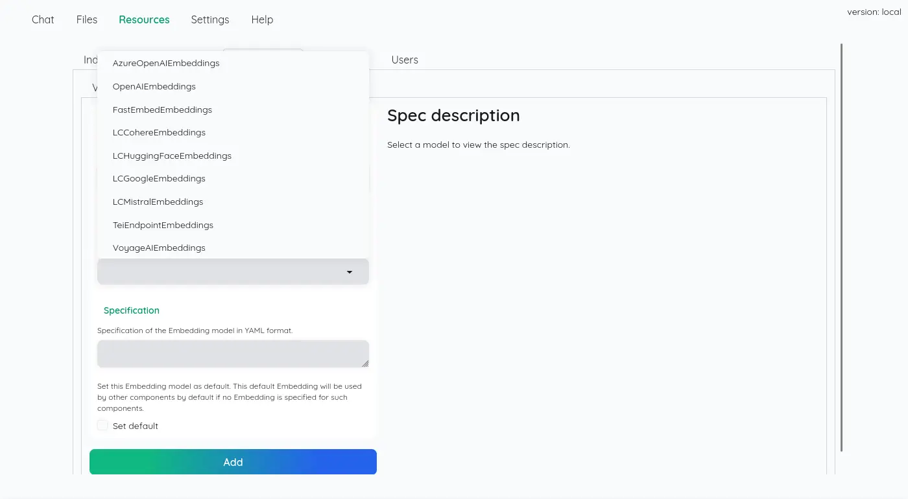

## 實作程序關閉

是否有實作 Graceful Shutdown？ 否。

```
kotaemon-1 exited with code 137
```
