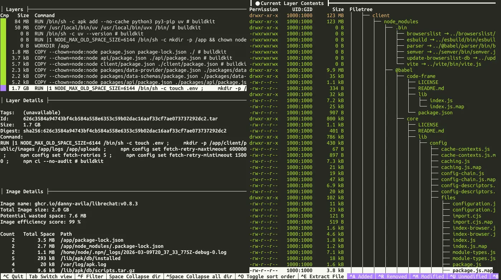
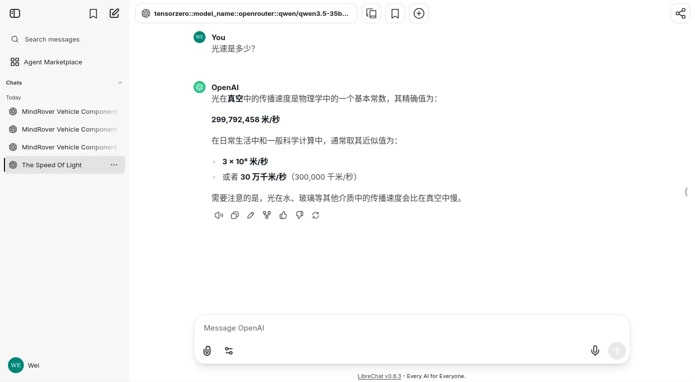
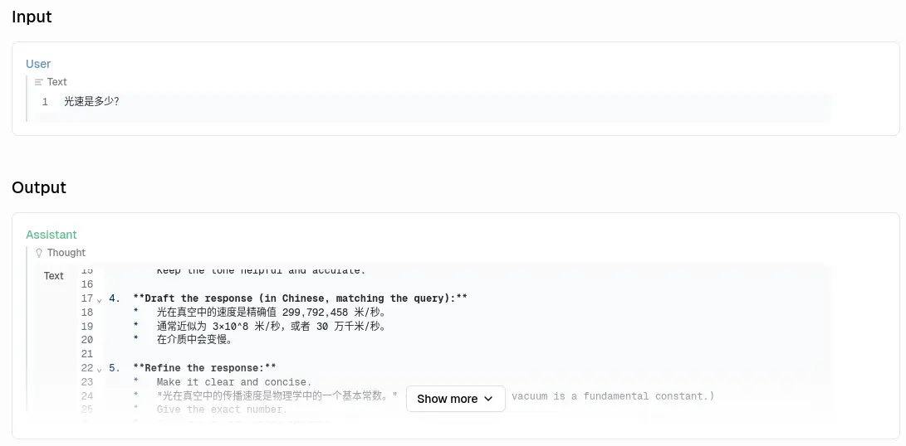
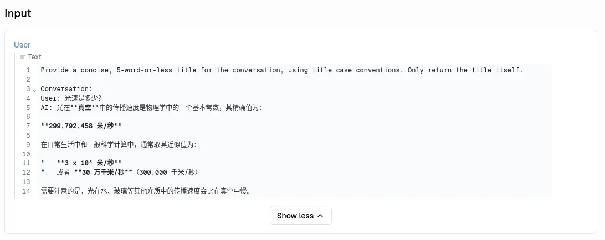
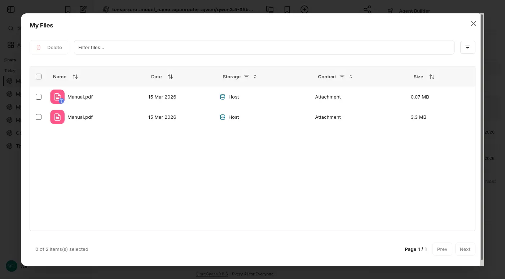
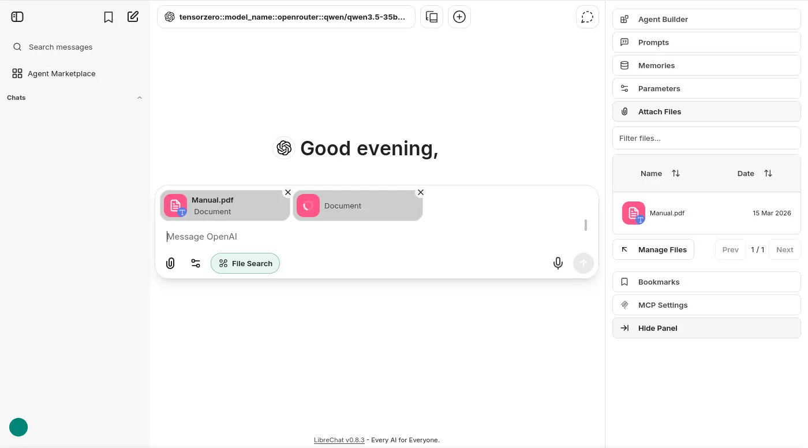

# 不正經 LLM APP 調查：LibreChat

## OCI 構成

<details>
  <summary>`podman image tree`</summary>

```shell
$ podman image tree ghcr.io/danny-avila/librechat:v0.8.3
Image ID: db02d9011e1e
Tags:     [ghcr.io/danny-avila/librechat:v0.8.3]
Size:     2.201GB
Image Layers
├── ID: 989e799e6349 Size: 8.724MB
├── ID: 6758d7b35d86 Size:   124MB
├── ID: 333310cf910c Size: 5.389MB
├── ID: d29cbceffa1f Size: 3.584kB
├── ID: 935b10faad71 Size: 624.1kB
├── ID: 1659844c9896 Size: 86.56MB
├── ID: 2adf2e4404c0 Size: 50.48MB
├── ID: 880e8eea9c5e Size: 1.024kB
├── ID: ab8949522823 Size: 1.536kB
├── ID: b71ecaa26171 Size: 1.024kB
├── ID: a47335e9373a Size: 1.763MB
├── ID: 4d4581101e46 Size: 6.656kB
├── ID: cbfbdba828ac Size: 8.704kB
├── ID: 999156c3e462 Size: 5.632kB
├── ID: a06c4078ab7d Size: 5.632kB
├── ID: 1cb7320dde2b Size: 8.704kB
├── ID: e81caf326165 Size: 1.857GB
├── ID: d7bc0ff01085 Size:  21.7MB
└── ID: 2cda3d91d984 Size: 44.34MB Top Layer of: [ghcr.io/danny-avila/librechat:v0.8.3]
```

```shell
podman image tree ghcr.io/danny-avila/librechat-rag-api-dev-lite:v0.7.2
Image ID: bbfc3176d88a
Tags:     [ghcr.io/danny-avila/librechat-rag-api-dev-lite:v0.7.2]
Size:     1.628GB
Image Layers
├── ID: a257f20c716c Size: 81.04MB
├── ID: 1820c49e830a Size: 4.123MB
├── ID: 1e553be60c00 Size:  41.2MB
├── ID: a24335924e53 Size:  5.12kB
├── ID: 700e73441c4c Size: 1.536kB
├── ID: 573812830903 Size: 414.4MB
├── ID: 7458178c5deb Size: 3.072kB
├── ID: e160554a24aa Size: 1.063GB
├── ID: 14437fc54cb5 Size:  24.2MB
└── ID: 22b5883936f5 Size: 502.3kB Top Layer of: [ghcr.io/danny-avila/librechat-rag-api-dev-lite:v0.7.2]
```
</details>

`ghcr.io/danny-avila/librechat-rag-api-dev-lite:v0.7.2` 1.6GB，單層最多 1.1GB。

`ghcr.io/danny-avila/librechat:v0.8.3` 2.2GB，最大單層 1.86GB。稍微看了一下是 `npm ci` 安裝套件造成的，不過我理解的沒錯的話，主因是映像檔同時包含了前端的仰賴。



## 簡單對話



沒有系統提示詞：



但是有看到似乎可以修改提示詞的界面。

另外一次請求則是做總結來幫該次對話取一個標題：



## 上傳與嵌入文件

LibreChat 有兩種上傳方式：純文字與嵌入模式。



並且沒有實做類似知識庫的系統，只能在聊天視窗上傳：



## 檢索知識


## 編排與構成


## 實作程序關閉

```
LibreChat exited with code 0
rag_api exited with code 0
```

## 小結

