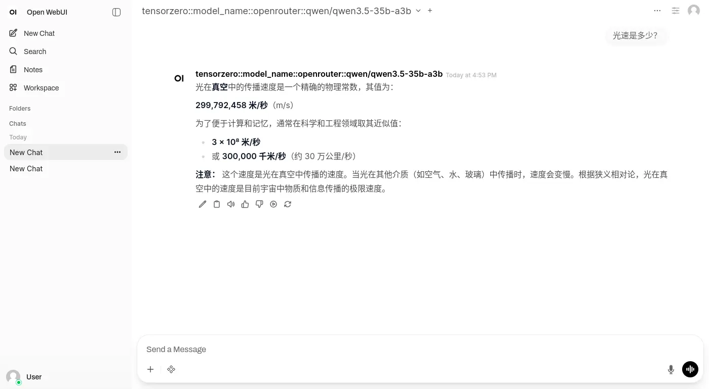
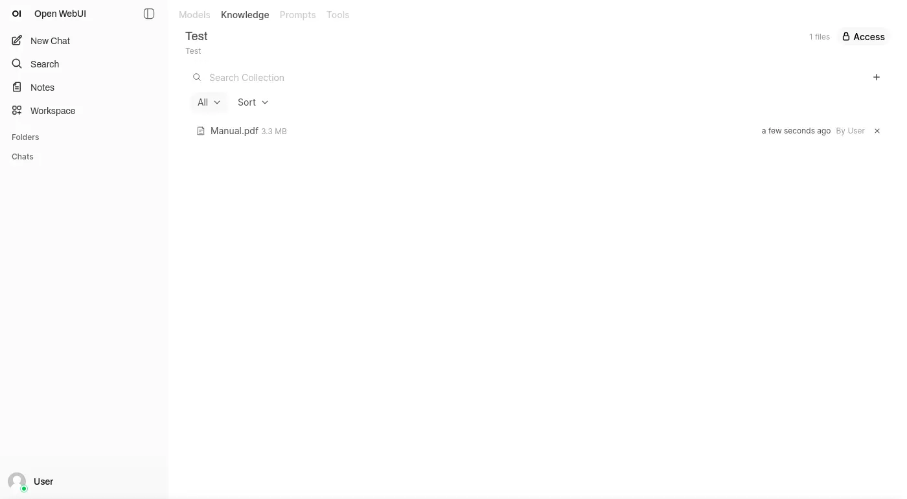
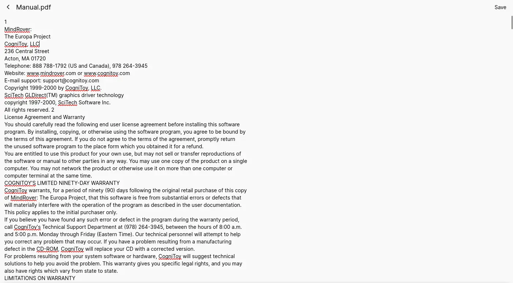
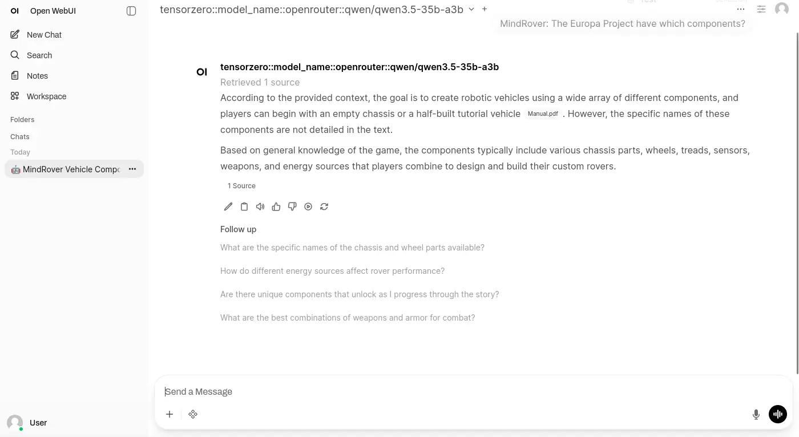
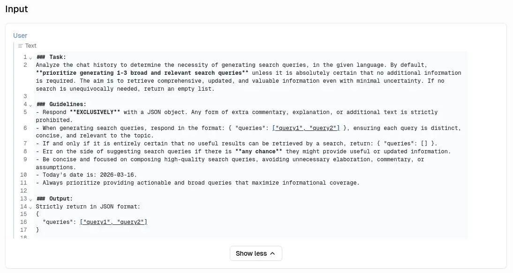
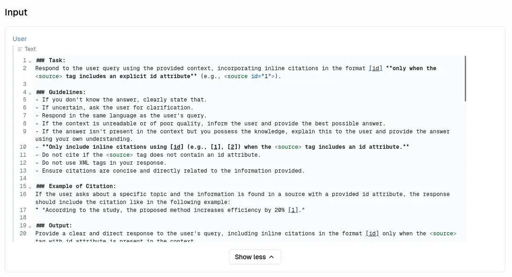
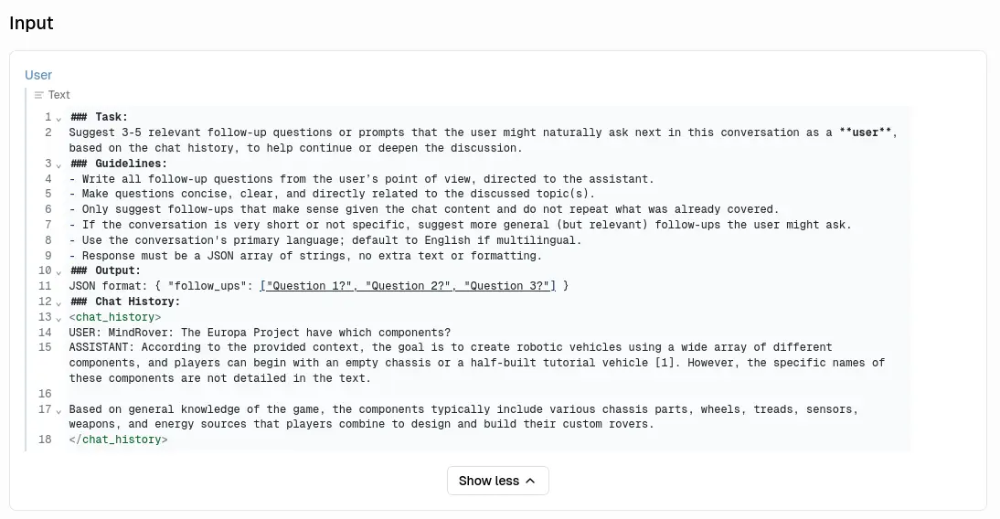
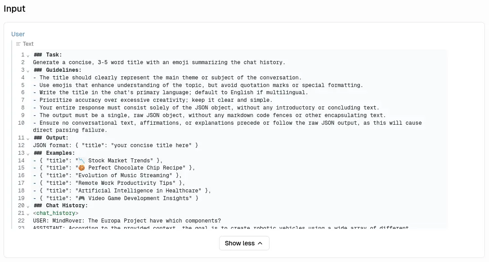
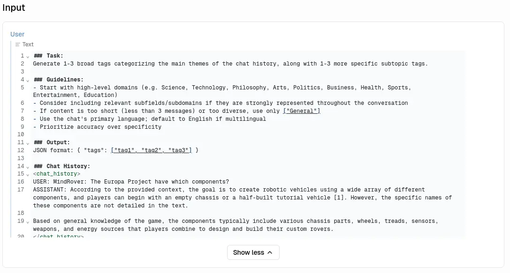
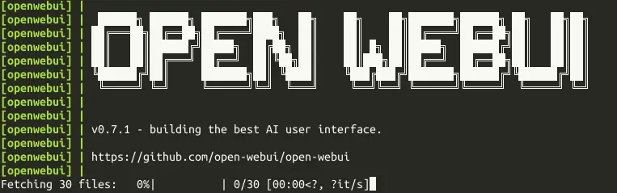

# 不正經 LLM APP 調查：Open WebUI

<head>
  <meta property="og:image" content="https://raw.githubusercontent.com/FlySkyPie/flyskypie.github.io/main/post/2026-03-16_open-webui/04_rag.webp" />
</head>

## 前情提要

想著調查一些 LLM 應用程式的 RAG 功能，關於調查的方向跟基準請見前一篇文章，不在此贅述：

[不正經 LLM APP 調查：AnythingLLM](https://flyskypie.github.io/posts/2026-03-14_anything-llm-survey/)

同系列其他調查文：

- [不正經 LLM APP 調查：AstrBot](https://flyskypie.github.io/posts/2026-03-15_astr-bot-survey/)
- [不正經 LLM APP 調查：Bionic](https://flyskypie.github.io/posts/2026-03-15_bionic-gpt/)
- [不正經 LLM APP 調查：LibreChat](https://flyskypie.github.io/posts/2026-03-16_libre-chat/)
- [不正經 LLM APP 調查：LobeHub](https://flyskypie.github.io/posts/2026-03-16_lobehub/)
- [不正經 LLM APP 調查：kotaemon](https://flyskypie.github.io/posts/2026-03-16_kotaemon/)

## OCI 構成

<details>
  <summary>`podman image tree`</summary>

```shell
podman image tree ghcr.io/open-webui/open-webui:0.7.1-slim
Image ID: d06877eb06db
Tags:     [ghcr.io/open-webui/open-webui:0.7.1-slim]
Size:     4.13GB
Image Layers
├── ID: dc6a97ced1cb Size: 77.89MB
├── ID: 8f188951e855 Size: 9.566MB
├── ID: 982be8b9b835 Size: 47.35MB
├── ID: 0132205617a0 Size:  5.12kB
├── ID: efc4a31ef8e1 Size: 2.048kB
├── ID: 53c41bbabd3a Size: 1.024kB
├── ID: 73a4c32381d7 Size:  2.56kB
├── ID: c59306ca6ac4 Size: 3.584kB
├── ID: 2d55a871ca12 Size: 1.024kB
├── ID: 3013e04e2b21 Size:  1.03GB
├── ID: a51f45165d8f Size: 5.632kB
├── ID: da79abc2036f Size: 2.704GB
├── ID: c5537d5956a2 Size: 1.024kB
├── ID: 4445f48d784d Size: 189.1MB
├── ID: 12978c7cabd7 Size: 502.3kB
├── ID: d5e09b6033c6 Size: 7.168kB
├── ID: 8e4a942db9a1 Size: 71.49MB
└── ID: 8fde1864177e Size: 1.024kB Top Layer of: [ghcr.io/open-webui/open-webui:0.7.1-slim]
```
</details>

總計 4.13GB，最大單層 2.7GB。

## 簡單對話



## 嵌入文件



PDF 上傳後會經過純文字處理，可以編輯，不過不會觸發重新嵌入：



## 檢索知識



生成檢索用的字串：



總結檢索內容：



其他功能，生成後續建議問題：



生成標題：



生成標籤：



## 編排與構成

<details>
  <summary>`docker-compose.yaml`</summary>

```yaml
services:
  openwebui:
    image: ghcr.io/open-webui/open-webui:0.7.1-slim
    ports:
      - "8080:8080"
    environment:
      - WEBUI_AUTH=False
      - HF_ENDPOINT=http://huggingface.mirrors.solid.arachne
      - OFFLINE_MODE=true
    volumes:
      - open-webui:/app/backend/data

  llama-cpp:
    image: ghcr.io/ggml-org/llama.cpp:server-vulkan
    restart: always
    devices:
      - /dev/dri/:/dev/dri/
    entrypoint: /app/llama-server
    environment:
      - HF_ENDPOINT=http://huggingface.mirrors.solid.arachne
    volumes:
      - llama-cpp-cache:/root/.cache/llama.cpp
    command:
      - --hf-repo
      - Qwen/Qwen3-Embedding-8B-GGUF
      - --hf-file
      - Qwen3-Embedding-8B-Q6_K.gguf
      - --embeddings
      - --pooling
      - mean
      - --ctx-size
      - "2048"
      - --batch-size
      - "1024"
      - --ubatch-size
      - "2048"
      - --gpu-layers
      - "999"
      - --flash-attn
      - on
      - --no-webui
    healthcheck:
      test: ["CMD", "curl", "-f", "http://localhost:8080/health"]
      interval: 10s
      timeout: 20s
      retries: 3

volumes:
  open-webui:
  llama-cpp-cache:
```
</details>

如果沒有設定 `OFFLINE_MODE`，Open WebUI 啟動就會嘗試嘗試下載各種模型：



如果把相關實作和向量資料庫拿掉想必映像檔可以小上許多。

話雖如此，Open WebUI 本身也被移植作為 llama.cpp 的內建 GUI。

## 實作程序關閉

是否有實作 Graceful Shutdown？ 是。

```
openwebui-1 exited with code 0
```
