# Agent! Agent! Agent! 所以 Agent 到底是什麼？

<head>
  <meta property="og:image" content="https://raw.githubusercontent.com/FlySkyPie/flyskypie.github.io/main/post/2026-03-17_llm-agent/01_agent.webp" />
</head>

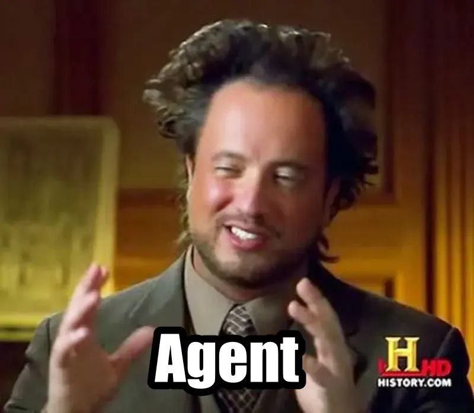

一天到晚聽 AI 跟風仔滿嘴 Agent；Agent 這個；Agent 那個...所以 Agent 到底是什麼？

心血來潮我想寫一篇文解釋 Agent 是什麼。

## OpeAI API

故事要從 OpeAI API 說起，一個目前實質成為產業標準的 HTTP API。

OpeAI API 的[規格書](https://github.com/openai/openai-openapi)包含了很多 Endpoint，檔案甚至高達 2.4 MB，不過我們今天要談的主角是 `POST /chat/completions` 這個 Endpoint：

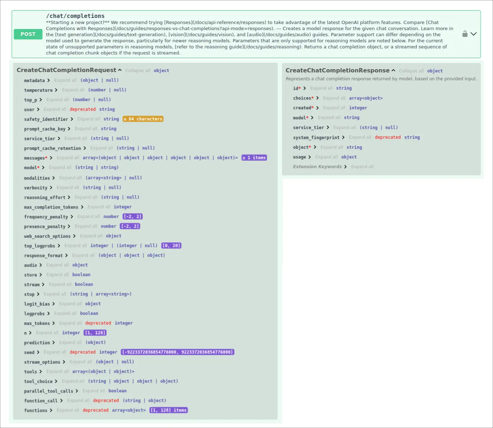

簡單來說 LLM 本身是無狀態的，`messages` 這個欄位簡單來說就是一個對話紀錄，透過上傳使用者跟 LLM 說過的話（對話紀錄）令 LLM 預測下一個回答從而產生「有記憶」的效果。

不過今天的重點是這個，

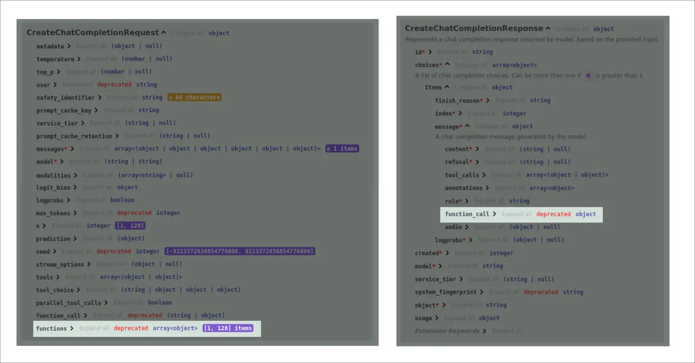

請求 (Request) 內的 `functions` 和回應 (Response) 內的 `function_call`。

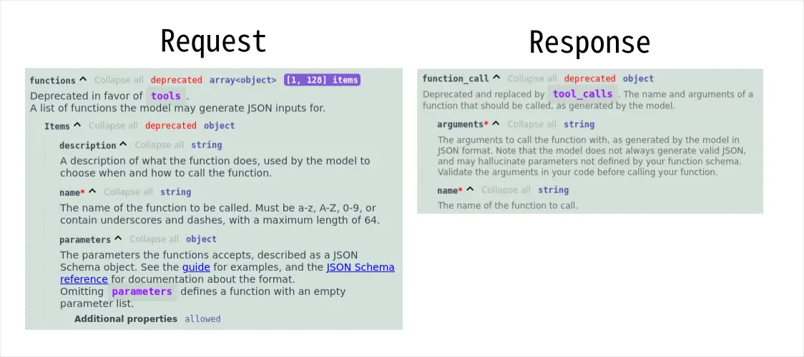

看規格書太抽象，接下來我們來看具體的例子。

## OpeAI API `function_call` 具體案例

這是一個應用程式中的「證據」功能，也就是要從參考資料中標示具體回答問題的段落文字：

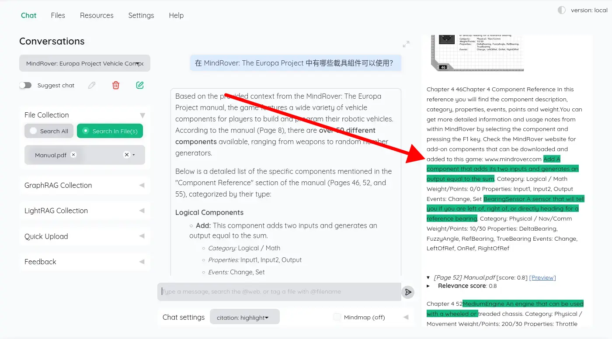

:::info
這是我調查 kotaemon 這個應用程式時發現的，更多內容可以至我的另外一篇文章查看：

[不正經 LLM APP 調查：kotaemon](https://flyskypie.github.io/posts/2026-03-16_kotaemon/)
:::

`messages` 長這樣，包含了使用者個原始問題、系統檢索的資料、系統提示詞：

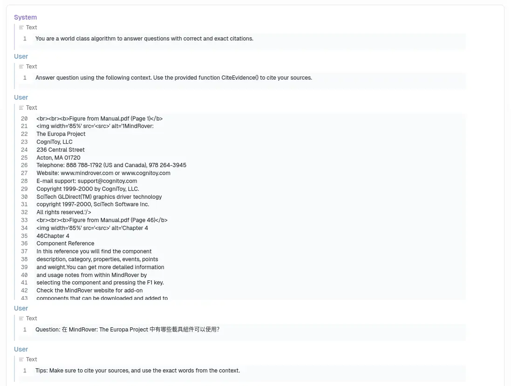

答案跟問題放在一起？這不就是開書考(open book)嗎？沒錯，這就是 RAG (Retrieval-augmented generation) 運作的基本原理，不過 RAG 不是本文的重點，以後再談。

`functions` 長這樣：

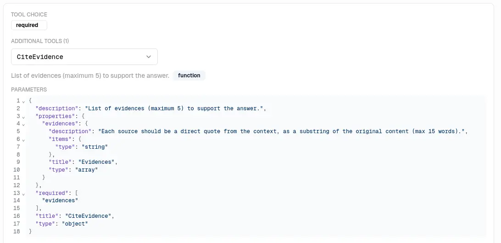

LLM 的 `function_call` 長這樣：

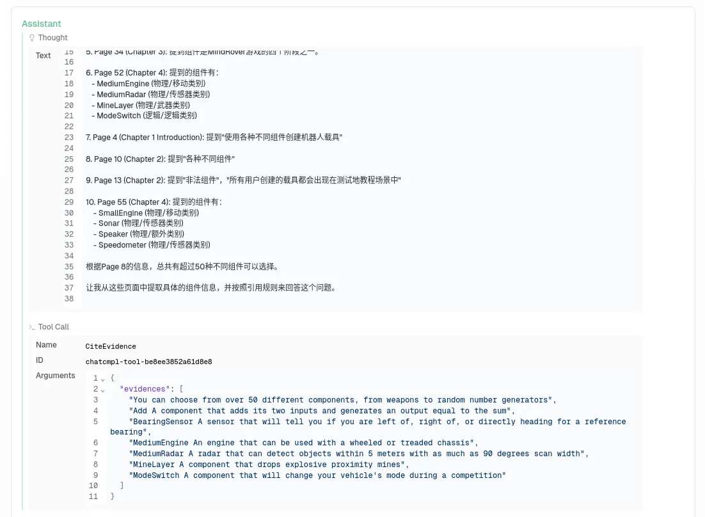

我們可以看到 LLM 根據 `functions` 的提示填入對應的資訊，上面那一串 `Thought` 是一種名為 Reasoning 的東西，在這裡先不管它。

## LLM Agent

原本使用者跟 LLM 的關係是這樣的，使用者問、LLM 答。

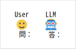

但是透過 `function_call` API，它允許角色翻轉過來：

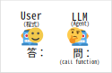

主動權交給 LLM，由程式操作的 User 則負責回答 LLM 的 `function_call`，只要 LLM 不主動結束對話，這個迴圈就不會結束。

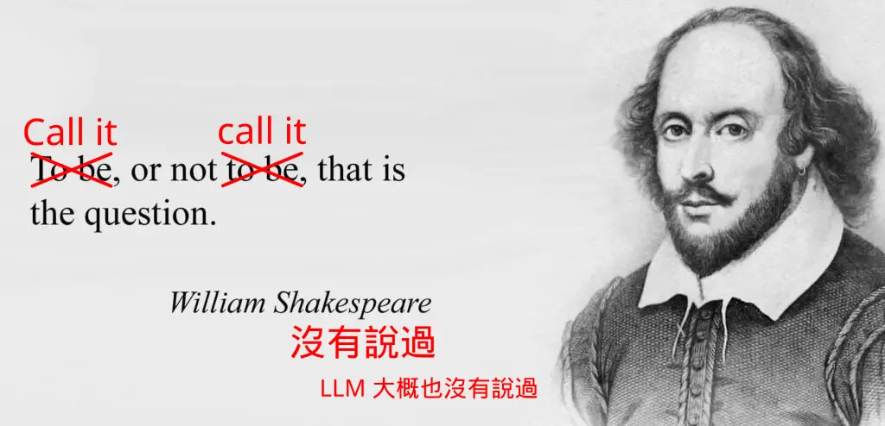

## 小結

"Agent" 一詞大概是從增強式學習 (Reinforcement learning) 借鏡過來的。

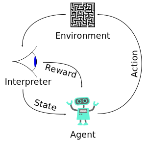

一來是比較專業，二來是這個用詞可能會給人一種「可獨立運作的 AI」的感覺（~~可以用來欺騙投資人和大眾~~）。不過老實說，目前大部分的 LLM 應用軟體都受到 OpenAI API 的設計影響（比如那個會不對累積最後把上下文塞爆的對話紀錄萬惡設計），與其去牽扯什麼高大上的理論，目前的實做方式就只是透過 OpenAI API 的特性反轉了請求與回應之間的關係罷了。

最近在研究 RAG 的範式，便看到了 Agentic RAG，我的天啊！Agentic Coding （俗稱 Vibe Coding） 就已經夠我煩躁的了，連 RAG 也來？總之我想說試著以這個視角整理一下思緒，順便寫下來向其他人解釋 Agent 是什麼。
