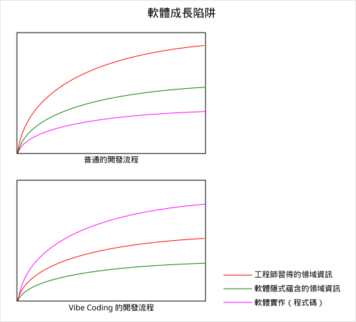

# 軟體成長陷阱

一圖以敝之：

開發者本應跟著專案一起成長，實際上只有部份被開發者消化過的領域知識會變成程式碼，並且程式碼本身又隱性的蘊含了一些領域知識，如果不具備相關領域知識的人可能無法從程式碼表面得知那些領域知識。一般透過註解或是文件來降低這種落差。

透過 Agentic Coding （俗成 Vibe Coding），即 LLM （大型語言模型）的幫助，程式碼產出的速度來到前所未有的高度，但是這可能會面臨一些問題：

程式碼本身並不蘊含來自現實世界的領域模型或領域知識，又或是蘊含甚少，因為 LLM 的上下文可能缺少了關鍵的領域知識，程式碼是根據表象的需求實做的，如此建立的軟體模型很有可能會跟現實問題脫句。

開發者成長遭到削弱，當工作流程一謂的關注堆砌程式碼，開發者不再學習領域知識，而是專注於建構虛有其表的程式碼，這不論是對開發者個個人生涯還是專案擁有者都十分不利，開發者的成長停滯；開發者缺乏對領域知識的理解更不可能撰寫出對應的交接文件。
