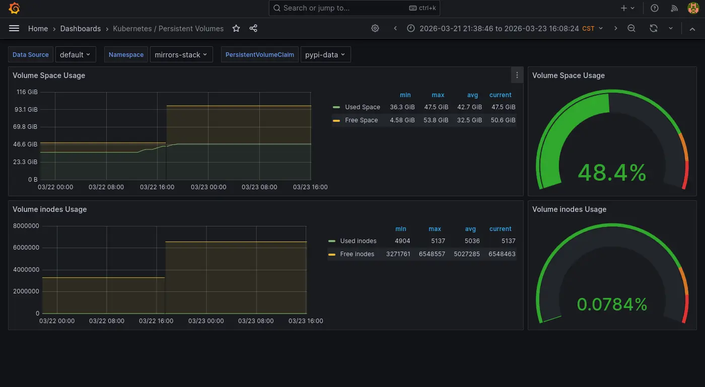
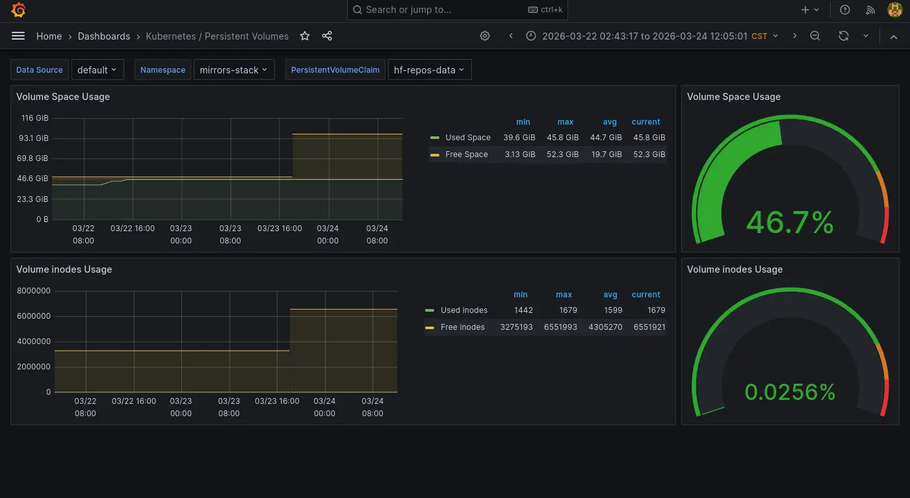
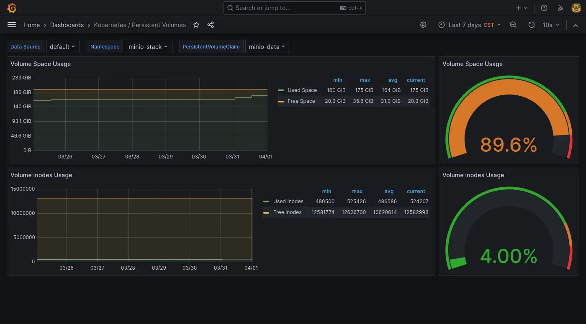
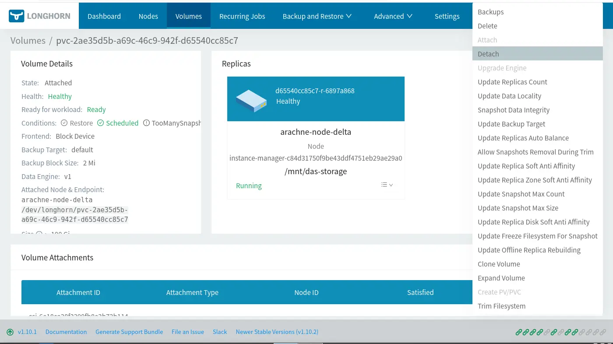
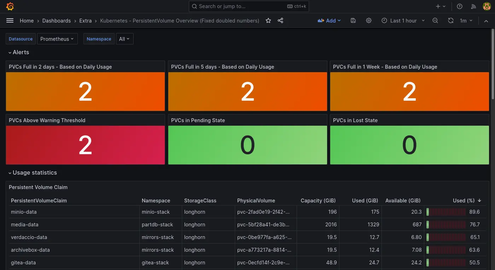

# Longhorn PVC 擴展筆記

<head>
  <meta property="og:image" content="https://raw.githubusercontent.com/FlySkyPie/flyskypie.github.io/main/post/2026-04-01_longhorn-extend/03_minio.webp" />
</head>

## 前情提要

我在 Homelab 使用 [Longhorn](https://github.com/longhorn/longhorn) 作為儲存後端，並且其實已經經歷過幾次調整 PVC (Persistent Volume Claim) 容量了，分別是 PyPi 和 Hugging Face 本地鏡像。





:::info
「儲存後端」在 K8s 的正確術語為 Storage Provider 或是理解成 CSI(Container Storage Interface) 實作，我稱為儲存後端只是為了通俗理解與方便不熟的讀者閱讀。
:::

最近則是 S3 實例 (MinIO) 快滿了，想說這次擴展的時候順便寫個筆記紀錄一下。



## 調整大小

```yaml
apiVersion: v1
kind: PersistentVolumeClaim
metadata:
  labels:
    io.kompose.service: minio-data
  name: minio-data
spec:
  accessModes:
    - ReadWriteOnce
  resources:
    requests:
      storage: 250Gi
```

```shell
kubectl apply -k .
```

然後...就可以了...

### 配額已達上限

算是小插曲，原本想從 200Gi 翻成兩倍的，但是看來總配額已經滿了：

```shell
kubectl apply -k .
service/minio-service unchanged
statefulset.apps/minio unchanged
ingress.networking.k8s.io/minio unchanged
Error from server (Forbidden): error when applying patch:
{"metadata":{"annotations":{"kubectl.kubernetes.io/last-applied-configuration":"{\"apiVersion\":\"v1\",\"kind\":\"PersistentVolumeClaim\",\"metadata\":{\"annotations\":{},\"labels\":{\"io.kompose.service\":\"minio-data\"},\"name\":\"minio-data\",\"namespace\":\"minio-stack\"},\"spec\":{\"accessModes\":[\"ReadWriteOnce\"],\"resources\":{\"requests\":{\"storage\":\"400Gi\"}}}}\n"}},"spec":{"resources":{"requests":{"storage":"400Gi"}}}}
to:
Resource: "/v1, Resource=persistentvolumeclaims", GroupVersionKind: "/v1, Kind=PersistentVolumeClaim"
Name: "minio-data", Namespace: "minio-stack"
for: ".": error when patching ".": admission webhook "validator.longhorn.io" denied the request: error while CheckReplicasSizeExpansion for volume pvc-2fad0e19-2f42-4dd2-8dc7-4e705f227432: cannot schedule 214748364800 more bytes to disk b08f46da-f50f-481d-8eff-de1e605e7859 with &{DiskUUID:b08f46da-f50f-481d-8eff-de1e605e7859 StorageAvailable:1702363136000 StorageMaximum:3936770629632 StorageReserved:214748364800 StorageScheduled:3625277456384 OverProvisioningPercentage:100 MinimalAvailablePercentage:25}
```

### 故障排除

這次過程蠻順利的，但是之前擴展的時候其實遇過 PVC 改大小是卡住的，但是那個時候沒截圖。故障排除的方式是需要把有使用 PVC 的 Pod (StatefulSet) 暫時移除並且 Detach PVC[^pvc-detach]：



[^pvc-detach]: How can I resize the longhorn volume? The new size should be shown in both rancher&longhorn UI · Issue #2263 · longhorn/longhorn.  Retrieved 2026-04-01 from https://github.com/longhorn/longhorn/issues/2263#issuecomment-935739738

## 後記

順便補一下一些跟 PVC 有關的東西。

### PV 持久化設定

PV (Persistent Volume) 有一個叫做 `reclaimPolicy` 的設定，如果沒有設定為 `Retain` 的話 （預設值為 `Delete`），在 PVC 資源移除時對應的 PV 會被系統自動清除。

更新系統層級的設計，日後新的 PVC 會遵守該設定[^pvc-retain]：

```shell
kubectl -n longhorn-system edit configmaps longhorn-storageclass
# 找到 `reclaimPolicy` 欄位設定成 `Retain`
```

若要更新已經建立的 PV，則使用以下指令：

```shell
for pv in $(kubectl get pv -o jsonpath='{.items[*].metadata.name}'); do     kubectl patch pv "$pv" -p '{"spec":{"persistentVolumeReclaimPolicy":"Retain"}}'; done
```

[^pvc-retain]: How to change reclaimPolicy without reinstalling everything? · longhorn/longhorn · Discussion #10102. Retrieved 2026-04-01 from https://github.com/longhorn/longhorn/discussions/10102#discussioncomment-14380415

### PVC Dashboard

平常是使用 Prometheus Helm 內建的 Grafana Dashboard (Kubernetes/Persistent Volumes)，雖然可以單獨檢查 PVC 但是缺乏快速對所有 PVC 有一個總覽可以快速掌握的功能。於是我安裝了[另外一個 Dashboard](https://grafana.com/grafana/dashboards/22429-kubernetes-persistentvolume-overview/) 來做這件事：



只是不知道為什麼有一點瑕疵：

- 其中一個 PVC 的數字異常。
- 使用百分比的進度條顯示異常。

只是目前暫時懶得故障排除。
