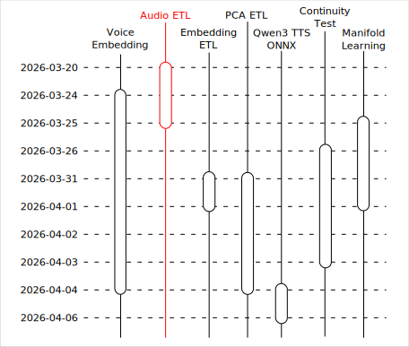
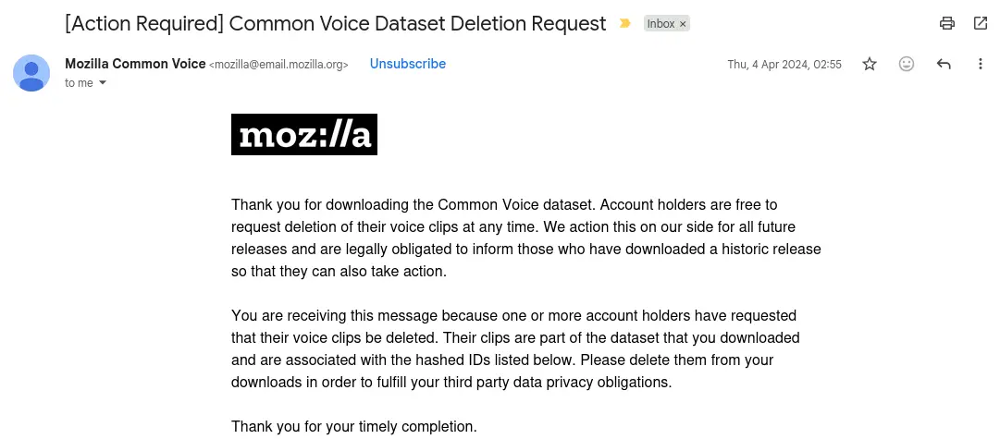

# Qwen3 TTS 之旅：資料集預處理

## 前情提要

這個文章是「Qwen3 TTS 之旅」系列的一部分，關於旅程的起因與整體概覽請見：

- [Qwen3 TTS 之旅：序](https://flyskypie.github.io/posts/2026-04-06_qwen3-tts-journey-prologue/)

本文僅覆蓋「資料預處理」相關的主題。



## Mozilla Common Voice

Common Voice 是 由 Mozilla 基金會所发起的群眾參與專案，旨在為語音辨識軟體建立自由資料庫，並且主要宗旨為建立多樣化的語音樣本，因此裡面也包含了一個台灣語音資料集，2023 年的時候我就以防萬一下載了一份放在手邊。

關於 Mozilla Common Voice 我認為有一點值得一提，2024 年的時候我收到這樣一封電子郵件：



大意就是語音資料的貢獻者想要撤銷貢獻，因此 Mozilla 通知下載過資料集的人（也就是我）刪除對應的資料。

先不談這個機制是否對下載的人有實質約束力，至少在這個「AI 公司」在網際網路上掠奪數據與資料，致個人的資料權利於無物的時代，Mozilla Common Voice 可以說是一股清流，至少我持有的資料是這些志工自願貢獻的，在法律與道德上我皆有權利在合理的範圍內自由使用。

然而我並沒有對 2023 年的資料做適度的處理，也很難從中挑出要被撤銷的檔案，於是我直接重新下載了一份 2026 版的。

## 資料集與預處理

Mozilla Common Voice 2026 (`cv-corpus-25.0-2026-03-09/zh_TW`) 內容物大致上長這樣：

```
├── clips/*.mp3
├── validated_sentences.tsv
├── unvalidated_sentences.tsv
├── other.tsv
├── validated.tsv
└── invalidated.tsv
```

首先映入眼簾的是 `.tsv` 檔案，它們提供了標籤資訊，也就是某個 `.mp3` 是誰※貢獻的、什麼性別、什麼年齡區間、字稿...。

:::info
資料集本身是使用去識別化的 id 去辨識貢獻者，同時 Mozilla Common Voice 的使用者授權也明確的要求下載的人禁止對貢獻者進行再識別，所以若後續文章我需要描述「某人」時，我會使用專案內部重新生成的 id，而不是資料集本身提供的 id。
:::

這是一個尚未經過正規化 (Normalization) 的資料，如果我要讓應用程式能夠更方便的提取特定貢獻者的資料或是其他標籤（性別...等），勢必需要使用關聯資料庫，並對資料進行正規化。

另外一個問題是該資料集包含 140k 筆語音資料，也就是 140k 個 `.mp3` 檔案，而這種在檔案系統上大量且碎片化的檔案在進行遷移（複製）時非常耗時，

因此我先把這些原始資料預處理成 SQLite 檔案，並用 BLOB 資料欄位儲存 `.mp3`。

