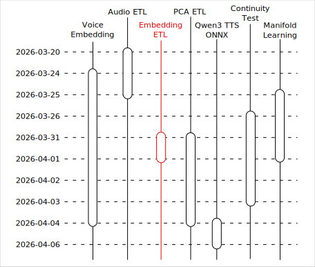

# Qwen3 TTS 之旅：資料集嵌入

這個文章是「Qwen3 TTS 之旅」系列的一部分，關於旅程的起因與整體概覽請見：

- [Qwen3 TTS 之旅：序](https://flyskypie.github.io/posts/2026-04-06_qwen3-tts-journey-prologue/)

本文僅覆蓋「資料集嵌入」相關的主題。



## 大型資料處理

即便在 ONNX 中使用 WebGPU 實現硬體加速，資料集包含 140k 筆資料，逐一進行嵌入依然需要歷時兩個小時左右。

:::info
關於嵌入伺服器的更多資訊請見：
[Qwen3 TTS 之旅：語音嵌入](https://flyskypie.github.io/posts/2026-04-06_qwen3-tts-journey-voice-embedding/)
本步驟的前置作業請見：
[Qwen3 TTS 之旅：資料集預處理](https://flyskypie.github.io/posts/2026-04-06_qwen3-tts-journey-audio-etl/)
:::

運行當下 `intel_gpu_top` 顯示只有使用一半，另一方面所有 CPU 則是跑滿的狀態且負載皆在伺服器端，但是我並沒有仔細研究性能瓶頸在哪裡，推測是伺服器的 mp3 轉換的影響。
當然也有 JSON 和 base64 的解編碼運算，不過這件事情資料處理端也有，但是並沒有佔用太多 CPU，因此可能性比較低。

因此我花了一點時間實作了運算進度存檔的機制，以 100 筆資料為一個單位，除了將 100 筆作為一個 Transaction 以外，還會在用於紀錄進度的資料表紀錄進度，若過程中中斷，下次運算便可從紀錄點繼續。

## 向量資料庫

[Milvus](https://github.com/milvus-io/milvus) 是蠻有名氣的向量資料庫實作之一，不過當下我並沒有檢索的需求，僅需要一個儲存的載體，因此選擇了其 [Lite](https://github.com/milvus-io/milvus-lite) 版本，會將資料儲存成 SQLite 格式。

然而實際使用時在運算到 4.9k 的資料左右會出現異常：

```
Assert "suc"  => failed to parse insert data from records at /workspace/milvus-lite/thirdparty/milvus/internal/core/src/segcore/segment_c.cpp:303
```

不確定是不是到達 1M~10M 左右的官方上限：


:::info
嵌入向量是 2048 維，中斷時大約是 4.9k資料；因此：
4900×2048≈10M
:::

所以最後將向量的 JSON 序化成字串後直接使用 SQLite 儲存，雖然效率很差，但是當下最重要的是先把資料做嵌入之後找地方放，而且方便後續步驟提取，應該避免無謂的為了效率而提高程式碼複雜度。

SQLite 雖然是「輕量」的資料庫實作，但是不代表它隨便，專案下的測試程式碼甚至比實作本身還多。並且在摸索資料的階段，可攜性、方便轉移複製版控...與生產環境需要考量的性能、低冗餘與最佳化...屬於不同情境。

## `dataset`


- https://github.com/pudo/dataset
  - 4.9k ⭐

在進行這個主題的額外收穫是發現這個名為 `dataset` 的 Python 套件，它可以像這樣：

```python
import dataset

db = dataset.connect('sqlite:///:memory:')

table = db['sometable']
table.insert(dict(name='John Doe', age=37))
table.insert(dict(name='Jane Doe', age=34, gender='female'))

john = table.find_one(name='John Doe')
```

直接操作一個 SQLite 實例讀寫資料，無須預先定義 Schema 或是新增資料表。
