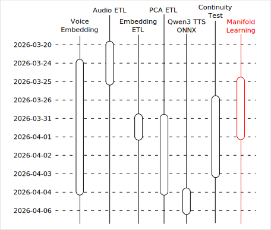
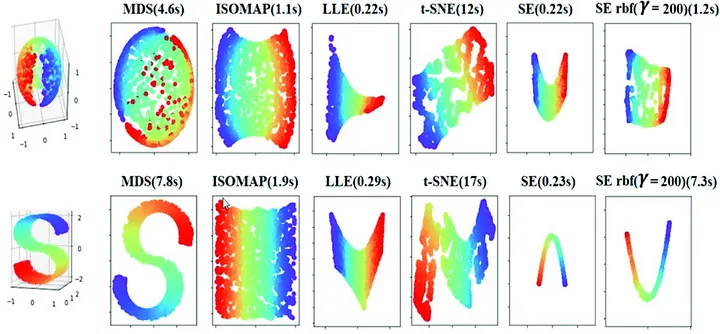
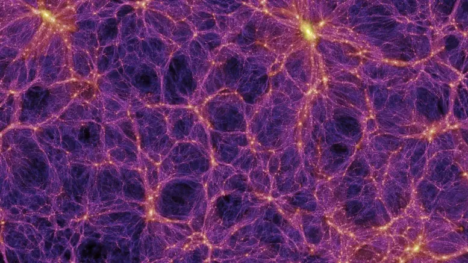
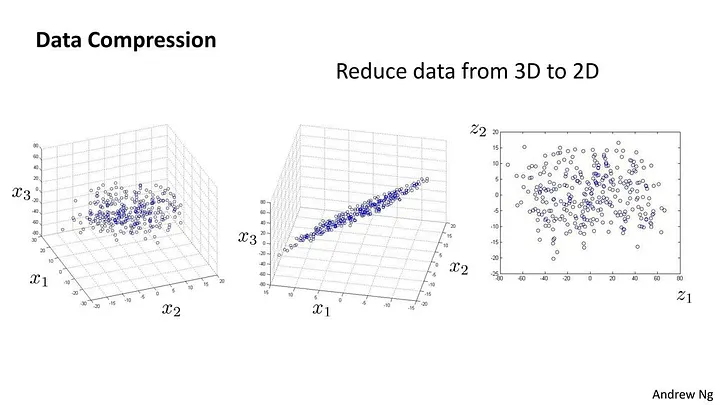
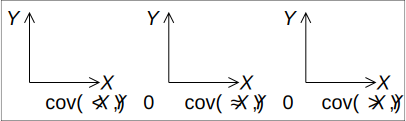
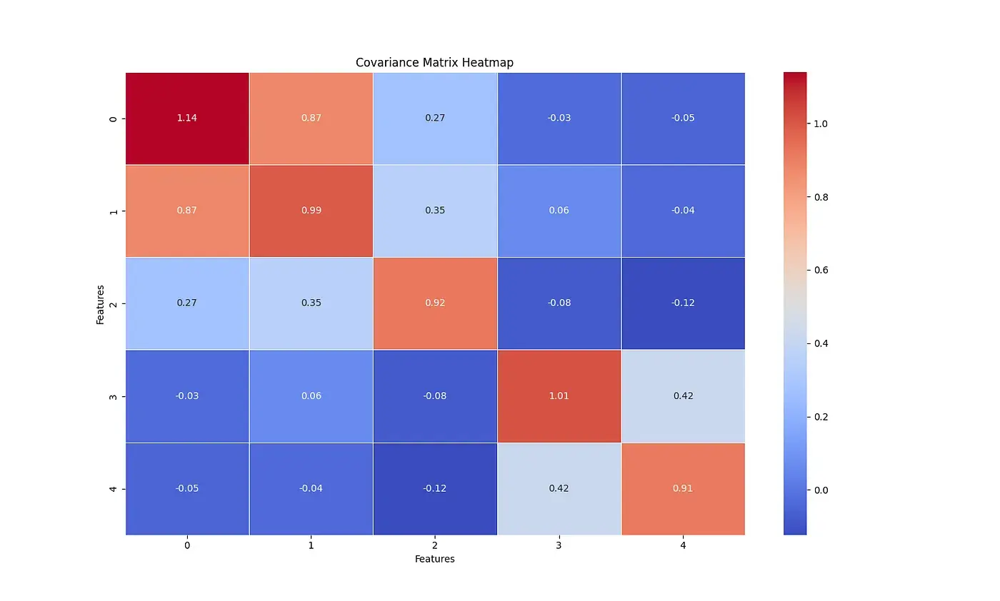
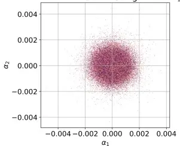
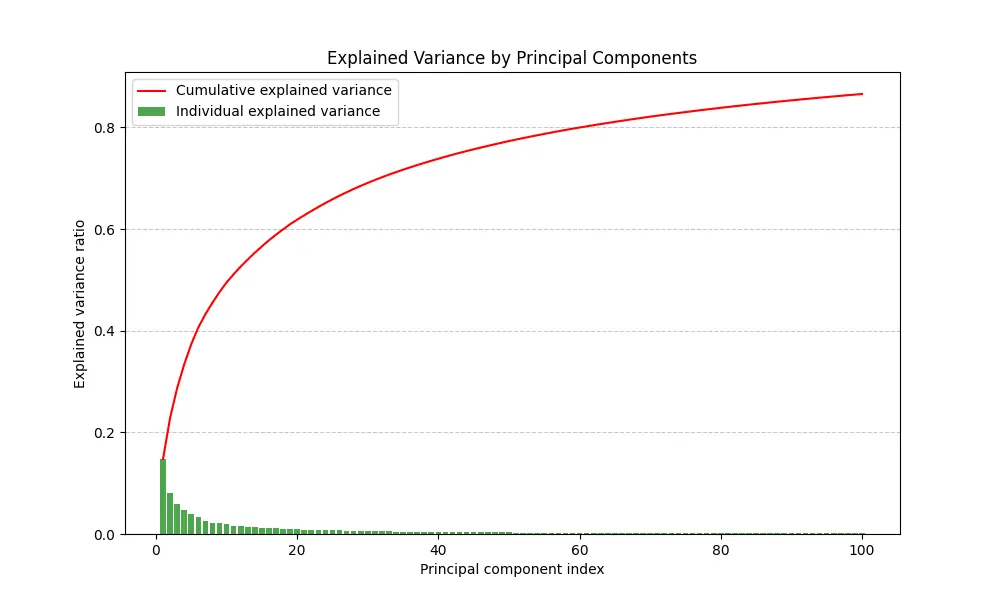

# Qwen3 TTS 之旅：流形學習

<head>
  <meta property="og:image" content="https://raw.githubusercontent.com/FlySkyPie/flyskypie.github.io/main/post/2026-04-06_qwen3-tts-journey-manifold-learning/02_manifold-learning.webp" />
</head>

這個文章是「Qwen3 TTS 之旅」系列的一部分，關於旅程的起因與整體概覽請見：

- [Qwen3 TTS 之旅：序](https://flyskypie.github.io/posts/2026-04-06_qwen3-tts-journey-prologue/)

在我開始撰寫主成份分析、視覺化...等程式以前，先對相關的領域知識進行學習，最後定位了「流形學習 (manifold learning)」這個領域，雖然「流形學習」這個詞比較正式且有嚴謹的定義，不過本文比較接近學習筆記。

本文雖然跟學術性的文章比起來隨性很多，但是跟其他軟體實作相比又抽象了許多，所以額外拉出來當成獨立的主題談：

## 視覺化與降維

一個語音經過 Qwen3 模型嵌入之後，會得到 2048 個數字，這 2048 個數字稍微學術一點會被稱呼為「高維向量」或是「高維空間」，2048 個數字排列組合構成的所有可能性便是「空間」，特定的 2048 個數字，也就是某個資料點就是「向量」。

然而人類並不能直接理解這 2048 個數字代表的意思，也就是人類不能理解高維空間或是高維向量的內含。

理解空間的其中一種方法就是視覺化，但是紙張只能呈現二維的圖像、就算透過軟體與之互動也只能呈現三維的畫面，那麼我們要如何把 2048 個數字變成等效的 3 個數字然後做成圖表呢？是的這個過程就是降維。

「沒吃過豬也看過豬走路」是我的中心思想之一，在進行更進一步的介紹以前我們先隨便看幾個降維的例子吧[^manifold-learning]：

它分別對兩個三維的資料用各種不同的方法降成二維。

[^manifold-learning]: Principal Component Analysis(PCA) | by venkateshtantravahi | Medium. Retrieved 2026-04-06, from https://vtantravahi.medium.com/principal-component-analysis-pca-37dc2c22cdf0

## 流形 (Manifolds)

:::warning
以下是關於流形這個概念的通俗解釋，不具備數學上的嚴謹性。
:::

「2048 維的高維空間」聽起來好像很厲害，不過我們可以這樣假設：

> 這個高維空間其實很稀疏
>

舉例來說，從宏觀角度來看宇宙，會發現它像海綿一樣充滿了空孔[^universe-void]：

只有少數的空間有被恆星和物質填充。有興趣的朋友可以聽聽看 YouTube 頻道 [Kurzgesagt 的介紹](https://www.youtube.com/watch?v=yDAAlojz8NU)。

又或是揉成一團的報紙，即便我們在三維空間觀察它是一個球體，但是它實際上充滿了空氣，真正有資訊的部份是以二維紙張的形式分佈的。

這個實際上是低維情報，但是在高維空間中被觀察到的東西，就是流形。

:::info
嚴謹的流形定義還包含了「局部近似歐幾里得空間」，只是解釋起來比較麻煩，所以以上描述省略了。
就像地球表面是弧形的，但是放大之後會接近平面。
:::

流形學習則是把揉成球的報紙攤平的過程，並且是一種機器學習。

[^universe-void]: New Research Supports the Idea That We Live in a Void. Retrieved 2026-04-06, from https://scitechdaily.com/new-research-supports-the-idea-that-we-live-in-a-void/

## 降維

最簡單的降維方式就是投影：

現實的例子就是你跟你的影子，找一個平面/方向就能把三維的資料壓成二維的，如何找到那個「正確的平面」則是最重要的問題。

然後讓我們回來看這張圖：

可以發現 S 型的資料在 ISOMAP 算法下被攤成漂亮的方形，接著再想想要投影出這個漂亮的方形的「面」長什麼樣子？想必不是一個平面對吧？

學術上會把這兩者分別稱呼成線性跟非線性的降維技術。

~~流形學習其實就是降維炫泡一點的講法。~~

## PCA

主成份分析 (PCA, Principal component analysis) 簡單來說是一種對資料進行線性降維的技巧，而且屬於非監督機器學習。

OS：恩？怎麼突然之間我就機器學習了！？(◐_◑)

至於不簡單來說嘛...它建立在不少統計與數學工具與概念之上...

### 敘述統計

把幾個基本的敘述統計概念列一下。

- 母體平均數 (Mean)
  - $\mu$
- 標準差
  - $\sigma ={\sqrt {{\frac {1}{N}}\sum _{i=1}^{N}(x_{i}-\mu )^{2}}}$
  - 需要先建立在平均數之上。
- 變異數 (Variance)
  - $\operatorname {Var} (X)=\sigma ^{2}$
  - 概念上是標準差的平方，但是實務上通常會先算出變異數，開根號之後才會得到標準差。

### 共變異數 (Covariance)

$$
\operatorname {cov}(X, Y) = {{\frac {1}{N}}\sum _{i=1}^{N}(x_{i}-\mu_x )(y_{i}-\mu_y )}
$$

計算兩個隨機變數的關聯性，越接近零代表兩個隨機變數越不相關。

### 共變異數矩陣（Covariance Matrix）

共變異數矩陣是 $p$ 個特徵交叉進行獲得共變異數構成的矩陣。以下是五維資料的共變異數矩陣例子[^covariance-matrix]：

共變異數矩陣的符號：

- $\mathbf {C} =[C_{jj'}]$
- $\operatorname {K} _{X_{i}X_{j}}=\operatorname {cov} [X_{i},X_{j}]$
- 在一些地方會使用符號 $\Sigma$ 代表。

[^covariance-matrix]:Principal Component Analysis Made Easy: A Step-by-Step Tutorial | by Marcus Sena | TDS Archive | Medium. Retrieved 2026-04-06, from https://medium.com/data-science/principal-component-analysis-made-easy-a-step-by-step-tutorial-184f295e97fe

### 特徵值與特徵向量

一般的 PCA 介紹大概會提到這個步驟：

> 對共變異數矩陣求特徵值 (eigenvalue) 與特徵向量 (eigenvector)
>

但是這個步驟開始比較抽象了，特徵值？特徵向量是啥？為什麼共變異矩陣的特徵值跟特徵向量會跟主成份有關系？

這裡我要試著用工程數學的經隨：先射箭再畫靶，來解釋這件事情。

首先我們假設一個白化空間 (whitening space)，每一個維度都是標準常態分佈且每一個維度的隨機變數都獨立於彼此：

在這個 $n$ 維空間的向量可以透過一個 $n\times n$矩陣變換到另外一個歪曲的空間去，圓形可能變成橢圓形。

共變異數矩陣反應的就是這個白化空間經過變換矩陣得到的觀察結果，那個歪曲的空間就是我們觀測到的空間，因此求那個矩陣的的特徵值與特徵向量就是分解這個矩陣的變換行為。

特徵向量是原本在這個白化空間中正交的向量經過變換後在觀察空間的表示，而特徵值則是從白化空間變換到觀察空間拉伸的比率。

所以我們可以知道，白化空間中一部分的維度在觀察空間中會被放大，換言之，觀察空間中的主要變化可能來自於白化空間中少數幾個維度的貢獻。

這個白化空間就是我們的主成份空間。（這句話嚴謹意義上不完全正確，但是方便理解）

### 解釋變異量 (Explained Variance)

解釋變異量是各個特徵值在所有特徵值和的佔比，代表著主成份空間某個維度對觀察空間資訊量貢獻的比例，因為特徵值越大、成份在觀察空間中放大的程度就越大。

將解釋變異量排序後畫成圖表便能一目了然各個主成份的佔比為何，積分後便得到累積解釋變異圖(Cumulative Explained Variance)：

綠色方條是解釋變異量；紅色曲線是累積解釋變異。透過累積解釋變異我們可以知道降維到幾個主成份可以保留足夠多的特徵。

實務上可取 70% 左右的固定值或是觀察拐點；即便主成份比例低，但是其他成份分佈過於均勻的話依然可以視為雜訊。

### PCA 降維

PCA 的最後一個步驟。有了特徵向量、特徵值並選定主成份維度，便可構造一個矩陣把高維資料進行線性變換以實現降維了。
