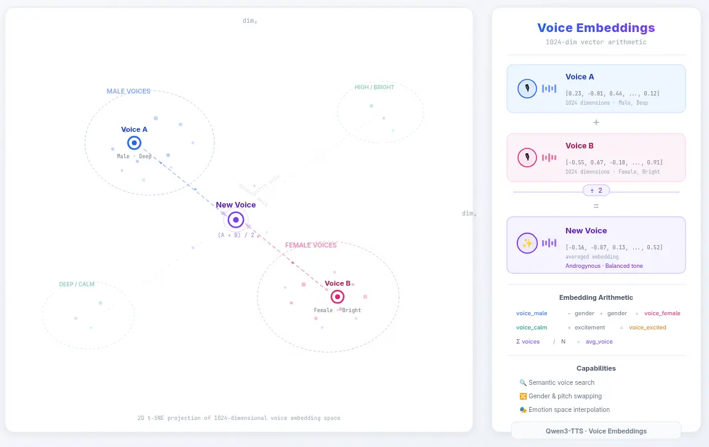
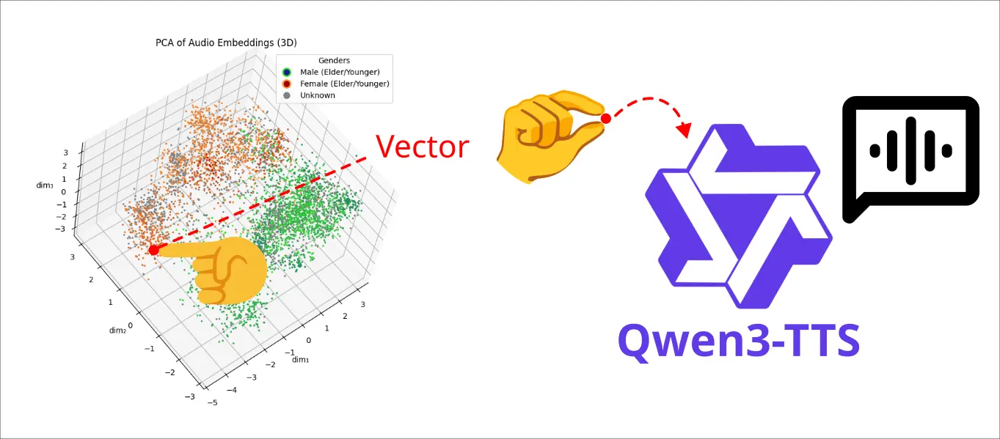
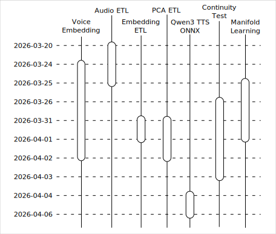

# Qwen3 TTS 之旅：序

<head>
  <meta property="og:image" content="https://raw.githubusercontent.com/FlySkyPie/flyskypie.github.io/main/post/2026-04-06_qwen3-tts-journey-prologue/02_tts-pipeline.webp" />
</head>

從我踏入 Qwen3 TTS 這個兔子洞到現在也已經兩個多禮拜了 (2026-03-20~2026-04-06)，即便還沒徹底完成一開始設定的目標也該設定一個存檔點；把歷程做個紀錄，然後回去忙其他事情了。然而因為整個過程並不是一個線性的故事，很難結構化的描述，因此本文會先概述整個事件的全面以及這個兔子洞是怎麼發生的，細節將由其他文章補充。

## 火種

這個旅途說是因為一張圖而起的也不違過：

[Qwen3-TTS](https://github.com/QwenLM/Qwen3-TTS) 是 2026 年一月釋出極為先進的 TTS 開放權重模型，而有個老兄將該模型前段一區用於進行語音嵌入的類神經網路抽出做成可獨立運行的模型[^qwen3-embedding]，這裡要稍微解釋一下這件事為什麼了不起，從嵌入的角度來說：

1. OpenAI-Compatible API 中的 `/embeddings` 端點僅覆蓋了「文字嵌入」，語音嵌入在工程應用領域依然相對稀疏。（細節我會在文章後面的內容詳談）
2. 它是開箱即用的開放權重模型，不像一些語音嵌入模型僅有論文。
3. 該模型產出的嵌入向量可作為後端聲音複製 (Voice Clone) 模型的輸入，因此該嵌入向量是有額外工程用途的，而不是單純比較餘弦距離來判斷語音音色的相似度。

從語音的角度：

1. 基於文字的 TTS 其輸出並不穩定，因為「一個沈重的男子聲音」可以存在無限多種解。
2. 大部分基於語音複製的 TTS 需要仰賴原音樣本的存在。
3. 大部分基於語音複製模型須提供語音的內文標籤，往往會鎖定特定語言。（原音樣本鎖定特定語言）

因此只要能調控嵌入空間，就能產生一個穩定的 TTS 客製化流水線。

[^qwen3-embedding]: Qwen3's most underrated feature: Voice embeddings : r/LocalLLaMA. Retrieved 2026-04-02, from https://www.reddit.com/r/LocalLLaMA/comments/1rc59ze/qwen3s_most_underrated_feature_voice_embeddings/

## 構想

於是一個構想油然而生：

透過資料降維的技術將一個已知資料集的嵌入向量視覺化，使用者在三維的的空間中可以選定某個資料點試聽，同時也可以也可以選定空間中不存在資料點的空間，透過降維的反函數生成嵌入向量，將開嵌入向量傳遞給 TTS 進行生成。

在三維空間中透過已知資料集的標籤與特徵讓使用者理解某個區域具有某些語音特徵，例如：男性特徵、女性特徵、年長者特徵...。

簡單來說這是一個能夠客製化聲音的 TTS 工作流程。

## 旅程概覽

整個旅途到目前為止大概可以分成幾個主題：

- Voice Embedding： 我把玩 Qwen3 Voice Embedding 以及進行一些模組化的過程。
- Audio ETL (Extract, Transform, Load)：對 cv-corpus-25.0-2026-03-09 (Mozilla Common Voice 25.0) 進行一些預處理的過程。
- Embedding ETL：對資料集進行嵌入的過程。
- PCA ETL：對嵌入向量的資料集進行主成份分析 (Principal components analysis) 的過程。
- Qwen3 TTS ONNX：我把玩 Qwen3 TTS ONNX 以及試圖進行一些模組化的過程。
- Continuity Test：嵌入空間連續性測試。
- Manifold Learning：對「資料降維」這一領域進行學習的過程。

並且上述主題並沒有明確的嵌後順序，而且事件相互交錯，在後續的文章我會試著僅以一個主題為主軸、相關事件為輔的方式描述，讓整個敘述比較不會太混亂。
