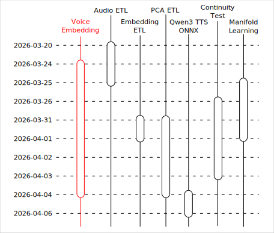
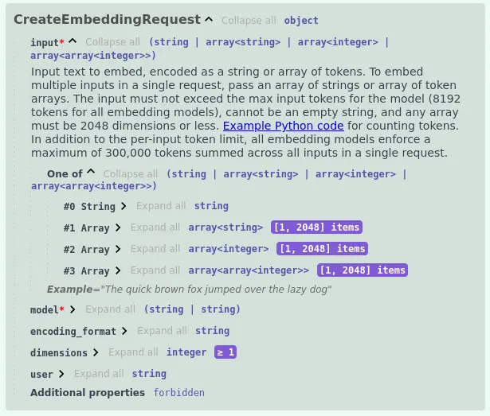
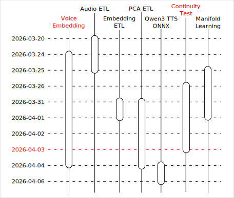
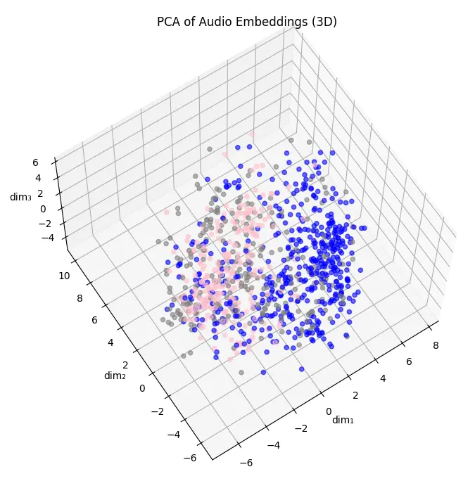

# Qwen3 TTS 之旅：語音嵌入

## 前情提要

這個文章是「Qwen3 TTS 之旅」系列的一部分，關於旅程的起因與整體概覽請見：

- [Qwen3 TTS 之旅：序](https://flyskypie.github.io/posts/2026-04-06_qwen3-tts-journey-prologue/)

本文僅覆蓋「語音嵌入」相關的主題。



## "運行" Qwen3-Voice-Embedding

我當然可以依照作者提供的程式碼直接運行這個模型：

```python
import librosa
import torch
from transformers import AutoModel, AutoProcessor

processor = AutoProcessor.from_pretrained(
    "marksverdhei/Qwen3-Voice-Embedding-12Hz-1.7B", trust_remote_code=True,
)
model = AutoModel.from_pretrained(
    "marksverdhei/Qwen3-Voice-Embedding-12Hz-1.7B", trust_remote_code=True,
)
model.eval()

audio, sr = librosa.load("audio.wav", sr=None, mono=True)
inputs = processor(audio, sampling_rate=sr)

with torch.no_grad():
    embedding = model(**inputs).last_hidden_state  # (1, 2048)
```

但是對我而言「運行」不只是這樣，它必須遵守幾個基本要件：

1. 軟體編排的解偶：模型推論本質上是仰賴 GPU 的重負載運算，因此不能跟應用程式的業務邏輯耦合在一起，必須使用 OpenAI-Compatible API。
2. 硬體的解偶：不能對特定的 GPU 品盤形成供應商鎖定，因此不能使用 CUDA。
3. GPU 加速：這類模型典型的「無 CUDA 備用方案」是直接降回使用 CPU 運算，這對我而言是不能接受。

簡化之後的描述為：

1. 軟體編排的解偶：封裝成 OpenAI-Compatible API。
2. 硬體的解偶：在不使用 CUDA, ROCm...等專有 SDK 的前提實現 GPU 加速推論。

### 軟體編排的解偶

:::info
關於這個主題我有撰寫一份[非線性筆記](https://flyskypie.github.io/microproject-wikis/mm-embedding-api.html)。
:::

OpenAI 嵌入 API 設計上只能處理「文字→向量」的嵌入運算，從官方的規格書可以看到： 



輸入必然為字串，原因是 OpenAI 提供的嵌入模型僅有：`text-embedding-3-small`、`text-embedding-3-large` 和 `text-embedding-ada-002` 這幾款文字嵌入模型，因此無法處理多模態問題，諸如嵌入音訊、影像、圖像...之類的。

即便參考其他多模態嵌入 API 設計，其 API 設計僅部份參考 OpenAI API 但不兼容，例如：

<details>
<summary>`LCO-Embedding-Omni-7B-GGUF` 透過 llama.cpp 的 API：</summary>

```shell
curl -s http://localhost:8080/embeddings \
  -d '{"content": [{"prompt_string": "<__media__>", "multimodal_data": ["<base64-audio-data>"]}]}'
```
</details>

<details>
<summary>`nvidia/llama-nemotron-embed-vl-1b-v2` 透過 OpenRouter 的 API：</summary>

```shell
curl https://openrouter.ai/api/v1/embeddings \
  -H "Authorization: Bearer $OPENROUTER_API_KEY" \
  -H "Content-Type: application/json" \
  -d '{
    "model": "nvidia/llama-nemotron-embed-vl-1b-v2:free",
    "input": [
      {
        "content": [
          {"type": "text", "text": "What is in this image?"},
          {"type": "image_url", "image_url": {"url": "https://live.staticflickr.com/3851/14825276609_098cac593d_b.jpg"}}
        ]
      }
    ],
    "encoding_format": "float"
  }'
```
</details>


<details>
<summary>`mistralai/voxtral-small-24b-2507` 透過 OpenRouter 的 API：</summary>

```shell
curl https://openrouter.ai/api/v1/chat/completions \
  -H "Content-Type: application/json" \
  -H "Authorization: Bearer $OPENROUTER_API_KEY" \
  -d '{
  "model": "mistralai/voxtral-small-24b-2507",
  "messages": [
      {
        "role": "user",
        "content": [
          {
            "type": "text",
            "text": "What is in this audio?"
          },
          {
            "type": "input_audio",
            "input_audio": {
              "data": "UklGRnoGAABXQVZFZm10IBAAAAABAAEAQB",
              "format": "wav"
            }
          }
        ]
      }
}'
```
</details>

它本身並不是嵌入模型，但是作為「使用 OpenAI API 輸入音訊檔案」的參照。

最後我決定透過引入 RFC 2397 與 RFC 3003 並同時遵守 OpenAI API 的設計哲學並兼容 OpenAI 嵌入 API，同時擴增支援多模態的能力。 

```shell
# Note: "input" also supports batch processing with arrays: ["text1", "text2", "text3"]
curl https://openrouter.ai/api/v1/embeddings \
  -H "Authorization: Bearer $OPENROUTER_API_KEY" \
  -H "Content-Type: application/json" \
  -d '{
    "model": "marksverdhei/Qwen3-Voice-Embedding-12Hz-1.7B",
    "input": "data:audio/mpeg;base64, iVBORw0KGgoAAAANSUhEUgAAAAUA
    AAAFCAYAAACNbyblAAAAHElEQVQI12P4//8/w38GIAXDIBKE0DHxgljNBAAO
        9TXL0Y4OHwAAAABJRU5ErkJggg==",
    "encoding_format": "float"
  }'
```

### 硬體的解偶

我原本想遵循之前使用 Zero123++ 時的路徑，使用 IPEX (Intel® Extension for PyTorch) 來實現 GPU 加速，不過過程並不順利，然而 Qwen3-Voice-Embedding 上傳者也準備了一份 [ONNX 版本的模型](https://huggingface.co/marksverdhei/Qwen3-Voice-Embedding-12Hz-1.7B-onnx)，於是我便研究一下 ONNX 這條路徑要怎麼跑這個模型。

就像 llama.cpp 支援諸如 CUDA、Vulkan ...之類的多種後端 (backend) 一樣，ONNX 則是透過 EP (Execution Provider) 的架構來和運行時的硬體加速解偶[^onnx-ep]，同時它也允許運行在網頁瀏覽器使用 WebGPU 作為 EP，然而官方文件與資料卻鮮少提及如何在 Python 使用 WebGPU 作為 EP。

經過一番搜尋終於[找到](https://github.com/microsoft/onnxruntime/issues/21917#issuecomment-3955107194)了線索，總之需要安裝 [`onnxruntime-webgpu`](https://pypi.org/project/onnxruntime-webgpu/) 這個套件，程式碼大致如下：

<details>
<summary>`run.py`</summary>

```python
import numpy as np
import onnxruntime as ort
import librosa
from huggingface_hub import hf_hub_download

model_path = hf_hub_download(
    repo_id="marksverdhei/Qwen3-Voice-Embedding-12Hz-1.7B-onnx",
    filename="speaker_encoder_fp32.onnx",
)

# Load model
session = ort.InferenceSession(
    model_path,
    providers=["WebGpuExecutionProvider"],
)

# Compute mel spectrogram (must match training preprocessing)
audio, sr = librosa.load("female.mp3", sr=24000, mono=True)
mel = librosa.feature.melspectrogram(
    y=audio,
    sr=24000,
    n_fft=1024,
    hop_length=256,
    n_mels=128,
    fmin=0,
    fmax=12000,
)
mel = np.log(np.clip(mel, a_min=1e-5, a_max=None))
mel = mel.T[np.newaxis, ...]  # (1, time, 128)

# Run inference
embedding = session.run(None, {"mel_spectrogram": mel.astype(np.float32)})[0]
print(embedding)
```
</details>

最後做個補充，我亦考慮過 llama.cpp 的 GGUF 路徑來解決這個問題，然而 GGUF 的生態系是以 LLAMA，即 LLM 建立起來的，對於多模態應用生態系覆蓋的不夠完善，舉例來說，我們可以在上述程式碼看到使用 `librosa` 來處理音訊檔案，這在 llama.cpp 中可不是只靠一個 mmprog （多模態映射）就能在類神經結構上解決的問題，而需要仰賴額外的音訊整理實做；API 的格式也是相同的情況，從 `LCO-Embedding-Omni-7B-GGUF` 就可以看到非通用標準的 API 格式。

[^onnx-ep]:Execution Providers | onnxruntime. Retrieved 2026-04-02, from https://onnxruntime.ai/docs/execution-providers/

### 結論

封裝成 OpenAI-Compatible API 之後，不論是後續實驗還是生產佈署都可以大幅簡化環境設定，只要有 Docker 就能跑起來：

```yaml
services:
  qwen3-voice-embedding-server:
    image: ghcr.io/flyskypie/qwen3-voice-embedding-server:0.1.2
    devices:
      - /dev/dri/:/dev/dri/
    ports:
      - 8000:8000
    environment:
      - HF_HOME=/cache
    volumes:
      - ./cache:/cache
```

程式碼：[https://github.com/FlySkyPie/qwen3-voice-embedding-server](https://github.com/FlySkyPie/qwen3-voice-embedding-server)

## 插曲



一直到在進行連續性測試的時候，才發現嵌入伺服器這邊有 bug：輸入女聲進行嵌入、嵌入向量 TTS 出來的聲音是男聲。

雖然早在進行視覺化的前期就有徵兆了：



可以看到男聲（藍色資料）跟女聲（粉紅色）混在一起，但是當時以為是資料特性，並沒有意識到是嵌入出 bug。

原因在於 pytorch 的實作中並沒有複雜的參數設定：

```python
audio, sr = librosa.load("audio.wav", sr=None, mono=True)
inputs = processor(audio, sampling_rate=sr)
```

而 ONNX 的有：

```python
audio, sr = librosa.load("audio.wav", sr=24000, mono=True)
mel = librosa.feature.melspectrogram(
    y=audio, sr=24000, n_fft=1024, hop_length=256,
    n_mels=128, fmin=0, fmax=12000,
)
```

特別是採樣率的部份我疏忽了，造成輸入的樣本在處理過程中被放慢兩倍，因而產生女聲變男聲的問題。
