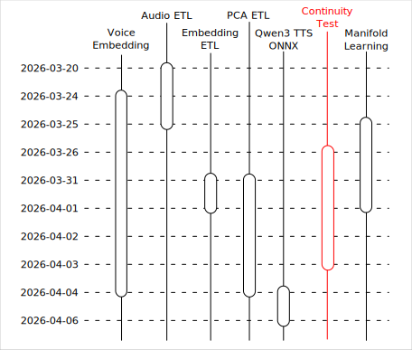

# Qwen3 TTS 之旅：連續性測試

<head>
  <meta property="og:image" content="https://raw.githubusercontent.com/FlySkyPie/flyskypie.github.io/main/post/2026-04-07_qwen3-tts-journey-continuity/00_cover.webp" />
</head>

這個文章是「Qwen3 TTS 之旅」系列的一部分，關於旅程的起因與整體概覽請見：

- [Qwen3 TTS 之旅：序](https://flyskypie.github.io/posts/2026-04-06_qwen3-tts-journey-prologue/)

本文僅覆蓋「連續性測試」相關的主題。

## 連續性測試

下述內容與其他文章有高度關聯，缺乏上下文的情況可能很難理解。

關於通用 GPU 加速與標準化請見：

[Qwen3 TTS 之旅：語音嵌入](https://flyskypie.github.io/posts/2026-04-06_qwen3-tts-journey-voice-embedding/)

關於資料視覺化請見：

[Qwen3 TTS 之旅：資料視覺化](https://flyskypie.github.io/posts/2026-04-07_qwen3-tts-journey-pca/)

---

採集兩個人的聲音（例如：一男一女），並對其進行嵌入運算得到嵌入向量，再兩個向量進行線性內插。

將內插的數個向量分別給予 Voice Clone 模型進行運算，會得到「女 100% + 男 0 %」、「女 90% + 男 10 %」...的聲音，如果空間是連續的，理應得到一個漸近改變聲音的過程。

這是一個進行視覺化以前就應該先進行的基本測試，不論是 AI 還是教授（？）都建議我先做這個測試。之所以一拖再拖的原因是我尚未完成 TTS 相關程式基礎設施的建立，包含通用 GPU 加速與標準化。所以不是很想在實驗內加入需要運行太多次 TTS 的步驟。

不過也因為這個測試意外的讓我發現嵌入伺服器實作有 bug。

## 測試結果

<iframe width="560" height="315" src="https://www.youtube.com/embed/Xhi-LD_LCio?si=0ccBP7Gbk4Krz9r1" title="YouTube video player" frameborder="0" allow="accelerometer; autoplay; clipboard-write; encrypted-media; gyroscope; picture-in-picture; web-share" referrerpolicy="strict-origin-when-cross-origin" allowfullscreen></iframe>

它並沒有很明顯的漸進，因此我們可以知道特徵空間不是線性的，不過也沒有出現「非人聲音」或是 TTS 故障的現象，可以肯定空間至少是連續的。

至於女聲跟男聲在 60~70%時劇烈變化，問題原因可能在於兩個樣本處於空間的位置有關，

如果女聲的樣本距離男聲區很遠，自然大部份內插值都落於女聲區。
