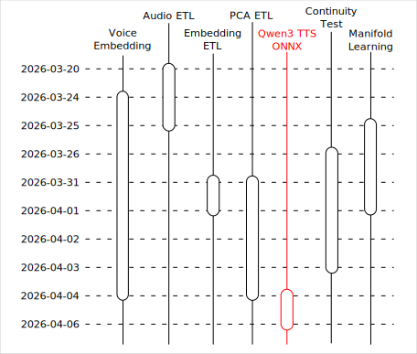
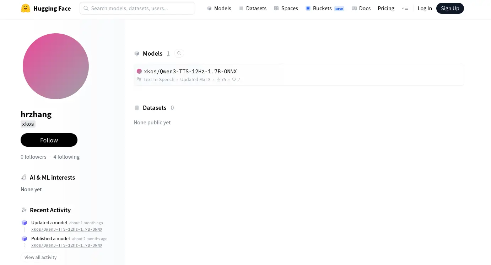
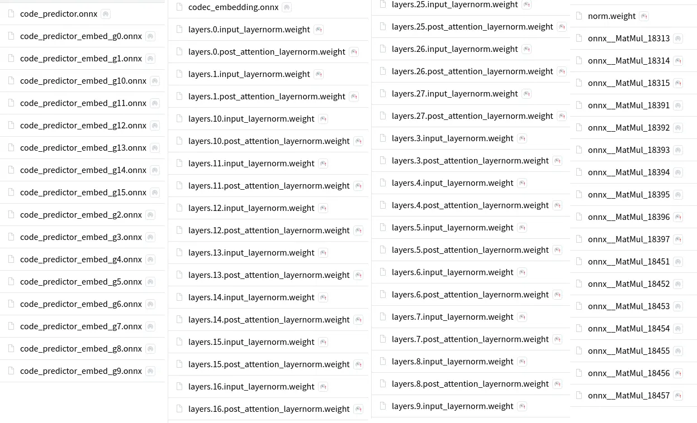
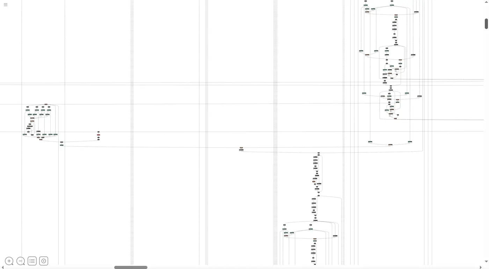

# Qwen3 TTS 之旅：標準化的嘗試

<head>
  <meta property="og:image" content="https://raw.githubusercontent.com/FlySkyPie/flyskypie.github.io/main/post/2026-04-07_qwen3-tts-journey-onnx/03_model-chunks.webp" />
</head>

這個文章是「Qwen3 TTS 之旅」系列的一部分，關於旅程的起因與整體概覽請見：

- [Qwen3 TTS 之旅：序](https://flyskypie.github.io/posts/2026-04-06_qwen3-tts-journey-prologue/)

並且預計是系列文章的收尾。



## 標準化

關於模型組件的標準化細節請見：

[Qwen3 TTS 之旅：語音嵌入](https://flyskypie.github.io/posts/2026-04-06_qwen3-tts-journey-voice-embedding/)

簡單來說，在在我的工作流程中，一個模型的標準化代表著：

- OCI (Open Container Initiative) 映像檔封裝，可以透過 Docker 或其他相同技術佈署。
- 可以透過 OpenAI-Compatible API 呼叫。
- 通用 GPU 加速，使用 Vulkan、WebGPU...等通用 GPU 界面實現硬體加速，避免被硬體供應商鎖定。
- 使用 Hugging Face SDK，除了分離程式碼與模型檔案管理的邏輯以外，可透過設定 HF_ENDPOINT 等參數指向鏡像站獲得本地下載加速。

從而將使用者的認知負荷降到最低，不論是實驗還是產品研發，調用者不用花費太多經歷在配置模型，這才符合我對「可用模型」的標準。換句話說，使用 CUDA 加速、凌亂的 Python 程式碼皆未達該門檻。

## Qwen3 TTS 的 ONNX 移植

ONNX 是目前我覺得最可靠的格式，雖然可以想像轉檔相關的工具必定存在，只是我還是稍微搜尋一下看有沒有現成實作，畢竟能不自己寫程式就不自己寫（？）

- [zukky/Qwen3-TTS-ONNX-DLL](https://huggingface.co/zukky/Qwen3-TTS-ONNX-DLL)
- [sivasub987/Qwen3-TTS-0.6B-ONNX-INT8](https://huggingface.co/sivasub987/Qwen3-TTS-0.6B-ONNX-INT8)
- [xkos/Qwen3-TTS-12Hz-1.7B-ONNX](https://huggingface.co/xkos/Qwen3-TTS-12Hz-1.7B-ONNX)
- [elbruno/ElBruno.QwenTTS](https://github.com/elbruno/ElBruno.QwenTTS)

DLL、C#、量化的方案不考慮，刪去法剃除後就只剩下 `xkos/Qwen3-TTS-12Hz-1.7B-ONNX` 看起來比較可行，但是它是 Hugging Face 上的野雞專案，作者也沒有提供足夠多的資訊構成公信力：



模型跟程式碼沒有分離，通通放在 Hugging Face 上，專案下也沒有足夠多的討論，這對我而言不夠成足夠多的可信度。

另一方面，`xkos` 的實作不知道為什麼比 Qwen3 官方的操作方式來得複雜，需要「預先生成」一些檔案。

## 安全性檢查

綜合上述上傳者缺乏公信力，程式碼又稱不上乾淨，模型相關的封裝全部擠在一個 1.3k 行的程式內，很難一眼看出有什麼問題，於是我用 [opengrep](https://github.com/opengrep/opengrep) 做了一個簡單的掃描：

```shell
$ opengrep scan --config auto . -v

    synthesize.py
   ❯❯❱ trailofbits.python.pickles-in-numpy.pickles-in-numpy
          Functions reliant on pickle can result in arbitrary code execution.  Consider using fickling or
          switching to a safer serialization method                                                      
          Details: https://sg.run/ryKe                                                                   
                                                                                                         
           64┆ data = np.load(args.speaker, allow_pickle=True)
                                
    tts_engine.py
   ❯❯❱ trailofbits.python.pickles-in-numpy.pickles-in-numpy
          Functions reliant on pickle can result in arbitrary code execution.  Consider using fickling or
          switching to a safer serialization method                                                      
          Details: https://sg.run/ryKe                                                                   
                                                                                                         
          559┆ data = np.load(cache_path, allow_pickle=True)
```

掃到的兩個 `pickle` 都是前面說的「預先生成的檔案」，可能問題不大。ONNX 本身似乎也有風險[^onnx-risk]，但是已經是相對安全的模型格式。

:::info
沒用 semgrep 的原因是因為：
```shell
$ podman run --rm -v "$PWD:/src" docker.io/semgrep/semgrep:1.157.0-nonroot semgrep ci
run `semgrep login` before using `semgrep ci` or use `semgrep scan` and set `--config`
There were errors during analysis but Semgrep will succeed because there were no blocking findings, use --no-suppress-errors if you want Semgrep to fail when there are errors.
```
開源軟體還要我登入？相關的故事可以在 Rddit 的討論上看到[^opengrep]。
:::

[^onnx-risk]: LobotoMl/ONNX_runtime_hacks at main · alkaet/LobotoMl. Retrieved 2026-04-07, from https://github.com/alkaet/LobotoMl/tree/main/ONNX_runtime_hacks

[^opengrep]: Opengrep - a truly Open Source fork of the Code Security tool Semgrep - Announced : r/devops. Retrieved 2026-04-07, from https://www.reddit.com/r/devops/comments/1i83yde/opengrep_a_truly_open_source_fork_of_the_code/

## 重構與壞味道

:::info
以下不是針對 `xkos`，而是就程式碼本身進行探討。因為他至少也是把程式跟模型上傳給別人使用了，也有標記 Qwen3 TTS 原本的開源許可證，所以以下就稱呼他為「熱心鄉民」。
:::

為了封裝成 API 伺服器，我需要對熱心鄉民的程式碼進行重構，抽出我用得上的邏輯，因為並不是所有 Qwen3 TTS 的模型我都需要，我只需要負責 Voice Clone 的模型。

### 程式碼與模型未分離

即便是 Qwen3-TTS 官方也是採取[程式碼](https://github.com/QwenLM/Qwen3-TTS)與[模型](https://huggingface.co/collections/Qwen/qwen3-tts)分離的策略。

熱心鄉民則是將程式碼與模型一同上傳到 Hugging Face，並且手刻 `os.path.join` 來讀取模型，同時將未量化模型與量化模型放在同一個 repo 內。

Qwen3-TTS 官方至少也是採取 1.7B 和 0.6B 兩種大小的模型分開來放的措施。

透過 Hugging Face SDK 實現程式與模型解偶除了我前面提到的可以用環境變數指定鏡像來源以外，還能在程式內實作「有用到才下載」的邏輯，這種整包上傳的方式，不是只能用 Git LFS 一次下載就是要一個手動挑選檔案，不管怎樣都不是應該發生在 Hugging Face SDK 已經成為實質產業標準的現代，屬於非常不成熟的作法。

### 違反使用直覺的封裝

在 Qwen3-TTS 的官方實作使用模型是像這樣的：

<details>
<summary>Sample Code</summary>

```python
model = Qwen3TTSModel.from_pretrained(
    "Qwen/Qwen3-TTS-12Hz-1.7B-CustomVoice",
    device_map="cuda:0",
    dtype=torch.bfloat16,
    attn_implementation="flash_attention_2",
)

# single inference
wavs, sr = model.generate_custom_voice(
    text="其实我真的有发现，我是一个特别善于观察别人情绪的人。",
    language="Chinese", # Pass `Auto` (or omit) for auto language adaptive; if the target language is known, set it explicitly.
    speaker="Vivian",
    instruct="用特别愤怒的语气说", # Omit if not needed.
)
```

```python
model = Qwen3TTSModel.from_pretrained(
    "Qwen/Qwen3-TTS-12Hz-1.7B-VoiceDesign",
    device_map="cuda:0",
    dtype=torch.bfloat16,
    attn_implementation="flash_attention_2",
)

# single inference
wavs, sr = model.generate_voice_design(
    text="哥哥，你回来啦，人家等了你好久好久了，要抱抱！",
    language="Chinese",
    instruct="体现撒娇稚嫩的萝莉女声，音调偏高且起伏明显，营造出黏人、做作又刻意卖萌的听觉效果。",
)
```

```python
model = Qwen3TTSModel.from_pretrained(
    "Qwen/Qwen3-TTS-12Hz-1.7B-Base",
    device_map="cuda:0",
    dtype=torch.bfloat16,
    attn_implementation="flash_attention_2",
)

ref_audio = "https://qianwen-res.oss-cn-beijing.aliyuncs.com/Qwen3-TTS-Repo/clone.wav"
ref_text  = "Okay. Yeah. I resent you. I love you. I respect you. But you know what? You blew it! And thanks to you."

wavs, sr = model.generate_voice_clone(
    text="I am solving the equation: x = [-b ± √(b²-4ac)] / 2a? Nobody can — it's a disaster (◍•͈⌔•͈◍), very sad!",
    language="English",
    ref_audio=ref_audio,
    ref_text=ref_text,
)
```
</details>

每一種模型的使用都非常直觀。

反觀熱心鄉民的程式長這樣：

```shell
# Step 1: Generate Global Cache (one-time) 
python generate_cache.py --model_dir ./model

# Step 2: Create Speaker Profile (once per voice) 
Step 2: Create Speaker Profile (once per voice) 
python create_speaker.py \
    --model_dir ./model \
    --ref_audio reference.wav \
    --ref_text "Transcript of the reference audio" \
    --language english \
    --output ./speakers/my_voice.npz

# Step 3: Synthesize Speech 
python synthesize.py \
    --model_dir ./model \
    --speaker ./speakers/my_voice.npz \
    --text "The weather is wonderful today." \
    --output output.wav
```

讓我無法理解的是 `generate_cache.py` 的設計，如果這是一個 pure function 每次都產生一樣的東西，那為什麼不乾脆做成模型直接載入，更別提為什麼 Qwen3 TTS 的官方實作就沒有這個問題？

當然，這可能是我對 ONNX 的理解還不夠深入而產生的疑問。

### 上帝物件

在熱心鄉民的程式碼中，`tts_engine.py` 總計 1.3k 行的程式碼中包含了一個 1k 行的 `Qwen3TTSONNXInference` class，同時處理了以下幾種模型：

- 16f量化/原始
  - `speaker_encoder.onnx`
  - `speech_tokenizer_decoder.onnx`
  - `speech_tokenizer_encoder.onnx`
  - Vocie Design/Voice Clone
    - `code_predictor.onnx`
    - `code_predictor_kv.onnx`
    - `text_embedding`

至少 18 種排列組合，表面上在遵守 DRY 原則：避免重複撰寫載入模型的程式，但是實際上卻因為缺乏抽象，內部充滿大量的 `if` 判斷式，讓整個實例的狀態與可能性變得非常臃腫且不好輕易理解狀態變化。

舉例來說 `def get_codec_embedding(self, input_ids: np.ndarray) -> np.ndarray:` 的 call stack 需要追朔如下這麼多層才知道到底是用哪一個模型計算的：

```python
# self.get_codec_embedding
# self.codec_embedding
# models["codec_embedding"]
# models = self._vc_models
# self._vc_models = self._load_talker_set(self.onnx_vc_dir, "voice_clone")
# self._load_talker_set
# result[name] = ONNXInferenceSession(path, self.use_gpu)
# ("codec_embedding", "codec_embedding.onnx"),
```

`某某Service` 或 `某某Repository` 這在後端的軟體開發中是十分常見的模式，就算不使用反轉注入或工廠模式那種高深的 OOP 技巧，單純的根據職責切割、輾平也不會寫出這種毫無工程美感的程式碼。

:::info
我知道實務上超過一萬行的 class 並不罕見，但是以現代開發的建議來說，500 行以上就算多了[^eslint-lines]。
:::

[^eslint-lines]: max-lines - ESLint - Pluggable JavaScript Linter. Retrieved 2026-04-07, from https://eslint.org/docs/latest/rules/max-lines

### 可疑且意義不明的模型拆分

最後我終於碰到了放棄前的最後一個障礙：

```
(…)main/onnx/voice_clone/talker_decode.onnx: 100%|████████████████████████████████████████████████████████████████████████████████████████| 1.72M/1.72M [00:05<00:00, 308kB/s]
2026-04-05 22:51:44.604204820 [W:onnxruntime:, session_state.cc:1327 VerifyEachNodeIsAssignedToAnEp] Some nodes were not assigned to the preferred execution providers which may or may not have an negative impact on performance. e.g. ORT explicitly assigns shape related ops to CPU to improve perf.
2026-04-05 22:51:44.604225200 [W:onnxruntime:, session_state.cc:1329 VerifyEachNodeIsAssignedToAnEp] Rerunning with verbose output on a non-minimal build will show node assignments.
2026-04-05 22:51:45.667070708 [E:onnxruntime:, inference_session.cc:2600 operator()] Exception during initialization: filesystem error: cannot get file size: No such file or directory [/home/flyskypie/.cache/huggingface/hub/models--xkos--Qwen3-TTS-12Hz-1.7B-ONNX/snapshots/6023a58eba391c4e2dbe7ff2dd73fbc9f039c76e/onnx/voice_clone/layers.10.input_layernorm.weight]
```

熱心鄉民的 repo 內充滿了這種意義不明的小檔案：



原本我想說可能是上傳了一些中間文件，可能最後根本用不到，事實證明這些檔案是有仰賴關係的。

我試著用 [netron](https://github.com/lutzroeder/netron) 觀察 ONNX 檔案的模型結構，但是並沒有太大幫助：



注意右邊和下方的捲軸塊，顯示這是一張**十分**巨大的結構圖，可見這個 ONNX 模型似乎以非常不自然的方式被呈現。

接下來合理的方案應該是放棄熱心鄉民的實作，直接自己轉 ONNX，不過想必有額外不少知識需要理解，也不知道需要花多少時間，於是我決定這個旅途先到此為止。

## 小結

過程中的幾個 ETL 步驟的程式碼我整理過之後上傳 GitHub 歸檔了：

https://github.com/FlySkyPie/qwen3-tts-etl

這一系列文章其實也是寫給我自己的紀錄，方便過一陣子之後回來處理這個主題的時候可以透過文字回憶一下細節。

---

在「序」中，我提到了整個旅途是因 Qwen3 Voice Embedding 而起，不過實際上還有其他原因。

我對於包含建造仿生人形機器人在內以及 TTS 等技術都有興趣，這個部份的情感與思緒比較複雜，改天有機會再談。今天先談「資料專案」的部份。

工作的時候因為公司內部的 AI 專案做準備，當時讀了不少資料，其中一個鐵人 30 天系列我很推薦：

[吵什麼 AI 煉金術？！你家有礦嗎？(資料領域必知的 30 個詞彙) :: 2023 iThome 鐵人賽](https://ithelp.ithome.com.tw/users/20161790/ironman/6320)

雖然內容缺乏組織，但是我認為建立基本概念以及提供足夠多的領域關鍵字上是十分適合的入門材料，ETL 跟資料專案的概念我就是從這系列文章為起點建立起來的。

求職未果後，我便想著我似乎還沒跑過一次資料專案，手上剛好有著一個資料集以及可以用來玩它的嵌入模型，就想著當著模擬跑一遍流程試試看，反正 S3 實例、PyPi 鏡像、Hugging Face 鏡像...等等資料專案大概會用到的基礎設施我都準備好了。

很遺憾花了兩個多禮拜並沒有達到我一開始預期的進度，不過我還有其他主題需要處理，只好先寫文章把結果做個整理之後先告一段落了。
