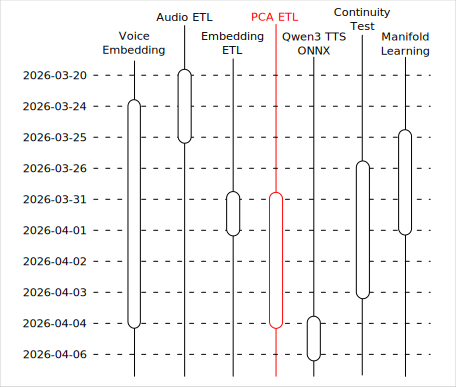
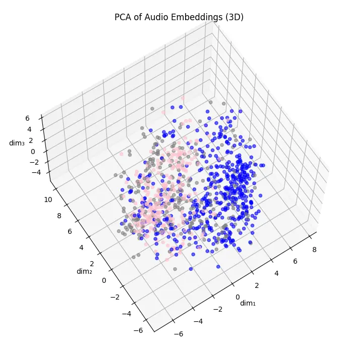
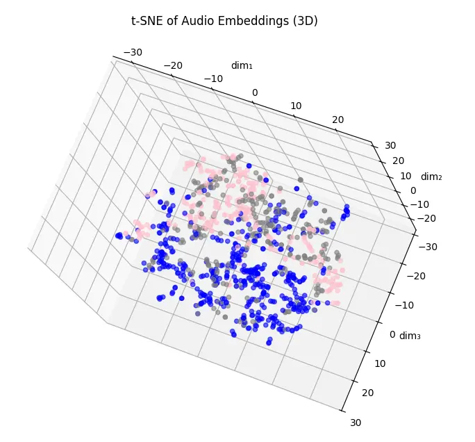
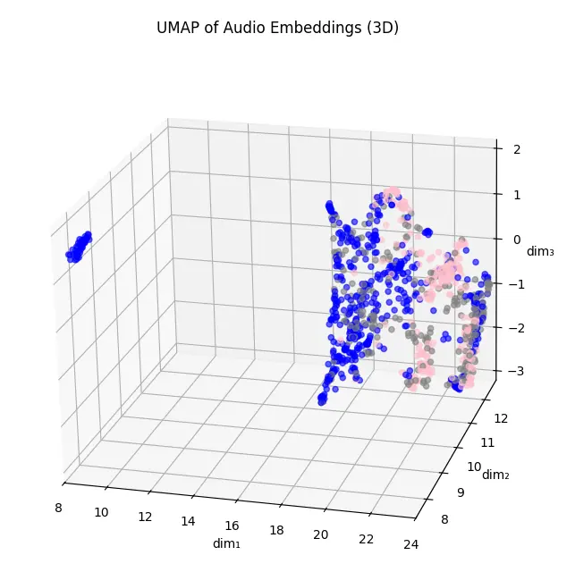
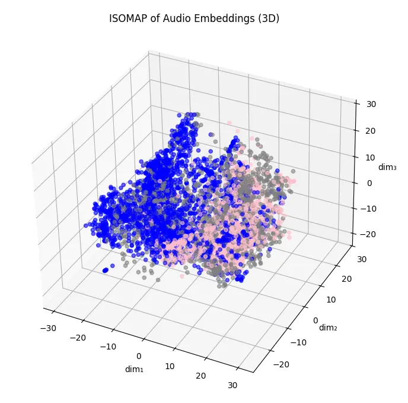
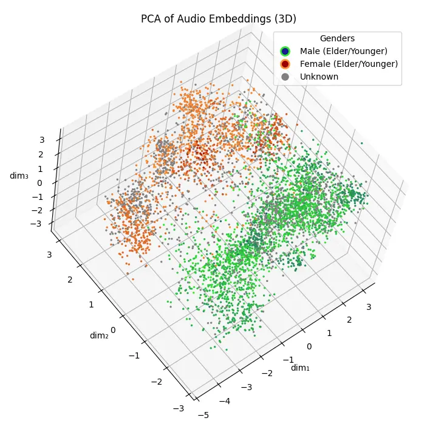

# Qwen3 TTS 之旅：資料視覺化

<head>
  <meta property="og:image" content="https://raw.githubusercontent.com/FlySkyPie/flyskypie.github.io/main/post/2026-04-07_qwen3-tts-journey-pca/07_PCA.webp" />
</head>

這個文章是「Qwen3 TTS 之旅」系列的一部分，關於旅程的起因與整體概覽請見：

- [Qwen3 TTS 之旅：序](https://flyskypie.github.io/posts/2026-04-06_qwen3-tts-journey-prologue/)

資料處理的幾個前置作業請見：

- [Qwen3 TTS 之旅：資料集預處理](https://flyskypie.github.io/posts/2026-04-06_qwen3-tts-journey-audio-etl/)
- [Qwen3 TTS 之旅：資料集嵌入](https://flyskypie.github.io/posts/2026-04-06_qwen3-tts-journey-embedding-etl/)

本文僅覆蓋「使用主成份分析進行資料視覺化」相關的主題。

## PCA

主成份分析 (PCA, Principal component analysis) 簡單來說是一種對資料進行線性降維的技巧。

在開始寫程式之前我有稍微學習一下相關理論，學習筆記放在其他文章，細節我就不再此贅述：

[Qwen3 TTS 之旅：流形學習](https://flyskypie.github.io/posts/2026-04-06_qwen3-tts-journey-manifold-learning/)

如果知道 PCA 原理的話大概可以直觀的發覺它不適合直接套用在 140k 筆 2048 維資料上，實際上可能需要使用增量 PCA (Incremental PCA)，並搭配 [joblib](https://github.com/joblib/joblib) 實現持久化與斷點續傳之類的機制。

不過為了驗證整個流程的可行性，在正式跑以前，我先抽比較小的樣本直接跑 PCA，或是搭配其他非線性算法。

## 抽樣失敗

以下是我第一次嘗試，抽樣 1000 個資料跑 PCA 的結果：

我原本以為是資料原本特性的關係，所以試著跑 PCA 降到 50 維，再跑幾個非線性的降維：

不過結果都不太理想。

## 累積解釋變異圖

累積解釋變異圖 (Cumulative Explained Variance) 是根據特徵值大小推論不同維度主成份的「資訊量」（或理解為「影響力」）：

綠色是每一個主成份的資訊量佔比，紅色曲線是把前 N 個主成份的佔比累計，上述的「取 50 維」是根據這個圖表中佔比 75% 對應的主成份數得來的。

## 抽樣成功

後來在做連續性測試的時候才發現嵌入伺服器實作有問題，簡單來說就是 Garbage in, garbage out 的具體例子，細節不在此贅述，請見其他文章：

[Qwen3 TTS 之旅：語音嵌入](https://flyskypie.github.io/posts/2026-04-06_qwen3-tts-journey-voice-embedding/)

修復後重新跑一遍終於正常了，男聲和女聲的差異在三個主成份以內就能分離：

