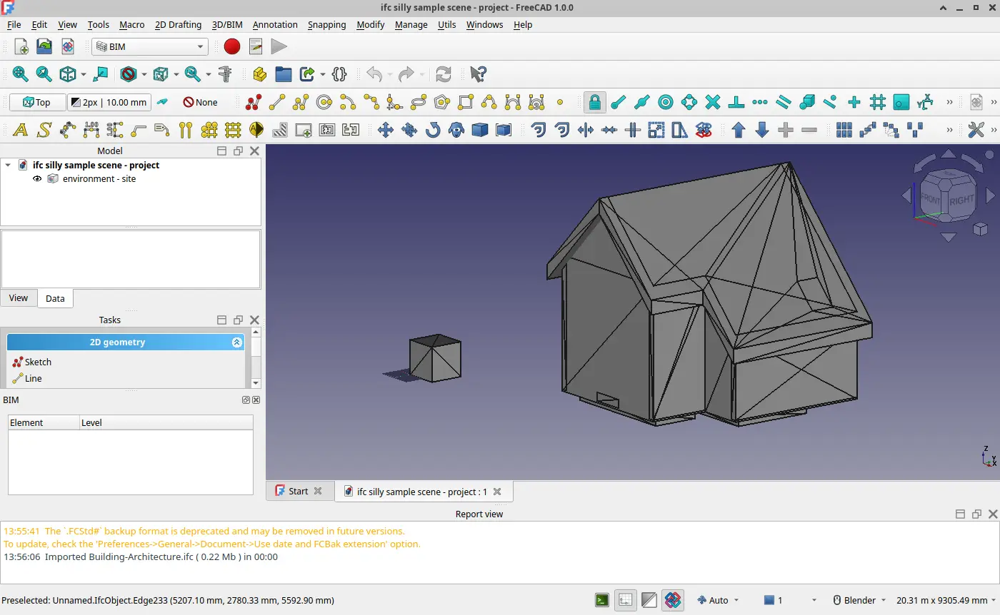
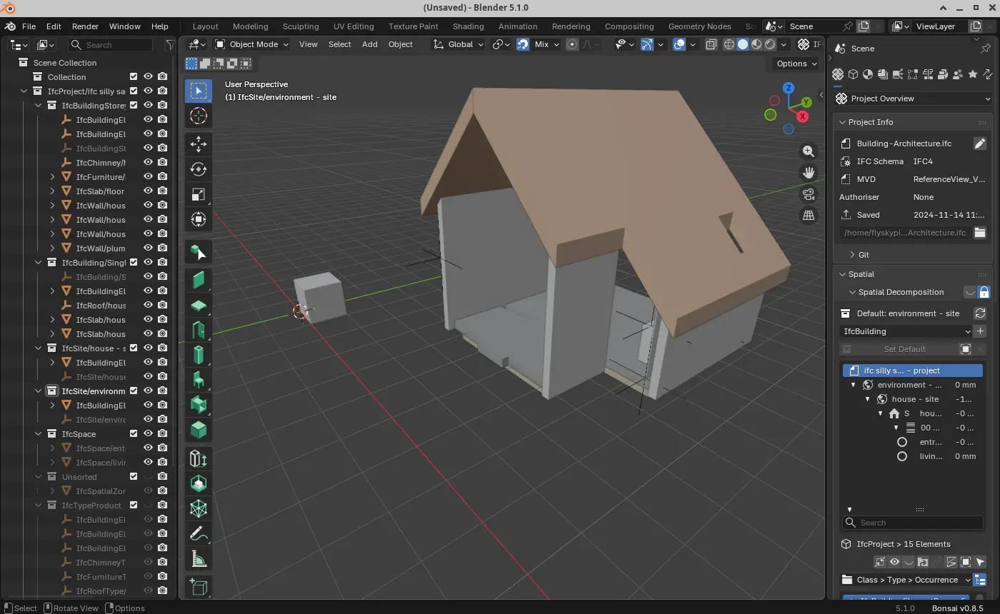
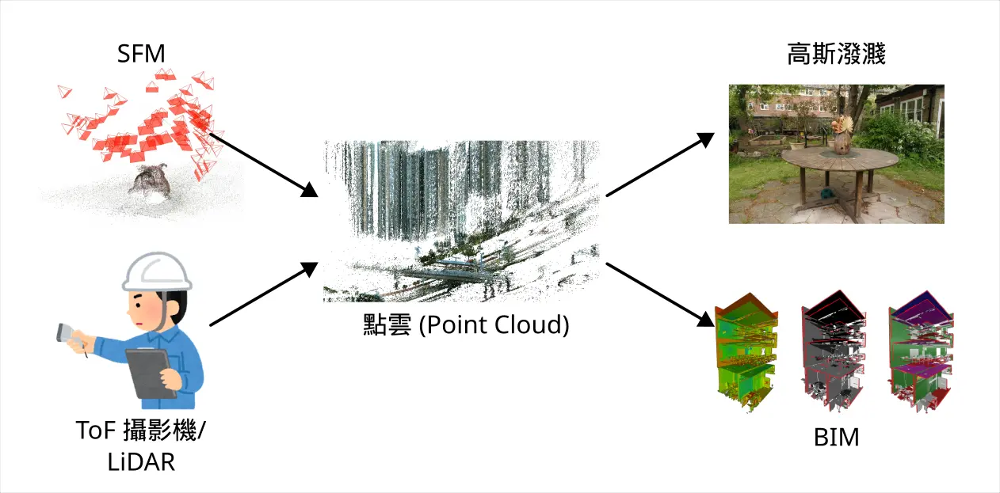
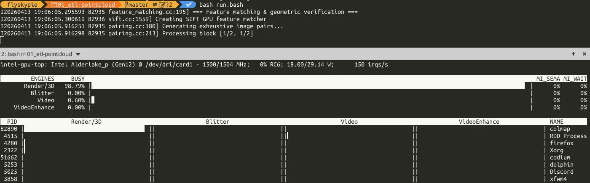
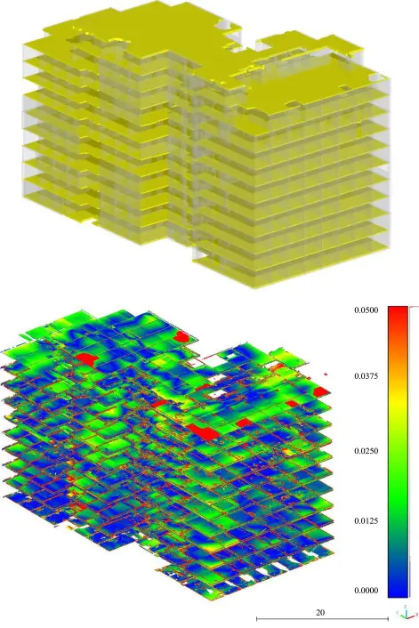

# 新的坑：Scan to BIM

<head>
  <meta property="og:image" content="https://raw.githubusercontent.com/FlySkyPie/flyskypie.github.io/main/post/2026-04-14_scan-to-bim/04_blender.webp" />
</head>

:::info
實際上花了一兩天摸索之後，這個坑大概是填不完了，但是姑且還是紀錄一下。
:::

## 起因

最近在 104 看到這樣一個職位描述：

> **Digital Twins Engineer**
> 
> Scope of Work
> 
> - Integrate outsourced BIM/3D models into the ██████████ platform.
> - Develop capabilities to bind dynamic data (e.g., IoT sensor data, system states) to 3D models and visualize them.
> - Embed LLM use-cases into DT scenarios—e.g., natural-language queries for asset status, simulation results, or triggering operations.
> - Partner with frontend/UX to optimize DT UI/UX and 3D rendering.
> - Work with backend/data teams to ensure efficient DT data flows.
> - Participate in DT PoCs to explore and realize innovative applications.
> - Ensure DT solution performance, stability, and scalability.
> 
> Qualifications
> 
> - Proficient in at least one backend or frontend language (e.g., Python, C#, JavaScript/TypeScript).
> - Knowledge of 3D graphics and at least one 3D engine/library (e.g., Unity, Unreal Engine, Omniverse, Three.js, Babylon.js).
> - Experience with data integration and APIs (RESTful, WebSocket).
> - Understanding of BIM/CAD formats (e.g., IFC, Revit API) and processing workflows.

你知道嗎？我本來就想在我的房間搞數位孿生了，看來這就是我的下一個題目了！

## 工欲善其事，必先利其器

正如我在前一篇文章（[從 DDD 看檔案格式](https://flyskypie.github.io/posts/2026-04-15_ddd-formats/)）中提到的，打開領域的第一步是先找檔案跟軟體。

從職缺內容來看 IFC (Industry Foundation Classes) 應該就是這次的重點關注檔案格式了，這些地方可以找到 ifc 的檔案樣本：

- https://github.com/buildingSMART/Sample-Test-Files
- https://github.com/youshengCode/IfcSampleFiles
- https://www.steptools.com/docs/stpfiles/ifc/



並且目前看起來最可靠的開源編輯器方案是 [Bonsai](https://bonsaibim.org) （原名 BlenderBIM），它是一個 [Blender 插件](https://extensions.blender.org/add-ons/bonsai/)，IFC 的相關實作則是由 [IfcOpenShell](https://github.com/ifcopenshell/ifcopenshell) 提供。



接下來就是用 Bonsai 繪製我的房間了嗎？我可不這麼認為。

## Scan to BIM

現在是 2026 年；「AI」依然大行其道；泡沫尚未被戳破；X 上充滿了高斯潑濺、實景掃描、三維重建的貼文，IFC 總該能透過演算法從點雲自己生出來了...吧？

事實是，就算撇開 AI 不談，Scan to BIM 也已經是在 AEC (Architecture Engineering Construction) 業界內存在已久的詞彙，用來描述「從現實掃描並建立 BIM (Building Information Modeling)」的過程，不過傳統上這個過程可能是指：把點雲匯入軟體後，由工程師拉出批配的模型，比較接近機械逆向工程的作法。

OK，所以接下來就是要研究 Scan to BIM 的方案了對吧？

我：`( ՞ټ՞)`



事情是這樣的，在 AEC 領域，掃描通常由 ToF 攝影機或光達 (LiDAR) 這樣的專門設備完成，而我只能透過 SFM (Structure-from-Motion) 的手段獲得點雲。SFM 使用二維圖像回推三維資訊的技術，講白化來說就是我可以用手機拍影片、切成一堆圖片、經過 SFM 處理來獲得點雲。

高斯潑濺 (3DGS, 3D Gaussian Splatting) 可以向一個點雲填充額外的機率資訊，最後呈現出一種現代 3D 渲染技術所不能企及的寫實度，就像一張 3D 的照片，是近幾年日漸熱門的一種技術。因為 SFM 是主流高斯潑濺資料處理流程的一部分，加上這是一個我之前就有興趣但是沒有花心思跑過的技術，所以我打算在執行 Scan to BIM 之前先試著跑一次 SFM 到高斯潑濺的路徑。

## SFM

SFM 的經典工具是 [colmap](github.com/colmap/colmap)，比較遺憾是它在 GitHub 的 release 中預編譯的 release 只有 Windows 的，並且計算過程仰賴 CUDA，2024 年使用它的時候可是稍微折騰了一番。

不過「去 CUDA」是我目前的主要原則，姑且還是在沒有 CUDA 的環境硬著頭皮編譯跟跑下去了，讓我有點意外是，無 CUDA 版本依然會使用 GPU 加速：



不知道這是本來就有；但是我在 2024 遺漏掉的特性，還是這是近一兩年內新加入的能力。

整個流程大概是這樣：

```shell
mkdir -p output
ffmpeg -i video.mp4 -qscale:v 1 -qmin 1 -vf fps=2 ./images/%04d.jpg

mkdir -p ./data
colmap database_creator --database_path ./data/database.db

colmap feature_extractor \
    --database_path ./data/database.db \
    --image_path ./images

colmap exhaustive_matcher \
    --database_path ./data/database.db

mkdir -p ./data/sparse
colmap mapper \
    --database_path ./data/database.db \
    --image_path ./images \
    --output_path ./data/sparse 

colmap bundle_adjuster \
  --input_path ./data/sparse/0 \
  --output_path ./data/sparse/0 \
  --BundleAdjustment.refine_principal_point 1

colmap gui \
    --database_path ./data/database.db \
    --image_path ./images \
    --import_path ./data/sparse/0
```

:::info
話說回來，我之前使用過得經驗其中幾次是針對 360 影像修改過得 fork ([json87/spheresfm](https://github.com/json87/spheresfm))就是了。
:::

## 高斯潑濺

試著用了比較有名的實作 [nerfstudio](https://github.com/nerfstudio-project/nerfstudio)

```shell
ns-process-data video --data source.mp4 --output-dir processed_data

ns-train splatfacto --data processed_data
```

第一個指令實際上是 colmap 的封裝，所以還是要先安裝 colmap。比較遺憾的是第二個指令高度仰賴 CUDA。來回翻了一下其他方案，**全部**都仰賴 CUDA。

[Taichi Lang](https://github.com/taichi-dev/taichi) 是一個 GPU API 的高級封裝，允許開發者可以用較簡單的程式使用 GPU 進行平行化運算，並且支援 Vulkan 作為運算後端[^taichi]

後來我找到了 [wanmeihuali/taichi_3d_gaussian_splatting](https://github.com/wanmeihuali/taichi_3d_gaussian_splatting)，一個使用 Taichi 的高斯潑濺實作，然而其程式碼依然使用了不少 PyTorch + CUDA，感覺去 CUDA 的成本依然很高，因為我對 GPU 平行化運算跟機器學習的程式相對陌生，所以試著玩高斯潑濺的念頭至此打消了。

[^taichi]:Taichi 和 PyTorch 有哪些相似和不同？ - 知乎. Retrieved 2026-04-15, from https://www.zhihu.com/question/535601383

## Scan to BIM

建了一個口袋名單之後抽從星星數比較高的抽出來看，打開 [LTTM/Scan-to-BIM](https://github.com/LTTM/Scan-to-BIM) 就看到滿滿的：

```python
'cuda' if torch.cuda.is_available() else 'cpu'
```

因為沒有 CUDA 就不讓我用 GPU 加速，那我乾脆不要用好了，下一個。

[VaclavNezerka/Cloud2BIM](https://github.com/VaclavNezerka/Cloud2BIM) 雖然沒看到 CUDA 的影子，不過它有其他問題，它在 README 提供的點雲檔案是 Kladno station：


然而預設組態與論文內使用的是 Hotel Opatov：



看起來是一個結構與格局相對方正的建築，讓我不禁懷疑這個算法處理像我房間這種堆放各種物品空間的可靠性，更重要的是它的 README 還寫著：

> This repository contains the foundational open-source research version of the Cloud2BIM algorithm. An advanced, production-ready version of this software, Cloud2BIM-AI, is now available through Constriq (a Czech Technical University spin-off).

看來這是典型的「開源的心不甘情不願」的那種專案。
