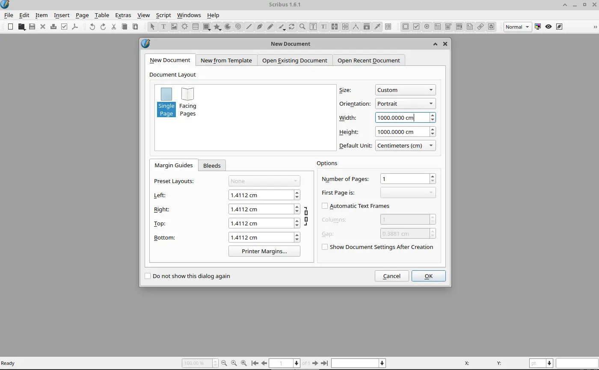
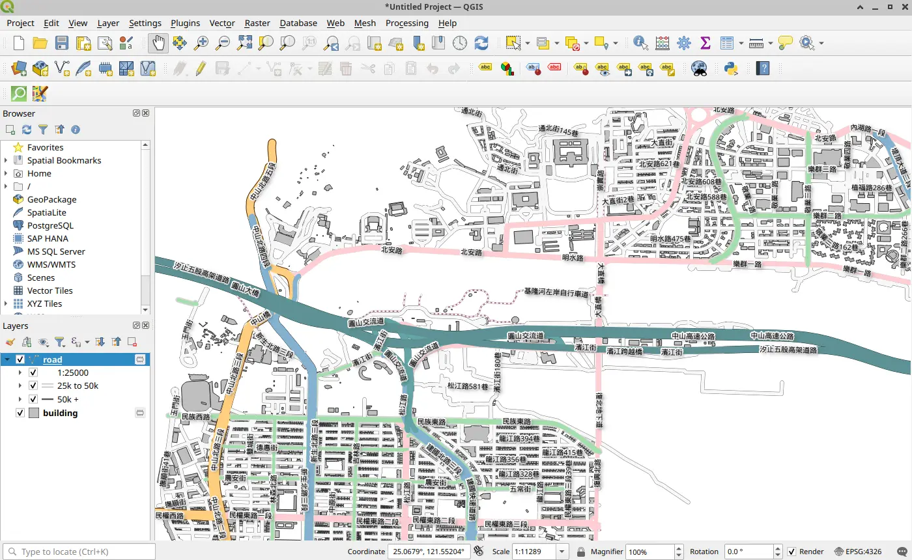
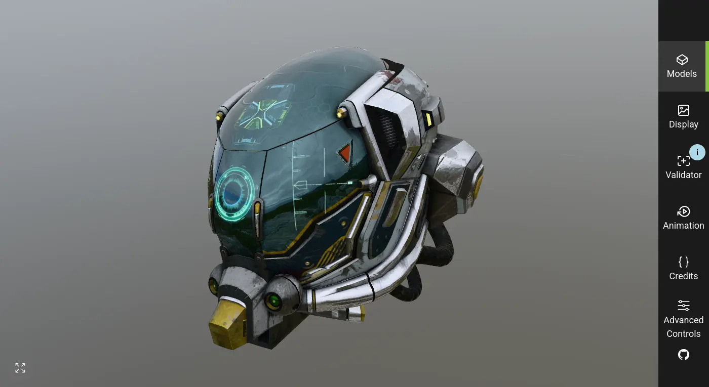
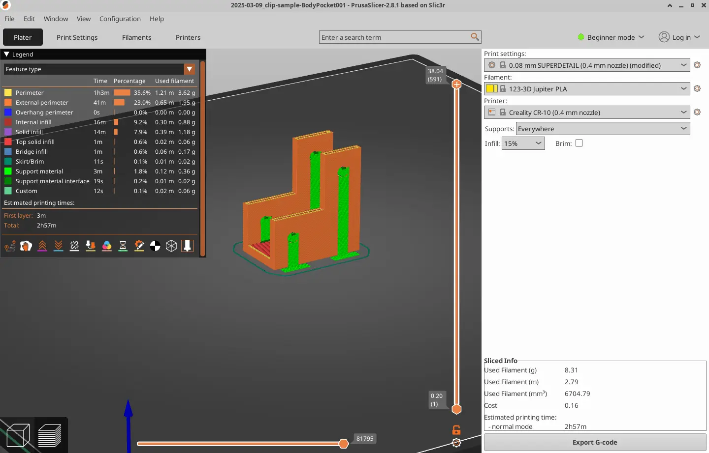
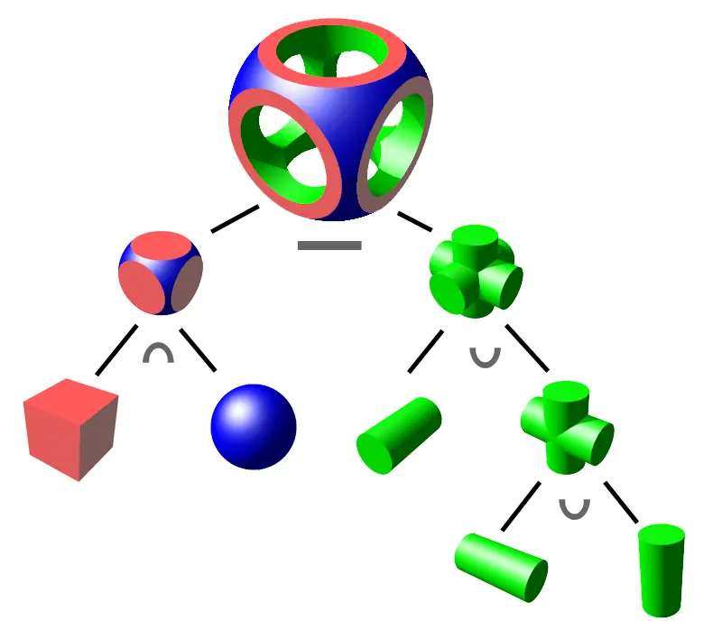

# 從 DDD 看檔案格式

<head>
  <meta property="og:image" content="https://raw.githubusercontent.com/FlySkyPie/flyskypie.github.io/main/post/2026-04-15_ddd-formats/03_gltf-viewer.webp" />
</head>

> 工欲善其事，必先利其器

當要和（主觀視角）未知的檔案格式打交道的時候，必定要先準備好：開啟檔案的軟體與檔案樣本。

:::info
「開啟檔案的軟體」可透過 Editor, Reader, Browser, Viewer ...等關鍵字尋找。
:::

從領域驅動開發 (DDD, domain-driven design) 的視角來看，針對特定用例設計的檔案格式其實封裝了大量的領域模型，而能打開檔案的軟體則是提供最直觀的方式讓人理解這些領域模型，這些軟體可以說是領域大門的鑰匙。

檔案樣本是用來驗證多個軟體可靠性的，因為在開源的世界裡沒有「唯一解」只有「相對有用解」，在某些情況甚至需要同時使用多個軟體，因為每一個軟體可能是針對特定的用例設計。

以下舉幾個我過去實際接觸過得例子。

##  大圖輸出、廣告帆布 - PDF

「列印要匯出成 PDF 檔案」大概是這個時代的常識，不過如果是「10 公尺×10 公尺」這種 PDF 呢？不幸的是一般的開源 PDF 瀏覽器無法正常瀏覽這種類型的 PDF，而且這種 PDF 的樣本也不好取得。

Inkscape 屬於向量繪圖軟體；
LibreOffice Draw 仍是偏向辦公文書處理的圖像軟體；
Okular, Gnome Evince 是 PDF 瀏覽器，但是無法正常在「10 公尺×10 公尺」這種檔案中縮放瀏覽。

上述軟體或多或少都能處理 PDF 的部份用例，但是就是無法覆蓋「10 公尺×10 公尺」這種 PDF，原因是這是一個名為桌面排版軟體 (DTP, Desktop publishing) 的領域。

[Scribus](https://www.scribus.net/) 的定位則剛好屬於這個領域，因此用它可以輕易的產生與遊覽「10 公尺×10 公尺」這樣的樣本。

:::info
以上資訊源自於和廣告帆布業者相關的軟體開發經驗。
:::

## GIS - GeoJSON

[GeoJSON](https://geojson.org/) 是 GIS (Geographic Information System) 使用的經典檔案交換格式。

:::info
Mapbox 的 [Vector Tile](https://github.com/mapbox/vector-tile-spec) 本質上是透過 Protocol buffers 封裝的 GeoJSON。
:::

從規範的層面你可以去翻閱 [RFC 7946](https://datatracker.ietf.org/doc/html/rfc7946)，從函式庫的層面可以使用諸如 `@types/geojson` 來獲得封裝好的 Typescript 界面。

OSM (OpenStreetMap) 本身是一個豐富的 GIS 資料來源，QGIS 本身是一個用於瀏覽與編輯 GIS 資料的軟體，同時能夠透過它從 OSM 提取特定地區的資料並儲存成 GeoJSON[^qgis-geojson]。

線上的工具也有像是 [geojson.io](https://geojson.io) 這樣的網站可以產生與預覽小型的 GeoJSON 資料。

:::info
以上資訊源自於林木業 GIS 解決方案相關的軟體開發經驗。
:::

[^qgis-geojson]: How to download OSM data using QuickOSM Plugin in QGIS. Retrieved 2026-04-15, from https://www.giscourse.com/how-to-download-osm-data-using-quickosm-plugin-in-qgis/

## Web3D - glTF

如果你想要在網頁上渲染一個 3D 模型，將模型輸出成 glTF 是標準方案之一，通俗的描述這個檔案格式為「3D 的 JPEG」。

glTF 的檔案樣本：

https://github.com/khronosgroup/gltf-sample-models

glTF 的線上瀏覽器：

https://gltf-viewer.donmccurdy.com/ （較舊）
https://github.khronos.org/glTF-Sample-Viewer-Release/ （較新）

當然，glTF 不只用於 Web 應用，你也可以使用其他軟體匯入或是開啟，但是當要開發 Web3D 應用時，3D 的渲染能力受限於遊覽器，因此使用上述兩個線上（基於瀏覽器）的瀏覽方案更能一併測試「在瀏覽器 runtime」下的渲染效果。

:::info
以上資訊源自於基於 Three.js 應用程式的開發經驗。
:::

## 機械工程 - CAD

我拿一般平面的圖檔來比喻，常見的圖檔這這幾種，具有不同的特性：

- JPG：有損壓縮點陣圖，用於呈現給人類看，實際上有部份資訊會丟失。
- PNG：無損壓縮點陣圖，能夠保留原始像素資訊。
- SVG：向量圖，不像點陣圖放大後會變成馬賽克，向量圖以幾何參數的方式儲存影像。

前面介紹的 glTF 可以說是 3D 的 JPG，而 STEP 則是 3D 的 SVG。一種典型的 3D 描述方式是用三角面近似各種幾何體，就像用多邊形近似圓形這樣，但是在工業製造這種對精細度有要求的產業中，用這種近似方式滿足產業需求的話需要**非常大量**的三角面，檔案儲存效率非常差勁，所以會用 STEP 這樣的檔案，以儲存幾何參數來交換 3D 模型。

以下是可獲得一些 STEP 檔案樣本的地方：

- https://www.steptools.com/docs/stpfiles/ap203/index.html
- https://www.steptools.com/docs/stpfiles/ap214/index.html
- https://www.nist.gov/ctl/smart-connected-systems-division/smart-connected-manufacturing-systems-group/mbe-pmi-0

可以打開 STEP 的線上工具也不少：[Online3DViewer](github.com/kovacsv/Online3DViewer)、Autodesk Viewer、Onshape。本機軟體則有像 FreeCAD 這樣的軟體可以用來打開 STEP 檔案。

不過 STEP 是一個難搞檔案格式，它有很多細部的規範：

| AP 編號 | 名稱說明 |
| --- | --- |
| AP203 | Configuration controlled 3D design |
| AP210 | Electronic assembly design |
| AP214 | Automotive mechanical design |
| AP218 | Ship arrangement (造船) |
| AP219 | Electrical harness design |
| AP220 | Process plans and resources |
| AP232 | Mechanical product definition (tolerance) |
| AP238 | STEP-NC (CNC加工) |
| AP242 | Managed model-based 3D engineering |

即便是像 Autodesk 或 Onshape 這種專門在這個領域深耕的公司，它們的軟體也會有一些細部特性不支援。

程序化操作 STEP 檔案的函式庫則有 OCCT (Open CASCADE Technology)，不過它的兩個 Python binding ([pyocct](https://github.com/trelau/pyOCCT) 和 [pythonocc](https://github.com/tpaviot/pythonocc)) 都僅支援 conda 安裝，為了在符合 Python 標準的環境下運行可能需要混合使用 micromamba 和 venv 等工具將 conda 的套件和 PyPI 的套件放在同一個生產專案中使用。

額外補充，FreeCAD 本身有一個 Python 的終端機，可以用來腳本化操作 CAD 軟體，同時也可以透過一些方式把這些函式庫從 Python 直接 import 進來使用。要注意的是 1.0.0 前後組織 Python 函式庫的方式不太一樣。

:::info
以上資訊源自於對接製造業相關需求的原型軟體開發經驗。
:::

## 三維重建 - 點雲

前面介紹過兩種 3D 模型，但是它們皆產自數位世界，如果我們想要從現實世界捕捉三維物體的資訊呢？

我們會透過 ToF 攝影機或光達 (LiDAR) 之類的工具來掃描現實世界的物體，這些資訊會以點雲 (point cloud) 的形式儲存。

[CloudCompare Viewer](https://github.com/cloudcompare/cloudcompare) 或 [MeshLab](https://github.com/cnr-isti-vclab/meshlab) 是可以用來瀏覽點雲檔案的工具。

不過對於缺乏專用設備的人而言，有另外一條路徑：SFM (Structure-from-Motion)，可以從二維影像回推三維資訊。

SFM 的經典工具為 [colmap](https://github.com/colmap/colmap)，你只要手上有一段環視物體或場景的影片，透過 FFmpeg 切成若干個圖片，再用 colmap 運行 SFM 流程，就能獲得點雲檔案了。

:::info
以上資訊源自於對接製造業相關需求以及感測器設備週邊軟體開發的經驗。
:::

## 3D 列印 - G-Code

:::info
熔融沉積成型 (FDM) 跟光固化的生態不太一樣，以下以 FDM 的角度描述。
:::

在 3D 列印中，會需要將一個僅有形體的幾何資訊轉換成可以被列印機的指令碼，這個過程稱為「切片」。[PrusaSlicer](https://github.com/prusa3d/PrusaSlicer)、[Cura](https://github.com/Ultimaker/Cura)、[Slic3r](https://github.com/slic3r/Slic3r)...這些用來切片的軟體則被統稱為「切片軟體」。

G-Code 原本是被用於 CNC 這種切削工藝的指令碼，不過該概念與技術被 3D 列印機重複使用，作為執行列印的指令碼。G-Code 檔案預覽起來會變成由線條構成，並且一層一層的畫面。

:::info
以上資訊源自於對接製造業相關需求以及學生時期課餘接觸 3D 列印的經驗。
:::

## 其他 3D 檔案與工具

如果你需要和 3D 美術合作，手邊有一個 Blender 永遠不會是壞主意，你可能需要處理諸如 FBX、OBJ 之類的檔案。

FBX 是 Autodesk 的專有檔案，標準的操作方式是使用 Autodesk 官方的 FBX SDK，不過你或許可以在 GitHub 上找到像 [fbx-tree-view](https://github.com/lo48576/fbx-tree-view) 這樣的野雞軟體來檢查內部的樹狀結構。

[assimp](https://github.com/assimp/assimp) 是 3D 檔案的瑞士刀工具，不過正如我先前介紹的「3D  檔案」的複雜性，使用前還是需要先讀過它的文件描述的對[各種檔案格式的支援性](https://github.com/assimp/assimp/blob/master/doc/Fileformats.md)。

CSG (Constructive solid geometry) 是一種透過布林運算進行 3D 建模的技術，如果你有實時根據參數生成 3D 模型的需求，在 Three.js 的生態系有 [three-bvh-csg](https://github.com/gkjohnson/three-bvh-csg) 這樣的函式庫可以處理。

:::info
three-bvh-csg 中有一些演算法優化相關的問題被[懸賞](https://github.com/gkjohnson/three-bvh-csg/issues?q=state%3Aopen%20label%3A%22bounty%22)喔～想賺外快的朋友不妨參考看看。
:::

## 小結

在大型組織中，領域專家通常是內部人員；在正常的開發情境中，領域通常也是一個相對穩定的空間，因為需求相對清晰。不過在一些*特殊的條件下*，我需要面對的是來自各種千奇百怪領域的需求。早在接觸 DDD 以前我就已經使用各種開源軟體作為領域指南針，直到接觸 DDD 後，我終於可以把這個概念明確的用「領域對齊」這個詞表達了。

從前面的例子中，我們可以知道哪怕只是「3D 檔案」都有非常多種似是而非、截然不同的可能，在開發之前如果不先進行領域對齊，可想其後果有多嚴重。
