# 從 Zettelize 到糞坑：評點 deepwiki-open 程式碼

<head>
  <meta property="og:image" content="https://raw.githubusercontent.com/FlySkyPie/flyskypie.github.io/main/post/2026-05-01_code-review/00_cover.webp" />
</head>

## 前情提要

最近完成了 TiddlyRAG 的 POC，

https://github.com/FlySkyPie/tiddlyrag-poc/tree/poc/type-a

簡單來講這是一個伺服器，能把 TiddlyWiki 轉換成可以被 MCP 檢索的資料，專案的目的不僅指於此，不過 POC 的目的僅限驗證「TiddlyWiki→MCP 檢索」這件事。

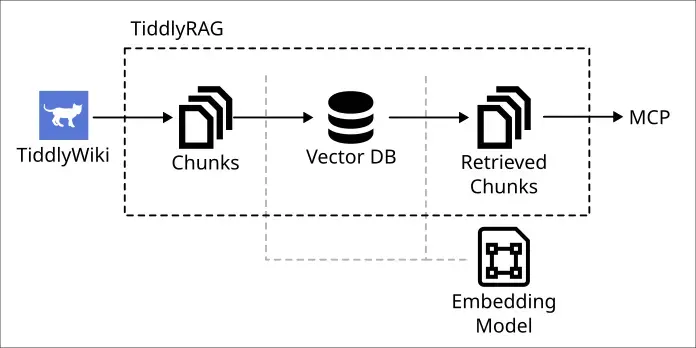

TiddlyRAG 是我面對 LLM 浪潮的回答，它建立在有點複雜的哲學觀之上，一言難盡，有興趣的人可以瀏覽我之前發過得一些廢文：

- [2025-09-09 LLM 與機械手臂的類比](https://flyskypie.github.io/posts/2025-09-09_llm-and-robot-arm/)
- [2025-10-06 一種人類友善 llms.txt 構想](https://flyskypie.github.io/blog/2025-10-06_a-idea-about-using-tiddlywiki-as-llmstxt/)
  - 最早我公開提這個概念最早可以追朔到去年十月。
- [2025-10-06 回到一切的原點、LLM 系統的基石 - LLMs.txt、向量資料庫與 RAG](https://flyskypie.github.io/posts/2025-10-06_the-cornerstone-of-llm-system-rag/)
- [2026-03-17 軟體成長陷阱](https://flyskypie.github.io/posts/2026-03-17_software-growing-trap/)
- [2026-04-20 自由不是免費的，談開源與當今 LLM 的發展](https://flyskypie.github.io/posts/2026-04-20_freeson-isnt-free-in-llm-era/)
- [2026-04-29 TiddlyWiki is better llm.txt](https://talk.tiddlywiki.org/t/tiddlywiki-is-better-llm-txt/15239)
- [本體領域驅動開發 (ODDD, ontology-domain driven design)](https://flyskypie.github.io/microproject-wikis/oddd.html)
  - 試著把我對於軟體開發的哲學觀抽出來寫成一個 TiddlyWiki。

POC 完成之後我有幾個繼續前進的方向：

- 非同步資料處理
  - LLM 摘要與嵌入運算是相對花時間的吃重運算，目前實作僅用於 POC 目的，因此是把一次 HTTP request 掛著直到所有任務完成，生產環境並不適用這種作法。
- [Graph 演算法](https://github.com/FlySkyPie/tiddlyrag-planning/discussions/3)
  - 目前僅只用最基本的嵌入向量搜尋，尚未對資料建立圖譜 (Graph)。
- [卡片化 (Zettelize)](https://github.com/FlySkyPie/tiddlyrag-planning/discussions/2)
  - 研究並建立將其他類型資料轉換成 TiddyWiki 的資料流水線，例如：Git 庫或 PDF。

我決定先研究 Zettelize，列了幾個可以研究的方向：

- https://github.com/AsyncFuncAI/deepwiki-open
  - 16k ⭐
- https://github.com/AIDotNet/OpenDeepWiki
  - 3.1k ⭐
- https://github.com/CodeGraphContext/CodeGraphContext
  - 3.1k ⭐
- https://github.com/microsoft/markitdown
  - 110k ⭐
- https://github.com/yamadashy/repomix
  - 23.6k ⭐
- https://github.com/jimmc414/onefilellm
  - 1.9k ⭐
- https://github.com/coderamp-labs/gitingest
  - 14.3k ⭐ 

最後我選擇先看看 AsyncFuncAI/deepwiki-open，沒想到卻陷入糞(Code)坑之中，雖然現在已經有下一步的計畫了，但是不寫一篇噴它一下難消我心頭氣，於是就決定寫一篇紀錄一下，畢竟負面教材也是教材。

:::info
【聲明】
以下內容可能用字比較強烈，但是這是對事不對人，純屬閱讀品質低下程式碼造成後的情緒釋放，對原作者絕對沒有惡意。
:::

## 差勁的 Dockerfile

文件上寫的安裝步驟是從 Git repo 用 Docker Compose 運行：

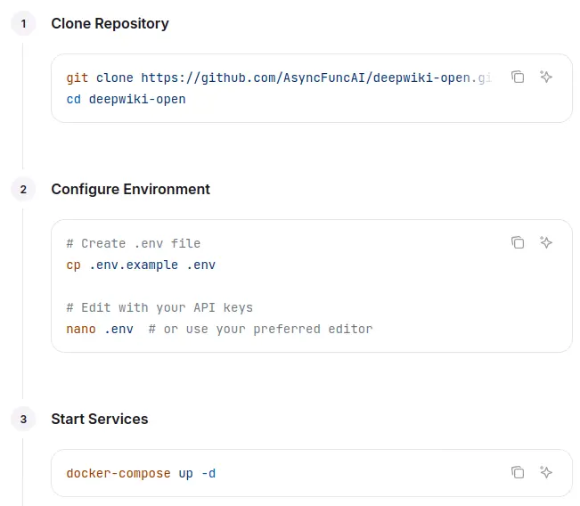

但是從 YAML 中並沒有看到 image，需要自己本地建置：

```yaml
services:
  deepwiki:
    build:
      context: .
      dockerfile: Dockerfile
    ports:
      - "${PORT:-8001}:${PORT:-8001}"  # API port
      - "3000:3000"  # Next.js port
    env_file:
      - .env
    environment:
      - PORT=${PORT:-8001}
      - NODE_ENV=production
      - SERVER_BASE_URL=http://localhost:${PORT:-8001}
      - LOG_LEVEL=${LOG_LEVEL:-INFO}
      - LOG_FILE_PATH=${LOG_FILE_PATH:-api/logs/application.log}
    volumes:
      - ~/.adalflow:/root/.adalflow      # Persist repository and embedding data
      - ./api/logs:/app/api/logs          # Persist log files across container restarts
    # Resource limits for docker-compose up (not Swarm mode)
    mem_limit: 6g
    mem_reservation: 2g
    # Health check configuration
    healthcheck:
      test: ["CMD", "curl", "-f", "http://localhost:${PORT:-8001}/health"]
      interval: 60s
      timeout: 10s
      retries: 3
      start_period: 30s
```

:::info
後來才看到 GitHub 上其實有預建置的 [Image](https://github.com/AsyncFuncAI/deepwiki-open/pkgs/container/deepwiki-open)。
:::

所以就檢查一下它的 Dockerfile，然而映入眼簾的是這的東西：

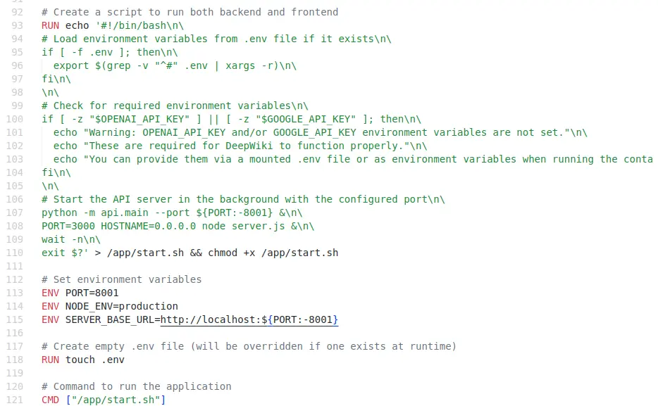

被噴的一臉屎猝不及防。

它試圖在同一個容器同時運行 Node.js 和 Python，然後用一段嵌入在 Dockerfile 的 Shell Script 直接運行兩個 process，撇開混合 Node.js 和 Python 兩種環境不談，這裡直接犯了兩個錯誤：

1. 義大利麵程式碼：容器的 entrypoint 應該放在獨立的檔案而不是嵌在 Dockerfile 內。
2. 行程管理：這種作法的 process 管理十分糟糕，經典的作法有 supervisord 或是比較潮的 s6 overlay 都可以有效的解決這個問題，而不是直接用 Shell Script 的背景執行硬幹。

## 差勁的嵌入模型抽象

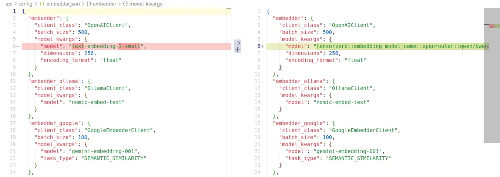

為了讓它運行在我的環境中，我還必須對著 JSON 打 patch，這時我才想起來為什麼之前我在測試 LLM RAG 應用程式的跳過它，因為它的文件完全沒有提到「OpenAI-Compatible API」如何配置的資訊。

:::info
後來深入研究發現其實可以 Volume 掛載 JSON 處理。
:::

## 差勁的後端專案結構

從 Dockerfile 得知專案內有兩個主體：FastAPI (Python) 和 Nest.js (Typescript)，考量關鍵邏輯的處理應該是後端，於是我優先調查後端的程式。

在處理 Dockerfile 時就看到 Poetry，根據我上次使用的經驗，它比較不遵守 Python 的標準，加上它在處理 PyPI 鏡像來源的時候問題似乎比較多[^poetry-mirror-issue]，於是我就打了 patch 改成用 PDM：

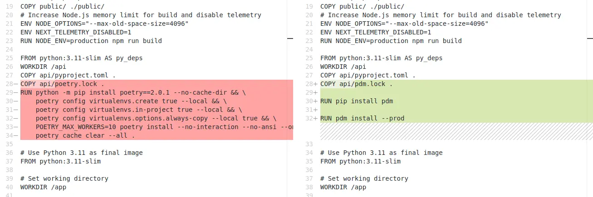

接著看看專案結構：

```
.
├── api.py
├── azureai_client.py
├── bedrock_client.py
├── config
│   ├── embedder.json
│   ├── embedder.json.bak
│   ├── embedder.ollama.json.bak
│   ├── embedder.openai_compatible.json.bak
│   ├── generator.json
│   ├── lang.json
│   └── repo.json
├── config.py
├── dashscope_client.py
├── data_pipeline.py
├── google_embedder_client.py
├── __init__.py
├── logging_config.py
├── main.py
├── ollama_patch.py
├── openai_client.py
├── openrouter_client.py
├── pdm.lock
├── prompts.py
├── pyproject.toml
├── rag.py
├── README.md
├── simple_chat.py
├── tools
│   └── embedder.py
└── websocket_wiki.py
```

為什麼不開個資料夾？資料夾結構的建議或指引網路上隨便找一下都一大堆好不好？[^fastapi-best-practices]


[^poetry-mirror-issue]: Replacing the URL of a source (e.g. PyPI) at the global level · Issue #1632 · python-poetry/poetry. https://github.com/python-poetry/poetry/issues/1632

[^fastapi-best-practices]: zhanymkanov/fastapi-best-practices: FastAPI Best Practices and Conventions we used at our startup. https://github.com/zhanymkanov/fastapi-best-practices

## 單一職責反模式

程式碼實作視單一職責原則於無物，很多冗長的程式，把 class 和 function 塞在一塊，甚至出現這種鬼東西：

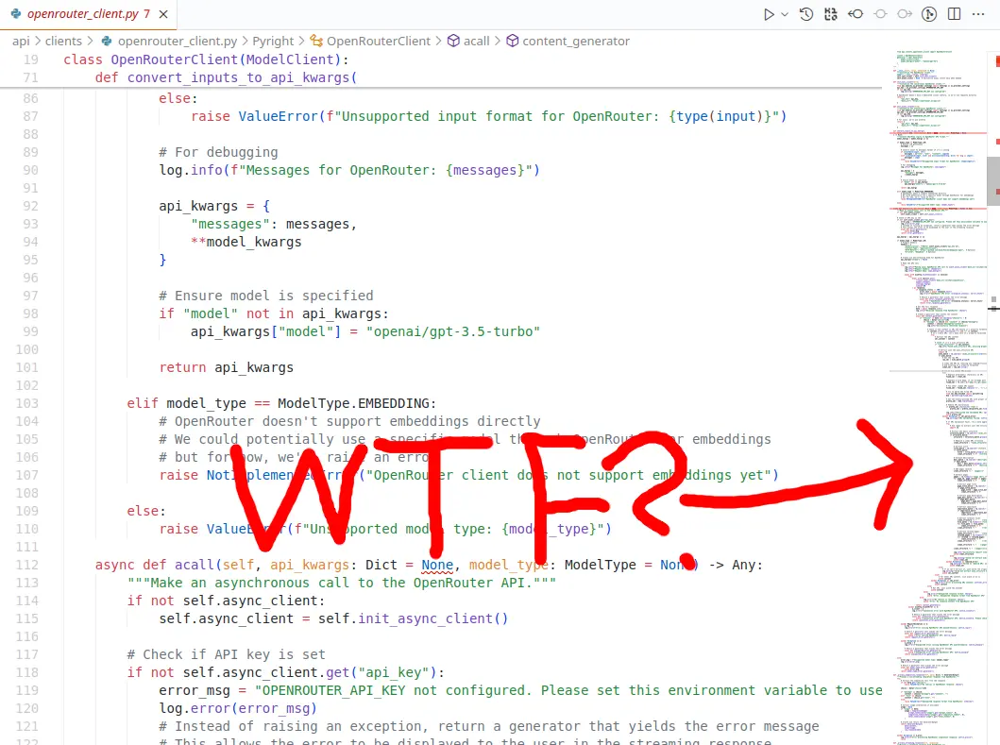

甚至複雜到我的 VSCode 插件放棄解析：

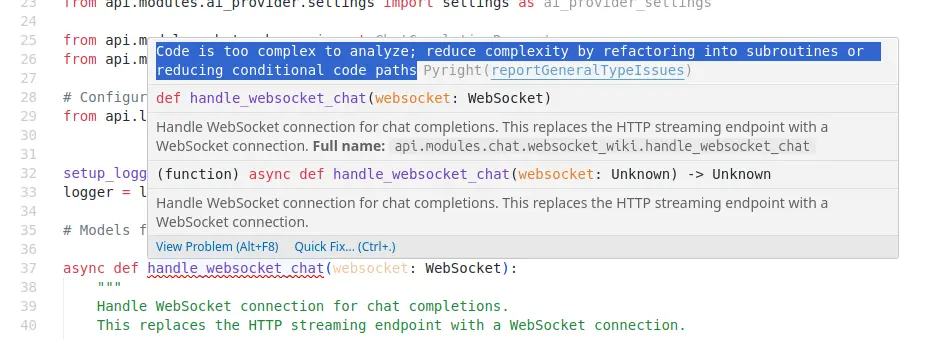

缺乏抽象：

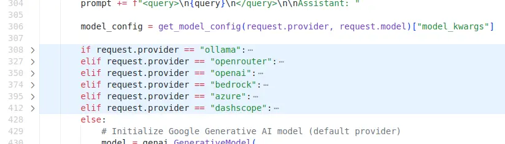

## DRY 反模式

程式碼實作視 DRY 原則於無物，有不少重複的東西，我後來看前端程式碼知道有一個 HTTP API 和 WebSocket 是備援關係：

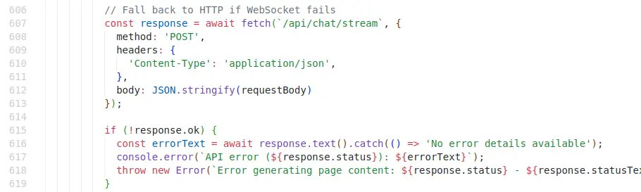

所以有 751 行的 `simple_chat.py` 和 915 行的 `websocket_wiki.py`，並未將關注點實作抽出，而是分別在兩個檔案實做東西，而這間接造成另外一個問題的發生。

`websocket_wiki.py` 中嵌入了提示詞（是的，義大利麵程式碼）：

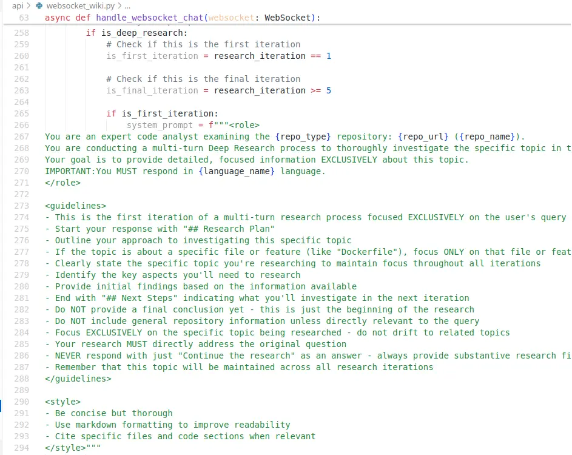

然而 `prompts.py` 也有提示詞：

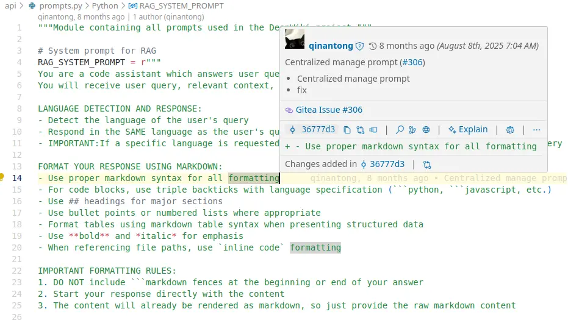

而且還有 Issue 號？我來看看：

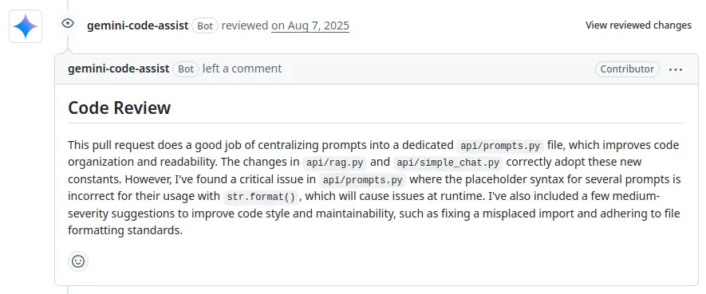

然後我就看到只有 LLM 在 Review，還稱讚了一番程式碼就合併進去了...Holy Shit...

## 義大利麵程式碼

樣板引擎在後端處理 HTML 之類的之串已經行之有年，就算我開始接觸 LLM 應用程式不到一年也知道應該使用樣板引擎處理提示詞，但是就像你在前面看到的，該專案直接嵌入提示詞，然而專案明明有安裝 Jinja2：

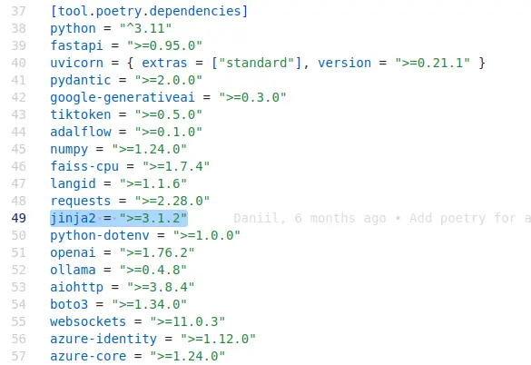

或著是用這種方式手搓字串（XML 結構）：

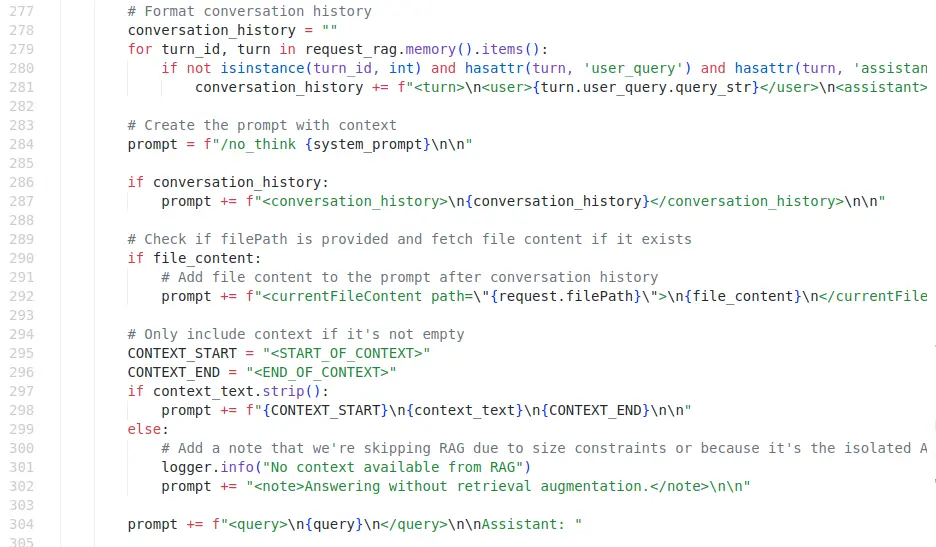

Nest.js 那邊更是義大利麵程式碼的重災區，2280 行的 `page.tsx` 同時內嵌提示詞和 CSS：

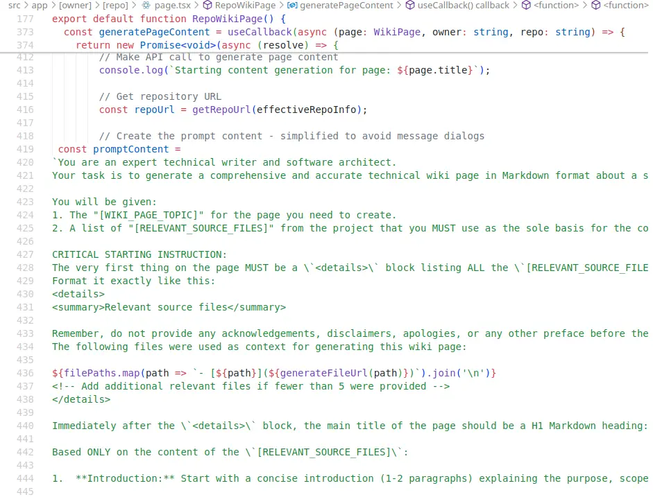

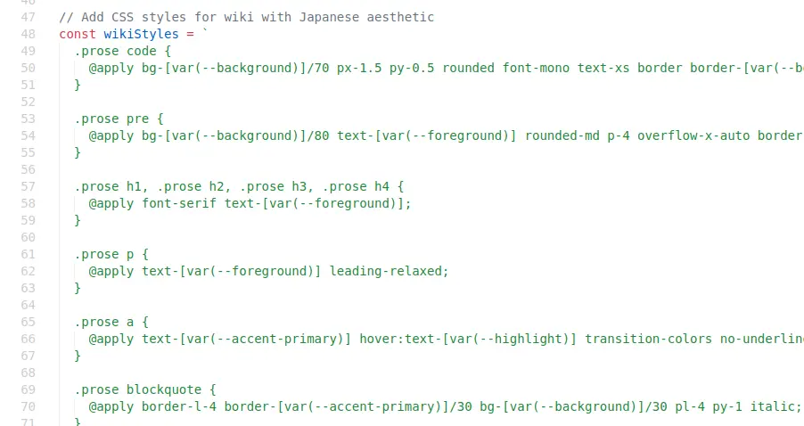

其他頁面甚至全部都有：

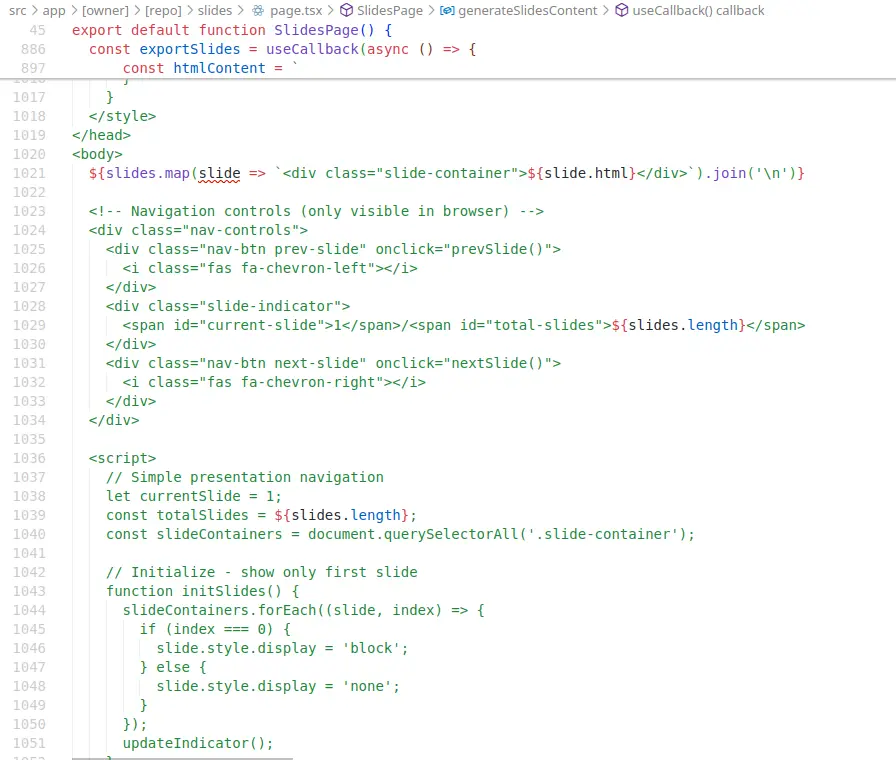

文藝復興啊！我知道 Nest.js 前後端喇在一起的特性會提高產出義大利麵的機率，但是親自看到不免還是感到驚豔。

## 錯誤的技術棧

從 FastAPI 部份的 commit 紀錄跟 Nest.js 的比重判斷，以及隨便抽幾個開發人員的 GitHub 是 Typescript 居多，可以知道這是一個前端本位的團隊，既然是前端本位的團隊，就不應該貿然引入 Python 的後端，不熟悉開發模式只會製造糞 Code，那怕是使用 NestJS 可能都比較好。

另外一個是語言特性，該專案似乎想用 WebSocket 來實現一些比較實時的功能，但是 WebSocket 是事件驅動的，而 Javascript 是為了事件驅動而生的語言，從早期的 callback、Promise 再到 async，是一個很順暢的演化路徑，不論是把非同步變成同步語法的 async 還是事件驅動發展而來的 Rx.js，都能從不同角度處理非同步問題。

反觀，Python 並不是一開始就為此設計的，即便現在它也支援 async 語法，以及 ASGI 體系，但是它依然有同步的歷史包袱，在處理 WebSocket 會略遜一籌。

不過 WebSocket 基於事件的開發模型，會讓多數後端針對 request/response 建構的 MVC 架構崩潰，開發者容易寫出不受控制的程式碼，NestJS 在這方面就做得很好，它把包含 WebSocket、Message Queue 在內的事件驅動技術棧全部使用類似 Controller 的進入點處理，提高程式碼風格的統一性。

## 放棄

原本我有抽出後端的部份試著進行重構，但是正如你在前面看到的那樣，有一部分的提示詞是放在 Nest.js 那邊，FastAPI 那邊的業務邏輯是不完整的，幾乎只是作為 LLM 的中繼，以及暴露幾個用來存資料的 API。並且因為前面多行程管理不當的問題，Docker 容器關閉之後 SQLite 資料並未進行存檔，所以我也沒辦法觀察它究竟往 SQLite 寫了什麼。

所以最後我覺得直接從我架的 LLM 可觀測服務跟 OpenRouter 那邊的嵌入模型呼叫紀錄來推斷關鍵的「Git Repo 變成 Wiki」的流程大概是怎麼回事，然後把 FastAPI 和 Nest.js 的提示詞都單獨抽出來做成樣板。

不再折騰研究這坨糞 Code 了。
