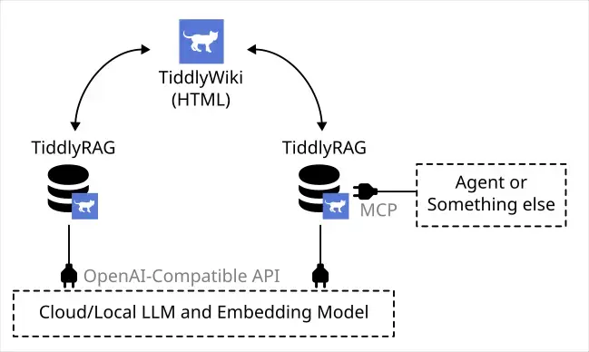

# TiddlyWiki is Better llm.txt

<head>
  <meta property="og:image" content="https://raw.githubusercontent.com/FlySkyPie/flyskypie.github.io/main/post/2026-05-01_tiddlywiki-is-better-llmtxt/01_chunk-transfer.webp" />
</head>

:::info
這篇文章是我在 TiddlyWiki 官方論壇的發文的[副本](https://talk.tiddlywiki.org/t/tiddlywiki-is-better-llm-txt/15239)。
:::

I made a POC server, it can import/export TiddlyWiki and exposed MCP and HTTP API allowed retrieval Tiddlers from database.

Link: https://github.com/FlySkyPie/tiddlyrag-poc/tree/poc/type-a

The POC only implemented a simple pipeline:

P.S. When I using the terms `llm.txt` not just "[robot.txt but for AI](https://llmstxt.org/)", but all "preprocessed plain text used for LLM providing context", the preprocessing tools including repomix, markitdown, Context7...

## Long Story

### Perspective 1: The development of LLM ecosystem feels wrongs to me

As open source stan, I don't believe performance of close source "Model", until I saw the open weight, who knows? Maybe it's a huge RAG system behind the API.

"Agentic" is most popular things in the current LLM ecosystem, but if you know how it works, you know the process is O(N²) a token wasted process. Meanwhile some people even advocating "RAG is dead", you should just put all context let "Model" (close source API) handle it.

Yes, create RAG system is annoying, you need clean your data, doing chunking, embedding, implement strategy...But to me, RAG is the correct way to using LLM, prevent it [bullshit](https://link.springer.com/article/10.1007/s10676-024-09775-5) things, at least at the moment.

Conclusion: I should build a RAG and meaninace knowledge.

### Perspective 2: Data Silos

I had investigated Open WebUI, LobeHub, kotaemon, Bionic, AstrBot, AnythingLLM. Some problems are common in most case:

- User can't review uploaded document.
- User can't review chunked document.
- The application didn't chunking document at all.
- Embedding related UI is glitchy.
- Can't edit uploaded document.
- Won't trigger re-embedding after edit text.

Nobody (application developers) care ETL process, I guess.

The situation of most application: You can upload file. and then? there is not then. I either don't doing chunking, or chucking badly, and you can't review or fix it, even it chunking good, you still can't reused those chunk.

Conclusion: Chunks should able transfer between systems, and I should build better review mechanism create data feedback loop.

### Perspective 3: Human Readability

Context7 is a neat MCP server, allowed LLM get latest state of library, but it's close source, and there is a company behind it. As open source stan, I can make this thing in my work flow. I did check some alternatvies such as GitMCP, but performance not good, GitMCP didn't chunking text right.

If you put MCP beside, llm.txt is most important part, you need prepare clean plain text to feed LLM. Some tools like repomix, markitdown can do the job, but here is the thing: the output is a bundle text, the chunking process may split it in wrong way, plus, it's hard to read for human.

Yes, it's plain text, human "can" read, but when it's a text over 10k lines, that kind of information is hard to maintain and review.

Conclusion: The readability issue of `llm.txt` must be solve.

### Conclusion

Ok, I have a clear goals:

Build RAG system, but we already have bunch of chat-based applications, I should not reinventing wheels but focus on ETL part, which no body care.

"A payload for chunking knowledge and improve human readability"...wait, doesn't it talking TiddlyWiki? I don't need reinventing wheels, and when it's compatible with TiddlyWiki, the system would allowed import existing TiddlyWiki into RAG system.

### Perspective 4: Scenario of Lazy Domain Expert

This is further vision of TiddlyRAG, it's based on very clear scenario which related my career experience.

Stakeholders in Agile and Domain Expert in DDD, both roles design shared a same philosophy: prevent developer straying too far from reality or actual needs, I would using perspective of DDD to explain this.

Domain Expert is the person who understand Domain knowledge, developer must frequently communicate with it, so make sure software is built on top of Domain Model that match real industry, but DDD make a assumption implicitly: it's asumming Developer and Domain Expert are allocable human resource inside orginization, frequently communication only works when this assumption is ture.

How ever many development condition is shift from this assumption, Domain Expert who have Domain knowledge and Developer are work for different company or organization. In this kind of scenario more often shows: Stakeholders seems not care about it, they don't give answer even Developer is asking with, thir thought is that the things should automaticly done because they paied money, not to mention getting them to write documents.

TiddlyRAG is planning forcus on review and audit knowledge.

The system alloed Developer or LLM draft up Tiddlers, only approved knoeledge would included by Wiki. So that Stakeholders or Domain Expert don't need write document but answer yes or not, even add comment if they welling.