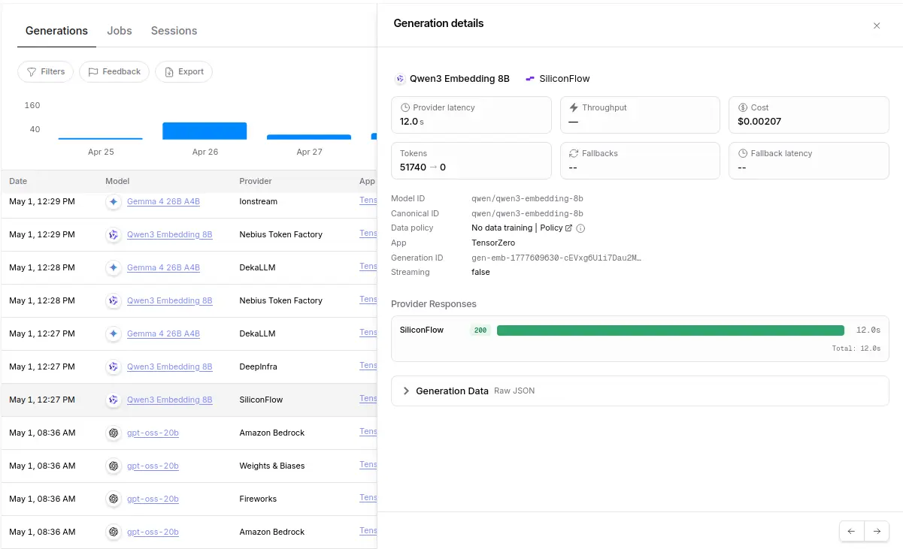
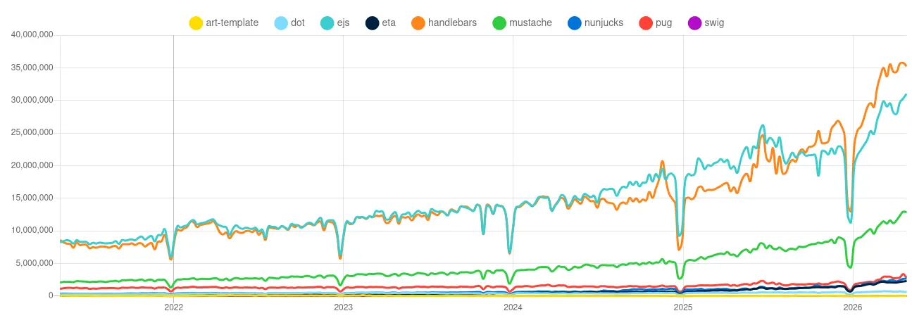

# 用於 LLM 提示詞的 Node.js 樣板引擎選型

<head>
  <meta property="og:image" content="https://raw.githubusercontent.com/FlySkyPie/flyskypie.github.io/main/post/2026-05-06_nodejs-template-engine/02_nodejs-template-engines.webp" />
</head>

:::info
這篇屬於 TiddlyRAG 的開發筆記，而不是單純的技術選型建議。
:::

## 前情提要

`AsyncFuncAI/deepwiki-open` 是一個開源專案，能夠把 Git Repo 透過 LLM 轉譯成方便人類閱讀的網頁（手冊）。但是隨著我 Review 程式碼發現其實作品質低下，宛如結集各種反模式於一身的負面教科書，於是我決定抽出提示詞然後試著重新實做再現類似的資料處理流程。更多資訊可以見我的前一篇文章：

[從 Zettelize 到糞坑：評點 deepwiki-open 程式碼](https://flyskypie.github.io/posts/2026-05-01_code-review/)

我先用 Jinja2 把抽出的提示詞重新整理過，再透過 LLM 可觀測留下的紀錄逆向工程回去理解這些提示詞是怎麼組裝的，以及經過什麼樣的步驟。

### 提示詞樣板

根據調查可以知道 `AsyncFuncAI/deepwiki-open` 的實作是經過兩個步驟：

#### 步驟一：建立手冊框架

```markdown
/no_think 

<START_OF_CONTEXT>

## File Path: {{ item.path }}

{{ item.content }}

<END_OF_CONTEXT>

<query>
 
</query>

Assistant: 
```

其輸出會類似於：

```xml
<wiki_structure>
  <title>Ariadne GIS Wiki</title>
  <description>這是一個將 GIS（地理資訊系統）與 Windows 使用者體驗（UX）結合的概念驗證（POC）專案，旨在模擬 Windows XP 風格的 GIS 應用環境。</description>
  <sections>
    <section id="overview">
      <title>專案概覽</title>
      <pages>
        <page_ref>project-intro</page_ref>
      </pages>
    </section>
    <!-- 以下省略 -->
  </sections>
  <pages>
    <page id="project-intro">
      <title>專案介紹</title>
      <description>說明 Ariadne GIS 的核心理念：建立一個具有 Windows UX 的 GIS 系統，以及其 POC 的定位。</description>
      <importance>high</importance>
      <relevant_files>
        <file_path>README.md</file_path>
        <file_path>packages/app/src/App.tsx</file_path>
      </relevant_files>
      <related_pages>
        <related>arch-overview</related>
      </related_pages>
      <parent_section>overview</parent_section>
    </page>
    <!-- 以下省略 -->
  </pages>
</wiki_structure>
```

#### 步驟二：為每一個頁面生成內容

```markdown
/no_think 

<START_OF_CONTEXT>

## File Path: {{ item.path }}

{{ item.content }}

<END_OF_CONTEXT>

<query>
 
</query>

Assistant: 
```

接著我要把這些提示詞轉移到 NestJS 去建立 POC。

### AdalFlow

可以留意到 `files` 的部份不是單靠樣板引擎就能處理的，



根據可觀測，除了 LLM 的處理以外，在步驟一、二以前還有一個量體不小的嵌入請求。

往下深究可以得知是仰賴來自 AdalFlow 的實作，它將大部分的檔案進行嵌入，然後根據任務內容從 AdalFlow 檢索出大約 20 個檔案填入 `files`。然而 AdalFlow 的實作方式有幾個問題：

1. AdalFlow 使用 `.pkl` 儲存嵌入向量。

簡單來說 `.pkl` 是將 Python 直接序列化儲存到檔案系統的格式，讀取後反序量化可以在記憶體重建一樣的物件，然而這在機器學習領域已經被普遍認為是不安全的方式，因為這種儲存方式可以夾帶「可執行的惡意程式」。

2. 自行實作以及運行時記憶體。

使用 `.pkl` 的另外一個問題是，它必須將整個資料載入記憶體才能運算，而不像成熟的資料庫方案透過特殊的處置每次只需要將少量的資料放入記憶體運算，資料本身是儲存在檔案系統上的。

這帶來另外一個問題，資料結構與檢索演算法是由 AdalFlow 自行實做的，但是 AdalFlow 的軟體定位更接近「自動化優化提示詞」，其實做品質必然低於專職的嵌入資料庫。

因此我會使用在前一個 POC 使用的 pgvector 處理這一個資料處理流程。

## Node.js 樣板引擎

好了，回到 Node.js 樣板引擎的話題。在 NestJS 官方文件中使用的樣板引擎是 [hbs](https://github.com/pillarjs/hbs)，但是它的使用方式長得像這樣：

```typescript
export class AppController {
  constructor(private appService: AppService) {}

  @Get()
  root(@Res() res: Response) {
    return res.render(
      this.appService.getViewName(),
      { message: 'Hello world!' },
    );
  }
}
```

跟 Response 深度榜定，它總是假設視圖 (View) 是用於 HTTP Response 的，這在 LLM 提示詞「用於 OpenAI API Request」 的使用情境下會顯得有問題。

於是我在前一個 POC 中是使用未被封裝的 Handlebars 本身：

```typescript
export class RetrievalTools {
  async resolveWiki({ query }: ResolveWikiParamsDto): Promise<string> {
    const templateStr = await readFile(
      resolve(__dirname, './prompts/resolve-wikis-response.hbs'),
      'utf8',
    );

    const wikis = await this.retrievalService.resolveWiki(query);

    return Handlebars.compile(templateStr, { noEscape: true })({
      wikis,
    });
  }
}
```

然而隨著提示詞的複雜化，我現在需要嵌套樣板，這在 Handlebars 中必須這樣處理[^Handlebars-Partials]：

```typescript
Handlebars.registerPartial('myPartial', '{{prefix}}');
```

我不知道你怎麼想，反正我覺得不夠優雅。一來是它必須手動註冊每一個樣板；二來是這是單例全域狀態污染，因此我必須尋找替代方案。



很快的我列出了一個清單：

- https://github.com/mozilla/nunjucks
  - 8.9k ⭐
- https://github.com/handlebars-lang/handlebars.js
  - 18.6k ⭐
- https://github.com/janl/mustache.js
  - 16.7k ⭐
- https://github.com/pugjs/pug
  - 21.9k ⭐
- https://github.com/goofychris/art-template
  - 9.9k ⭐
- https://github.com/olado/dot
  - 5k ⭐
- https://github.com/paularmstrong/swig
  - 3.1k ⭐
- https://github.com/mde/ejs
  - 8.1k ⭐
- https://github.com/bgub/eta
  - 1.7k ⭐

pug 雖然在 GitHub 有較高的聲望，但是它的語法一看就知道是為了簡化 HTML 而生的，在處理多數情況為 Markdown 的提示詞不見得方便。而且我沒有很喜歡它的語法。

mustache.js 和 handlebars.js 師出同門那就不用提了。

swig 雖然有名但是 Javascript 套件已經停止維護。

其他方案我沒有花太多時間調查，因為當我看到 Nunjucks 時，覺得它能滿足我的需求。

1. jinja2 友善

> Rich Powerful language with block inheritance, autoescaping, macros, asynchronous control, and more. Heavily inspired by jinja2

既然我原本的實作是 jinja2，而 Nunjucks 又高度參考 jinja2，那麼遷移成本理應較低。

2. Mozilla

Nunjucks 是 Mozilla 之下的專案，並且 Mozilla 其他專案也有使用 Nunjucks。雖然 GitHub 已經沒有活躍的編輯紀錄，但是上一次編輯是關於 Node 25 的，因此穩定性可以期待，畢竟樣板引擎就這樣，完成了的話其實就沒有東西好加了。

另外快速掃一下 issue，不少都是跟安全性有關的，但是這應該屬於「不信任源輸入過濾」的職責，跟樣板引擎本身無關。

[^Handlebars-Partials]: Partials | Handlebars. https://handlebarsjs.com/guide/partials.html
